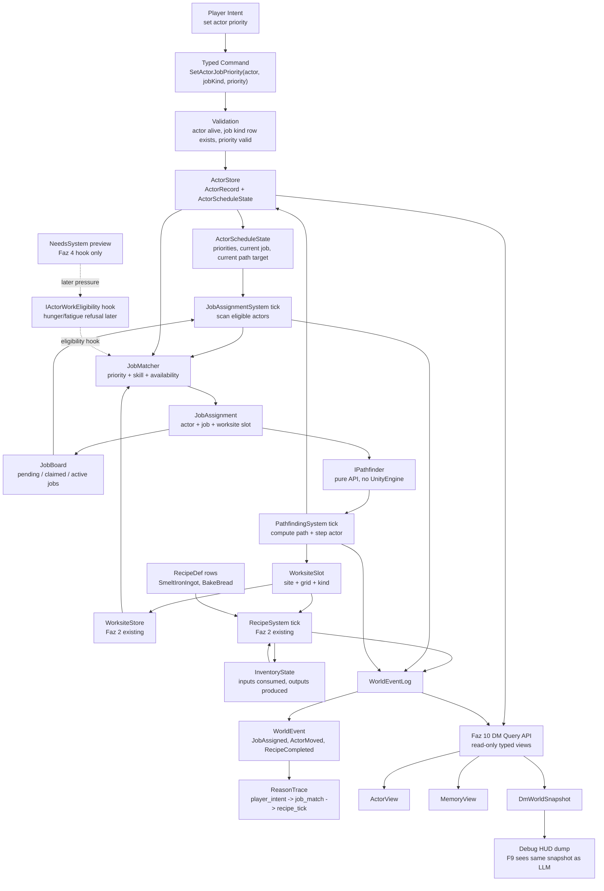
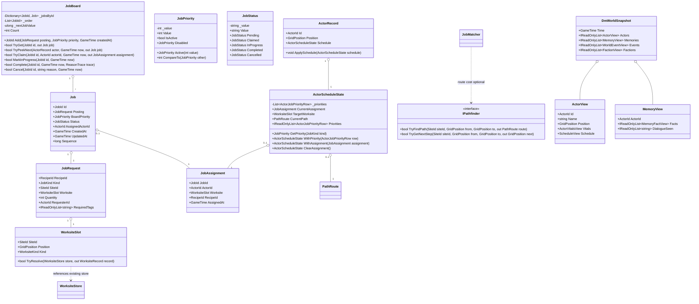
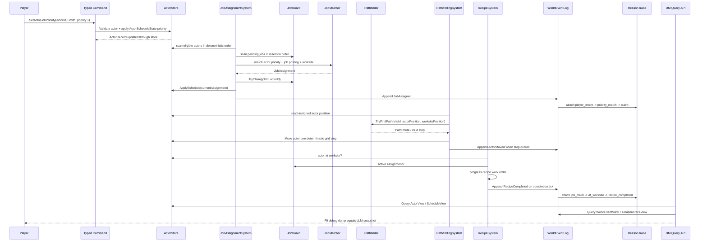

## 1. Sistem haritası (Mermaid graph TB)

> _Captain atom-map_: `DOCS/sprint-faz-10-atom-map.md` (Captain narrow vertical-slice decomposition).
> _Naming_: aligned with Captain types (JobRequest, ActorScheduleState, JobAssignmentSystem).
> _Spec covers full architecture; Captain may implement subset and extend later.



## 2. Veri modeli (Mermaid classDiagram)



## 3. Tick akışı (Mermaid sequenceDiagram)



## 4. C# scaffold — DOSYA YOLU + İMZA (gövde YOK)

> Bu bölüm signature-only scaffold'tur. Captain her atomda gövdeleri ekler; aşağıdaki C# bloklarında method body yoktur ve `Domain/` ile `Simulation/` altında `using UnityEngine` yasaktır.

### Core PROCESS / LIVING scaffold

```csharp
// Assets/Scripts/Domain/Process/JobStatus.cs
using System;

namespace EmberCrpg.Domain.Process
{
    /// <summary>Validated job lifecycle value. It is a value object so systems do not branch on ad-hoc strings.</summary>
    public readonly struct JobStatus : IEquatable<JobStatus>
    {
        /// <summary>Raw status token stored for deterministic save/load and debug output.</summary>
        private readonly string _value;

        /// <summary>Creates a validated lifecycle status token.</summary>
        private JobStatus(string value);

        /// <summary>Raw deterministic status token.</summary>
        public string Value { get; }

        /// <summary>Job is available for matching and claim.</summary>
        public static JobStatus Pending { get; }

        /// <summary>Job is reserved by one actor but work has not started.</summary>
        public static JobStatus Claimed { get; }

        /// <summary>Actor is at the worksite and the recipe/process is progressing.</summary>
        public static JobStatus InProgress { get; }

        /// <summary>Job finished and should no longer be matched.</summary>
        public static JobStatus Completed { get; }

        /// <summary>Job was removed before completion with a traceable reason.</summary>
        public static JobStatus Cancelled { get; }

        /// <summary>Returns true when both statuses carry the same token.</summary>
        public bool Equals(JobStatus other);

        /// <summary>Returns true when the object is a status with the same token.</summary>
        public override bool Equals(object obj);

        /// <summary>Returns a stable hash derived from the raw status token.</summary>
        public override int GetHashCode();

        /// <summary>Returns the raw status token for logs and save diffs.</summary>
        public override string ToString();
    }
}
```

```csharp
// Assets/Scripts/Domain/Process/WorksiteSlot.cs
using System;
using EmberCrpg.Domain.Actors;
using EmberCrpg.Domain.Core;

namespace EmberCrpg.Domain.Process
{
    /// <summary>Stable reference to one worksite cell inside the existing WorksiteStore. It carries identity only, not behaviour.</summary>
    public sealed class WorksiteSlot
    {
        /// <summary>Creates a worksite reference from site, grid cell, and expected kind.</summary>
        public WorksiteSlot(SiteId siteId, GridPosition position, WorksiteKind kind);

        /// <summary>Site containing the worksite cell.</summary>
        public SiteId SiteId { get; }

        /// <summary>Grid coordinate of the worksite cell.</summary>
        public GridPosition Position { get; }

        /// <summary>Expected worksite kind, checked against WorksiteStore at match time.</summary>
        public WorksiteKind Kind { get; }

        /// <summary>Resolves this slot against the existing store without mutating the store.</summary>
        public bool TryResolve(WorksiteStore store, out WorksiteRecord record);
    }
}
```

```csharp
// Assets/Scripts/Domain/Process/JobRequest.cs
using System.Collections.Generic;
using EmberCrpg.Domain.Core;

namespace EmberCrpg.Domain.Process
{
    /// <summary>Immutable request for work. New work enters the simulation as data rows, not branches.</summary>
    public sealed class JobRequest
    {
        /// <summary>Defensive copy of required actor/work tags used by JobMatcher.</summary>
        private readonly string[] _requiredTags;

        /// <summary>Creates a deterministic job posting for one recipe/process at one worksite.</summary>
        public JobRequest(
            RecipeId recipeId,
            JobKind kind,
            SiteId siteId,
            WorksiteSlot worksite,
            int quantity,
            ActorId requesterId,
            IEnumerable<string> requiredTags);

        /// <summary>Recipe row consumed by RecipeSystem when the actor reaches the worksite.</summary>
        public RecipeId RecipeId { get; }

        /// <summary>Typed category used only for priority matching; recipe behaviour stays data-driven.</summary>
        public JobKind Kind { get; }

        /// <summary>Site where the job must be performed.</summary>
        public SiteId SiteId { get; }

        /// <summary>Worksite slot required by this job.</summary>
        public WorksiteSlot Worksite { get; }

        /// <summary>Number of recipe completions requested by the posting.</summary>
        public int Quantity { get; }

        /// <summary>Actor that created the posting, or empty for world/system postings.</summary>
        public ActorId RequesterId { get; }

        /// <summary>Required tag rows used by matching, such as skill or guild permission tags.</summary>
        public IReadOnlyList<string> RequiredTags { get; }
    }
}
```

```csharp
// Assets/Scripts/Domain/Process/JobAssignment.cs
using EmberCrpg.Domain.Core;

namespace EmberCrpg.Domain.Process
{
    /// <summary>Immutable binding between one actor and one claimed job. ActorScheduleState stores this, not a subclassed actor.</summary>
    public sealed class JobAssignment
    {
        /// <summary>Creates an assignment after JobBoard successfully claims a job.</summary>
        public JobAssignment(JobId jobId, ActorId actorId, WorksiteSlot worksite, RecipeId recipeId, GameTime assignedAt);

        /// <summary>Claimed job id.</summary>
        public JobId JobId { get; }

        /// <summary>Actor responsible for the claimed job.</summary>
        public ActorId ActorId { get; }

        /// <summary>Target worksite where the work must happen.</summary>
        public WorksiteSlot Worksite { get; }

        /// <summary>Recipe row to start when the actor reaches the worksite.</summary>
        public RecipeId RecipeId { get; }

        /// <summary>Deterministic time of assignment.</summary>
        public GameTime AssignedAt { get; }
    }
}
```

```csharp
// Assets/Scripts/Domain/Process/Job.cs
using EmberCrpg.Domain.Core;
using EmberCrpg.Domain.World;

namespace EmberCrpg.Domain.Process
{
    /// <summary>Runtime state for one JobRequest on a JobBoard. It owns lifecycle state but does not run recipes.</summary>
    public sealed class Job
    {
        /// <summary>Creates a board-owned job record in Pending status.</summary>
        public Job(JobId id, JobRequest posting, JobPriority boardPriority, GameTime createdAt, long sequence);

        /// <summary>Stable job handle.</summary>
        public JobId Id { get; }

        /// <summary>Immutable work request behind the job.</summary>
        public JobRequest Posting { get; }

        /// <summary>Board-side priority used before actor priority tie-breakers.</summary>
        public JobPriority BoardPriority { get; }

        /// <summary>Current lifecycle status.</summary>
        public JobStatus Status { get; private set; }

        /// <summary>Actor that currently owns the claim, or empty when unclaimed.</summary>
        public ActorId AssignedActorId { get; private set; }

        /// <summary>Creation time for deterministic debugging and replay.</summary>
        public GameTime CreatedAt { get; }

        /// <summary>Last lifecycle update time.</summary>
        public GameTime UpdatedAt { get; private set; }

        /// <summary>Insertion sequence used as final deterministic tie-breaker.</summary>
        public long Sequence { get; }

        /// <summary>Claims the job for one actor and returns the resulting assignment.</summary>
        public bool TryClaim(ActorId actorId, GameTime now, out JobAssignment assignment);

        /// <summary>Marks the job as actively progressing at the worksite.</summary>
        public bool MarkInProgress(GameTime now);

        /// <summary>Marks the job as completed and terminal.</summary>
        public bool Complete(GameTime now, ReasonTrace trace);

        /// <summary>Marks the job as cancelled and terminal.</summary>
        public bool Cancel(string reason, GameTime now);
    }
}
```

```csharp
// Assets/Scripts/Domain/Process/JobBoard.cs
using System.Collections.Generic;
using EmberCrpg.Domain.Actors;
using EmberCrpg.Domain.Core;
using EmberCrpg.Domain.World;

namespace EmberCrpg.Domain.Process
{
    /// <summary>Deterministic board of pending and active jobs for a site. Enumeration follows insertion order.</summary>
    public sealed class JobBoard
    {
        /// <summary>Job lookup by stable id.</summary>
        private readonly Dictionary<JobId, Job> _jobsById;

        /// <summary>Insertion order used for deterministic selection and replay.</summary>
        private readonly List<JobId> _order;

        /// <summary>Next raw id value allocated by this board.</summary>
        private ulong _nextJobValue;

        /// <summary>Creates an empty deterministic job board.</summary>
        public JobBoard();

        /// <summary>Number of jobs currently retained by the board.</summary>
        public int Count { get; }

        /// <summary>Current jobs in deterministic insertion order.</summary>
        public IEnumerable<Job> Jobs { get; }

        /// <summary>Adds a pending job and returns its allocated id.</summary>
        public JobId Add(JobRequest posting, JobPriority boardPriority, GameTime createdAt);

        /// <summary>Tries to fetch a job by id without mutating board state.</summary>
        public bool TryGet(JobId id, out Job job);

        /// <summary>Finds the next pending job for the actor using actor priority, board priority, then insertion order.</summary>
        public bool TryPeekNext(ActorRecord actor, GameTime now, out Job job);

        /// <summary>Claims a pending job for one actor and prevents duplicate claims.</summary>
        public bool TryClaim(JobId id, ActorId actorId, GameTime now, out JobAssignment assignment);

        /// <summary>Marks a claimed job as in-progress when the actor reaches the worksite.</summary>
        public bool MarkInProgress(JobId id, GameTime now);

        /// <summary>Completes a terminal job and keeps board ordering stable for replay inspection.</summary>
        public bool Complete(JobId id, GameTime now, ReasonTrace trace);

        /// <summary>Cancels a terminal job with a deterministic reason label.</summary>
        public bool Cancel(JobId id, string reason, GameTime now);
    }
}
```

```csharp
// Assets/Scripts/Domain/Actors/ActorJobPriorityRow.cs
using EmberCrpg.Domain.Process;

namespace EmberCrpg.Domain.Actors
{
    /// <summary>Actor-local data row mapping one job kind to one priority. It is row data; systems must not hard-code branch behaviour from it.</summary>
    public sealed class ActorJobPriorityRow
    {
        /// <summary>Creates a priority row for one actor schedule.</summary>
        public ActorJobPriorityRow(JobKind kind, JobPriority priority);

        /// <summary>Job category this row applies to.</summary>
        public JobKind Kind { get; }

        /// <summary>Actor-local priority. Disabled means the actor opts out of that job row.</summary>
        public JobPriority Priority { get; }
    }
}
```

```csharp
// Assets/Scripts/Domain/Actors/ActorScheduleState.cs
using System.Collections.Generic;
using EmberCrpg.Domain.Process;

namespace EmberCrpg.Domain.Actors
{
    /// <summary>Pure actor schedule component. It carries current work state and priorities without adding actor subclasses.</summary>
    public sealed class ActorScheduleState
    {
        /// <summary>Defensive ordered priority rows for deterministic matching.</summary>
        private readonly List<ActorJobPriorityRow> _priorities;

        /// <summary>Creates schedule state with optional priorities and current assignment.</summary>
        public ActorScheduleState(
            IEnumerable<ActorJobPriorityRow> priorities,
            JobAssignment currentAssignment,
            WorksiteSlot targetWorksite,
            PathRoute currentPath);

        /// <summary>Priority rows in deterministic actor-local order.</summary>
        public IReadOnlyList<ActorJobPriorityRow> Priorities { get; }

        /// <summary>Current claimed assignment, or null when idle.</summary>
        public JobAssignment CurrentAssignment { get; }

        /// <summary>Current target worksite, or null when idle or pathing is not needed.</summary>
        public WorksiteSlot TargetWorksite { get; }

        /// <summary>Current deterministic path route, or null when no route is assigned.</summary>
        public PathRoute CurrentPath { get; }

        /// <summary>True when the actor has no active job assignment.</summary>
        public bool IsIdle { get; }

        /// <summary>Returns the actor priority for a job kind, or Disabled when no row exists.</summary>
        public JobPriority GetPriority(JobKind kind);

        /// <summary>Returns a new schedule with one priority row added or replaced.</summary>
        public ActorScheduleState WithPriority(ActorJobPriorityRow row);

        /// <summary>Returns a new schedule carrying the current assignment and target worksite.</summary>
        public ActorScheduleState WithAssignment(JobAssignment assignment);

        /// <summary>Returns a new schedule carrying an updated path route.</summary>
        public ActorScheduleState WithPath(PathRoute route);

        /// <summary>Returns a new idle schedule with priorities preserved.</summary>
        public ActorScheduleState ClearAssignment();
    }
}
```

```csharp
// Assets/Scripts/Domain/Actors/ActorRecord.cs
using EmberCrpg.Domain.Process;

namespace EmberCrpg.Domain.Actors
{
    public sealed partial class ActorRecord
    {
        /// <summary>Actor-local schedule and job priority component. Existing actors default to an idle component.</summary>
        public ActorScheduleState Schedule { get; private set; }

        /// <summary>Replaces actor schedule state through the store-owned actor record.</summary>
        public void ApplySchedule(ActorScheduleState schedule);
    }
}
```

```csharp
// Assets/Scripts/Domain/Process/PathRoute.cs
using System.Collections.Generic;
using EmberCrpg.Domain.Actors;

namespace EmberCrpg.Domain.Process
{
    /// <summary>Immutable deterministic route returned by IPathfinder. It stores grid steps only, never Unity navigation objects.</summary>
    public sealed class PathRoute
    {
        /// <summary>Defensive ordered steps from current position toward destination.</summary>
        private readonly GridPosition[] _steps;

        /// <summary>Creates a route from deterministic grid steps.</summary>
        public PathRoute(IEnumerable<GridPosition> steps);

        /// <summary>Ordered route steps.</summary>
        public IReadOnlyList<GridPosition> Steps { get; }

        /// <summary>Number of steps in the route.</summary>
        public int Count { get; }

        /// <summary>Returns true when at least one step remains.</summary>
        public bool HasSteps { get; }

        /// <summary>Tries to read the next step without mutating the route.</summary>
        public bool TryPeekNext(out GridPosition next);
    }
}
```

```csharp
// Assets/Scripts/Simulation/World/IPathfinder.cs
using EmberCrpg.Domain.Actors;
using EmberCrpg.Domain.Core;
using EmberCrpg.Domain.Process;

namespace EmberCrpg.Simulation.World
{
    /// <summary>Pure pathfinding API for simulation systems. Implementations must be deterministic and must not depend on UnityEngine.</summary>
    public interface IPathfinder
    {
        /// <summary>Finds a route between two grid cells inside one site.</summary>
        bool TryFindPath(SiteId siteId, GridPosition from, GridPosition to, out PathRoute route);

        /// <summary>Finds only the next step when the caller does not need the full path.</summary>
        bool TryGetNextStep(SiteId siteId, GridPosition from, GridPosition to, out GridPosition next);
    }
}
```

```csharp
// Assets/Scripts/Simulation/Process/JobMatch.cs
using EmberCrpg.Domain.Actors;
using EmberCrpg.Domain.Process;

namespace EmberCrpg.Simulation.Process
{
    /// <summary>Pure result of matching one actor to one job. JobAssignmentSystem applies it after validation succeeds.</summary>
    public sealed class JobMatch
    {
        /// <summary>Creates a match candidate.</summary>
        public JobMatch(ActorRecord actor, Job job, WorksiteSlot worksite);

        /// <summary>Actor selected for work.</summary>
        public ActorRecord Actor { get; }

        /// <summary>Job selected from the board.</summary>
        public Job Job { get; }

        /// <summary>Resolved worksite slot for the job.</summary>
        public WorksiteSlot Worksite { get; }
    }
}
```

```csharp
// Assets/Scripts/Simulation/Process/IActorWorkEligibility.cs
using EmberCrpg.Domain.Actors;
using EmberCrpg.Domain.Process;

namespace EmberCrpg.Simulation.Process
{
    /// <summary>Faz 4 needs hook used by JobMatcher. Faz 3 ships an allow-all row; Needs later adds hunger/fatigue refusal without changing matching order.</summary>
    public interface IActorWorkEligibility
    {
        /// <summary>Returns whether an actor may work this job at the current tick.</summary>
        bool CanWork(ActorRecord actor, Job job);
    }
}
```

```csharp
// Assets/Scripts/Simulation/Process/JobMatcher.cs
using EmberCrpg.Domain.Actors;
using EmberCrpg.Domain.Core;
using EmberCrpg.Domain.Process;

namespace EmberCrpg.Simulation.Process
{
    /// <summary>Deterministic matcher from actor schedule priorities to pending jobs. It reads state and returns a candidate; it does not mutate stores.</summary>
    public sealed class JobMatcher
    {
        /// <summary>External work eligibility rule, defaulting to allow-all until Faz 4 needs are implemented.</summary>
        private readonly IActorWorkEligibility _workEligibility;

        /// <summary>Creates a matcher with a concrete work eligibility rule.</summary>
        public JobMatcher(IActorWorkEligibility workEligibility);

        /// <summary>Selects the next actor/job pair using actor order, priority, board priority, and insertion order.</summary>
        public bool TrySelectMatch(ActorStore actors, JobBoard board, WorksiteStore worksites, GameTime now, out JobMatch match);

        /// <summary>Checks whether the actor can claim the job without mutating either record.</summary>
        public bool IsEligible(ActorRecord actor, Job job, WorksiteStore worksites, GameTime now);
    }
}
```

```csharp
// Assets/Scripts/Simulation/Process/JobAssignmentSystem.cs
using EmberCrpg.Domain.Core;
using EmberCrpg.Domain.Inventory;
using EmberCrpg.Domain.Process;
using EmberCrpg.Domain.World;

namespace EmberCrpg.Simulation.Process
{
    /// <summary>Coordinates matching, claiming, and work-order startup. It routes all mutation through stores and existing RecipeSystem calls.</summary>
    public sealed class JobAssignmentSystem
    {
        /// <summary>Matcher used to find deterministic actor/job pairs.</summary>
        private readonly JobMatcher _matcher;

        /// <summary>Recipe runtime used when an assigned actor reaches the target worksite.</summary>
        private readonly RecipeSystem _recipes;

        /// <summary>Creates the job system with explicit dependencies.</summary>
        public JobAssignmentSystem(JobMatcher matcher, RecipeSystem recipes);

        /// <summary>Scans actors and pending jobs, then claims at most one deterministic match for this tick.</summary>
        public bool TryAssignNext(
            ActorStore actors,
            JobBoard board,
            WorksiteStore worksites,
            WorldEventLog events,
            GameTime now,
            out JobAssignment assignment);

        /// <summary>Starts recipe work for an actor that has reached the assigned worksite.</summary>
        public bool TryStartRecipeForClaim(
            ActorRecord actor,
            Job job,
            WorksiteStore worksites,
            InventoryState inventory,
            GameTime now,
            out RecipeWorkOrder order);

        /// <summary>Advances active recipe work and completes the backing job when RecipeSystem completes.</summary>
        public bool TickAssignedJob(
            Job job,
            RecipeWorkOrder order,
            InventoryState inventory,
            WorldEventLog events,
            GameTime now);
    }
}
```

```csharp
// Assets/Scripts/Simulation/World/PathfindingSystem.cs
using EmberCrpg.Domain.Core;
using EmberCrpg.Domain.Process;
using EmberCrpg.Domain.World;

namespace EmberCrpg.Simulation.World
{
    /// <summary>Moves assigned actors one deterministic grid step toward their target worksite. It uses IPathfinder and writes only through ActorStore.</summary>
    public sealed class PathfindingSystem
    {
        /// <summary>Pathfinder implementation injected by tests or runtime.</summary>
        private readonly IPathfinder _pathfinder;

        /// <summary>Creates the pathing tick system with a deterministic pathfinder.</summary>
        public PathfindingSystem(IPathfinder pathfinder);

        /// <summary>Computes or consumes a route for assigned actors and steps each eligible actor once.</summary>
        public bool TickAssignedActors(ActorStore actors, JobBoard board, WorldEventLog events, GameTime now);
    }
}
```

### Faz 10 AI / DM scaffold

```csharp
// Assets/Scripts/Domain/AiDm/ActorVitalsView.cs (planned)
namespace EmberCrpg.Domain.DM
{
    /// <summary>LLM-readable immutable resource snapshot. It exposes values only, not mutable ActorVitals instances.</summary>
    public sealed class ActorVitalsView
    {
        /// <summary>Creates a vital snapshot from primitive resource values.</summary>
        public ActorVitalsView(int healthCurrent, int healthMax, int fatigueCurrent, int fatigueMax, int manaCurrent, int manaMax);

        /// <summary>Current health value.</summary>
        public int HealthCurrent { get; }

        /// <summary>Maximum health value.</summary>
        public int HealthMax { get; }

        /// <summary>Current fatigue value.</summary>
        public int FatigueCurrent { get; }

        /// <summary>Maximum fatigue value.</summary>
        public int FatigueMax { get; }

        /// <summary>Current mana value.</summary>
        public int ManaCurrent { get; }

        /// <summary>Maximum mana value.</summary>
        public int ManaMax { get; }
    }
}
```

```csharp
// Assets/Scripts/Domain/AiDm/ScheduleView.cs (planned)
using EmberCrpg.Domain.Core;
using EmberCrpg.Domain.Process;

namespace EmberCrpg.Domain.DM
{
    /// <summary>Read-only projection of an actor schedule for the DM layer. It includes job intent but no mutation entry points.</summary>
    public sealed class ScheduleView
    {
        /// <summary>Creates a schedule projection from current component state.</summary>
        public ScheduleView(JobId currentJobId, JobPriority smithPriority, WorksiteSlot targetWorksite, string planLabel);

        /// <summary>Current job id, or empty when idle.</summary>
        public JobId CurrentJobId { get; }

        /// <summary>Smith priority seed used by the Faz 3 acceptance scenario.</summary>
        public JobPriority SmithPriority { get; }

        /// <summary>Current target worksite, or null when idle.</summary>
        public WorksiteSlot TargetWorksite { get; }

        /// <summary>Short deterministic label for HUD and LLM views.</summary>
        public string PlanLabel { get; }
    }
}
```

```csharp
// Assets/Scripts/Domain/AiDm/ActorView.cs (planned)
using EmberCrpg.Domain.Actors;
using EmberCrpg.Domain.Core;

namespace EmberCrpg.Domain.DM
{
    /// <summary>LLM-readable actor projection. It is deterministic and contains no methods that mutate ActorRecord.</summary>
    public sealed class ActorView
    {
        /// <summary>Creates an actor projection from store-backed actor state.</summary>
        public ActorView(ActorId id, string name, ActorRole role, GridPosition position, ActorVitalsView vitals, ScheduleView schedule);

        /// <summary>Actor id.</summary>
        public ActorId Id { get; }

        /// <summary>Display name known to the simulation.</summary>
        public string Name { get; }

        /// <summary>Current actor role seed.</summary>
        public ActorRole Role { get; }

        /// <summary>Current deterministic grid position.</summary>
        public GridPosition Position { get; }

        /// <summary>Read-only vital values.</summary>
        public ActorVitalsView Vitals { get; }

        /// <summary>Read-only schedule projection.</summary>
        public ScheduleView Schedule { get; }
    }
}
```

```csharp
// Assets/Scripts/Domain/AiDm/MemoryFactView.cs (planned)
using EmberCrpg.Domain.Core;

namespace EmberCrpg.Domain.DM
{
    /// <summary>One mechanical memory fact exposed to the DM. It is derived from ActorMemory or WorldEventLog, never invented by the LLM.</summary>
    public sealed class MemoryFactView
    {
        /// <summary>Creates a memory fact projection.</summary>
        public MemoryFactView(ActorId actorId, string eventType, string subjectId, long tick);

        /// <summary>Actor that owns or observed the fact.</summary>
        public ActorId ActorId { get; }

        /// <summary>Mechanical event type, such as dialogue_topic or passage_requested.</summary>
        public string EventType { get; }

        /// <summary>Subject id carried by the memory event.</summary>
        public string SubjectId { get; }

        /// <summary>Deterministic tick when the fact was recorded.</summary>
        public long Tick { get; }
    }
}
```

```csharp
// Assets/Scripts/Domain/AiDm/MemoryView.cs (planned)
using System.Collections.Generic;
using EmberCrpg.Domain.Core;

namespace EmberCrpg.Domain.DM
{
    /// <summary>LLM-readable memory projection for one actor. It is a compact view over ActorMemory and dialogue history.</summary>
    public sealed class MemoryView
    {
        /// <summary>Defensive memory fact rows.</summary>
        private readonly MemoryFactView[] _facts;

        /// <summary>Defensive dialogue topic rows.</summary>
        private readonly string[] _dialogueSeen;

        /// <summary>Creates a memory projection for one actor.</summary>
        public MemoryView(ActorId actorId, IEnumerable<MemoryFactView> facts, IEnumerable<string> dialogueSeen);

        /// <summary>Actor whose memory is represented.</summary>
        public ActorId ActorId { get; }

        /// <summary>Mechanical facts visible to the DM.</summary>
        public IReadOnlyList<MemoryFactView> Facts { get; }

        /// <summary>Dialogue topics this actor has seen.</summary>
        public IReadOnlyList<string> DialogueSeen { get; }
    }
}
```

```csharp
// Assets/Scripts/Domain/AiDm/ReasonTraceView.cs (planned)
using System.Collections.Generic;

namespace EmberCrpg.Domain.DM
{
    /// <summary>Read-only projection of ReasonTrace for HUD and LLM consumption.</summary>
    public sealed class ReasonTraceView
    {
        /// <summary>Defensive copy of root-first cause labels.</summary>
        private readonly string[] _causes;

        /// <summary>Creates a trace projection from deterministic cause labels.</summary>
        public ReasonTraceView(IEnumerable<string> causes);

        /// <summary>Root-first cause labels.</summary>
        public IReadOnlyList<string> Causes { get; }

        /// <summary>First cause in the chain.</summary>
        public string RootCause { get; }

        /// <summary>Most recent cause in the chain.</summary>
        public string LeafCause { get; }
    }
}
```

```csharp
// Assets/Scripts/Domain/AiDm/WorldEventView.cs (planned)
using EmberCrpg.Domain.Core;
using EmberCrpg.Domain.World;

namespace EmberCrpg.Domain.DM
{
    /// <summary>LLM-readable world event projection. It exposes the event and its trace without exposing mutable logs.</summary>
    public sealed class WorldEventView
    {
        /// <summary>Creates a world event projection.</summary>
        public WorldEventView(GameTime tick, WorldEventKind kind, ActorId actorId, SiteId siteId, string reason, ReasonTraceView trace);

        /// <summary>Deterministic event tick.</summary>
        public GameTime Tick { get; }

        /// <summary>Typed event category.</summary>
        public WorldEventKind Kind { get; }

        /// <summary>Optional actor subject.</summary>
        public ActorId ActorId { get; }

        /// <summary>Optional site subject.</summary>
        public SiteId SiteId { get; }

        /// <summary>Stable reason label.</summary>
        public string Reason { get; }

        /// <summary>Optional projected causal trace.</summary>
        public ReasonTraceView Trace { get; }
    }
}
```

```csharp
// Assets/Scripts/Domain/AiDm/FactionView.cs (planned)
using System.Collections.Generic;
using EmberCrpg.Domain.Core;

namespace EmberCrpg.Domain.DM
{
    /// <summary>Read-only faction projection included in the F9/LLM snapshot.</summary>
    public sealed class FactionView
    {
        /// <summary>Defensive tag rows.</summary>
        private readonly string[] _tags;

        /// <summary>Creates a faction projection.</summary>
        public FactionView(FactionId id, string name, IEnumerable<string> tags);

        /// <summary>Faction id.</summary>
        public FactionId Id { get; }

        /// <summary>Faction display name.</summary>
        public string Name { get; }

        /// <summary>Faction tags in deterministic order.</summary>
        public IReadOnlyList<string> Tags { get; }
    }
}
```

```csharp
// Assets/Scripts/Domain/AiDm/DmWorldSnapshot.cs (planned)
using System.Collections.Generic;
using EmberCrpg.Domain.Core;

namespace EmberCrpg.Domain.DM
{
    /// <summary>Single immutable snapshot shared by the LLM adapter and F9 debug dump. The player must see the same data the LLM sees.</summary>
    public sealed class DmWorldSnapshot
    {
        /// <summary>Defensive actor rows.</summary>
        private readonly ActorView[] _actors;

        /// <summary>Defensive memory rows.</summary>
        private readonly MemoryView[] _memories;

        /// <summary>Defensive event rows.</summary>
        private readonly WorldEventView[] _events;

        /// <summary>Defensive faction rows.</summary>
        private readonly FactionView[] _factions;

        /// <summary>Creates an immutable DM snapshot.</summary>
        public DmWorldSnapshot(GameTime time, IEnumerable<ActorView> actors, IEnumerable<MemoryView> memories, IEnumerable<WorldEventView> events, IEnumerable<FactionView> factions);

        /// <summary>Snapshot time.</summary>
        public GameTime Time { get; }

        /// <summary>Actors visible to the DM.</summary>
        public IReadOnlyList<ActorView> Actors { get; }

        /// <summary>Memory facts visible to the DM.</summary>
        public IReadOnlyList<MemoryView> Memories { get; }

        /// <summary>Recent world events visible to the DM.</summary>
        public IReadOnlyList<WorldEventView> Events { get; }

        /// <summary>Faction state visible to the DM.</summary>
        public IReadOnlyList<FactionView> Factions { get; }
    }
}
```

```csharp
// Assets/Scripts/Domain/AiDm/DmToolRows.cs (planned)
using EmberCrpg.Domain.Core;

namespace EmberCrpg.Domain.DM
{
    /// <summary>Typed query request. ToolName is a data row key; implementations dispatch through a registry, not enum branching.</summary>
    public sealed class DmQueryRequest
    {
        /// <summary>Creates a read-only query request.</summary>
        public DmQueryRequest(string toolName, ActorId actorId, SiteId siteId, string argument);

        /// <summary>Data row key for the query tool.</summary>
        public string ToolName { get; }

        /// <summary>Optional actor subject.</summary>
        public ActorId ActorId { get; }

        /// <summary>Optional site subject.</summary>
        public SiteId SiteId { get; }

        /// <summary>Optional stable string argument.</summary>
        public string Argument { get; }
    }

    /// <summary>Computed probability without consuming RNG. This is safe to call repeatedly.</summary>
    public sealed class DmChanceResult
    {
        /// <summary>Creates a chance result from a deterministic percentage and reason trace.</summary>
        public DmChanceResult(string toolName, int percent, ReasonTraceView trace);

        /// <summary>Data row key for the chance tool.</summary>
        public string ToolName { get; }

        /// <summary>Chance in the inclusive 0..100 range.</summary>
        public int Percent { get; }

        /// <summary>Reason trace explaining the computed chance.</summary>
        public ReasonTraceView Trace { get; }
    }

    /// <summary>Roll request that consumes deterministic RNG only through IDmRollService.</summary>
    public sealed class DmRollRequest
    {
        /// <summary>Creates a roll request from a chance result and a stable reason label.</summary>
        public DmRollRequest(DmChanceResult chance, string reason);

        /// <summary>Chance used by the roll.</summary>
        public DmChanceResult Chance { get; }

        /// <summary>Stable reason label recorded in roll output.</summary>
        public string Reason { get; }
    }

    /// <summary>Deterministic roll output. It records the consumed roll value so replay can compare snapshots.</summary>
    public sealed class DmRollResult
    {
        /// <summary>Creates a roll result.</summary>
        public DmRollResult(DmRollRequest request, int rolledPercent, bool succeeded, ReasonTraceView trace);

        /// <summary>Original roll request.</summary>
        public DmRollRequest Request { get; }

        /// <summary>Consumed deterministic 1..100 roll.</summary>
        public int RolledPercent { get; }

        /// <summary>Whether the roll succeeded against the request chance.</summary>
        public bool Succeeded { get; }

        /// <summary>Reason trace explaining the roll.</summary>
        public ReasonTraceView Trace { get; }
    }

    /// <summary>LLM proposal for mutation. It is not authority; it must pass validation and system tick routing.</summary>
    public sealed class DmMutationRequest
    {
        /// <summary>Creates a proposed mutation request from a data row key and payload.</summary>
        public DmMutationRequest(string toolName, ActorId actorId, string payload);

        /// <summary>Mutation tool row key.</summary>
        public string ToolName { get; }

        /// <summary>Actor proposing or receiving the mutation.</summary>
        public ActorId ActorId { get; }

        /// <summary>Stable serialized payload interpreted by validation code.</summary>
        public string Payload { get; }
    }

    /// <summary>Validated mutation outcome. Failed mutations leave world state unchanged.</summary>
    public sealed class DmMutationResult
    {
        /// <summary>Creates a mutation result.</summary>
        public DmMutationResult(bool accepted, string reason, ReasonTraceView trace);

        /// <summary>True when validation accepted and the mutation routed through a system tick.</summary>
        public bool Accepted { get; }

        /// <summary>Stable reason label for HUD and tests.</summary>
        public string Reason { get; }

        /// <summary>Reason trace for replay inspection.</summary>
        public ReasonTraceView Trace { get; }
    }
}
```

```csharp
// Assets/Scripts/Domain/AiDm/IDmQueryService.cs (planned)
using System.Collections.Generic;
using EmberCrpg.Domain.Core;

namespace EmberCrpg.Domain.DM
{
    /// <summary>Tier 1 read-only DM queries. Calls are pure projections of current world state.</summary>
    public interface IDmQueryService
    {
        /// <summary>Builds the full F9/LLM world snapshot.</summary>
        DmWorldSnapshot Snapshot();

        /// <summary>Returns one actor projection by id.</summary>
        ActorView GetActor(ActorId actorId);

        /// <summary>Returns one memory projection by actor id.</summary>
        MemoryView GetMemory(ActorId actorId);

        /// <summary>Returns recent world events in deterministic log order.</summary>
        IReadOnlyList<WorldEventView> GetRecentEvents(int count);
    }
}
```

```csharp
// Assets/Scripts/Domain/AiDm/IDmChanceService.cs (planned)
namespace EmberCrpg.Domain.DM
{
    /// <summary>Tier 2 computed probabilities. It computes chance and reason without consuming RNG.</summary>
    public interface IDmChanceService
    {
        /// <summary>Computes a deterministic chance for a typed DM query request.</summary>
        DmChanceResult ComputeChance(DmQueryRequest request);
    }
}
```

```csharp
// Assets/Scripts/Domain/AiDm/IDmRollService.cs (planned)
namespace EmberCrpg.Domain.DM
{
    /// <summary>Tier 3 roll API. It is the only DM surface allowed to consume DeterministicRng.</summary>
    public interface IDmRollService
    {
        /// <summary>Consumes deterministic RNG and returns a replayable roll result.</summary>
        DmRollResult Roll(DmRollRequest request);
    }
}
```

```csharp
// Assets/Scripts/Domain/AiDm/IDmMutationService.cs (planned)
namespace EmberCrpg.Domain.DM
{
    /// <summary>Tier 4 mutation proposal API. Implementations must route through validation and simulation ticks.</summary>
    public interface IDmMutationService
    {
        /// <summary>Proposes a mutation and returns the validation/tick outcome.</summary>
        DmMutationResult Propose(DmMutationRequest request);
    }
}
```

```csharp
// Assets/Scripts/Simulation/DM/DmProjectionService.cs
using EmberCrpg.Domain.Core;
using EmberCrpg.Domain.DM;
using EmberCrpg.Domain.World;

namespace EmberCrpg.Simulation.DM
{
    /// <summary>Builds read-only DM projections from SliceWorldState stores. It never writes to the world.</summary>
    public sealed class DmProjectionService : IDmQueryService
    {
        /// <summary>World state read by projection methods.</summary>
        private readonly SliceWorldState _world;

        /// <summary>Creates a projection service over one world state reference.</summary>
        public DmProjectionService(SliceWorldState world);

        /// <summary>Builds the same snapshot consumed by the LLM adapter and F9 debug dump.</summary>
        public DmWorldSnapshot Snapshot();

        /// <summary>Projects one actor from ActorStore.</summary>
        public ActorView GetActor(ActorId actorId);

        /// <summary>Projects one actor memory from NpcMemoryStore.</summary>
        public MemoryView GetMemory(ActorId actorId);

        /// <summary>Projects recent events from WorldEventLog in deterministic order.</summary>
        public System.Collections.Generic.IReadOnlyList<WorldEventView> GetRecentEvents(int count);
    }
}
```

```csharp
// Assets/Scripts/Simulation/DM/DmRollService.cs
using EmberCrpg.Domain.DM;
using EmberCrpg.Simulation.Rng;

namespace EmberCrpg.Simulation.DM
{
    /// <summary>Deterministic DM roll implementation backed by injected RNG. Tests inject a fixed seed and compare replay output.</summary>
    public sealed class DmRollService : IDmRollService
    {
        /// <summary>Injected deterministic RNG.</summary>
        private readonly IDeterministicRng _rng;

        /// <summary>Creates a roll service with explicit deterministic RNG.</summary>
        public DmRollService(IDeterministicRng rng);

        /// <summary>Consumes one RollPercent call and records the result.</summary>
        public DmRollResult Roll(DmRollRequest request);
    }
}
```

```csharp
// Assets/Scripts/Simulation/DM/ValidatedDmMutationRouter.cs
using EmberCrpg.Domain.DM;
using EmberCrpg.Domain.World;

namespace EmberCrpg.Simulation.DM
{
    /// <summary>Routes DM mutation proposals through validation and existing system ticks. It is the guardrail that prevents direct LLM writes.</summary>
    public sealed class ValidatedDmMutationRouter : IDmMutationService
    {
        /// <summary>World state that may only change after validation succeeds.</summary>
        private readonly SliceWorldState _world;

        /// <summary>Creates a mutation router over the current world.</summary>
        public ValidatedDmMutationRouter(SliceWorldState world);

        /// <summary>Validates a mutation proposal and applies it only through the owning simulation system.</summary>
        public DmMutationResult Propose(DmMutationRequest request);
    }
}
```

```csharp
// Assets/Scripts/Presentation/DM/DmDebugHudDumpFormatter.cs
using EmberCrpg.Domain.DM;

namespace EmberCrpg.Presentation.DM
{
    /// <summary>Formats the exact DM snapshot for the debug HUD. It does not query Unity state and does not mutate simulation state.</summary>
    public sealed class DmDebugHudDumpFormatter
    {
        /// <summary>Creates a pure text formatter for F9/debug output.</summary>
        public DmDebugHudDumpFormatter();

        /// <summary>Formats the snapshot into a deterministic multi-line dump.</summary>
        public string Format(DmWorldSnapshot snapshot);
    }
}
```

```csharp
// Assets/Tests/Xunit/DM/MockLlmClient.cs
using EmberCrpg.Domain.DM;

namespace EmberCrpg.Tests.Xunit.DM
{
    /// <summary>Test-only mock LLM client. It exercises the same query/chance/roll/mutation services a real adapter would call.</summary>
    public sealed class MockLlmClient
    {
        /// <summary>Read-only query service used by the mock client.</summary>
        private readonly IDmQueryService _queries;

        /// <summary>Chance service used by the mock client.</summary>
        private readonly IDmChanceService _chances;

        /// <summary>Roll service used by the mock client.</summary>
        private readonly IDmRollService _rolls;

        /// <summary>Mutation proposal service used by the mock client.</summary>
        private readonly IDmMutationService _mutations;

        /// <summary>Creates a mock LLM client with the full typed tool surface.</summary>
        public MockLlmClient(IDmQueryService queries, IDmChanceService chances, IDmRollService rolls, IDmMutationService mutations);

        /// <summary>Reads a snapshot and makes a deterministic no-op query pass.</summary>
        public DmWorldSnapshot ReadWorld();

        /// <summary>Proposes a mutation through the validated API and returns the result.</summary>
        public DmMutationResult Propose(DmMutationRequest request);
    }
}
```

### Atom listesi

| Atom | Dosya + sınıf | Kısa açıklama | Tag |
|---:|---|---|---|
| 1 | `Assets/Scripts/Domain/Process/JobStatus.cs` :: `JobStatus` | Enum branch yerine validated lifecycle value object. | `[box=PROCESS]` |
| 2 | `Assets/Scripts/Domain/Process/WorksiteSlot.cs` :: `WorksiteSlot` | Existing `WorksiteStore` için stable reference. | `[box=PROCESS][box=WORLD]` |
| 3 | `Assets/Scripts/Domain/Process/JobRequest.cs` :: `JobRequest` | Recipe/worksite/quantity/requester data row. | `[box=PROCESS]` |
| 4 | `Assets/Scripts/Domain/Process/JobAssignment.cs` :: `JobAssignment` | Actor + claimed job binding. | `[box=PROCESS][box=LIVING]` |
| 5 | `Assets/Scripts/Domain/Process/Job.cs` :: `Job` | Runtime lifecycle state, no recipe execution. | `[box=PROCESS]` |
| 6 | `Assets/Scripts/Domain/Process/JobBoard.cs` :: `JobBoard` | Add/peek/claim/complete/cancel deterministic ordering. | `[box=PROCESS]` |
| 7 | `Assets/Scripts/Domain/Actors/ActorJobPriorityRow.cs` :: `ActorJobPriorityRow` | Actor-local priority row. | `[box=LIVING]` |
| 8 | `Assets/Scripts/Domain/Actors/ActorScheduleState.cs` :: `ActorScheduleState` | Current job, target, route, priority rows. | `[box=LIVING]` |
| 9 | `Assets/Scripts/Domain/Actors/ActorRecord.cs` :: `Schedule` integration | Add component field + `ApplySchedule`. | `[box=LIVING]` |
| 10 | `Assets/Scripts/Domain/Process/PathRoute.cs` :: `PathRoute` | Pure route value for pathing. | `[box=PROCESS][box=WORLD]` |
| 11 | `Assets/Scripts/Simulation/World/IPathfinder.cs` :: `IPathfinder` | Interface-only pathfinder API, no Unity. | `[box=WORLD]` |
| 12 | `Assets/Scripts/Simulation/Process/IActorWorkEligibility.cs` :: `IActorWorkEligibility` | Faz 4 needs refusal hook, allow-all consumer in same PR. | `[box=LIVING][box=PROCESS]` |
| 13 | `Assets/Scripts/Simulation/Process/JobMatcher.cs` :: `JobMatcher` | Actor priority + job + worksite deterministic match. | `[box=PROCESS][box=LIVING]` |
| 14 | `Assets/Scripts/Simulation/Process/JobAssignmentSystem.cs` :: `JobAssignmentSystem` | Claim + start recipe + complete job event rail. | `[box=PROCESS]` |
| 15 | `Assets/Scripts/Simulation/World/PathfindingSystem.cs` :: `PathfindingSystem` | Assigned actor moves toward worksite. | `[box=WORLD][box=LIVING]` |
| 16 | `Assets/Tests/Xunit/Process/JobBoardTests.cs` | Pin order, duplicate claims, terminal status. | `[box=PROCESS]` |
| 17 | `Assets/Tests/Xunit/Actors/ScheduleComponentTests.cs` | Pin priority and assignment transitions. | `[box=LIVING]` |
| 18 | `Assets/Tests/Xunit/Process/JobAssignmentAcceptanceTests.cs` | Two smiths queue at furnace and produce deterministic ingots. | `[box=PROCESS][box=LIVING]` |
| 19 | `Assets/Scripts/Domain/AiDm/*View.cs (planned)` | `ActorView`, `MemoryView`, `WorldEventView`, `ReasonTraceView`, `FactionView`. | `[box=AI/DM][box=LIVING]` |
| 20 | `Assets/Scripts/Domain/AiDm/DmWorldSnapshot.cs (planned)` | Shared F9/LLM immutable snapshot. | `[box=AI/DM]` |
| 21 | `Assets/Scripts/Domain/AiDm/IDmQueryService.cs (planned)` | Tier 1 pure query contract. | `[box=AI/DM]` |
| 22 | `Assets/Scripts/Domain/AiDm/IDmChanceService.cs (planned)` | Tier 2 computed probability contract. | `[box=AI/DM]` |
| 23 | `Assets/Scripts/Domain/AiDm/IDmRollService.cs (planned)` + `Simulation/DM/DmRollService.cs` | Tier 3 deterministic RNG roll surface. | `[box=AI/DM][box=TIME]` |
| 24 | `Assets/Scripts/Domain/AiDm/IDmMutationService.cs (planned)` + `Simulation/DM/ValidatedDmMutationRouter.cs` | Tier 4 mutation proposal routes through validation + tick. | `[box=AI/DM][box=PROCESS]` |
| 25 | `Assets/Scripts/Simulation/DM/DmProjectionService.cs` | Build read-only snapshot from stores, memory, events, factions. | `[box=AI/DM]` |
| 26 | `Assets/Tests/Xunit/DM/MockLlmClient.cs` | Test-only client that exercises API without state authority. | `[box=AI/DM]` |
| 27 | `Assets/Scripts/Presentation/DM/DmDebugHudDumpFormatter.cs` | F9 dump formatter; presentation consumes same snapshot. | `[box=AI/DM]` |
| 28 | `Assets/Tests/Xunit/DM/DmSnapshotReplayTests.cs` | Same seed + same commands = byte-equal snapshot dump. | `[box=AI/DM][box=TIME]` |

## 5. Test stratejisi

| Test alanı | Pin'lenen davranış | xunit dosya yolu |
|---|---|---|
| `JobStatus` | Status token equality, terminal/non-terminal expectations, no enum branch dependency. | `Assets/Tests/Xunit/Process/JobStatusTests.cs` |
| `JobRequest` | Empty ids, invalid quantity, missing worksite, missing recipe rejected. | `Assets/Tests/Xunit/Process/JobPostingTests.cs` |
| `JobBoard` | Add order, priority ordering, actor priority tie-break, duplicate claim prevention, complete/cancel terminal state. | `Assets/Tests/Xunit/Process/JobBoardTests.cs` |
| `ActorScheduleState` | Priority replacement, disabled priorities, assignment set/clear, path update. | `Assets/Tests/Xunit/Actors/ScheduleComponentTests.cs` |
| `JobMatcher` | Actor insertion order, lower priority wins, inactive worksite rejected, Faz 4 eligibility hook respected. | `Assets/Tests/Xunit/Process/JobMatcherTests.cs` |
| `IPathfinder` consumer | `PathfindingSystem` uses interface, no Unity dependency, one step per tick. | `Assets/Tests/Xunit/World/PathfindingSystemTests.cs` |
| Recipe integration | Actor at worksite starts `RecipeSystem.TryStart`; completion closes job and emits event. | `Assets/Tests/Xunit/Process/JobSystemRecipeIntegrationTests.cs` |
| DM projections | `ActorView`, `MemoryView`, `WorldEventView`, `ReasonTraceView`, `FactionView` are read-only and deterministic. | `Assets/Tests/Xunit/DM/DmProjectionServiceTests.cs` |
| Query / Chance / Roll | Query is side-effect free; Chance consumes no RNG; Roll consumes exactly one deterministic roll. | `Assets/Tests/Xunit/DM/DmToolServiceTests.cs` |
| Mutation router | Rejected proposal leaves world unchanged; accepted proposal routes through validation + system tick. | `Assets/Tests/Xunit/DM/DmMutationRouterTests.cs` |
| Debug HUD dump | Formatter output equals mock LLM snapshot content for same world. | `Assets/Tests/Xunit/DM/DmDebugHudDumpFormatterTests.cs` |

Deterministic test pattern:

```csharp
// xunit pattern, no Unity dependency.
var rngA = new XorShiftRng(12345u);
var rngB = new XorShiftRng(12345u);

var rollA = new DmRollService(rngA).Roll(request);
var rollB = new DmRollService(rngB).Roll(request);

Assert.Equal(rollA.RolledPercent, rollB.RolledPercent);
Assert.Equal(rollA.Succeeded, rollB.Succeeded);
Assert.Equal(rollA.Trace.Causes, rollB.Trace.Causes);
```

Acceptance test çevirisi:

| Player sentence | Test düzeni |
|---|---|
| `player can set 2 actors to smith priority 1` | Two `ActorRecord` rows get `ActorScheduleState` rows with `JobKind.Smith` + `JobPriority.Active(1)`. |
| `watch both queue at the furnace` | `JobBoard` contains two or more furnace `JobRequest` rows; `JobMatcher` assigns both actors in deterministic actor insertion order; `PathfindingSystem` steps both toward `WorksiteSlot`. |
| `and produce 4 ingots` | Four `SmeltIronIngot` completions are produced by `RecipeSystem`; inventory gains four `iron_ingot` units. |
| `in a deterministic day` | Same seed and same command list replay to identical event kinds, actor positions, job states, inventory counts, and DM dump text. |

Replay determinism check:

1. Build world fixture with fixed actor ids, site id, furnace `WorksiteRecord`, `SmeltIronIngot` recipe row, inventory with enough ore/fuel, and `XorShiftRng(20260514u)`.
2. Apply the same typed commands: set two actor priorities, add four smith postings, tick one day.
3. Serialize comparison surface: actor positions, schedules, job statuses, inventory item counts, `WorldEventLog` kinds/reasons/traces, and `DmDebugHudDumpFormatter.Format(snapshot)`.
4. Run the same fixture twice with the same seed.
5. Assert exact equality. A failed equality means either nondeterministic iteration or hidden mutable projection state.

## 6. Risk + acceptance

Acceptance senaryosu: `player can set 2 actors to smith priority 1, watch both queue at the furnace, and produce 4 ingots in a deterministic day`.

Test akışı:

| Adım | Assertion | Kapatacak atomlar |
|---|---|---|
| İki actor yaratılır | `ActorStore.Records` deterministic order: smith A, smith B. | 7, 8, 9 |
| Player priority verir | Her iki `ActorScheduleState.GetPriority(JobKind.Smith)` => `Active(1)`. | 7, 8, 9, 17 |
| Furnace ve recipe hazırlanır | `WorksiteSlot.TryResolve` active furnace döndürür; recipe row `SmeltIronIngot` data'dır. | 2, 3 |
| Dört posting eklenir | `JobBoard.Count == 4`; ids insertion order ile artar. | 3, 5, 6, 16 |
| JobAssignmentSystem tick çalışır | İlk iki uygun actor iki farklı job claim eder; duplicate claim yok. | 13, 14, 18 |
| Pathfinding tick çalışır | Her actor furnace'a doğru deterministic step atar ve queue durumuna gelir. | 10, 11, 15 |
| RecipeSystem tick çalışır | Dört completion sonrası inventory `iron_ingot == 4`. | 14, 18 |
| Event + trace doğrulanır | `JobAssigned`, `ActorMoved`, `RecipeCompleted`; trace root `player_intent`. | 14, 18, 24 |
| DM snapshot alınır | F9 dump ile mock LLM snapshot aynı actor/job/event/memory/faction state'i gösterir. | 19-28 |

Risk matrisi:

| Risk | Atomlar | Boyut | Neden | Mitigasyon |
|---|---:|---|---|---|
| `ActorRecord` constructor değişikliği geniş kırılım yaratır | 8-9 | Büyük | Mevcut test fixtures çok actor yaratıyor. | `ActorScheduleState` default idle overload veya migration helper aynı PR'da; eski constructor kırılmadan ilerlesin. |
| `JobRequest` adı mevcut Faz 3 map'teki `JobRequest` ile çakışır | 3 | Orta | Eski atom map `JobRequest` demiş, bu spec `JobRequest` istiyor. | Captain tek isim seçsin: bu dosyada `JobRequest` canonical; varsa branch'te rename PR önce gelsin. |
| xUnit rayı repo mevcut NUnit fallback harness ile çakışır | 16-18, 26-28 | Büyük | Repo şu an Unity EditMode/NUnit ağırlıklı. | Faz 10 için pure .NET xUnit test project ayrı atom olarak açılmalı; Unity testleri mirror olabilir ama canonical acceptance xUnit olsun. |
| Pathfinding gerçek A* kapsamı büyür | 10-11, 15 | Orta | Faz 3 için sadece interface ve deterministic fixture path gerekir. | İlk PR interface + fake/grid fixture; gerçek A* sonraki WORLD atomu. |
| Mutation router yanlışlıkla world'e doğrudan yazar | 24 | Büyük | Faz 10'un ana güvenlik sınırı bu. | Tests: rejected mutation world hash unchanged; accepted mutation only event/tick path ile değişir. |
| DM snapshot mutable Domain objesi sızdırır | 19-25 | Orta | LLM layer state değiştirememeli. | View'lar primitive/defensive copy taşısın; mutable store/list referansı expose edilmesin. |
| Faz 4 hook speculative helper'a dönüşür | 12-13 | Orta | Agent rules no speculative utility. | Hook aynı PR'da `JobMatcher` tarafından tüketilsin; default allow-all concrete consumer olsun. |

Atom sırası nedeni:

| Sıra | Neden |
|---|---|
| 1-6 | Önce PROCESS job state rail: board olmadan matcher/test anlamlı değil. |
| 7-9 | Sonra LIVING schedule rail: actor priority ve current job olmadan assignment kalıcı olamaz. |
| 10-15 | Sonra systems: pathing ve recipe entegrasyonu ancak job + schedule state varken testlenebilir. |
| 16-18 | Acceptance pin'i bu noktada ürün davranışını kapatır; üçüncü test-only PR kuralını aşmadan görünür event/log üretir. |
| 19-25 | DM Query API artık gerçek stores/events üzerinden snapshot üretebilir; boş projeksiyon helper'ı yazılmaz. |
| 26-28 | Mock LLM + F9 dump en sona gelir, çünkü aynı snapshot'ı tüketmeleri gerekir. |

Faz 4 `Colony needs` entegrasyonu için bırakılacak hook'lar:

| Hook | Nerede | Faz 4 davranışı |
|---|---|---|
| `IActorWorkEligibility.CanWork(actor, job)` | `JobMatcher` | Hunger/fatigue threshold üstündeyse actor işi reddeder. |
| `ActorScheduleState.PlanLabel` / `ScheduleView.PlanLabel` | LIVING + DM | Mood/needs etkisi HUD ve LLM snapshot'ta görünür: `refusing_work:hunger`. |
| `ReasonTrace` cause labels | `JobAssignmentSystem`, `RecipeSystem` | Refusal trace: `needs:hunger_high -> job_refused`. |
| `DmWorldSnapshot` actor vitals extension | `ActorVitalsView` | Faz 4 `NeedsView` eklenebilir; mevcut snapshot contract bozulmaz. |
| `JobRequest.RequiredTags` | PROCESS row | Food/rest jobs data row olarak eklenir; yeni branch değil, yeni recipe/process row. |
