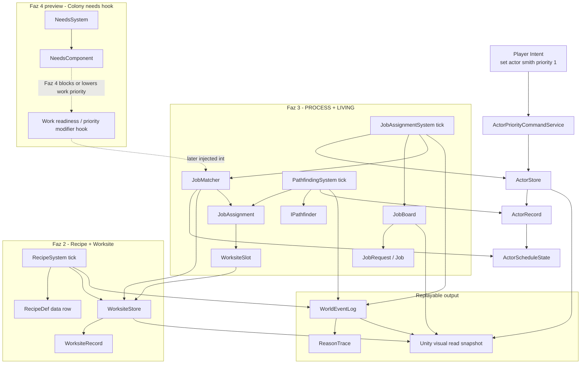
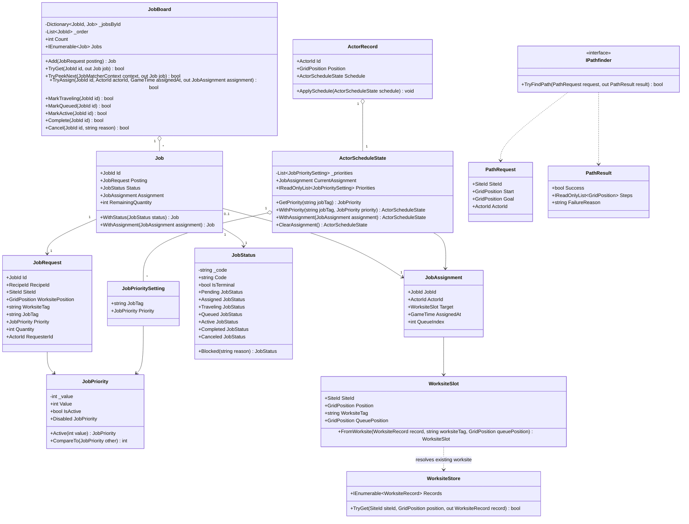
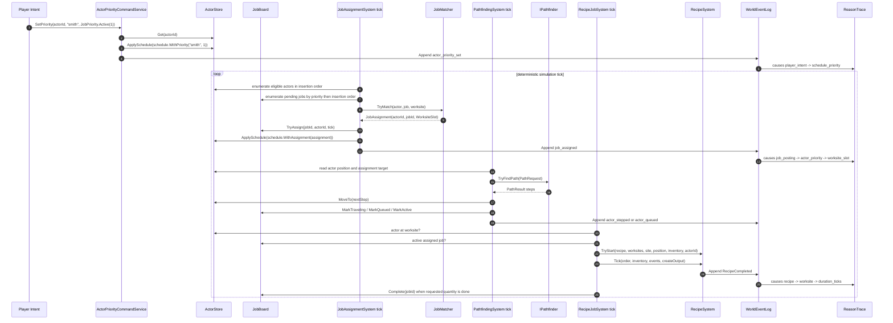

## 1. Sistem haritası (Mermaid graph TB)

> _Captain atom-map_: `docs/sprint-faz-11-atom-map.md` (Captain narrow vertical-slice decomposition).
> _Naming_: aligned with Captain types (JobRequest, ActorScheduleState, JobAssignmentSystem).
> _Spec covers full architecture; Captain may implement subset and extend later.



Faz 11 bu haritada dünya mutasyonu yapmaz; Unity tarafı yalnızca `ActorStore`, `JobBoard`, `WorksiteStore`, `WorldEventLog` ve okunabilir snapshot satırlarını tüketir. Domain/Simulation tarafına Unity engine tipi girmemeli.

## 2. Veri modeli (Mermaid classDiagram)



`JobTag`, `WorksiteTag` ve `RecipeDef` yeni davranışların ana genişleme noktasıdır. Yeni recipe veya meslek tipi için C# branch eklenmez; data row eklenir.

## 3. Tick akışı (Mermaid sequenceDiagram)



## 4. C# scaffold — DOSYA YOLU + İMZA (gövde YOK)

Aşağıdaki bloklar imza scaffold’udur. Captain implement ederken gövde ekler; Domain/Simulation içinde Unity engine tipi kullanmaz.

### `Assets/Scripts/Domain/Process/JobStatus.cs`

```csharp
using System;

namespace EmberCrpg.Domain.Process
{
    /// <summary>
    /// Data-coded runtime status for a job. The code is a stable string so new status rows do not require enum branching.
    /// </summary>
    public readonly struct JobStatus : IEquatable<JobStatus>
    {
        /// <summary>Stable status code used by save/load, tests, and visual snapshots.</summary>
        private readonly string _code;

        /// <summary>Creates a status from a non-blank stable code.</summary>
        public JobStatus(string code);

        /// <summary>Stable status code, for example "pending" or "queued".</summary>
        public string Code { get; }

        /// <summary>True when this status should leave the active board lifecycle.</summary>
        public bool IsTerminal { get; }

        /// <summary>Job exists but no actor has claimed it.</summary>
        public static JobStatus Pending { get; }

        /// <summary>Job has an actor assignment but pathing has not started yet.</summary>
        public static JobStatus Assigned { get; }

        /// <summary>Assigned actor is moving toward the target worksite.</summary>
        public static JobStatus Traveling { get; }

        /// <summary>Actor reached the worksite queue but cannot start yet.</summary>
        public static JobStatus Queued { get; }

        /// <summary>Recipe work is currently progressing at the worksite.</summary>
        public static JobStatus Active { get; }

        /// <summary>Job completed all requested units.</summary>
        public static JobStatus Completed { get; }

        /// <summary>Job was intentionally removed before completion.</summary>
        public static JobStatus Canceled { get; }

        /// <summary>Creates a blocked status with a stable reason suffix.</summary>
        public static JobStatus Blocked(string reason);

        /// <summary>Returns true when both statuses carry the same code.</summary>
        public bool Equals(JobStatus other);

        /// <summary>Returns true when the object is a status with the same code.</summary>
        public override bool Equals(object obj);

        /// <summary>Returns a hash code derived only from the stable code.</summary>
        public override int GetHashCode();

        /// <summary>Returns the stable code for debug and snapshot output.</summary>
        public override string ToString();
    }
}
```

### `Assets/Scripts/Domain/Process/JobRequest.cs`

```csharp
using System;
using EmberCrpg.Domain.Actors;
using EmberCrpg.Domain.Core;

namespace EmberCrpg.Domain.Process
{
    /// <summary>
    /// Immutable data row for requested work. It binds recipe, worksite, job tag, priority, and quantity without assigning actors.
    /// </summary>
    public sealed class JobRequest
    {
        /// <summary>Creates a deterministic job posting from validated row data.</summary>
        public JobRequest(
            JobId id,
            RecipeId recipeId,
            SiteId siteId,
            GridPosition worksitePosition,
            string worksiteTag,
            string jobTag,
            JobPriority priority,
            int quantity,
            ActorId requesterId);

        /// <summary>Stable handle for this requested work.</summary>
        public JobId Id { get; }

        /// <summary>Recipe data row that should run when the job becomes active.</summary>
        public RecipeId RecipeId { get; }

        /// <summary>Site containing the target worksite.</summary>
        public SiteId SiteId { get; }

        /// <summary>Grid position of the target worksite inside the site.</summary>
        public GridPosition WorksitePosition { get; }

        /// <summary>Data tag for the required worksite, for example "furnace".</summary>
        public string WorksiteTag { get; }

        /// <summary>Data tag for actor matching, for example "smith".</summary>
        public string JobTag { get; }

        /// <summary>Posting-level priority; lower active values win.</summary>
        public JobPriority Priority { get; }

        /// <summary>Number of recipe units requested by this posting.</summary>
        public int Quantity { get; }

        /// <summary>Actor or system proxy that created this posting.</summary>
        public ActorId RequesterId { get; }
    }
}
```

### `Assets/Scripts/Domain/Process/Job.cs`

```csharp
using System;

namespace EmberCrpg.Domain.Process
{
    /// <summary>
    /// Runtime job state owned by JobBoard. It wraps the immutable posting with status, assignment, and remaining quantity.
    /// </summary>
    public sealed class Job
    {
        /// <summary>Creates a runtime job from a posting and initial lifecycle state.</summary>
        public Job(JobRequest posting, JobStatus status, JobAssignment assignment, int remainingQuantity);

        /// <summary>Stable job handle copied from the posting.</summary>
        public JobId Id { get; }

        /// <summary>Immutable requested-work row.</summary>
        public JobRequest Posting { get; }

        /// <summary>Current lifecycle status for matching, pathing, recipe work, and visual output.</summary>
        public JobStatus Status { get; }

        /// <summary>Current actor assignment, or null while pending.</summary>
        public JobAssignment Assignment { get; }

        /// <summary>Recipe units still required before the job can complete.</summary>
        public int RemainingQuantity { get; }

        /// <summary>Returns an equivalent job with a different status.</summary>
        public Job WithStatus(JobStatus status);

        /// <summary>Returns an equivalent job with a different assignment.</summary>
        public Job WithAssignment(JobAssignment assignment);

        /// <summary>Returns an equivalent job with a changed remaining quantity.</summary>
        public Job WithRemainingQuantity(int remainingQuantity);
    }
}
```

### `Assets/Scripts/Domain/Process/JobAssignment.cs`

```csharp
using System;
using EmberCrpg.Domain.Core;

namespace EmberCrpg.Domain.Process
{
    /// <summary>
    /// Immutable claim that binds one actor to one job and one worksite slot. Queue index is deterministic and visualizable.
    /// </summary>
    public sealed class JobAssignment
    {
        /// <summary>Creates an assignment for one actor and one target worksite slot.</summary>
        public JobAssignment(JobId jobId, ActorId actorId, WorksiteSlot target, GameTime assignedAt, int queueIndex);

        /// <summary>Assigned job handle.</summary>
        public JobId JobId { get; }

        /// <summary>Actor responsible for the job.</summary>
        public ActorId ActorId { get; }

        /// <summary>Resolved worksite target and queue cell.</summary>
        public WorksiteSlot Target { get; }

        /// <summary>Deterministic time when the assignment was created.</summary>
        public GameTime AssignedAt { get; }

        /// <summary>Stable order among actors targeting the same worksite.</summary>
        public int QueueIndex { get; }
    }
}
```

### `Assets/Scripts/Domain/Process/JobBoard.cs`

```csharp
using System;
using System.Collections.Generic;
using EmberCrpg.Domain.Core;

namespace EmberCrpg.Domain.Process
{
    /// <summary>
    /// Deterministic PROCESS queue for pending and assigned jobs. It owns lifecycle transitions, not pathfinding or recipe execution.
    /// </summary>
    public sealed class JobBoard
    {
        /// <summary>Jobs by stable id for direct lookup.</summary>
        private readonly Dictionary<JobId, Job> _jobsById;

        /// <summary>Insertion-order ids used for deterministic enumeration and tie-breaking.</summary>
        private readonly List<JobId> _order;

        /// <summary>Creates an empty deterministic job board.</summary>
        public JobBoard();

        /// <summary>Number of jobs currently tracked by the board.</summary>
        public int Count { get; }

        /// <summary>Adds a posting as a pending runtime job.</summary>
        public Job Add(JobRequest posting);

        /// <summary>Returns true when a non-terminal job exists for the id.</summary>
        public bool Contains(JobId id);

        /// <summary>Tries to fetch a job by id.</summary>
        public bool TryGet(JobId id, out Job job);

        /// <summary>Finds the next pending job by posting priority, actor eligibility, and insertion order.</summary>
        public bool TryPeekNext(JobMatcherContext context, out Job job);

        /// <summary>Assigns a pending job to an actor and records queue position.</summary>
        public bool TryAssign(JobId id, ActorId actorId, WorksiteSlot target, GameTime assignedAt, out JobAssignment assignment);

        /// <summary>Moves an assigned job into traveling state.</summary>
        public bool MarkTraveling(JobId id);

        /// <summary>Moves an assigned job into deterministic worksite queue state.</summary>
        public bool MarkQueued(JobId id);

        /// <summary>Moves an assigned job into active recipe work state.</summary>
        public bool MarkActive(JobId id);

        /// <summary>Decrements completed unit count and completes the job when no units remain.</summary>
        public bool CompleteOneUnit(JobId id);

        /// <summary>Cancels a job before completion with a stable reason label.</summary>
        public bool Cancel(JobId id, string reason);

        /// <summary>Drops all jobs and assignments.</summary>
        public void Clear();

        /// <summary>Jobs in deterministic insertion order, including assigned and queued jobs.</summary>
        public IEnumerable<Job> Jobs { get; }
    }
}
```

### `Assets/Scripts/Domain/Actors/JobPrioritySetting.cs`

```csharp
using System;
using EmberCrpg.Domain.Process;

namespace EmberCrpg.Domain.Actors
{
    /// <summary>
    /// Actor-local priority row for one job tag. New job tags are data rows, not new branches.
    /// </summary>
    public sealed class JobPrioritySetting
    {
        /// <summary>Creates one actor preference row.</summary>
        public JobPrioritySetting(string jobTag, JobPriority priority);

        /// <summary>Data tag matched against JobRequest.JobTag.</summary>
        public string JobTag { get; }

        /// <summary>Actor's priority for the tag; disabled means opt out.</summary>
        public JobPriority Priority { get; }
    }
}
```

### `Assets/Scripts/Domain/Actors/ActorScheduleState.cs`

```csharp
using System;
using System.Collections.Generic;
using System.Collections.ObjectModel;
using EmberCrpg.Domain.Process;

namespace EmberCrpg.Domain.Actors
{
    /// <summary>
    /// Actor schedule component containing job priorities and the current assignment. It is actor state, not system behavior.
    /// </summary>
    public sealed class ActorScheduleState
    {
        /// <summary>Deterministic copied list of actor job priority rows.</summary>
        private readonly List<JobPrioritySetting> _priorities;

        /// <summary>Read-only view over priority rows for callers and snapshots.</summary>
        private readonly ReadOnlyCollection<JobPrioritySetting> _priorityView;

        /// <summary>Creates a schedule component with optional priorities and assignment.</summary>
        public ActorScheduleState(IEnumerable<JobPrioritySetting> priorities, JobAssignment currentAssignment = null);

        /// <summary>Current job assignment, or null when idle.</summary>
        public JobAssignment CurrentAssignment { get; }

        /// <summary>Priority rows in deterministic insertion order.</summary>
        public IReadOnlyList<JobPrioritySetting> Priorities { get; }

        /// <summary>Returns the priority for a job tag, or disabled when no row exists.</summary>
        public JobPriority GetPriority(string jobTag);

        /// <summary>Returns a new schedule with the given priority row inserted or replaced.</summary>
        public ActorScheduleState WithPriority(string jobTag, JobPriority priority);

        /// <summary>Returns a new schedule with the current assignment set.</summary>
        public ActorScheduleState WithAssignment(JobAssignment assignment);

        /// <summary>Returns a new schedule with no current assignment.</summary>
        public ActorScheduleState ClearAssignment();
    }
}
```

### `Assets/Scripts/Domain/Actors/ActorRecord.cs` ek imzalar

```csharp
using System.Collections.Generic;
using EmberCrpg.Domain.Core;

namespace EmberCrpg.Domain.Actors
{
    /// <summary>
    /// Pure actor record used by simulation and save/load mapping. Schedule is a component on the actor, not inherited behavior.
    /// </summary>
    public sealed class ActorRecord
    {
        /// <summary>Actor's current job schedule and assignment component.</summary>
        public ActorScheduleState Schedule { get; }

        /// <summary>Creates an actor record with optional schedule component.</summary>
        public ActorRecord(
            ActorId id,
            string name,
            ActorRole role,
            EmberStatBlock stats,
            ActorVitals vitals,
            GridPosition position,
            int accuracy,
            int dodge,
            int armor,
            int baseDamage,
            IEnumerable<string> topicIds = null,
            ActorScheduleState schedule = null);

        /// <summary>Applies a replacement schedule component without changing actor identity.</summary>
        public void ApplySchedule(ActorScheduleState schedule);
    }
}
```

### `Assets/Scripts/Domain/Process/WorksiteSlot.cs`

```csharp
using System;
using EmberCrpg.Domain.Actors;
using EmberCrpg.Domain.Core;

namespace EmberCrpg.Domain.Process
{
    /// <summary>
    /// Resolved work target derived from WorksiteStore. It gives job/path systems a stable target and queue cell.
    /// </summary>
    public sealed class WorksiteSlot
    {
        /// <summary>Creates a resolved worksite slot.</summary>
        public WorksiteSlot(SiteId siteId, GridPosition position, string worksiteTag, GridPosition queuePosition);

        /// <summary>Site containing the worksite.</summary>
        public SiteId SiteId { get; }

        /// <summary>Actual worksite cell.</summary>
        public GridPosition Position { get; }

        /// <summary>Data tag for worksite matching, for example "furnace".</summary>
        public string WorksiteTag { get; }

        /// <summary>Cell where the assigned actor should stand or queue.</summary>
        public GridPosition QueuePosition { get; }

        /// <summary>Builds a slot from an existing WorksiteRecord plus data tag and queue cell.</summary>
        public static WorksiteSlot FromWorksite(WorksiteRecord record, string worksiteTag, GridPosition queuePosition);
    }
}
```

### `Assets/Scripts/Domain/World/IPathfinder.cs`

```csharp
using EmberCrpg.Domain.Actors;

namespace EmberCrpg.Domain.World
{
    /// <summary>
    /// Pure pathfinding API consumed by simulation systems. Implementations must be deterministic for the same request and map data.
    /// </summary>
    public interface IPathfinder
    {
        /// <summary>Attempts to compute a deterministic path from start to goal.</summary>
        bool TryFindPath(PathRequest request, out PathResult result);
    }
}
```

### `Assets/Scripts/Domain/World/PathRequest.cs`

```csharp
using EmberCrpg.Domain.Actors;
using EmberCrpg.Domain.Core;

namespace EmberCrpg.Domain.World
{
    /// <summary>
    /// Immutable path query for one actor inside one site. It carries no Unity or rendering data.
    /// </summary>
    public sealed class PathRequest
    {
        /// <summary>Creates a deterministic path request.</summary>
        public PathRequest(SiteId siteId, GridPosition start, GridPosition goal, ActorId actorId);

        /// <summary>Site whose navigation graph should be queried.</summary>
        public SiteId SiteId { get; }

        /// <summary>Actor start cell.</summary>
        public GridPosition Start { get; }

        /// <summary>Target cell, usually WorksiteSlot.QueuePosition.</summary>
        public GridPosition Goal { get; }

        /// <summary>Actor requesting the path.</summary>
        public ActorId ActorId { get; }
    }
}
```

### `Assets/Scripts/Domain/World/PathResult.cs`

```csharp
using System.Collections.Generic;
using EmberCrpg.Domain.Actors;

namespace EmberCrpg.Domain.World
{
    /// <summary>
    /// Deterministic pathfinding result. Failed paths carry a stable reason label for ReasonTrace.
    /// </summary>
    public sealed class PathResult
    {
        /// <summary>Creates a path result from success flag, ordered steps, and optional failure reason.</summary>
        public PathResult(bool success, IEnumerable<GridPosition> steps, string failureReason);

        /// <summary>True when a route was found.</summary>
        public bool Success { get; }

        /// <summary>Ordered path cells after the start position.</summary>
        public IReadOnlyList<GridPosition> Steps { get; }

        /// <summary>Stable reason label when Success is false.</summary>
        public string FailureReason { get; }
    }
}
```

### `Assets/Scripts/Simulation/Process/ActorPriorityCommandService.cs`

```csharp
using EmberCrpg.Domain.Core;
using EmberCrpg.Domain.Process;
using EmberCrpg.Domain.World;

namespace EmberCrpg.Simulation.Process
{
    /// <summary>
    /// Applies player or AI priority intent to ActorRecord.Schedule through ActorStore. It emits replayable events but does not run jobs.
    /// </summary>
    public sealed class ActorPriorityCommandService
    {
        /// <summary>Creates a command service for actor job priorities.</summary>
        public ActorPriorityCommandService();

        /// <summary>Sets one actor priority row and appends a reason-traced world event.</summary>
        public bool SetPriority(
            ActorStore actors,
            ActorId actorId,
            string jobTag,
            JobPriority priority,
            GameTime now,
            WorldEventLog events);
    }
}
```

### `Assets/Scripts/Simulation/Process/JobMatcher.cs`

```csharp
using EmberCrpg.Domain.Actors;
using EmberCrpg.Domain.Core;
using EmberCrpg.Domain.Process;
using EmberCrpg.Domain.World;
using EmberCrpg.Simulation.Rng;

namespace EmberCrpg.Simulation.Process
{
    /// <summary>
    /// Pure deterministic matcher from actor schedule rows to pending job rows. It reads stores and returns assignments; JobBoard owns mutation.
    /// </summary>
    public sealed class JobMatcher
    {
        /// <summary>Creates a matcher with deterministic tie-breaking dependencies.</summary>
        public JobMatcher(IDeterministicRng rng);

        /// <summary>Tries to match one actor to one pending job at the current tick.</summary>
        public bool TryMatch(
            ActorRecord actor,
            Job job,
            WorksiteStore worksites,
            GameTime now,
            out JobAssignment assignment);

        /// <summary>Returns true when the actor is alive, idle, prioritized for the job tag, and the worksite resolves.</summary>
        public bool CanActorWorkJob(
            ActorRecord actor,
            Job job,
            WorksiteStore worksites,
            out string rejectionReason);
    }

    /// <summary>
    /// Context passed into JobBoard peek so board selection can stay deterministic without owning actor logic.
    /// </summary>
    public sealed class JobMatcherContext
    {
        /// <summary>Creates a matcher context for one actor and current stores.</summary>
        public JobMatcherContext(ActorRecord actor, WorksiteStore worksites, GameTime now);

        /// <summary>Actor currently being matched.</summary>
        public ActorRecord Actor { get; }

        /// <summary>Worksite registry used to resolve job targets.</summary>
        public WorksiteStore Worksites { get; }

        /// <summary>Current deterministic game time.</summary>
        public GameTime Now { get; }
    }
}
```

### `Assets/Scripts/Simulation/Process/JobAssignmentSystem.cs`

```csharp
using System.Collections.Generic;
using EmberCrpg.Domain.Core;
using EmberCrpg.Domain.World;
using EmberCrpg.Simulation.Rng;

namespace EmberCrpg.Simulation.Process
{
    /// <summary>
    /// Orchestrates one deterministic job-assignment tick. It scans actors in store order and assigns matching pending jobs.
    /// </summary>
    public sealed class JobAssignmentSystem
    {
        /// <summary>Matcher used for actor/job eligibility checks.</summary>
        private readonly JobMatcher _matcher;

        /// <summary>Creates a job system with a deterministic matcher.</summary>
        public JobAssignmentSystem(JobMatcher matcher);

        /// <summary>Runs one assignment tick and returns assignments created during the tick.</summary>
        public IReadOnlyList<JobAssignment> Tick(
            ActorStore actors,
            JobBoard board,
            WorksiteStore worksites,
            GameTime now,
            WorldEventLog events);
    }
}
```

### `Assets/Scripts/Simulation/Process/PathfindingSystem.cs`

```csharp
using EmberCrpg.Domain.World;

namespace EmberCrpg.Simulation.Process
{
    /// <summary>
    /// Advances assigned actors toward their WorksiteSlot queue positions. It mutates ActorRecord position only through ActorStore records.
    /// </summary>
    public sealed class PathfindingSystem
    {
        /// <summary>Deterministic pathfinding API implementation.</summary>
        private readonly IPathfinder _pathfinder;

        /// <summary>Creates a pathing system from a deterministic pathfinder.</summary>
        public PathfindingSystem(IPathfinder pathfinder);

        /// <summary>Runs one pathing tick for assigned jobs and appends reason-traced movement or blocked events.</summary>
        public void Tick(ActorStore actors, JobBoard board, WorldEventLog events);
    }
}
```

### `Assets/Scripts/Simulation/Process/RecipeJobSystem.cs`

```csharp
using System;
using EmberCrpg.Domain.Inventory;
using EmberCrpg.Domain.Process;
using EmberCrpg.Domain.World;

namespace EmberCrpg.Simulation.Process
{
    /// <summary>
    /// Bridges assigned jobs into RecipeSystem execution when actors are at the target worksite. It does not define recipes in code.
    /// </summary>
    public sealed class RecipeJobSystem
    {
        /// <summary>Recipe executor used for work order start and progress.</summary>
        private readonly RecipeSystem _recipeSystem;

        /// <summary>Creates a bridge over the existing RecipeSystem.</summary>
        public RecipeJobSystem(RecipeSystem recipeSystem);

        /// <summary>Runs one recipe-job tick, starting or advancing work orders for active assignments.</summary>
        public void Tick(
            ActorStore actors,
            JobBoard board,
            WorksiteStore worksites,
            InventoryState inventory,
            Func<RecipeId, RecipeDef> resolveRecipe,
            Func<RecipeOutput, InventoryItem> createOutput,
            WorldEventLog events);
    }
}
```

### `Assets/Scripts/Presentation/VisualLayer/JobDebugSnapshot.cs`

```csharp
using System.Collections.Generic;
using EmberCrpg.Domain.Actors;
using EmberCrpg.Domain.Process;
using EmberCrpg.Domain.World;

namespace EmberCrpg.Presentation.VisualLayer
{
    /// <summary>
    /// Read-only visual snapshot for Unity debug surfaces. It carries serializable view rows and performs no world mutation.
    /// </summary>
    public sealed class JobDebugSnapshot
    {
        /// <summary>Creates a snapshot from actor, job, and worksite rows.</summary>
        public JobDebugSnapshot(IEnumerable<JobDebugRow> rows);

        /// <summary>Rows in deterministic display order.</summary>
        public IReadOnlyList<JobDebugRow> Rows { get; }

        /// <summary>Builds a deterministic visual snapshot from current stores.</summary>
        public static JobDebugSnapshot FromStores(ActorStore actors, JobBoard board, WorksiteStore worksites);
    }

    /// <summary>
    /// One visual row describing an actor/job/worksite queue state. Unity can render this without reading simulation internals.
    /// </summary>
    public sealed class JobDebugRow
    {
        /// <summary>Creates one visual job queue row.</summary>
        public JobDebugRow(ActorId actorId, JobId jobId, string actorName, string jobTag, string statusCode, string worksiteTag, int queueIndex);

        /// <summary>Actor shown in the row.</summary>
        public ActorId ActorId { get; }

        /// <summary>Job shown in the row.</summary>
        public JobId JobId { get; }

        /// <summary>Actor display name.</summary>
        public string ActorName { get; }

        /// <summary>Data-driven job tag.</summary>
        public string JobTag { get; }

        /// <summary>Stable job status code.</summary>
        public string StatusCode { get; }

        /// <summary>Data-driven worksite tag.</summary>
        public string WorksiteTag { get; }

        /// <summary>Deterministic queue order at the worksite.</summary>
        public int QueueIndex { get; }
    }
}
```

### Atom listesi

| Atom | Dosya + sınıf | Tag | Kısa açıklama | Neyi açar |
|---:|---|---|---|---|
| Atom 1 | `Assets/Scripts/Domain/Process/JobStatus.cs` :: `JobStatus` | [box=PROCESS] | Enum yerine stable string status value object. | Queue/active/completed lifecycle dili. |
| Atom 2 | `Assets/Scripts/Domain/Process/JobRequest.cs` :: `JobRequest` | [box=PROCESS] | `JobRequest` üstüne data-driven posting row; `JobTag` string. | Yeni recipe/job branch yazmadan iş açma. |
| Atom 3 | `Assets/Scripts/Domain/Process/Job.cs` + `JobAssignment.cs` | [box=PROCESS] | Runtime job ve actor claim row. | Board lifecycle ve queue index. |
| Atom 4 | `Assets/Scripts/Domain/Process/JobBoard.cs` :: lifecycle extension | [box=PROCESS] | Add/assign/status/complete akışı; eski JobBoard testleri kırılmadan genişletilir. | JobAssignmentSystem için mutasyon noktası. |
| Atom 5 | `Assets/Scripts/Domain/Actors/JobPrioritySetting.cs` + `ActorScheduleState.cs` | [box=LIVING] | Actor-local job priority rows. | Player can set smith priority. |
| Atom 6 | `Assets/Scripts/Domain/Actors/ActorRecord.cs` :: `Schedule` integration | [box=LIVING] | ActorScheduleState ActorRecord’a eklenir. | ActorStore üzerinden schedule okunabilir. |
| Atom 7 | `Assets/Scripts/Simulation/Process/ActorPriorityCommandService.cs` | [box=LIVING] | Player intent -> actor priority -> EventLog/ReasonTrace. | İlk visible debug event. |
| Atom 8 | `Assets/Scripts/Domain/Process/WorksiteSlot.cs` | [box=PROCESS] | Existing WorksiteStore’dan target + queue cell çözümü. | Pathing ve queue görselleştirme. |
| Atom 9 | `Assets/Scripts/Domain/World/IPathfinder.cs` + `PathRequest/PathResult` | [box=PROCESS] | Class değil interface; deterministic path API. | PathfindingSystem izolasyonu. |
| Atom 10 | `Assets/Scripts/Simulation/Process/JobMatcher.cs` | [box=PROCESS] | Actor schedule + pending job + worksite eligibility. | Assignment tick’in karar merkezi. |
| Atom 11 | `Assets/Scripts/Simulation/Process/JobAssignmentSystem.cs` | [box=PROCESS] | Eligible actors scan -> match -> assign. | İki smith actor aynı furnace queue’ya girebilir. |
| Atom 12 | `Assets/Scripts/Simulation/Process/PathfindingSystem.cs` | [box=PROCESS] | Compute path -> step actor -> queued/active status. | “Watch both queue” snapshot’ı. |
| Atom 13 | `Assets/Scripts/Simulation/Process/RecipeJobSystem.cs` | [box=PROCESS] | Actor at worksite -> RecipeSystem.TryStart/Tick -> job completion. | 4 ingot üretim zinciri. |
| Atom 14 | `Assets/Scripts/Presentation/VisualLayer/JobDebugSnapshot.cs` | [box=PROCESS] | Unity’nin okuyacağı saf snapshot rows. | Faz 11 screenshot/debug HUD kanıtı. |
| Atom 15 | `tests/EmberCrpg.Core.Tests/Replay/Faz3SmithingReplayTests.cs` | [box=PROCESS][box=LIVING] | Full deterministic acceptance replay. | Sprint kapanış kanıtı. |

## 5. Test stratejisi

| Test dosyası | Pin’lenen davranış | Not |
|---|---|---|
| `tests/EmberCrpg.Core.Tests/Process/JobStatusTests.cs` | Status code equality, terminal status, blocked reason normalization. | Enum branch yok. |
| `tests/EmberCrpg.Core.Tests/Process/JobPostingTests.cs` | Empty id, blank `JobTag`, blank `WorksiteTag`, inactive priority, non-positive quantity rejection. | Yeni recipe/job data row ile genişler. |
| `tests/EmberCrpg.Core.Tests/Process/JobBoardLifecycleTests.cs` | Add order, priority order, assign, queued, active, complete, cancel. | Existing JobBoard NUnit kapsamını xUnit pure rail’e taşır. |
| `tests/EmberCrpg.Core.Tests/Actors/ScheduleComponentTests.cs` | Priority row replacement, disabled priority, assignment set/clear. | Actor behavior değil, component state. |
| `tests/EmberCrpg.Core.Tests/Process/ActorPriorityCommandServiceTests.cs` | Player intent schedule’a yazılır ve ReasonTrace oluşur. | İlk visible EventLog. |
| `tests/EmberCrpg.Core.Tests/Process/JobMatcherTests.cs` | Alive + idle actor, matching `JobTag`, active worksite, deterministic rejection reason. | Faz 4 Needs hook için rejection reason önemli. |
| `tests/EmberCrpg.Core.Tests/World/PathfinderContractTests.cs` | Same request -> same path result; no Unity dependency. | Concrete pathfinder daha sonra gelir. |
| `tests/EmberCrpg.Core.Tests/Process/PathfindingSystemTests.cs` | Actor one step moves, reaches queue position, status changes to queued/active. | Store mutation pinlenir. |
| `tests/EmberCrpg.Core.Tests/Process/RecipeJobSystemTests.cs` | Actor at furnace starts recipe, ticks existing RecipeSystem, board completes units. | Faz 2 bağlantısı. |
| `tests/EmberCrpg.Core.Tests/Presentation/JobDebugSnapshotTests.cs` | Snapshot rows deterministic order and queue index. | Faz 11 view read model. |
| `tests/EmberCrpg.Core.Tests/Replay/Faz3SmithingReplayTests.cs` | Full “2 smiths, furnace queue, 4 ingots, deterministic day” replay. | Acceptance gate. |

Deterministic test pattern:

```csharp
using EmberCrpg.Simulation.Rng;
using Xunit;

namespace EmberCrpg.Core.Tests.Process
{
    public sealed class DeterministicReplayPattern
    {
        [Fact]
        public void SameSeed_ProducesSameReplayLog()
        {
            IDeterministicRng firstRng = new XorShiftRng(1337u);
            IDeterministicRng secondRng = new XorShiftRng(1337u);

            // Arrange the same ActorStore, WorksiteStore, JobBoard, RecipeDef rows.
            // Run the same fixed tick loop.
            // Assert serialized WorldEventLog + JobDebugSnapshot rows are byte-equal.
        }
    }
}
```

Acceptance çevirisi:

| Player sentence | Test karşılığı |
|---|---|
| player can set 2 actors to smith priority 1 | `ActorPriorityCommandService.SetPriority(a1, "smith", Active(1))` ve `a2` için aynı çağrı; schedule rows assert edilir. |
| watch both queue at the furnace | `JobAssignmentSystem.Tick` iki assignment üretir; `PathfindingSystem.Tick` sonrası iki `JobDebugRow` aynı `worksiteTag=furnace`, queue index `0,1`. |
| produce 4 ingots | 4 adet `JobRequest` veya quantity 4 posting; `RecipeJobSystem` tick sonunda inventory `iron_ingot == 4`. |
| in a deterministic day | Tick count `GameTime.MinutesPerDay` sınırını aşmaz; aynı seed ile replay log byte-equal. |

Replay determinism check:

| Kontrol | Assertion |
|---|---|
| Event order | `WorldEventLog.Events.Select(e => e.Reason)` iki replay’de aynı. |
| ReasonTrace | Her `job_assigned`, `actor_queued`, `recipe_completed` trace root-first aynı. |
| Inventory | Final `iron_ore == 0`, `fuel == 0`, `iron_ingot == 4`. |
| Actor state | Final positions ve schedules aynı. |
| Snapshot | `JobDebugSnapshot.Rows` stable actor/job/order/status sırasıyla aynı. |

## 6. Risk + acceptance

Acceptance senaryosu: `player can set 2 actors to smith priority 1, watch both queue at the furnace, and produce 4 ingots in a deterministic day`.

Test kurulumu:

| Adım | Fixture |
|---|---|
| Actors | `ActorStore` içinde iki canlı actor, aynı site, farklı start positions, boş schedule. |
| Priority intent | `ActorPriorityCommandService` ile ikisine de `smith` priority `1`. |
| Worksite | `WorksiteStore` içinde active furnace at `SiteId(1), GridPosition(5,5)`. |
| Recipes | `SmeltIronIngot` data row: `2 iron_ore + 1 fuel -> 1 iron_ingot`, duration existing Faz 2 value. |
| Inventory | 8 ore + 4 fuel, output capacity enough. |
| Jobs | 4 unit job posting veya quantity 4 posting; tercih: 4 unit posting, daha küçük lifecycle testleri. |
| Tick loop | `JobAssignmentSystem`, `PathfindingSystem`, `RecipeJobSystem` fixed order, max `GameTime.MinutesPerDay`. |
| Pass condition | 4 ingots, both actors assigned/queued at least once, same seed replay byte-equal. |

Hangi atom’lar acceptance’ı kapatır:

| Acceptance parçası | Kapatıcı atom |
|---|---|
| Priority setlenebilir | Atom 5, Atom 6, Atom 7 |
| Job açılır ve iki actor claim eder | Atom 1-4, Atom 10, Atom 11 |
| Furnace queue görünür | Atom 8, Atom 12, Atom 14 |
| Recipe üretimi job completion’a bağlanır | Atom 13 |
| Deterministic day kanıtı | Atom 15 |

Risk matrisi:

| Risk | Atom | Büyüklük | Neden | Mitigasyon |
|---|---:|---|---|---|
| `ActorRecord` constructor değişimi mevcut testleri kırar | 6 | Büyük | Çok sayıda test actor oluşturuyor. | `schedule = null` optional param; default empty schedule. |
| Existing `JobBoard` API ile yeni lifecycle çakışır | 4 | Büyük | Mevcut `JobRequest` testleri var. | Backward-compatible overload veya ayrı `JobRequest` path; eski testler korunur. |
| Worksite queue capacity belirsizliği | 8, 12, 13 | Orta | Existing WorksiteStore yalnızca record lookup. | Queue index `JobAssignment` üzerinde tutulur; WorksiteStore değiştirilmez. |
| Pathfinding gerçek map verisi yoksa acceptance bloke olur | 9, 12 | Orta | Interface var ama concrete pathfinder ayrı PR olabilir. | Acceptance testte deterministic grid pathfinder fake’i kullan; production concrete sonra. |
| RecipeSystem tek work order varsayımı | 13 | Orta | Faz 2 dar slice. | `RecipeJobSystem` active orders’ı job id ile tutar; RecipeSystem saf executor kalır. |
| Event kind genişletme enum tartışması | 7, 11, 13 | Basit/orta | Log görünürlüğü gerekiyor. | Logic branch event kind’a bağlanmaz; reason labels ve data tags testlenir. |
| Unity visual layer’ın core’a sızması | 14 | Basit | Faz 11 sunum hedefi var. | Snapshot pure C# kalır; Unity yalnızca okur. |

Atom sırası nedeni:

| Sıra | Gerekçe |
|---|---|
| 1-4 | Önce job lifecycle dili ve board state netleşir; assignment sistemi boşa yazılmaz. |
| 5-7 | Player intent ve actor schedule görünür olur; üçüncü PR visible progress üretebilir. |
| 8-9 | Worksite target ve path API netleşmeden queue/path sistemi yazılmaz. |
| 10-11 | Matcher ayrı pinlenir, sonra JobAssignmentSystem orchestration gelir. |
| 12-13 | Önce actor worksite’a gelir, sonra RecipeSystem bridge çalışır. |
| 14-15 | Snapshot ve replay en sona gelir; acceptance tüm davranışı kapatır. |

Faz 4 Colony Needs hook’ları:

| Hook | Nerede bırakılır | Faz 4’te kullanım |
|---|---|---|
| `ActorScheduleState.GetPriority(string jobTag)` | Actor schedule component | Hunger/fatigue priority düşürebilir veya disabled döndürebilir. |
| `JobMatcher.CanActorWorkJob(..., out rejectionReason)` | Matcher boundary | Needs threshold actor’u “too_hungry_to_work” reason ile reddeder. |
| `ReasonTrace` cause labels | `job_assigned`, `job_blocked`, `actor_queued` events | Mood/needs kaynaklı refusal görünür ve replayable olur. |
| `JobStatus.Blocked(string reason)` | Job lifecycle | Needs yüzünden geçici bloklar status olarak debug HUD’a düşer. |
| `JobDebugSnapshot.StatusCode` | Faz 11 read model | Unity, “blocked:hunger” gibi state’i core’a dokunmadan gösterir. |
