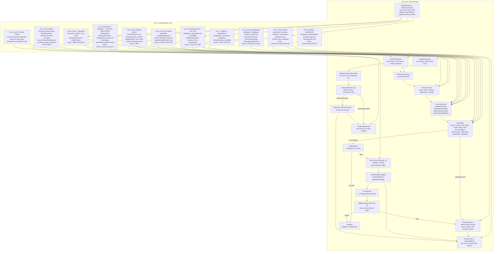

# Faz 12 — LLM / NPC fallback flavour

> _Captain atom-map_: authored under `docs/archive/sprint/` as `sprint-faz-12-atom-map.md` when this slice is scheduled (Captain narrow vertical-slice decomposition).  
> _Naming_: aligned with Captain types (`JobRequest`, `ActorScheduleState`, `JobAssignmentSystem`).  
> _Spec covers full architecture; Captain may implement subset and extend later._

Faz 12, Alcyone-Ember’in son katmanıdır. Bu faz yeni bir “LLM oyun motoru” eklemez; önceki 11 fazın deterministic çekirdeğini tek bir yaşayan dünya davranışına bağlar. NPC’ler önce kendi ihtiyaç, hafıza, moral, disposition, iş ve tool verileriyle karar verir. DM/LLM yalnızca deterministic sistemin takıldığı, düşük güvenli ve stale durumlarda 1-3 öneri üretir. Öneriler Store’a yazamaz; sadece NPC’nin kendi tool listesine karşı validate edilir ve deterministic command path üzerinden çalışır.

## 1. Sistem Haritası



Faz 10 ile Faz 12 ayrımı net kalır: Faz 10 DM Query API sadece typed read-only snapshot verir. Faz 12 `IDmEscalationAdapter` üzerinden yalnızca öneri ister. DM hiçbir zaman Store’a yazmaz, command üretmez, actor inventory veya city-wide state gibi NPC’nin tool scope’u dışındaki verilere müdahale edemez.

## 2. Veri Modeli

```mermaid
classDiagram
  direction TB

  class NpcAgent {
    +ActorId ActorId
    +NpcToolKit ToolKit
    +WorldTick LastProgressTick
    +int ConsecutiveStaleTicks
    +int StaleThresholdTicks
    +bool IsStale(WorldTick currentTick)
  }

  class NpcToolKit {
    +ActorId OwnerActorId
    +IReadOnlySet~NpcToolId~ AllowedTools
    +bool Allows(NpcToolId toolId)
    +ToolCallValidationResult Validate(ProposedToolCall call, NpcToolContext context)
    +NpcCommand ToCommand(ProposedToolCall call, NpcToolContext context)
  }

  class IDmEscalationAdapter {
    <<interface>>
    +ValueTask~DmProposal~ ProposeAsync(DmEscalationRequest request, CancellationToken ct)
  }

  class DmProposal {
    +DmCallId CallId
    +ActorId ActorId
    +WorldTick Tick
    +IReadOnlyList~ProposedToolCall~ ProposedToolCalls
    +string Rationale
    +string OutputHash
  }

  class ProposedToolCall {
    +NpcToolId ToolId
    +IReadOnlyDictionary~string,string~ Args
    +int Priority
    +string Rationale
  }

  class AmbientBarkDef {
    +BarkDefId BarkDefId
    +BarkContextId ContextId
    +bool LlmEnhance
    +int Weight
    +IReadOnlyList~AmbientBarkVariant~ Variants
  }

  class BarkContext {
    +ActorId? ActorId
    +SiteId SiteId
    +RegionId RegionId
    +WorldTick Tick
    +string Language
    +IReadOnlyList~string~ Tags
  }

  class BackgroundChatterSystem {
    +double SampleRateMin
    +double SampleRateMax
    +int LlmBatchSize
    +IReadOnlyList~AmbientBarkEvent~ Tick(WorldTick tick, BackgroundChatterContext context)
  }

  class LlmOutputRow {
    +DmCallId CallId
    +WorldTick Tick
    +ActorId? ActorId
    +string Model
    +string PromptHash
    +string Text
    +int Tokens
    +string OutputHash
  }

  class LiveDmAdapter {
    +ValueTask~DmProposal~ ProposeAsync(DmEscalationRequest request, CancellationToken ct)
  }

  class ReplayDmAdapter {
    +ValueTask~DmProposal~ ProposeAsync(DmEscalationRequest request, CancellationToken ct)
  }

  class WorldGenSeed {
    +ulong Value
    +WorldGenSeed Derive(string scope, int index)
  }

  class MultiverseConfig {
    +WorldGenSeed Seed
    +int TargetPopulation
    +int SettlementCount
    +int FactionCount
  }

  class LodTickScheduler {
    +IReadOnlyList~ActorId~ ActorsDue(WorldTick tick, CameraFocus focus)
    +LodBand ResolveBand(ActorId actorId, CameraFocus focus)
  }

  class SpatialHashIndex {
    +void Insert(ActorId actorId, CellCoord cell)
    +void Move(ActorId actorId, CellCoord from, CellCoord to)
    +IReadOnlyList~ActorId~ QueryRadius(CellCoord center, int radius)
  }

  class NeedPriorityRow {
    +string NeedId
    +float Weight
    +float DesperateMultiplier
    +NpcToolId PreferredTool
  }

  class MoralePressureRow {
    +string Mood
    +NpcToolId PreferredTool
    +float ScoreDelta
  }

  class MemoryReactionRow {
    +string MemoryTag
    +NpcToolId PreferredTool
    +float ScoreDelta
  }

  class DispositionWeightRow {
    +int MinDisposition
    +int MaxDisposition
    +NpcToolId PreferredTool
    +float ScoreDelta
  }

  IDmEscalationAdapter <|.. LiveDmAdapter
  IDmEscalationAdapter <|.. ReplayDmAdapter
  NpcAgent --> NpcToolKit
  NpcToolKit --> ProposedToolCall
  DmProposal o-- ProposedToolCall
  BackgroundChatterSystem --> AmbientBarkDef
  BackgroundChatterSystem --> BarkContext
  LiveDmAdapter --> LlmOutputRow
  ReplayDmAdapter --> LlmOutputRow
  MultiverseConfig --> WorldGenSeed
  LodTickScheduler --> SpatialHashIndex
  NpcAgent --> NeedPriorityRow
  NpcAgent --> MoralePressureRow
  NpcAgent --> MemoryReactionRow
  NpcAgent --> DispositionWeightRow
```



## 3. Tick Akışı

```mermaid
sequenceDiagram
  participant Clock as TickClock
  participant Scheduler as LodTickScheduler
  participant Decision as NpcDecisionSystem
  participant Actor as NpcAgent
  participant Rules as Data-driven Rows
  participant Tools as NpcToolKit
  participant Stale as StaleDetector
  participant DM as IDmEscalationAdapter
  participant Queue as CommandQueue
  participant Store as World Stores
  participant Trace as ReasonTrace

  Clock->>Scheduler: Tick(worldTick, cameraFocus)
  Scheduler-->>Decision: actorsDue ordered deterministically

  loop each due actor by stable ActorId order
    Decision->>Actor: read ActorView, MemoryView, NeedState, Disposition
    Decision->>Rules: score NeedPriorityRow / MoralePressureRow / MemoryReactionRow / DispositionWeightRow
    Rules-->>Decision: ranked tool scores
    Decision->>Tools: validate best deterministic tool

    alt best tool score passes threshold
      Tools-->>Decision: valid NpcCommand
      Decision->>Queue: enqueue command with DeterministicRng(seed,tick,actorId,actionIndex)
      Queue->>Store: mutate through owning system only
      Queue->>Trace: append ToolCall + ReasonTrace
      Decision->>Stale: reset progress
    else no strong tool
      Decision->>Stale: IsStale(actorId, worldTick)
      alt not stale
        Decision->>Tools: validate IdleBark or WaitTick(1)
        Tools-->>Decision: fallback command
        Decision->>Queue: enqueue fallback
        Queue->>Trace: append fallback reason
      else stale and regional rate limit open
        Decision->>DM: ProposeAsync(DmEscalationRequest)
        alt Live mode
          DM-->>Decision: DmProposal from local-first LLM
          Decision->>Trace: record LlmOutputRow with hashes
        else Replay mode
          DM-->>Decision: DmProposal reconstructed from recorded LlmOutputRow
        end

        loop each ProposedToolCall by proposal priority
          Decision->>Tools: validate against NPC allowed tools and local scope
          alt valid
            Tools-->>Decision: NpcCommand
            Decision->>Queue: enqueue deterministic command
            Queue->>Store: mutate through owning system only
            Queue->>Trace: append accepted proposal id
          else invalid
            Decision->>Trace: append rejected proposal reason
          end
        end

        alt no proposal accepted
          Decision->>Tools: validate IdleBark or WaitTick(1)
          Decision->>Queue: enqueue fallback
          Decision->>Trace: append fallback after reject
        end
      end
    end
  end
```

Determinism kuralı: LLM sonucu canlı modda non-deterministic olabilir, fakat çıktı `LlmOutputRow` olarak kaydedildiği anda replay determinism sağlanır. Replay modda aynı `CallId` için recorded text/proposal okunur; provider tekrar çağrılmaz.

## 4. C# Scaffold — Dosya Yolu + İmza

Aşağıdaki bloklar signature map’tir. Method ve constructor gövdeleri kasıtlı olarak yoktur. Captain implementasyon atomlarında gövdeleri doldurur. Core saf C# kalır; `MonoBehaviour` yoktur.

### `Assets/Scripts/Domain/AiDm/NpcAgent.cs`

```csharp
using System.Collections.Generic;
using EmberCrpg.Domain.Actors;
using EmberCrpg.Domain.Time;
using EmberCrpg.Domain.World;

namespace EmberCrpg.Domain.AiDm;

/// <summary>
/// Deterministic NPC decision owner. Holds only agent-level AI/DM state; world mutation happens through command systems.
/// </summary>
public sealed class NpcAgent
{
    /// <summary>Creates an NPC agent bound to one actor and one deterministic tool kit.</summary>
    public NpcAgent(ActorId actorId, NpcToolKit toolKit, int staleThresholdTicks, WorldTick lastProgressTick);

    /// <summary>Actor controlled by this agent.</summary>
    public ActorId ActorId { get; }

    /// <summary>Allowed deterministic tools for this actor.</summary>
    public NpcToolKit ToolKit { get; }

    /// <summary>Last tick where this actor made observable progress.</summary>
    public WorldTick LastProgressTick { get; }

    /// <summary>Number of consecutive scheduled ticks without progress.</summary>
    public int ConsecutiveStaleTicks { get; }

    /// <summary>Ticks without progress required before DM escalation may be considered.</summary>
    public int StaleThresholdTicks { get; }

    /// <summary>Returns true when the agent has failed to progress long enough to request DM proposals.</summary>
    public bool IsStale(WorldTick currentTick);

    /// <summary>Returns the next immutable agent state after deterministic progress.</summary>
    public NpcAgent WithProgress(WorldTick tick);

    /// <summary>Returns the next immutable agent state after a stale scheduled tick.</summary>
    public NpcAgent WithStaleTick(WorldTick tick);
}

/// <summary>Per-actor decision context assembled from read-only views.</summary>
public sealed record NpcTickContext(
    ActorId ActorId,
    WorldTick Tick,
    ActorView Actor,
    MemoryView Memory,
    DispositionView Disposition,
    NeedStateView Needs,
    IReadOnlyList<WorldEventView> RecentEvents);

/// <summary>Numeric score for one candidate NPC tool.</summary>
public readonly record struct ToolScore(NpcToolId ToolId, float Score, string ReasonCode);

/// <summary>Data row mapping a decayed need to a preferred deterministic tool.</summary>
public sealed record NeedPriorityRow(string NeedId, float Weight, float DesperateMultiplier, NpcToolId PreferredTool);

/// <summary>Data row mapping mood or morale pressure to a tool score delta.</summary>
public sealed record MoralePressureRow(string Mood, NpcToolId PreferredTool, float ScoreDelta, string ReasonCode);

/// <summary>Data row mapping remembered event tags to tool reactions.</summary>
public sealed record MemoryReactionRow(string MemoryTag, NpcToolId PreferredTool, float ScoreDelta, string ReasonCode);

/// <summary>Data row mapping disposition bands to preferred social or hostile tools.</summary>
public sealed record DispositionWeightRow(int MinDisposition, int MaxDisposition, NpcToolId PreferredTool, float ScoreDelta, string ReasonCode);
```

### `Assets/Scripts/Domain/AiDm/NpcToolKit.cs`

```csharp
using System.Collections.Generic;
using EmberCrpg.Domain.Actors;
using EmberCrpg.Domain.Items;
using EmberCrpg.Domain.Time;
using EmberCrpg.Domain.World;

namespace EmberCrpg.Domain.AiDm;

/// <summary>Deterministic NPC tool identifiers. These are executable only after validation.</summary>
public enum NpcToolId
{
    Move,
    PickJob,
    EatFromInventory,
    SleepAtBed,
    TradeWithActor,
    AttackActor,
    FleeFrom,
    TellActor,
    UseObject,
    StartConversation,
    WaitTick,
    IdleBark,
    RememberEvent,
    ChangeDisposition
}

/// <summary>Per-actor whitelist and validator for deterministic NPC actions.</summary>
public sealed class NpcToolKit
{
    /// <summary>Creates a tool kit for one actor.</summary>
    public NpcToolKit(ActorId ownerActorId, IReadOnlySet<NpcToolId> allowedTools, IReadOnlyDictionary<NpcToolId, ToolCooldown> cooldowns);

    /// <summary>Actor that owns this tool kit.</summary>
    public ActorId OwnerActorId { get; }

    /// <summary>Tools this actor is allowed to execute.</summary>
    public IReadOnlySet<NpcToolId> AllowedTools { get; }

    /// <summary>Cooldown rules keyed by tool id.</summary>
    public IReadOnlyDictionary<NpcToolId, ToolCooldown> Cooldowns { get; }

    /// <summary>Returns true when this actor is allowed to use the tool.</summary>
    public bool Allows(NpcToolId toolId);

    /// <summary>Validates a proposed call against actor scope, nearby targets, cooldowns, and tool args.</summary>
    public ToolCallValidationResult Validate(ProposedToolCall call, NpcToolContext context);

    /// <summary>Converts a validated proposed call into the typed command queue representation.</summary>
    public NpcCommand ToCommand(ProposedToolCall call, NpcToolContext context);
}

/// <summary>Cooldown signature for a deterministic NPC tool.</summary>
public sealed record ToolCooldown(NpcToolId ToolId, int CooldownTicks);

/// <summary>Validation context for a proposed NPC tool call.</summary>
public sealed record NpcToolContext(
    ActorId ActorId,
    WorldTick Tick,
    CellCoord ActorCell,
    IReadOnlySet<ActorId> VisibleActors,
    IReadOnlySet<ThingId> ReachableThings,
    IReadOnlyDictionary<string, string> LocalFacts);

/// <summary>Result of validating a proposed or scored tool call.</summary>
public sealed record ToolCallValidationResult(bool IsValid, NpcToolId ToolId, string ReasonCode, string Message);

/// <summary>Typed command emitted by NPC AI into the deterministic command queue.</summary>
public sealed record NpcCommand(ActorId ActorId, NpcToolId ToolId, IReadOnlyDictionary<string, string> Args, WorldTick Tick);
```

### `Assets/Scripts/Domain/AiDm/IDmEscalationAdapter.cs`

```csharp
using System.Collections.Generic;
using System.Threading;
using System.Threading.Tasks;
using EmberCrpg.Domain.Actors;
using EmberCrpg.Domain.Time;

namespace EmberCrpg.Domain.AiDm;

/// <summary>
/// Adapter boundary for DM escalation. Implementations may call an LLM or replay recorded rows, but never mutate world state.
/// </summary>
public interface IDmEscalationAdapter
{
    /// <summary>Returns 1-3 proposed tool calls for a stale NPC situation.</summary>
    ValueTask<DmProposal> ProposeAsync(DmEscalationRequest request, CancellationToken cancellationToken);
}

/// <summary>Read-only escalation request assembled from Faz 10 typed views.</summary>
public sealed record DmEscalationRequest(
    DmCallId CallId,
    ActorId ActorId,
    WorldTick Tick,
    ActorView Actor,
    MemoryView Memory,
    ReasonTraceView RecentReasonTrace,
    IReadOnlyList<WorldEventView> NearbyEvents,
    IReadOnlyList<NpcToolId> AllowedTools,
    string SituationContext);
```

### `Assets/Scripts/Domain/AiDm/DmProposal.cs`

```csharp
using System.Collections.Generic;
using EmberCrpg.Domain.Actors;
using EmberCrpg.Domain.Time;

namespace EmberCrpg.Domain.AiDm;

/// <summary>LLM or replay-produced suggestion packet. It is not executable until validated by NpcToolKit.</summary>
public sealed record DmProposal(
    DmCallId CallId,
    ActorId ActorId,
    WorldTick Tick,
    IReadOnlyList<ProposedToolCall> ProposedToolCalls,
    string Rationale,
    string OutputHash);
```

### `Assets/Scripts/Domain/AiDm/ProposedToolCall.cs`

```csharp
using System.Collections.Generic;

namespace EmberCrpg.Domain.AiDm;

/// <summary>One DM-suggested NPC tool call with string args that must be parsed and validated deterministically.</summary>
public sealed record ProposedToolCall(
    NpcToolId ToolId,
    IReadOnlyDictionary<string, string> Args,
    int Priority,
    string Rationale);
```

### `Assets/Scripts/Domain/AiDm/AmbientBarkDef.cs`

```csharp
using System.Collections.Generic;
using EmberCrpg.Domain.Actors;
using EmberCrpg.Domain.Time;
using EmberCrpg.Domain.World;

namespace EmberCrpg.Domain.AiDm;

/// <summary>Data row for deterministic ambient bark selection.</summary>
public sealed record AmbientBarkDef(
    BarkDefId BarkDefId,
    BarkContextId ContextId,
    int Weight,
    int CooldownTicks,
    bool LlmEnhance,
    IReadOnlyList<string> Tags,
    IReadOnlyList<AmbientBarkVariant> Variants);

/// <summary>Localized text variant for one ambient bark definition.</summary>
public sealed record AmbientBarkVariant(string Language, string Text);

/// <summary>Context used to pick or enhance an ambient bark.</summary>
public sealed record BarkContext(
    ActorId? ActorId,
    SiteId SiteId,
    RegionId RegionId,
    WorldTick Tick,
    string Language,
    IReadOnlyList<string> Tags);

/// <summary>View-facing chatter event. This does not mutate world stores.</summary>
public sealed record AmbientBarkEvent(
    BarkDefId BarkDefId,
    ActorId? ActorId,
    SiteId SiteId,
    WorldTick Tick,
    string Text,
    string Language,
    bool WasLlmEnhanced);
```

### `Assets/Scripts/Simulation/AiDm/NpcDecisionSystem.cs`

```csharp
using System.Collections.Generic;
using EmberCrpg.Domain.Actors;
using EmberCrpg.Domain.AiDm;
using EmberCrpg.Domain.Replay;
using EmberCrpg.Domain.Time;

namespace EmberCrpg.Simulation.AiDm;

/// <summary>Scores deterministic NPC tools, applies stale detection, and gates DM escalation.</summary>
public sealed class NpcDecisionSystem
{
    /// <summary>Creates the decision system with data rows, stale detector, DM adapter, and trace writer.</summary>
    public NpcDecisionSystem(
        IReadOnlyList<NeedPriorityRow> needRows,
        IReadOnlyList<MoralePressureRow> moraleRows,
        IReadOnlyList<MemoryReactionRow> memoryRows,
        IReadOnlyList<DispositionWeightRow> dispositionRows,
        StaleDetector staleDetector,
        IDmEscalationAdapter dmAdapter,
        IReasonTraceWriter reasonTraceWriter);

    /// <summary>Ticks all actors scheduled for this world tick in stable deterministic order.</summary>
    public IReadOnlyList<NpcCommand> Tick(WorldTick tick, IReadOnlyList<ActorId> scheduledActors, NpcDecisionContext context);

    /// <summary>Builds a single actor command from deterministic rules or DM escalation fallback.</summary>
    public NpcCommand DecideForActor(NpcAgent agent, NpcTickContext tickContext, NpcDecisionContext decisionContext);

    /// <summary>Scores every tool available to the actor.</summary>
    public IReadOnlyList<ToolScore> ScoreTools(NpcAgent agent, NpcTickContext tickContext);

    /// <summary>Returns true when the actor should attempt DM escalation this tick.</summary>
    public bool ShouldEscalate(NpcAgent agent, NpcTickContext tickContext, RegionRateLimitState rateLimit);

    /// <summary>Returns deterministic fallback command after no valid tool or proposal is accepted.</summary>
    public NpcCommand BuildFallbackCommand(NpcAgent agent, NpcTickContext tickContext);
}

/// <summary>Read-only context for NPC decision execution.</summary>
public sealed record NpcDecisionContext(
    IActorViewReader ActorViews,
    IMemoryViewReader MemoryViews,
    IWorldEventReader WorldEvents,
    IReasonTraceWriter ReasonTrace,
    RegionRateLimitState RegionRateLimits);
```

### `Assets/Scripts/Simulation/AiDm/BackgroundChatterSystem.cs`

```csharp
using System.Collections.Generic;
using EmberCrpg.Domain.Actors;
using EmberCrpg.Domain.AiDm;
using EmberCrpg.Domain.Replay;
using EmberCrpg.Domain.Time;

namespace EmberCrpg.Simulation.AiDm;

/// <summary>Rate-limited deterministic ambient chatter system with optional batched LLM enhancement.</summary>
public sealed class BackgroundChatterSystem
{
    /// <summary>Creates a chatter system with bark rows, sample limits, batch size, and trace writer.</summary>
    public BackgroundChatterSystem(
        IReadOnlyList<AmbientBarkDef> barkDefs,
        IDmEscalationAdapter? flavourAdapter,
        IReasonTraceWriter reasonTraceWriter,
        double sampleRateMin,
        double sampleRateMax,
        int llmBatchSize);

    /// <summary>Samples eligible actors and returns view-facing ambient bark events.</summary>
    public IReadOnlyList<AmbientBarkEvent> Tick(WorldTick tick, BackgroundChatterContext context);

    /// <summary>Builds LLM enhancement batches only for bark definitions marked LlmEnhance.</summary>
    public IReadOnlyList<LlmBarkBatchRequest> BuildLlmBatches(WorldTick tick, IReadOnlyList<BarkContext> contexts);

    /// <summary>Selects a canned bark variant deterministically from data rows.</summary>
    public AmbientBarkEvent SelectCannedBark(WorldTick tick, BarkContext context);
}

/// <summary>Read-only context for ambient chatter sampling.</summary>
public sealed record BackgroundChatterContext(
    IReadOnlyList<ActorId> CandidateActors,
    IActorViewReader ActorViews,
    string Language,
    DeterministicRng Rng);

/// <summary>Batch request for optional LLM bark enhancement.</summary>
public sealed record LlmBarkBatchRequest(WorldTick Tick, IReadOnlyList<BarkContext> Contexts);
```

### `Assets/Scripts/Simulation/AiDm/LodTickScheduler.cs`

```csharp
using System.Collections.Generic;
using EmberCrpg.Domain.Actors;
using EmberCrpg.Domain.Time;
using EmberCrpg.Domain.World;

namespace EmberCrpg.Simulation.AiDm;

/// <summary>Schedules actor ticks by distance from player camera and stable actor ordering.</summary>
public sealed class LodTickScheduler
{
    /// <summary>Creates a scheduler backed by a spatial index.</summary>
    public LodTickScheduler(SpatialHashIndex spatialHashIndex, LodTickBudget budget);

    /// <summary>Returns actors due for this tick in deterministic order.</summary>
    public IReadOnlyList<ActorId> ActorsDue(WorldTick tick, CameraFocus focus);

    /// <summary>Registers an actor at a cell.</summary>
    public void Register(ActorId actorId, CellCoord cell);

    /// <summary>Updates an actor cell after movement.</summary>
    public void Move(ActorId actorId, CellCoord from, CellCoord to);

    /// <summary>Removes an actor from scheduling.</summary>
    public void Remove(ActorId actorId);

    /// <summary>Resolves the current LOD band for an actor.</summary>
    public LodBand ResolveBand(ActorId actorId, CameraFocus focus);
}

/// <summary>LOD band for actor simulation cadence.</summary>
public enum LodBand
{
    Close60Hz,
    Distant1Hz,
    Offscreen001Hz
}

/// <summary>Distance and cadence configuration for LOD ticks.</summary>
public sealed record LodTickBudget(int CloseRadiusMeters, int DistantRadiusMeters, int OffscreenTickIntervalSeconds);

/// <summary>Player camera focus projected into core simulation space.</summary>
public sealed record CameraFocus(CellCoord Cell, RegionId RegionId);
```

### `Assets/Scripts/Simulation/AiDm/SpatialHashIndex.cs`

```csharp
using System.Collections.Generic;
using EmberCrpg.Domain.Actors;
using EmberCrpg.Domain.World;

namespace EmberCrpg.Simulation.AiDm;

/// <summary>Spatial hash for actor lookup. Prevents O(N) scans at 200K population scale.</summary>
public sealed class SpatialHashIndex
{
    /// <summary>Creates an index with fixed cell size in world cells.</summary>
    public SpatialHashIndex(int bucketSizeCells);

    /// <summary>Number of indexed actors.</summary>
    public int Count { get; }

    /// <summary>Inserts an actor into the spatial index.</summary>
    public void Insert(ActorId actorId, CellCoord cell);

    /// <summary>Moves an actor between cells.</summary>
    public void Move(ActorId actorId, CellCoord from, CellCoord to);

    /// <summary>Removes an actor from the index.</summary>
    public void Remove(ActorId actorId);

    /// <summary>Returns all actors inside a radius using deterministic bucket and actor ordering.</summary>
    public IReadOnlyList<ActorId> QueryRadius(CellCoord center, int radiusCells);

    /// <summary>Returns all actors in one hash bucket.</summary>
    public IReadOnlyList<ActorId> QueryBucket(SpatialBucketCoord bucket);
}

/// <summary>Coordinate of one spatial hash bucket.</summary>
public readonly record struct SpatialBucketCoord(int X, int Y, RegionId RegionId);
```

### `Assets/Scripts/Simulation/AiDm/StaleDetector.cs`

```csharp
using EmberCrpg.Domain.Actors;
using EmberCrpg.Domain.Time;
using EmberCrpg.Domain.World;

namespace EmberCrpg.Simulation.AiDm;

/// <summary>Tracks actor progress and regional DM escalation rate limits.</summary>
public sealed class StaleDetector
{
    /// <summary>Creates a detector with actor stale threshold and regional escalation cooldown.</summary>
    public StaleDetector(int staleThresholdTicks, int regionEscalationCooldownTicks);

    /// <summary>Records that an actor made observable progress.</summary>
    public void ResetProgress(ActorId actorId, WorldTick tick);

    /// <summary>Records that an actor had a scheduled tick without progress.</summary>
    public void ObserveNoProgress(ActorId actorId, WorldTick tick);

    /// <summary>Returns true when the actor is stale at the current tick.</summary>
    public bool IsStale(ActorId actorId, WorldTick tick);

    /// <summary>Returns true when DM escalation is available for the actor's region.</summary>
    public bool CanEscalateRegion(RegionId regionId, WorldTick tick);

    /// <summary>Consumes the regional DM escalation cooldown.</summary>
    public void MarkRegionEscalated(RegionId regionId, WorldTick tick);

    /// <summary>Returns a serializable stale snapshot for replay debugging.</summary>
    public StaleDetectorSnapshot Snapshot();
}

/// <summary>Serializable stale detector state for replay and debugging.</summary>
public sealed record StaleDetectorSnapshot(int ActorCount, int RegionCooldownCount);
```

### `Assets/Scripts/Simulation/AiDm/LiveDmAdapter.cs`

```csharp
using System.Threading;
using System.Threading.Tasks;
using EmberCrpg.Domain.AiDm;
using EmberCrpg.Domain.Replay;

namespace EmberCrpg.Simulation.AiDm;

/// <summary>Local-first live DM adapter. Uses Qwen3 local provider before any configured fallback.</summary>
public sealed class LiveDmAdapter : IDmEscalationAdapter
{
    /// <summary>Creates a live adapter with provider, prompt builder, cost gate, and trace writer.</summary>
    public LiveDmAdapter(ILlmClient llmClient, IDmPromptBuilder promptBuilder, ILlmCostGate costGate, IReasonTraceWriter reasonTraceWriter);

    /// <summary>Requests tool proposals from the configured LLM provider and records output rows.</summary>
    public ValueTask<DmProposal> ProposeAsync(DmEscalationRequest request, CancellationToken cancellationToken);
}

/// <summary>LLM client abstraction for local Qwen3 or fallback provider.</summary>
public interface ILlmClient
{
    /// <summary>Completes one prompt and returns raw model text.</summary>
    ValueTask<LlmCompletion> CompleteAsync(LlmPrompt prompt, CancellationToken cancellationToken);
}

/// <summary>Builds bounded prompts from read-only DM escalation requests.</summary>
public interface IDmPromptBuilder
{
    /// <summary>Builds a prompt that asks only for proposed NPC tool calls.</summary>
    LlmPrompt BuildEscalationPrompt(DmEscalationRequest request);
}

/// <summary>Prevents provider usage beyond configured cost and rate limits.</summary>
public interface ILlmCostGate
{
    /// <summary>Returns true when a live LLM call is allowed.</summary>
    bool CanCall(DmEscalationRequest request);
}
```

### `Assets/Scripts/Simulation/AiDm/ReplayDmAdapter.cs`

```csharp
using System.Threading;
using System.Threading.Tasks;
using EmberCrpg.Domain.AiDm;
using EmberCrpg.Domain.Replay;

namespace EmberCrpg.Simulation.AiDm;

/// <summary>Replay adapter that reconstructs DM proposals from recorded LlmOutputRow entries.</summary>
public sealed class ReplayDmAdapter : IDmEscalationAdapter
{
    /// <summary>Creates a replay adapter backed by reason trace rows.</summary>
    public ReplayDmAdapter(IReasonTraceReader reasonTraceReader, IDmProposalParser proposalParser);

    /// <summary>Returns the recorded proposal for the request CallId without calling an LLM provider.</summary>
    public ValueTask<DmProposal> ProposeAsync(DmEscalationRequest request, CancellationToken cancellationToken);
}

/// <summary>Parses recorded LLM text into deterministic proposal records.</summary>
public interface IDmProposalParser
{
    /// <summary>Parses a proposal from a recorded output row.</summary>
    DmProposal Parse(DmEscalationRequest request, LlmOutputRow row);
}
```

### `Assets/Scripts/Domain/AiDm/LlmOutputRow.cs`

```csharp
using EmberCrpg.Domain.Actors;
using EmberCrpg.Domain.Time;

namespace EmberCrpg.Domain.AiDm;

/// <summary>Recorded LLM output used to make replay deterministic even when live provider output is not.</summary>
public sealed record LlmOutputRow(
    DmCallId CallId,
    WorldTick Tick,
    ActorId? ActorId,
    string Model,
    string PromptHash,
    string Text,
    int Tokens,
    string OutputHash);

/// <summary>Stable identifier for a DM or flavour LLM call.</summary>
public readonly record struct DmCallId(string Value);

/// <summary>Raw LLM prompt with precomputed hash.</summary>
public sealed record LlmPrompt(DmCallId CallId, string Text, string PromptHash);

/// <summary>Raw LLM completion returned by a provider before validation.</summary>
public sealed record LlmCompletion(DmCallId CallId, string Model, string Text, int Tokens, string OutputHash);
```

### `Assets/Scripts/Domain/AiDm/WorldGenSeed.cs`

```csharp
namespace EmberCrpg.Domain.AiDm;

/// <summary>Root deterministic seed for world generation and replay-stable random streams.</summary>
public readonly record struct WorldGenSeed(ulong Value)
{
    /// <summary>Creates a seed from a stable string hash.</summary>
    public static WorldGenSeed FromString(string value);

    /// <summary>Derives a child seed for a named scope and index.</summary>
    public WorldGenSeed Derive(string scope, int index);

    /// <summary>Creates a deterministic RNG stream for one tick, actor, and action index.</summary>
    public DeterministicRng CreateRng(long tick, string actorId, int actionIndex);
}
```

### `Assets/Scripts/Domain/AiDm/MultiverseConfig.cs`

```csharp
using System.Collections.Generic;

namespace EmberCrpg.Domain.AiDm;

/// <summary>Configuration for deterministic procedural world generation.</summary>
public sealed record MultiverseConfig(
    WorldGenSeed Seed,
    int TargetPopulation,
    int SettlementCount,
    int FactionCount,
    int TerrainRegionCount,
    IReadOnlyList<string> EnabledBiomeIds,
    IReadOnlyList<string> EnabledCultureIds);

/// <summary>Summary of a generated world used by determinism and difference tests.</summary>
public sealed record MultiverseSnapshot(
    WorldGenSeed Seed,
    string WorldHash,
    int PopulationCount,
    int SettlementCount,
    int FactionCount);

/// <summary>Pure C# generator boundary for seed-driven world creation.</summary>
public interface IMultiverseGenerator
{
    /// <summary>Generates the same world for the same config and seed.</summary>
    MultiverseSnapshot Generate(MultiverseConfig config);
}
```

## Atom Listesi

| Atom | Tag | PR hedefi | Bağımlılık | Visible proof | Test |
|---:|---|---|---|---|---|
| 01 | `[box=AI/DM:Contracts]` | `NpcToolId`, `NpcCommand`, `ProposedToolCall`, `DmProposal`, `LlmOutputRow` domain contracts | Yok | ReasonTrace debug row type görünür | Serialization + equality |
| 02 | `[box=AI/DM:Tools]` | `NpcToolKit` whitelist + arg validation | 01 | Invalid DM proposal rejected log | Validation matrix |
| 03 | `[box=AI/DM:Agent]` | `NpcAgent` stale/progress state | 01 | Debug HUD actor AI state | stale threshold tests |
| 04 | `[box=AI/DM:Spatial]` | `SpatialHashIndex` actor insert/move/query | Yok | Nearby NPC count overlay | 200K lookup micro-benchmark |
| 05 | `[box=AI/DM:LOD]` | `LodTickScheduler` 60Hz/1Hz/0.01Hz bands | 04 | Player camera changes NPC tick counts | LOD oracle tests |
| 06 | `[box=AI/DM:Rows]` | `NeedPriorityRow`, `MoralePressureRow`, `MemoryReactionRow`, `DispositionWeightRow` data catalogs | 01 | NPC picks eat/sleep/flee from real needs | row scoring tests |
| 07 | `[box=AI/DM:Decision]` | `NpcDecisionSystem.ScoreTools` deterministic tool ranking | 02,03,06 | EventLog shows selected tool reason | seed replay tests |
| 08 | `[box=AI/DM:Stale]` | `StaleDetector` actor stale + region escalation cooldown | 03 | DM_ESCALATE suppressed by cooldown | stale/rate-limit tests |
| 09 | `[box=AI/DM:Fallback]` | fallback `IdleBark` / `WaitTick(1)` after low score | 02,07,08 | Idle NPC emits harmless bark | fallback command tests |
| 10 | `[box=AI/DM:DM]` | `IDmEscalationAdapter` boundary + request assembly from Faz 10 views | 01,08 | Trace shows request context hash | adapter contract tests |
| 11 | `[box=AI/DM:LiveDM]` | `LiveDmAdapter` local-first provider + cost gate | 10 | Mock LLM proposes valid Move | mocked provider tests |
| 12 | `[box=AI/DM:Replay]` | `ReplayDmAdapter` reads `LlmOutputRow` by `CallId` | 10,11 | replay uses recorded text only | replay determinism tests |
| 13 | `[box=AI/DM:ProposalValidation]` | Accept/reject DM proposals through `NpcToolKit` only | 02,10,12 | invalid “open all city inventory” rejected | malicious proposal tests |
| 14 | `[box=AI/DM:Ambient]` | `AmbientBarkDef` rows + canned TR/EN bark selection | 01 | tavern idle chatter visible | deterministic bark tests |
| 15 | `[box=AI/DM:AmbientBatch]` | Optional `LlmEnhance` batched 10 NPC prompt mode | 11,14 | enhanced bark trace row | batch/coalesce tests |
| 16 | `[box=AI/DM:Thing]` | `UseObject(thingId, actionId)` bridge to existing Thing alter pipeline | 02,07 | NPC uses door/table/chest via ChangeEvent | use-object integration |
| 17 | `[box=AI/DM:Memory]` | `RememberEvent` + `ChangeDisposition` tool integration | 02,06 | NPC remembers insult and refuses trade | memory/disposition tests |
| 18 | `[box=AI/DM:Scale]` | job-board shard hooks + memory eviction policy integration | 05,07,17 | 1000 NPC town runs 60 sim minutes | scale acceptance |
| 19 | `[box=AI/DM:Multiverse]` | `WorldGenSeed`, `MultiverseConfig`, seed-derived RNG streams | 01 | three seeds generate different worlds | multiverse determinism |
| 20 | `[box=AI/DM:Acceptance]` | Tavern, population scale, multiverse acceptance tests | 14-19 | final “living world” proof | three acceptance files |

Atom sırası özellikle önce contracts, sonra validation, sonra scheduling, sonra decision, sonra DM ve en son acceptance şeklindedir. İlk iki PR test ağırlıklı olabilir; üçüncü PR’da debug-visible `NpcAgent` state çıkarılmalıdır.

## 5. Test Stratejisi

Testler xUnit ile saf C# core üzerinde koşar. Unity assembly, `MonoBehaviour`, scene veya frame lifecycle bağımlılığı yoktur. Unity sadece Faz 11 view consumer olarak kabul edilir.

Ana test dosyaları:

| Dosya | Amaç |
|---|---|
| `Tests/EmberCrpg.Core.Tests/AiDm/NpcToolKitTests.cs` | tool whitelist, arg parsing, invalid proposal reject |
| `Tests/EmberCrpg.Core.Tests/AiDm/NpcDecisionSystemTests.cs` | need/morale/memory/disposition row scoring |
| `Tests/EmberCrpg.Core.Tests/AiDm/StaleDetectorTests.cs` | stale threshold, region cooldown, fallback |
| `Tests/EmberCrpg.Core.Tests/AiDm/ReplayDmAdapterTests.cs` | recorded `LlmOutputRow` ile identical proposal |
| `Tests/EmberCrpg.Core.Tests/AiDm/LiveDmAdapterTests.cs` | mocked provider, no Store writes, cost gate |
| `Tests/EmberCrpg.Core.Tests/AiDm/BackgroundChatterSystemTests.cs` | canned TR/EN bark, sample rate, batch coalescing |
| `Tests/EmberCrpg.Core.Tests/AiDm/SpatialHashIndexBenchmarks.cs` | 200K actor lookup p95 < 1ms profile gate |
| `Tests/EmberCrpg.Core.Tests/AiDm/LodTickSchedulerTests.cs` | 50m close, 500m distant, offscreen 100s cadence |
| `Tests/EmberCrpg.Core.Tests/Acceptance/TavernFlavourAcceptanceTests.cs` | tavern with 3 NPCs, 1000 ticks, chatter + tools + bounded DM |
| `Tests/EmberCrpg.Core.Tests/Acceptance/LivingPopulationScaleAcceptanceTests.cs` | 1000 NPC subset, 60 simulated minutes, no deadlock |
| `Tests/EmberCrpg.Core.Tests/Acceptance/MultiverseDeterminismAcceptanceTests.cs` | seeds S1/S2/S3 generate repeatable but different worlds |

Acceptance constants:

| Test | N1 | N2 | N3 |
|---|---:|---:|---:|
| Tavern | at least 3 unique NPC bark events | at least 2 deterministic tool uses | at most 3 DM_ESCALATEs |
| Scale | stable event distribution for seed S | p95 LOD tick under project budget | 0 deadlocks |
| Multiverse | replay snapshot identical | worlds differ by settlement/faction/pop hash | 0 live LLM calls in replay |

`LiveDmAdapter` hiçbir acceptance testte gerçek provider’a bağlanmaz. Provider mocked olur. Gerçek LLM sadece manuel local profile veya integration smoke testte açılır. Replay determinism testi, canlı modda kaydedilen `LlmOutputRow` setini `ReplayDmAdapter` ile tekrar oynatır ve tick 1000 snapshot hash’ini karşılaştırır.

## 6. Risk + Acceptance

| Risk | Etki | Mitigasyon | Acceptance |
|---|---|---|---|
| LLM dünya state’i mutate ediyor gibi davranır | Determinism ve authority kırılır | DM sadece `DmProposal` döner; `NpcToolKit` validate etmeden command yok | invalid proposal ReasonTrace’e reject olarak düşer |
| “Player can stand in tavern...” satırları world mutation yapar | Flavour ve sim command karışır | Bark/line event view-facing EventLog’dur; Store version değişmez | tavern testte bark sonrası Actor/Item/Site/Faction store hash aynı kalır |
| 200K actor heap pressure | GC pause ve frame spike | struct ID, pooled buffers, no LINQ hot path, sharded job boards | scale test allocation budget raporlar |
| Parallelism deterministic order bozar | Replay mismatch | parallel chunk sonrası stable sort by ActorId + Tick + ActionIndex | replay seed S distribution identical |
| Spatial lookup O(N) scan’e döner | 200K scale çöker | `SpatialHashIndex` zorunlu dependency, perf test | 200K radius lookup p95 < 1ms profile |
| LLM provider downtime | NPC stuck veya sessizlik | canned bark + `WaitTick(1)` fallback, cost gate fail closed | mocked provider failure still produces fallback |
| Replay row corruption | hash mismatch ve divergent replay | `OutputHash` doğrula, row quarantine, replay mismatch error | corrupted row test fails closed, live provider çağrılmaz |
| Memory unbounded büyür | Long campaign save şişer | 7 günden eski memory compress, en eski 100 entry archive | memory eviction test preserves important tags |
| Unity chatter render Faz 11’e sızar | Core Unity bağımlı olur | Core emits `AmbientBarkEvent`; Unity overlay consumes projection | no Unity reference in core test assembly |

Tavern acceptance nasıl test edilir:

1. Seed `S_TAVERN_001` ile bir site oluşturulur: player tavern cell’de, 3 NPC görünür radius içinde.
2. `BackgroundChatterSystem` canned bark rows ile açılır; `LiveDmAdapter` mock veya kapalıdır.
3. 1000 tick çalıştırılır.
4. Assert: 3 farklı NPC en az bir context-aware line üretmiştir.
5. Assert: Line eventleri Store mutation değildir; ActorStore, ItemStore, SiteStore, FactionStore hash’i line event anında değişmez.
6. Assert: NPC’lerin deterministic tool kullanımı ayrı command path’te izlenir ve ReasonTrace’e kaydolur.
7. Assert: DM escalation sayısı region rate limit ve N3 bütçesi altında kalır.
8. Assert: replay mode aynı tick 1000 snapshot hash’ini üretir.

Faz 11 Unity render kuralı: Unity layer NPC chatter’ı Store’dan değil, `AmbientBarkEvent` ve `WorldEventView` projection’ından okur. Bubble, combat log veya debug overlay view concern’dür. Core tarafında `MonoBehaviour`, coroutine veya Unity time yoktur.

## 7. Genre Synthesis

Alcyone-Ember’in Faz 12’de hedeflediği şey “LLM ile konuşan NPC’ler” değildir. Hedef, deterministic CRPG çekirdeğinin üzerinde yaşayan, hatırlayan, ihtiyaç duyan, iş yapan, kavga eden, susan, mırıldanan, ticaret yapan ve takıldığında DM’den yalnızca öneri alan bir dünya kurmaktır. Bu yüzden Faz 12 son katmandır: önceki fazlar olmadan LLM yalnızca dekor olurdu; Faz 12 ile LLM, zaten işleyen bir simülasyonda nadir ve kayıtlı bir flavour/escalation aracı olur.

Hitchhiker’s Guide’dan gelen unsur, metnin derinliği ve dünyanın oyuncu inputunu tutarlı biçimde yorumlamasıdır. Ember’de bu, DM’nin doğrudan state yazmasıyla değil, parser-aware dialog ve read-only context üzerinden flavour üretmesiyle karşılık bulur. Absurd ton mümkün olabilir, ama dünya kuralları bozulmaz.

Fallout 1’den gelen unsur, her NPC’nin konuşulabilir ve hatırlayabilir olmasıdır. Ember’de her actor `MemoryComponent`, disposition ve faction geçmişiyle değerlendirilir. NPC “seni hatırlıyorum” dediğinde bu sadece yazı değildir; `MemoryReactionRow` ve `DispositionWeightRow` onun trade, flee, attack veya conversation tool skorunu değiştirir.

Divinity Original Sin’den gelen unsur, her şeyin alter edilebilir bir Thing olmasıdır. Ember’de `UseObject(thingId, actionId)` NPC tool listesine dahil edilir. Oyuncu kapıyı kullanırken hangi validation path çalışıyorsa, NPC de aynı deterministic alter path’i kullanır. Cutscene değil, ChangeEvent vardır.

Dwarf Fortress ve RimWorld’den gelen unsur, idle halinde bile yaşayan nüfus ve ekonomik döngüdür. Ember’de 200K actor hedefi, her actorü her frame full ticklemekle değil, `SpatialHashIndex`, LOD scheduler, sharded job board ve memory eviction ile çözülür. Yakındaki NPC 60Hz davranabilir; offscreen actor 100 saniyede bir abstract tick alır. Aynı seed aynı yaşayan düzeni tekrar üretir.

Baldur’s Gate 1/2 ve GemRB’den gelen unsur, command queue, actor script yaklaşımı ve replay-stable determinism’dir. Ember’de LLM önerisi bile `ReasonTrace` ve `LlmOutputRow` ile kayıt altına alınır. Replay modda provider yoktur; recorded proposal validate edilir ve aynı command path’ten geçer.

Daggerfall ve Morrowind’den gelen unsur, lineer hikaye yerine açık sandbox’tır. Ember’de bu etki yanlış bir “quest fazı” varsayımıyla değil; Faz 6 trade routes + faction state, Faz 8 data-driven magic, Faz 9 dialogue + memory + faction reputation ve Faz 10 read-only DM query katmanlarının birleşmesiyle kurulur. Oyuncu dünyaya temas ettiğinde cevap, LLM’in doğrudan yazdığı state’ten değil, settlement, faction, memory, dialogue, magic ve store projection’larından gelir. Faz 12 bu cevaba son ses katmanını ekler.

| Oyun | Etkisi | Ember’de karşılığı |
|---|---|---|
| Hitchhiker’s Guide | text depth, DM voice | DM flavour layer + parser-aware read-only context |
| Fallout 1 | NPC dialog + memory | `DialogueComponent` + `MemoryComponent` + `DispositionWeightRow` |
| Divinity Original Sin | “her şey Thing, alter edilebilir” | `UseObject(thingId, actionId)` tool + ChangeEvent |
| Dwarf Fortress | massive scale schedule | `LodTickScheduler`, `SpatialHashIndex`, sharded jobs |
| RimWorld | needs + mood + ambient idle | `NeedPriorityRow` + `MoralePressureRow` + `BackgroundChatterSystem` |
| Baldur’s Gate 1/2 | determinism, command queue | `DeterministicRng`, `CommandQueue`, `ReasonTrace` |
| GemRB | per-actor scripts, replay-stable rules | data-driven tool scoring and validation |
| Daggerfall + Morrowind | open sandbox, no linear story | trade routes + faction state, data-driven magic, dialogue/memory/reputation |

Faz 12’nin ruhu şudur: Dünya LLM yüzünden yaşamaz; dünya zaten yaşadığı için LLM nadiren anlamlı bir DM sesi olabilir. NPC tool first, DM escalate last.
