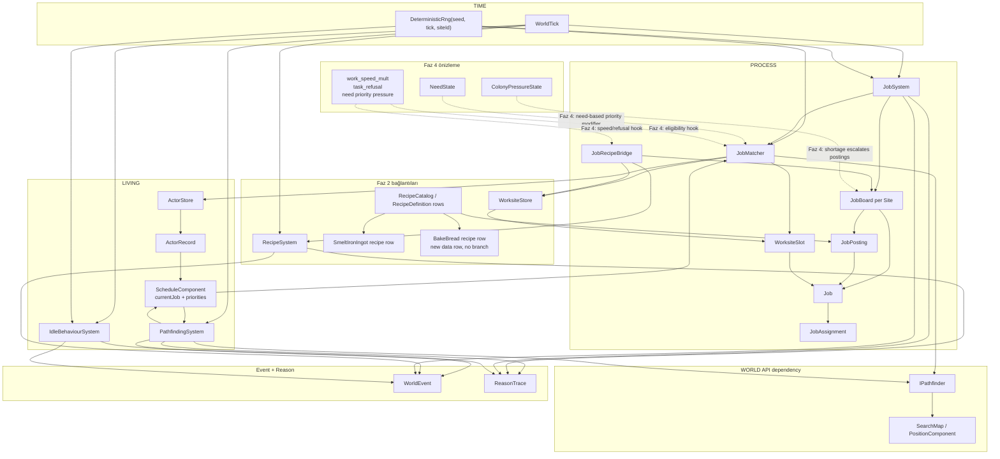
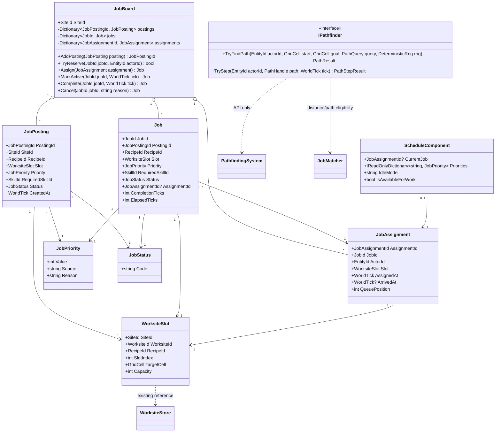
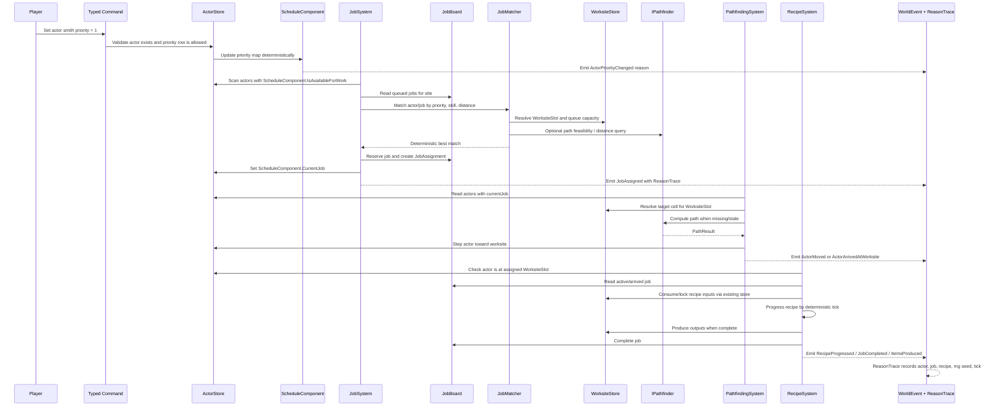

## 1. Sistem haritası (Mermaid graph TB)



## 2. Veri modeli (Mermaid classDiagram)



## 3. Tick akışı (Mermaid sequenceDiagram)



## 4. C# scaffold — DOSYA YOLU + İMZA (gövde YOK)

> Not: Aşağıdaki scaffold imza sözleşmesidir. Gövde yazılmayacak; Captain PR’larda mevcut ID/value-object isimleri farklıysa Atom 1’de adaptör eşlemesi yapmalıdır. Domain/Simulation katmanında `UnityEngine` kullanılmaz.

### `Assets/Scripts/Domain/Process/JobPriority.cs`

```csharp
using System;

namespace EmberCrpg.Domain.Process;

/// <summary>
/// İş önceliğini data olarak taşır; düşük Value daha yüksek önceliktir.
/// Source alanı Faz 4 ihtiyaç baskısı, oyuncu komutu veya sistem üretimi ayrımını branch yazmadan taşır.
/// </summary>
public readonly record struct JobPriority(int Value, string Source, string Reason);
```

### `Assets/Scripts/Domain/Process/JobStatus.cs`

```csharp
using System;

namespace EmberCrpg.Domain.Process;

/// <summary>
/// Job lifecycle durumunu string code olarak taşır.
/// Geçişler enum switch ile değil JobStatusTransition tablosu ile doğrulanır.
/// </summary>
public readonly record struct JobStatus(string Code);

/// <summary>
/// İzinli JobStatus geçişini veri satırı gibi temsil eder.
/// State machine validasyonu bu kayıtlar üzerinden yapılır.
/// </summary>
public readonly record struct JobStatusTransition(JobStatus From, JobStatus To, string ReasonCode);
```

### `Assets/Scripts/Domain/Process/JobPosting.cs`

```csharp
using System;
using EmberCrpg.Domain.Common;
using EmberCrpg.Domain.Living;

namespace EmberCrpg.Domain.Process;

/// <summary>
/// JobBoard üzerindeki üretim talebidir.
/// Recipe row, worksite slot, priority ve gerekli skill bilgisini birleştirir.
/// </summary>
public sealed record JobPosting(
    JobPostingId PostingId,
    SiteId SiteId,
    RecipeId RecipeId,
    WorksiteSlot Slot,
    JobPriority Priority,
    SkillId? RequiredSkillId,
    JobStatus Status,
    WorldTick CreatedAt);
```

### `Assets/Scripts/Domain/Process/Job.cs`

```csharp
using System;
using EmberCrpg.Domain.Common;
using EmberCrpg.Domain.Living;

namespace EmberCrpg.Domain.Process;

/// <summary>
/// Bir aktör tarafından yürütülebilecek tekil iş birimidir.
/// RecipeSystem ilerlemesi için CompletionTicks ve ElapsedTicks değerlerini taşır.
/// </summary>
public sealed record Job(
    JobId JobId,
    JobPostingId PostingId,
    RecipeId RecipeId,
    WorksiteSlot Slot,
    JobPriority Priority,
    SkillId? RequiredSkillId,
    JobStatus Status,
    JobAssignmentId? AssignmentId,
    int CompletionTicks,
    int ElapsedTicks,
    WorldTick CreatedAt,
    WorldTick? CompletedAt);
```

### `Assets/Scripts/Domain/Process/JobAssignment.cs`

```csharp
using System;
using EmberCrpg.Domain.Common;
using EmberCrpg.Domain.Living;

namespace EmberCrpg.Domain.Process;

/// <summary>
/// Bir Job ile onu üstlenen aktör arasındaki deterministik bağdır.
/// QueuePosition aynı worksite slot üzerinde birden fazla aktörün bekleme sırasını sabitler.
/// </summary>
public sealed record JobAssignment(
    JobAssignmentId AssignmentId,
    JobId JobId,
    EntityId ActorId,
    WorksiteSlot Slot,
    WorldTick AssignedAt,
    WorldTick? ArrivedAt,
    int QueuePosition);
```

### `Assets/Scripts/Domain/Process/WorksiteSlot.cs`

```csharp
using System;
using EmberCrpg.Domain.Common;
using EmberCrpg.Domain.World;

namespace EmberCrpg.Domain.Process;

/// <summary>
/// Existing WorksiteStore içindeki bir worksite kapasite noktasına referanstır.
/// Job sistemi worksite verisini kopyalamaz; sadece site, worksite, recipe ve target cell bağını taşır.
/// </summary>
public sealed record WorksiteSlot(
    SiteId SiteId,
    WorksiteId WorksiteId,
    RecipeId RecipeId,
    int SlotIndex,
    GridCell TargetCell,
    int Capacity);
```

### `Assets/Scripts/Domain/Living/ScheduleComponent.cs`

```csharp
using System.Collections.Generic;
using EmberCrpg.Domain.Common;
using EmberCrpg.Domain.Process;

namespace EmberCrpg.Domain.Living;

/// <summary>
/// ActorRecord üzerine eklenen composition component'idir.
/// Aktörün mevcut işini, oyuncu/sistem önceliklerini ve idle davranış modunu taşır.
/// </summary>
public sealed record ScheduleComponent(
    JobAssignmentId? CurrentJob,
    IReadOnlyDictionary<string, JobPriority> Priorities,
    string IdleMode,
    bool IsAvailableForWork);
```

### `Assets/Scripts/Domain/World/IPathfinder.cs`

```csharp
using EmberCrpg.Domain.Common;

namespace EmberCrpg.Domain.World;

/// <summary>
/// Faz 3 iş atamasının pathfinding bağımlılığıdır; somut A* sınıfı değildir.
/// Implementasyon Faz 2 SearchMap/PathfindingSystem tarafından sağlanır.
/// </summary>
public interface IPathfinder
{
    /// <summary>
    /// Aktör için başlangıçtan hedef hücreye deterministik path hesaplar.
    /// Aynı map, actor, seed ve query ile aynı PathResult dönmelidir.
    /// </summary>
    PathResult TryFindPath(EntityId actorId, GridCell start, GridCell goal, PathQuery query, DeterministicRng rng);

    /// <summary>
    /// Mevcut path üzerinde aktörü tek tick ilerletmek için path adımı üretir.
    /// Dünya mutasyonu bu interface içinde değil, caller sistemde yapılır.
    /// </summary>
    PathStepResult TryStep(EntityId actorId, PathHandle path, WorldTick tick);
}
```

### `Assets/Scripts/Domain/Process/JobMatchResult.cs`

```csharp
using EmberCrpg.Domain.Common;
using EmberCrpg.Domain.Living;

namespace EmberCrpg.Domain.Process;

/// <summary>
/// JobMatcher çıktısını taşır.
/// Neden alanı ReasonTrace'e doğrudan yazılabilecek kısa deterministik açıklamadır.
/// </summary>
public sealed record JobMatchResult(
    bool Success,
    EntityId? ActorId,
    JobId? JobId,
    WorksiteSlot? Slot,
    int Score,
    string Reason);
```

### `Assets/Scripts/Domain/Process/JobBoard.cs`

```csharp
using System.Collections.Generic;
using EmberCrpg.Domain.Common;

namespace EmberCrpg.Domain.Process;

/// <summary>
/// Tek bir site için job posting, job ve assignment kayıtlarının otoritesidir.
/// Status geçişlerini tabloyla doğrular ve aynı işi iki aktöre atamayı engeller.
/// </summary>
public sealed partial class JobBoard
{
    /// <summary>Bu board'un ait olduğu site kimliğidir.</summary>
    private readonly SiteId _siteId;

    /// <summary>Board üzerindeki üretim taleplerini posting id ile saklar.</summary>
    private readonly Dictionary<JobPostingId, JobPosting> _postings;

    /// <summary>Tekil iş kayıtlarını job id ile saklar.</summary>
    private readonly Dictionary<JobId, Job> _jobs;

    /// <summary>Aktif veya tamamlanmış iş atamalarını assignment id ile saklar.</summary>
    private readonly Dictionary<JobAssignmentId, JobAssignment> _assignments;

    /// <summary>JobStatus state machine geçiş tablosudur.</summary>
    private readonly IReadOnlySet<JobStatusTransition> _allowedTransitions;

    /// <summary>Site board'unu gerekli transition tablosu ile oluşturur.</summary>
    public JobBoard(SiteId siteId, IReadOnlySet<JobStatusTransition> allowedTransitions);

    /// <summary>Board'un site kimliğini döndürür.</summary>
    public SiteId SiteId { get; }

    /// <summary>Yeni posting ekler ve posting id döndürür.</summary>
    public JobPostingId AddPosting(JobPosting posting);

    /// <summary>Posting üzerinden tekil job oluşturur.</summary>
    public JobId CreateJobFromPosting(JobPostingId postingId, JobId jobId, WorldTick tick);

    /// <summary>Duruma göre işleri deterministik sırada listeler.</summary>
    public IReadOnlyList<Job> GetJobs(JobStatus status);

    /// <summary>Belirli job kaydını bulmayı dener.</summary>
    public bool TryGetJob(JobId jobId, out Job job);

    /// <summary>Job'u aktör için rezerve etmeyi dener.</summary>
    public bool TryReserve(JobId jobId, EntityId actorId, WorldTick tick, out Job reservedJob);

    /// <summary>Assignment kaydını board'a yazar ve job durumunu assigned yapar.</summary>
    public Job Assign(JobAssignment assignment);

    /// <summary>Aktör worksite'a vardığında job durumunu active yapar.</summary>
    public Job MarkActive(JobId jobId, WorldTick tick);

    /// <summary>Recipe tamamlandığında job durumunu completed yapar.</summary>
    public Job Complete(JobId jobId, WorldTick tick);

    /// <summary>Queued, assigned veya active job'u iptal eder.</summary>
    public Job Cancel(JobId jobId, string reasonCode, WorldTick tick);

    /// <summary>Board snapshot'ını replay ve test için deterministik sırada döndürür.</summary>
    public JobBoardSnapshot Snapshot();
}
```

### `Assets/Scripts/Domain/Process/JobBoardStore.cs`

```csharp
using System.Collections.Generic;
using EmberCrpg.Domain.Common;

namespace EmberCrpg.Domain.Process;

/// <summary>
/// Site başına JobBoard erişimini sağlar.
/// SliceWorldState'e yeni named field eklemeden store tabanlı büyümeyi destekler.
/// </summary>
public sealed partial class JobBoardStore
{
    /// <summary>Board kayıtlarını site id ile saklar.</summary>
    private readonly Dictionary<SiteId, JobBoard> _boards;

    /// <summary>Boş store oluşturur.</summary>
    public JobBoardStore();

    /// <summary>Site için board döndürür veya oluşturur.</summary>
    public JobBoard GetOrCreate(SiteId siteId);

    /// <summary>Site için board bulmayı dener.</summary>
    public bool TryGet(SiteId siteId, out JobBoard board);

    /// <summary>Tüm board'ları deterministik site sırasıyla döndürür.</summary>
    public IReadOnlyList<JobBoard> GetAll();
}
```

### `Assets/Scripts/Domain/Process/JobMatcher.cs`

```csharp
using System.Collections.Generic;
using EmberCrpg.Domain.Common;
using EmberCrpg.Domain.Living;
using EmberCrpg.Domain.World;

namespace EmberCrpg.Domain.Process;

/// <summary>
/// Actor schedule priority, skill ve worksite mesafesine göre en iyi işi seçer.
/// Tie-break sırası priority, path distance, higher skill, actor id, job id şeklinde deterministiktir.
/// </summary>
public sealed partial class JobMatcher
{
    /// <summary>Path uygunluğu ve mesafe sorgusu için kullanılan API'dir.</summary>
    private readonly IPathfinder _pathfinder;

    /// <summary>Eşit skor durumlarında deterministik ama seed'li seçim gereken yerler için kullanılır.</summary>
    private readonly DeterministicRng _rng;

    /// <summary>Matcher'ı pathfinder ve rng ile oluşturur.</summary>
    public JobMatcher(IPathfinder pathfinder, DeterministicRng rng);

    /// <summary>Tek aktör için en iyi queued job'u seçer.</summary>
    public JobMatchResult MatchBestJobForActor(
        ActorRecord actor,
        ScheduleComponent schedule,
        IReadOnlyList<Job> queuedJobs,
        WorksiteStore worksiteStore,
        WorldTick tick);

    /// <summary>Tek job için en iyi aktörü seçer.</summary>
    public JobMatchResult MatchBestActorForJob(
        Job job,
        IReadOnlyList<ActorRecord> candidates,
        WorksiteStore worksiteStore,
        WorldTick tick);

    /// <summary>Aktörün job için skill, status, schedule ve Faz 4 refusal hook'ları açısından uygunluğunu denetler.</summary>
    public bool IsEligible(ActorRecord actor, ScheduleComponent schedule, Job job, WorldTick tick);

    /// <summary>Priority, skill ve path distance birleşik skorunu hesaplar.</summary>
    public int Score(ActorRecord actor, ScheduleComponent schedule, Job job, WorksiteSlot slot, WorldTick tick);
}
```

### `Assets/Scripts/Simulation/Process/JobSystem.cs`

```csharp
using System.Collections.Generic;
using EmberCrpg.Domain.Common;
using EmberCrpg.Domain.Living;
using EmberCrpg.Domain.Process;

namespace EmberCrpg.Simulation.Process;

/// <summary>
/// Her world tick'te uygun aktörleri queued job'larla eşleştirir.
/// Dünya mutasyonunu ActorStore ve JobBoardStore üzerinden yapar, ReasonTrace üretir.
/// </summary>
public sealed partial class JobSystem
{
    /// <summary>Site bazlı job board otoritesidir.</summary>
    private readonly JobBoardStore _jobBoards;

    /// <summary>Aktör kayıtlarına ve schedule component'lerine erişir.</summary>
    private readonly ActorStore _actorStore;

    /// <summary>Worksite slot ve kapasite bilgisini sağlayan Faz 2 store'dur.</summary>
    private readonly WorksiteStore _worksiteStore;

    /// <summary>Recipe row bilgilerini sağlayan Faz 2 catalog'dur.</summary>
    private readonly RecipeCatalog _recipeCatalog;

    /// <summary>Priority, skill ve mesafe eşleşmesini yapan domain servisidir.</summary>
    private readonly JobMatcher _matcher;

    /// <summary>WorldEvent ve ReasonTrace yazımı için kullanılır.</summary>
    private readonly JobEventWriter _events;

    /// <summary>JobSystem bağımlılıklarını alır.</summary>
    public JobSystem(
        JobBoardStore jobBoards,
        ActorStore actorStore,
        WorksiteStore worksiteStore,
        RecipeCatalog recipeCatalog,
        JobMatcher matcher,
        JobEventWriter events);

    /// <summary>Site için queued işleri ve available aktörleri eşleştirir.</summary>
    public IReadOnlyList<WorldEvent> Tick(SiteId siteId, WorldTick tick, DeterministicRng rng);

    /// <summary>Oyuncu veya sistem komutundan aktör job priority map'ini günceller.</summary>
    public WorldEvent SetActorPriority(EntityId actorId, string laborId, JobPriority priority, WorldTick tick);

    /// <summary>Recipe row ve worksite slot'tan posting üretir; recipe branch yazmaz.</summary>
    public JobPostingId PostRecipeJob(SiteId siteId, RecipeId recipeId, WorksiteId worksiteId, JobPriority priority, WorldTick tick);
}
```

### `Assets/Scripts/Simulation/Living/PathfindingSystem.cs`

```csharp
using System.Collections.Generic;
using EmberCrpg.Domain.Common;
using EmberCrpg.Domain.Living;
using EmberCrpg.Domain.Process;
using EmberCrpg.Domain.World;

namespace EmberCrpg.Simulation.Living;

/// <summary>
/// CurrentJob sahibi aktörleri assigned worksite hedefine taşır.
/// Path hesaplama IPathfinder üzerinden yapılır; pozisyon mutasyonu ActorStore/PositionComponent üzerinden yazılır.
/// </summary>
public sealed partial class PathfindingSystem
{
    /// <summary>Somut pathfinding implementasyonuna soyut erişimdir.</summary>
    private readonly IPathfinder _pathfinder;

    /// <summary>Aktör ve schedule verilerinin store erişimidir.</summary>
    private readonly ActorStore _actorStore;

    /// <summary>Job assignment ve worksite slot çözümü için board store'dur.</summary>
    private readonly JobBoardStore _jobBoards;

    /// <summary>Hareket ve varış event'lerini üretir.</summary>
    private readonly JobEventWriter _events;

    /// <summary>PathfindingSystem bağımlılıklarını alır.</summary>
    public PathfindingSystem(
        IPathfinder pathfinder,
        ActorStore actorStore,
        JobBoardStore jobBoards,
        JobEventWriter events);

    /// <summary>Site içindeki currentJob sahibi aktörleri bir tick ilerletir.</summary>
    public IReadOnlyList<WorldEvent> Tick(SiteId siteId, WorldTick tick, DeterministicRng rng);

    /// <summary>Aktörün assigned job için path'e ihtiyacı olup olmadığını denetler.</summary>
    public bool NeedsPath(ActorRecord actor, ScheduleComponent schedule, WorldTick tick);

    /// <summary>Aktör worksite target cell'e ulaştığında JobBoard üzerinde active geçişini tetikler.</summary>
    public WorldEvent MarkArrived(EntityId actorId, JobAssignmentId assignmentId, WorldTick tick);
}
```

### `Assets/Scripts/Simulation/Process/JobRecipeBridge.cs`

```csharp
using System.Collections.Generic;
using EmberCrpg.Domain.Common;
using EmberCrpg.Domain.Process;

namespace EmberCrpg.Simulation.Process;

/// <summary>
/// Active job ile Faz 2 RecipeSystem ilerlemesi arasındaki adaptördür.
/// Recipe seçimi RecipeDefinition row üzerinden yapılır; yeni üretim türleri C# branch gerektirmez.
/// </summary>
public sealed partial class JobRecipeBridge
{
    /// <summary>Recipe execution otoritesi olan Faz 2 sistemdir.</summary>
    private readonly RecipeSystem _recipeSystem;

    /// <summary>Input/output ve worksite stoklarının Faz 2 store erişimidir.</summary>
    private readonly WorksiteStore _worksiteStore;

    /// <summary>Job status ve assignment kayıtlarının store erişimidir.</summary>
    private readonly JobBoardStore _jobBoards;

    /// <summary>Recipe/job event'lerini üretir.</summary>
    private readonly JobEventWriter _events;

    /// <summary>Bridge bağımlılıklarını alır.</summary>
    public JobRecipeBridge(
        RecipeSystem recipeSystem,
        WorksiteStore worksiteStore,
        JobBoardStore jobBoards,
        JobEventWriter events);

    /// <summary>Worksite'a ulaşmış active job'ların recipe progress değerini ilerletir.</summary>
    public IReadOnlyList<WorldEvent> Tick(SiteId siteId, WorldTick tick, DeterministicRng rng);

    /// <summary>Aktörün assigned worksite hücresinde olup olmadığını doğrular.</summary>
    public bool IsActorAtAssignedWorksite(EntityId actorId, JobAssignment assignment);

    /// <summary>Recipe tamamlandığında output üretimini ve job completion geçişini yapar.</summary>
    public WorldEvent CompleteRecipeJob(JobId jobId, EntityId actorId, WorldTick tick, DeterministicRng rng);
}
```

### `Assets/Scripts/Simulation/Living/IdleBehaviourSystem.cs`

```csharp
using System.Collections.Generic;
using EmberCrpg.Domain.Common;
using EmberCrpg.Domain.Living;

namespace EmberCrpg.Simulation.Living;

/// <summary>
/// Job bulunamadığında aktörün deterministik idle davranışını yürütür.
/// Bu sistem oyuncuya görünür idle event üretir fakat job veya recipe state'ini değiştirmez.
/// </summary>
public sealed partial class IdleBehaviourSystem
{
    /// <summary>Aktör schedule ve pozisyon state'ine erişir.</summary>
    private readonly ActorStore _actorStore;

    /// <summary>Idle event ve trace üretim noktasıdır.</summary>
    private readonly JobEventWriter _events;

    /// <summary>IdleBehaviourSystem bağımlılıklarını alır.</summary>
    public IdleBehaviourSystem(ActorStore actorStore, JobEventWriter events);

    /// <summary>CurrentJob olmayan ve available aktörler için idle tick yürütür.</summary>
    public IReadOnlyList<WorldEvent> Tick(SiteId siteId, WorldTick tick, DeterministicRng rng);

    /// <summary>Aktör için idle mode'a göre deterministik idle aksiyon seçer.</summary>
    public string SelectIdleAction(ActorRecord actor, ScheduleComponent schedule, WorldTick tick, DeterministicRng rng);
}
```

### `Assets/Scripts/Simulation/Process/JobEventWriter.cs`

```csharp
using EmberCrpg.Domain.Common;
using EmberCrpg.Domain.Process;

namespace EmberCrpg.Simulation.Process;

/// <summary>
/// Job, movement ve recipe olaylarını WorldEvent + ReasonTrace olarak yazar.
/// LLM/DM yalnızca bu event ve trace çıktılarını okuyabilir; dünya state'ine doğrudan yazamaz.
/// </summary>
public sealed partial class JobEventWriter
{
    /// <summary>WorldEvent kayıt hedefidir.</summary>
    private readonly IWorldEventSink _worldEvents;

    /// <summary>ReasonTrace kayıt hedefidir.</summary>
    private readonly IReasonTraceSink _reasonTraces;

    /// <summary>Event writer bağımlılıklarını alır.</summary>
    public JobEventWriter(IWorldEventSink worldEvents, IReasonTraceSink reasonTraces);

    /// <summary>Aktör priority değişimini görünür event olarak yazar.</summary>
    public WorldEvent ActorPriorityChanged(EntityId actorId, string laborId, JobPriority priority, WorldTick tick);

    /// <summary>Job posting yaratıldığında event ve trace üretir.</summary>
    public WorldEvent JobPosted(JobPosting posting, WorldTick tick);

    /// <summary>Job aktöre atandığında event ve trace üretir.</summary>
    public WorldEvent JobAssigned(Job job, JobAssignment assignment, string reason, WorldTick tick);

    /// <summary>Aktör worksite'a vardığında event ve trace üretir.</summary>
    public WorldEvent ActorArrivedAtWorksite(EntityId actorId, JobAssignment assignment, WorldTick tick);

    /// <summary>Recipe progress tick'i için event ve trace üretir.</summary>
    public WorldEvent RecipeProgressed(Job job, EntityId actorId, int elapsedTicks, WorldTick tick);

    /// <summary>Job tamamlandığında output ve xp bilgisiyle event üretir.</summary>
    public WorldEvent JobCompleted(Job job, EntityId actorId, RecipeId recipeId, int outputCount, WorldTick tick);

    /// <summary>Aktör için job bulunamadığında idle event üretir.</summary>
    public WorldEvent ActorIdle(EntityId actorId, string idleAction, string reason, WorldTick tick);
}
```

### Atom listesi

| Atom | Tag | PR içeriği | Captain için net seçim kriteri | Görünürlük |
|---:|---|---|---|---|
| Atom 1 | [box=PROCESS] | `JobPriority`, `JobStatus`, `JobStatusTransition`, ID/value-object adaptörleri | Önce state vocabulary sabitlenir; enum switch yerine transition row hazırlanır. | Test-only olabilir |
| Atom 2 | [box=PROCESS] | `JobPosting`, `Job`, `JobAssignment`, `WorksiteSlot` | Job data contract ve WorksiteStore referansı netleşir. | Store state görünür |
| Atom 3 | [box=LIVING] | `ScheduleComponent` ActorRecord entegrasyonu | Actor composition genişler; `currentJob` ve priority map taşınır. | Store state görünür |
| Atom 4 | [box=PROCESS] | `JobBoard` state machine ve snapshot | Queued→assigned→active→completed/cancelled geçişleri pin'lenir. | Event olmadan test-visible |
| Atom 5 | [box=PROCESS] | `JobBoardStore` site başına board | Per-site job authority kurulur; SliceWorldState named field eklenmez. | Store state görünür |
| Atom 6 | [box=PROCESS] | `JobMatcher` priority + skill + distance scoring | İş seçimi deterministik olur; pathfinder distance query hook'u hazırdır. | Test-only olabilir |
| Atom 7 | [box=LIVING] | `IPathfinder` integration + `PathfindingSystem` assigned actor movement | Aktör worksite'a yürür ve arrival event üretir. | Visible event |
| Atom 8 | [box=PROCESS] | `JobEventWriter` WorldEvent + ReasonTrace | Debug overlay/replay log için event yüzeyi açılır. | Visible event |
| Atom 9 | [box=PROCESS] | `JobSystem` tick: scan actors, match, assign | Oyuncu priority verdiğinde aktör job alır. | Visible event |
| Atom 10 | [box=PROCESS] | `JobRecipeBridge` RecipeSystem tick entegrasyonu | Actor worksite'tayken recipe progress ve completion job'a bağlanır. | Visible production |
| Atom 11 | [box=PROCESS] | `BakeBread` recipe data row | Smelt ve bake işleri rekabet eder; C# branch yoktur. | Visible competing jobs |
| Atom 12 | [box=LIVING] | `IdleBehaviourSystem` no-job fallback | Job yoksa deterministik idle event üretilir. | Visible event |
| Atom 13 | [box=PROCESS] | End-to-end deterministic day acceptance | 2 smith aktör, furnace queue, 4 ingot üretimi replay hash ile pin'lenir. | Playable proof |
| Atom 14 | [box=PROCESS] | Faz 4 hooks: need priority modifier, work speed/refusal signatures | NeedState entegrasyonu için kırılmadan genişleme noktası kalır. | Future-facing |

## 5. Test stratejisi

| Test alanı | Pin'lenen sınıf/davranış | Beklenen xunit dosyası |
|---|---|---|
| Job status state machine | `JobBoard.Assign`, `MarkActive`, `Complete`, `Cancel` yalnızca izinli transition yapar | `Tests/Domain/Process/JobBoardStateMachineTests.cs` |
| Posting → Job dönüşümü | `CreateJobFromPosting` recipe, slot, priority ve completion tick taşır | `Tests/Domain/Process/JobBoardPostingTests.cs` |
| Schedule priority | `ScheduleComponent` ActorRecord üzerinde current job ve priority map taşır | `Tests/Domain/Living/ScheduleComponentTests.cs` |
| Matcher eligibility | Skill yoksa elenir, priority 1 priority 5'i geçer | `Tests/Domain/Process/JobMatcherEligibilityTests.cs` |
| Matcher tie-break | Eşit distance'ta yüksek skill; eşitse actor id/job id sırası | `Tests/Domain/Process/JobMatcherDeterminismTests.cs` |
| Pathfinder integration | Assigned aktör target cell'e yürür ve arrival event üretir | `Tests/Simulation/Living/PathfindingSystemTests.cs` |
| Recipe bridge | Actor worksite'tayken recipe progress artar, uzaktayken artmaz | `Tests/Simulation/Process/JobRecipeBridgeTests.cs` |
| Event trace | Assignment, arrival, progress, completion event'leri ReasonTrace ile gelir | `Tests/Simulation/Process/JobEventWriterTests.cs` |
| Idle fallback | Job yoksa actor currentJob almaz, idle event deterministik olur | `Tests/Simulation/Living/IdleBehaviourSystemTests.cs` |
| End-to-end day | 2 smith actor, furnace queue, 4 ingot, stable replay hash | `Tests/Acceptance/Faz3JobAssignmentAcceptanceTests.cs` |

Deterministic test pattern:

```csharp
using EmberCrpg.Domain.Common;
using EmberCrpg.Domain.Process;
using Xunit;

namespace EmberCrpg.Tests.Acceptance;

/// <summary>
/// Faz 3 acceptance testleri aynı seed ve aynı command list ile aynı world event hash'i üretmelidir.
/// DeterministicRng testte dışarıdan inject edilir; sistemler kendi Random örneğini oluşturmaz.
/// </summary>
public sealed partial class Faz3JobAssignmentAcceptanceTests
{
    /// <summary>
    /// Oyuncu iki aktöre smith priority 1 verir; ikisi furnace kuyruğuna girer ve deterministik gün sonunda 4 ingot üretilir.
    /// Test replay hash, output count, job completion count ve event order değerlerini birlikte doğrular.
    /// </summary>
    public void PlayerCanAssignTwoSmithsAndProduceFourIngotsDeterministically();
}
```

Acceptance çevirisi:

| Oyuncu cümlesi | Test adımı |
|---|---|
| player can set 2 actors to smith priority 1 | `JobSystem.SetActorPriority(actorA, "smith", JobPriority(1, "player", "..."))` ve actorB için aynı komut |
| watch both queue at the furnace | `JobAssigned` event'lerinde aynı `WorksiteId`, farklı `QueuePosition`, iki `CurrentJob` |
| and produce 4 ingots | `JobRecipeBridge.Tick` sonrası WorksiteStore/ItemStore içinde `IronIngot` toplamı 4 |
| in a deterministic day | Aynı seed + command log iki kez replay edilir, event hash ve final store snapshot eşit olur |

Replay determinism check:

| Check | Kural |
|---|---|
| Seed | Acceptance seed sabit: ör. `DeterministicRng.Create(phase: 3, scenario: "two-smiths-furnace")` |
| Command log | Priority komutları ve tick count aynı sırada replay edilir |
| Event ordering | Tick, actor id, job id, event kind sıralaması stable olmalı |
| Snapshot hash | ActorStore + JobBoardStore + WorksiteStore + ItemStore canonical serialization hash eşit olmalı |
| No wall-clock | Testte `DateTime.Now`, `Guid.NewGuid`, `Random.Shared` kullanılmaz |

## 6. Risk + acceptance

### Ana acceptance senaryosu

| Adım | Test edilen atomlar | Doğrulama |
|---:|---|---|
| 1 | Atom 1-3 | İki ActorRecord üzerinde `ScheduleComponent.Priorities["smith"].Value == 1` |
| 2 | Atom 4-6 | Furnace için iki queued smith job deterministik olarak iki aktöre atanır |
| 3 | Atom 7-8 | İki aktör aynı furnace `WorksiteId` için path alır; biri queue position 0, diğeri 1 |
| 4 | Atom 9 | `JobAssigned` event'leri ReasonTrace ile debug/replay yüzeyinde görünür |
| 5 | Atom 10 | Actor target cell'e vardığında recipe progress başlar |
| 6 | Atom 11 | `SmeltIronIngot` ve `BakeBread` aynı matcher havuzunda rekabet eder; recipe branch yoktur |
| 7 | Atom 13 | Gün sonunda iki completed smith job ve toplam 4 ingot vardır; replay hash sabittir |

Acceptance test fixture önerisi:

| Fixture parçası | Değer |
|---|---|
| Actors | `actor-smith-a`, `actor-smith-b`, ikisinde smith skill mevcut |
| Priority | İki aktörde `smith = JobPriority(1, "player", "acceptance")` |
| Worksite | Tek furnace, capacity/queue destekli `WorksiteSlot` |
| Recipe | `SmeltIronIngot` output quantity toplam acceptance için 4; `BakeBread` data row rekabet için mevcut |
| Tick budget | 1 deterministic day = proje takvimindeki sabit day tick count |
| Assertions | 2 assignment, 2 arrival, 2 completion, 4 ingot, stable event hash |

### Risk matrisi

| Risk | Seviye | Etkilenen atom | Neden | Azaltma |
|---|---|---:|---|---|
| ActorRecord'a `ScheduleComponent` eklemek mevcut save/load'u kırabilir | Yüksek | Atom 3 | Store serialization değişir | Backward-compatible default schedule factory |
| RecipeSystem ile active job bağlamak refactor gerektirebilir | Yüksek | Atom 10 | Faz 2 recipe tick actor-aware olmayabilir | `JobRecipeBridge` adapter; RecipeSystem core'a minimum temas |
| Pathfinding API mevcut değilse hareket entegrasyonu büyür | Orta/Yüksek | Atom 7 | Faz 2 pathfinding PRD tamamlanmamış olabilir | `IPathfinder` fake ile başlayıp gerçek adapter sonraki PR |
| Matcher determinism bozulabilir | Orta | Atom 6 | Dictionary iteration sırası veya random tie-break | Canonical sort: priority, distance, skill desc, actor id, job id |
| Worksite queue capacity yorumu belirsiz olabilir | Orta | Atom 2, 4 | Tek furnace üzerinde iki aktör kuyruğu acceptance gerektiriyor | `WorksiteSlot.Capacity` + `QueuePosition` açık tutulur |
| BakeBread branch'e kaçabilir | Orta | Atom 11 | Yeni recipe için C# if/switch yazma riski | Sadece data row; RecipeCatalog testinde branch yokluğu review edilir |
| Event/ReasonTrace fazla geç eklenirse visible PR kuralı aksar | Orta | Atom 8-9 | İlk PR'lar test-only kalabilir | Atom 8 en geç üçüncü ürün-visible PR olmalı |
| Idle behavior scope büyüyebilir | Düşük | Atom 12 | Random walk/pathing detayına kayabilir | Sadece deterministic idle event; hareket opsiyonel değilse ayrı PR |
| Status modelini enum yapmak data-driven kuralı zayıflatabilir | Düşük | Atom 1 | Switch-driven lifecycle artabilir | `JobStatus` value object + transition rows |

Atom sırası gerekçesi:

| Sıra | Gerekçe |
|---|---|
| Atom 1-2 | Veri sözleşmesi netleşmeden sistem yazılırsa Captain her PR'da model taşır. |
| Atom 3 | LIVING tarafı erken eklenir; matcher ve system actor availability'yi gerçek component'ten okur. |
| Atom 4-5 | Board state machine ve per-site store, job authority'yi kurar. |
| Atom 6 | Matcher board ve schedule üzerine oturur; pathfinder fake ile test edilebilir. |
| Atom 7-9 | Assignment artık oyuncuya/event log'a görünür hale gelir. |
| Atom 10-11 | Üretim ve rekabet bağlanır; acceptance için gerçek ekonomi sonucu oluşur. |
| Atom 12 | No-job durumunu kapatır, simülasyon sessiz kalmaz. |
| Atom 13 | Dikey acceptance replay ile pin'lenir. |
| Atom 14 | Faz 4 ihtiyaç sistemi için API kırmadan hook bırakılır. |

Faz 4 `Colony needs` entegrasyonu için bırakılacak hook'lar:

| Hook | Nerede | Faz 4 kullanımı |
|---|---|---|
| `JobPriority.Source` | `JobPriority` | `"player"`, `"need"`, `"shortage"`, `"morale"` kaynaklarını branch yazmadan taşır |
| `JobPriority.Reason` | `JobPriority` | `food_insecure`, `fatigue`, `housing_strain` gibi pressure tag'leri ReasonTrace'e yazar |
| `JobMatcher.IsEligible(...)` | `JobMatcher` | `task_refusal`, desperate needs veya morale cascade aktörü eleyebilir |
| `JobMatcher.Score(...)` | `JobMatcher` | NeedState açlık/uyku/craft ihtiyacı job skorunu değiştirebilir |
| `JobRecipeBridge.Tick(...)` | `JobRecipeBridge` | `work_speed_mult` recipe progress hızını etkiler |
| `ScheduleComponent.IdleMode` | `ScheduleComponent` | İş yoksa eat/sleep/socialize gibi Faz 4 need fulfillment idle task'larına yönlenir |
| `JobPosting.Priority.Source` | `JobPosting` | ProductionLedger shortage job posting priority'sini yükseltir |
| `ReasonTrace` fields | `JobEventWriter` | DM/AI sadece trace okur; world state'e doğrudan yazmaz |
