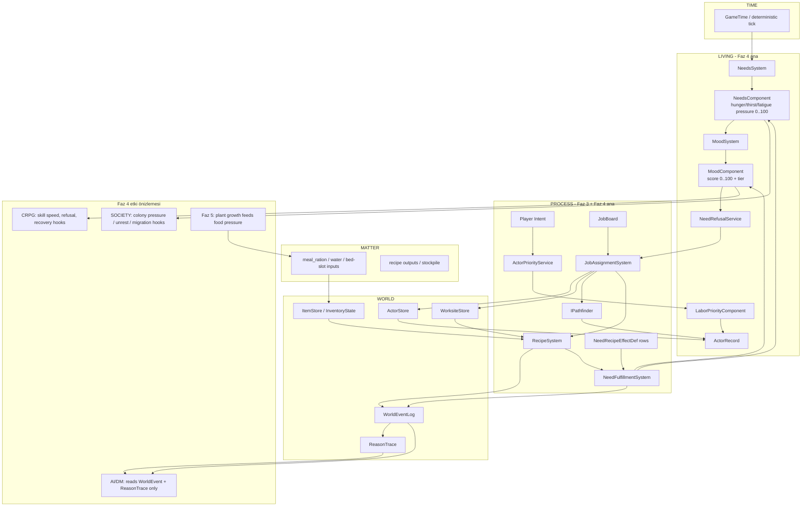
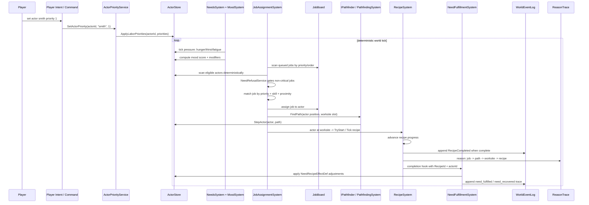

## 1. Sistem haritası (Mermaid graph TB)

> _Captain atom-map_: `docs/sprint-faz-4-atom-map.md` (Captain narrow vertical-slice decomposition).
> _Naming_: aligned with Captain types (JobRequest, ActorScheduleState, JobAssignmentSystem).
> _Spec covers full architecture; Captain may implement subset and extend later.



## 2. Veri modeli (Mermaid classDiagram)

```mermaid
classDiagram
    class ActorRecord {
        +ActorId Id
        +GridPosition Position
        +NeedsComponent Needs
        +MoodComponent Mood
        +LaborPriorityComponent LaborPriorities
        +ApplyNeeds(NeedsComponent needs) void
        +ApplyMood(MoodComponent mood) void
        +ApplyLaborPriorities(LaborPriorityComponent priorities) void
    }

    class NeedsComponent {
        -Dictionary~string,float~ _values
        -List~string~ _order
        +IEnumerable~NeedValue~ Values
        +GetPressure(string needId) float
        +WithPressure(string needId, float pressure) NeedsComponent
    }

    class NeedDefinition {
        +string Id
        +string Label
        +float PressurePerTick
        +float FulfillmentBase
        +float DesperateThreshold
        +float MoodWeight
        +string FulfillmentActivityTag
    }

    class NeedDefinitionCatalog {
        -Dictionary~string,NeedDefinition~ _byId
        -List~string~ _order
        +IEnumerable~NeedDefinition~ Definitions
        +Get(string needId) NeedDefinition
        +TryGet(string needId, out NeedDefinition definition) bool
    }

    class MoodComponent {
        +float Score
        +string TierId
        +float MemoryDelta
        +BehaviorModifierSet Modifiers
    }

    class BehaviorModifierSet {
        +float WorkSpeedMultiplier
        +bool SocialHostility
        +bool TaskRefusal
        +float TantrumRisk
    }

    class MoodRule {
        +string TierId
        +float MinInclusive
        +float MaxExclusive
        +BehaviorModifierSet Modifiers
    }

    class NeedRefusalRule {
        +string NeedId
        +float ThresholdExclusive
        +IReadOnlyList~string~ RefusedJobTags
        +IReadOnlyList~string~ AllowedJobTags
    }

    class LaborPriorityComponent {
        -Dictionary~string,ActorJobPriority~ _byJobTag
        +SetPriority(ActorJobPriority priority) LaborPriorityComponent
        +TryGetPriority(string jobTag, out ActorJobPriority priority) bool
    }

    class ActorJobPriority {
        +string JobTag
        +int Priority
        +bool Enabled
    }

    class WorksiteSlot {
        -WorksiteStore _worksites
        +SiteId SiteId
        +GridPosition Position
        +string RequiredWorksiteKind
        +TryResolve(out WorksiteRecord worksite) bool
    }

    class JobRecord {
        +JobId Id
        +string JobTag
        +string RequiredSkillTag
        +int Priority
        +string StatusId
        +ActorId AssigneeId
        +WorksiteSlot Worksite
        +RecipeId RecipeId
    }

    class JobBoard {
        -Dictionary~JobId,JobRecord~ _byId
        -List~JobId~ _order
        +IEnumerable~JobRecord~ Jobs
        +Add(JobRecord job) void
        +Replace(JobRecord job) void
    }

    class NeedAdjustment {
        +string NeedId
        +float Delta
        +bool ScalesWithFacilityQuality
    }

    class NeedRecipeEffectDef {
        +RecipeId RecipeId
        +string ActivityTag
        +bool IsCriticalSelfCare
        +IReadOnlyList~NeedAdjustment~ Adjustments
    }

    class IPathfinder {
        <<interface>>
        +FindPath(PathRequest request) PathResult
        +StepActor(ActorRecord actor, PathResult path) ActorPathStep
    }

    class PathRequest {
        +ActorId ActorId
        +SiteId SiteId
        +GridPosition Start
        +GridPosition Goal
        +int ActorSize
    }

    class PathResult {
        +bool Success
        +IReadOnlyList~GridPosition~ Steps
        +int TotalCost
    }

    ActorRecord *-- NeedsComponent
    ActorRecord *-- MoodComponent
    ActorRecord *-- LaborPriorityComponent
    NeedDefinitionCatalog o-- NeedDefinition
    MoodComponent *-- BehaviorModifierSet
    MoodRule *-- BehaviorModifierSet
    JobRecord *-- WorksiteSlot
    JobBoard o-- JobRecord
    NeedRecipeEffectDef o-- NeedAdjustment
    WorksiteSlot --> WorksiteStore
    IPathfinder ..> PathRequest
    IPathfinder ..> PathResult
```



## 3. Tick akışı (Mermaid sequenceDiagram)



## 4. C# scaffold — DOSYA YOLU + İMZA (gövde YOK)

```csharp
// Assets/Scripts/Domain/Living/NeedDefinition.cs
using System;

namespace EmberCrpg.Domain.Living
{
    /// <summary>Data row for one need pressure channel. Values are pressure-based: 0 means satisfied, 100 means critical.</summary>
    public sealed class NeedDefinition
    {
        private readonly string _id;
        private readonly string _label;
        private readonly float _pressurePerTick;
        private readonly float _fulfillmentBase;
        private readonly float _desperateThreshold;
        private readonly float _moodWeight;
        private readonly string _fulfillmentActivityTag;

        /// <summary>Creates a deterministic need definition row. Rows drive behavior; systems must not branch on hard-coded need ids.</summary>
        public NeedDefinition(string id, string label, float pressurePerTick, float fulfillmentBase, float desperateThreshold, float moodWeight, string fulfillmentActivityTag);

        /// <summary>Stable data id, for example hunger, thirst, or fatigue.</summary>
        public string Id { get; }

        /// <summary>Human-readable label for debug output and tooling.</summary>
        public string Label { get; }

        /// <summary>Pressure added per deterministic tick before clamping to 0..100.</summary>
        public float PressurePerTick { get; }

        /// <summary>Base pressure removed by a fulfillment activity before quality scaling.</summary>
        public float FulfillmentBase { get; }

        /// <summary>Pressure level above which the actor is considered desperate for this need.</summary>
        public float DesperateThreshold { get; }

        /// <summary>Weight used by MoodSystem when converting needs into mood score.</summary>
        public float MoodWeight { get; }

        /// <summary>Activity tag that can fulfill this need, for example eat, drink, or sleep.</summary>
        public string FulfillmentActivityTag { get; }
    }
}
```

```csharp
// Assets/Scripts/Domain/Living/NeedValue.cs
using System;

namespace EmberCrpg.Domain.Living
{
    /// <summary>Snapshot row for one actor need pressure value. Kept as a row so ordering stays deterministic.</summary>
    public readonly struct NeedValue : IEquatable<NeedValue>
    {
        private readonly string _needId;
        private readonly float _pressure;

        /// <summary>Creates a need pressure row clamped by the owning component/system.</summary>
        public NeedValue(string needId, float pressure);

        /// <summary>Need id matching NeedDefinition.Id.</summary>
        public string NeedId { get; }

        /// <summary>Current pressure value, expected in the inclusive 0..100 range.</summary>
        public float Pressure { get; }

        /// <summary>Returns true when both rows carry the same id and pressure.</summary>
        public bool Equals(NeedValue other);

        /// <summary>Returns true when the object is an equal NeedValue.</summary>
        public override bool Equals(object obj);

        /// <summary>Returns a deterministic hash code for the row.</summary>
        public override int GetHashCode();
    }
}
```

```csharp
// Assets/Scripts/Domain/Living/NeedDefinitionCatalog.cs
using System.Collections.Generic;

namespace EmberCrpg.Domain.Living
{
    /// <summary>Deterministic registry over need definition rows. The default catalog seeds Faz 4 rows and can grow by data only.</summary>
    public sealed class NeedDefinitionCatalog
    {
        private readonly Dictionary<string, NeedDefinition> _byId;
        private readonly List<string> _order;

        /// <summary>Creates a catalog from data rows while preserving insertion order.</summary>
        public NeedDefinitionCatalog(IEnumerable<NeedDefinition> definitions);

        /// <summary>Number of registered need definitions.</summary>
        public int Count { get; }

        /// <summary>Definitions in deterministic insertion order.</summary>
        public IEnumerable<NeedDefinition> Definitions { get; }

        /// <summary>Returns the definition for a need id or throws if the row is missing.</summary>
        public NeedDefinition Get(string needId);

        /// <summary>Tries to fetch a definition without throwing on missing ids.</summary>
        public bool TryGet(string needId, out NeedDefinition definition);

        /// <summary>Returns true when the catalog contains the need id.</summary>
        public bool Contains(string needId);

        /// <summary>Creates default Faz 4 rows: hunger, thirst, fatigue. PRD extension rows are added here as data when their consumers ship.</summary>
        public static NeedDefinitionCatalog CreateDefault();
    }
}
```

```csharp
// Assets/Scripts/Domain/Living/NeedsComponent.cs
using System.Collections.Generic;

namespace EmberCrpg.Domain.Living
{
    /// <summary>Actor component storing need pressures by id. It is pure Domain state and has no Unity or clock dependency.</summary>
    public sealed class NeedsComponent
    {
        private readonly Dictionary<string, float> _values;
        private readonly List<string> _order;

        /// <summary>Creates an actor needs component from pressure rows.</summary>
        public NeedsComponent(IEnumerable<NeedValue> values);

        /// <summary>Current need pressure rows in deterministic order.</summary>
        public IEnumerable<NeedValue> Values { get; }

        /// <summary>Returns the pressure for a need id, or 0 when absent.</summary>
        public float GetPressure(string needId);

        /// <summary>Returns a component with one pressure replaced or inserted.</summary>
        public NeedsComponent WithPressure(string needId, float pressure);

        /// <summary>Returns a component seeded with zero pressure for every catalog row.</summary>
        public static NeedsComponent FromCatalog(NeedDefinitionCatalog catalog);
    }
}
```

```csharp
// Assets/Scripts/Domain/Living/BehaviorModifierSet.cs
namespace EmberCrpg.Domain.Living
{
    /// <summary>Data-driven behavior modifiers derived from mood or colony pressure. Job systems read these values but do not compute them.</summary>
    public sealed class BehaviorModifierSet
    {
        private readonly float _workSpeedMultiplier;
        private readonly bool _socialHostility;
        private readonly bool _taskRefusal;
        private readonly float _tantrumRisk;

        /// <summary>Creates a behavior modifier snapshot.</summary>
        public BehaviorModifierSet(float workSpeedMultiplier, bool socialHostility, bool taskRefusal, float tantrumRisk);

        /// <summary>Multiplier applied to productive work speed.</summary>
        public float WorkSpeedMultiplier { get; }

        /// <summary>Whether the actor may produce hostile social behavior.</summary>
        public bool SocialHostility { get; }

        /// <summary>Whether the actor may refuse non-critical work.</summary>
        public bool TaskRefusal { get; }

        /// <summary>Per-tick deterministic risk value consumed only by systems that inject DeterministicRng.</summary>
        public float TantrumRisk { get; }

        /// <summary>Neutral modifier row used by content actors.</summary>
        public static BehaviorModifierSet Neutral { get; }
    }
}
```

```csharp
// Assets/Scripts/Domain/Living/MoodComponent.cs
namespace EmberCrpg.Domain.Living
{
    /// <summary>Actor component storing the current mood scalar and tier. Score is 0..100 and is derived from needs plus memory deltas.</summary>
    public sealed class MoodComponent
    {
        private readonly float _score;
        private readonly string _tierId;
        private readonly float _memoryDelta;
        private readonly BehaviorModifierSet _modifiers;

        /// <summary>Creates a mood component snapshot.</summary>
        public MoodComponent(float score, string tierId, float memoryDelta, BehaviorModifierSet modifiers);

        /// <summary>Current mood score where 100 is stable and 0 is breakdown.</summary>
        public float Score { get; }

        /// <summary>Data tier id such as content, unhappy, miserable, or breakdown.</summary>
        public string TierId { get; }

        /// <summary>Signed contribution from memory and recent events.</summary>
        public float MemoryDelta { get; }

        /// <summary>Behavior modifiers attached to the current tier.</summary>
        public BehaviorModifierSet Modifiers { get; }
    }
}
```

```csharp
// Assets/Scripts/Domain/Living/MoodRule.cs
namespace EmberCrpg.Domain.Living
{
    /// <summary>Data row mapping a mood score range to a tier and modifiers. MoodSystem selects rows by numeric range, not enum branches.</summary>
    public sealed class MoodRule
    {
        private readonly string _tierId;
        private readonly float _minInclusive;
        private readonly float _maxExclusive;
        private readonly BehaviorModifierSet _modifiers;

        /// <summary>Creates a mood rule row.</summary>
        public MoodRule(string tierId, float minInclusive, float maxExclusive, BehaviorModifierSet modifiers);

        /// <summary>Tier id emitted when the score falls in this range.</summary>
        public string TierId { get; }

        /// <summary>Inclusive lower score bound.</summary>
        public float MinInclusive { get; }

        /// <summary>Exclusive upper score bound; use 101 for the top row.</summary>
        public float MaxExclusive { get; }

        /// <summary>Modifiers applied for this score range.</summary>
        public BehaviorModifierSet Modifiers { get; }

        /// <summary>Returns true when the score belongs to this row.</summary>
        public bool Contains(float score);
    }
}
```

```csharp
// Assets/Scripts/Domain/Living/NeedRefusalRule.cs
using System.Collections.Generic;

namespace EmberCrpg.Domain.Living
{
    /// <summary>Data row describing when a need blocks work. Allowed self-care tags override refused work tags.</summary>
    public sealed class NeedRefusalRule
    {
        private readonly string _needId;
        private readonly float _thresholdExclusive;
        private readonly IReadOnlyList<string> _refusedJobTags;
        private readonly IReadOnlyList<string> _allowedJobTags;

        /// <summary>Creates a refusal rule row.</summary>
        public NeedRefusalRule(string needId, float thresholdExclusive, IEnumerable<string> refusedJobTags, IEnumerable<string> allowedJobTags);

        /// <summary>Need pressure id evaluated by this rule.</summary>
        public string NeedId { get; }

        /// <summary>Actor refuses matching work when pressure is greater than this threshold.</summary>
        public float ThresholdExclusive { get; }

        /// <summary>Job tags blocked when the rule is active.</summary>
        public IReadOnlyList<string> RefusedJobTags { get; }

        /// <summary>Critical self-care job tags still allowed when the rule is active.</summary>
        public IReadOnlyList<string> AllowedJobTags { get; }

        /// <summary>Returns true when this rule blocks the supplied job tag at the supplied pressure.</summary>
        public bool Blocks(float pressure, string jobTag);
    }
}
```

```csharp
// Assets/Scripts/Domain/Living/ActorJobPriority.cs
namespace EmberCrpg.Domain.Living
{
    /// <summary>Per-actor labor priority row. Priority 1 is highest; disabled rows are ignored by JobAssignmentSystem.</summary>
    public sealed class ActorJobPriority
    {
        private readonly string _jobTag;
        private readonly int _priority;
        private readonly bool _enabled;

        /// <summary>Creates a labor priority row for one job tag.</summary>
        public ActorJobPriority(string jobTag, int priority, bool enabled);

        /// <summary>Data job tag such as smith, cook, haul, eat, drink, or sleep.</summary>
        public string JobTag { get; }

        /// <summary>Priority where 1 is highest and larger numbers are lower priority.</summary>
        public int Priority { get; }

        /// <summary>Whether this actor may accept this job tag.</summary>
        public bool Enabled { get; }
    }
}
```

```csharp
// Assets/Scripts/Domain/Living/LaborPriorityComponent.cs
using System.Collections.Generic;

namespace EmberCrpg.Domain.Living
{
    /// <summary>Actor component storing data-driven labor priorities. JobAssignmentSystem reads this component during deterministic assignment.</summary>
    public sealed class LaborPriorityComponent
    {
        private readonly Dictionary<string, ActorJobPriority> _byJobTag;
        private readonly List<string> _order;

        /// <summary>Creates a labor priority component from rows.</summary>
        public LaborPriorityComponent(IEnumerable<ActorJobPriority> priorities);

        /// <summary>Rows in deterministic insertion order.</summary>
        public IEnumerable<ActorJobPriority> Priorities { get; }

        /// <summary>Tries to fetch the row for a job tag.</summary>
        public bool TryGetPriority(string jobTag, out ActorJobPriority priority);

        /// <summary>Returns a component with one row replaced or inserted.</summary>
        public LaborPriorityComponent SetPriority(ActorJobPriority priority);
    }
}
```

```csharp
// Assets/Scripts/Domain/Actors/ActorRecord.cs
using System.Collections.Generic;
using EmberCrpg.Domain.Core;
using EmberCrpg.Domain.Living;

namespace EmberCrpg.Domain.Actors
{
    /// <summary>Pure actor record extended with Faz 4 LIVING components. Existing constructor parameters remain, with optional component parameters appended.</summary>
    public sealed class ActorRecord
    {
        private readonly List<string> _topicIds;
        private readonly List<string> _askedTopicIds;

        /// <summary>Creates pure actor state with optional needs, mood, and labor priorities. Defaults must be deterministic and data-catalog backed.</summary>
        public ActorRecord(ActorId id, string name, ActorRole role, EmberStatBlock stats, ActorVitals vitals, GridPosition position, int accuracy, int dodge, int armor, int baseDamage, IEnumerable<string> topicIds = null, NeedsComponent needs = null, MoodComponent mood = null, LaborPriorityComponent laborPriorities = null);

        /// <summary>Need pressure component used by NeedsSystem and refusal logic.</summary>
        public NeedsComponent Needs { get; private set; }

        /// <summary>Mood component derived from needs plus memory.</summary>
        public MoodComponent Mood { get; private set; }

        /// <summary>Per-actor labor priority component used by JobAssignmentSystem.</summary>
        public LaborPriorityComponent LaborPriorities { get; private set; }

        /// <summary>Replaces the actor's needs component after a deterministic system tick.</summary>
        public void ApplyNeeds(NeedsComponent needs);

        /// <summary>Replaces the actor's mood component after mood recomputation.</summary>
        public void ApplyMood(MoodComponent mood);

        /// <summary>Replaces the actor's labor priorities after validated player or AI intent.</summary>
        public void ApplyLaborPriorities(LaborPriorityComponent laborPriorities);
    }
}
```

```csharp
// Assets/Scripts/Domain/Process/JobId.cs
using System;

namespace EmberCrpg.Domain.Process
{
    /// <summary>Stable handle to a job record. Zero is reserved as the empty sentinel.</summary>
    public readonly struct JobId : IEquatable<JobId>
    {
        private readonly ulong _value;

        /// <summary>Creates a job id from its raw stable value.</summary>
        public JobId(ulong value);

        /// <summary>Raw stable job identifier.</summary>
        public ulong Value { get; }

        /// <summary>True when this id is the empty sentinel.</summary>
        public bool IsEmpty { get; }

        /// <summary>Returns true when both ids carry the same raw value.</summary>
        public bool Equals(JobId other);

        /// <summary>Returns true when the object is an equal JobId.</summary>
        public override bool Equals(object obj);

        /// <summary>Returns a deterministic hash code.</summary>
        public override int GetHashCode();

        /// <summary>Returns a compact debug label.</summary>
        public override string ToString();
    }
}
```

```csharp
// Assets/Scripts/Domain/Process/WorksiteSlot.cs
using EmberCrpg.Domain.Actors;
using EmberCrpg.Domain.Core;

namespace EmberCrpg.Domain.Process
{
    /// <summary>Reference to one existing WorksiteStore site-cell. This is a slot reference, not a new worksite store.</summary>
    public sealed class WorksiteSlot
    {
        private readonly WorksiteStore _worksites;
        private readonly SiteId _siteId;
        private readonly GridPosition _position;
        private readonly string _requiredWorksiteKind;

        /// <summary>Creates a slot reference into an existing WorksiteStore.</summary>
        public WorksiteSlot(WorksiteStore worksites, SiteId siteId, GridPosition position, string requiredWorksiteKind);

        /// <summary>Site containing the slot.</summary>
        public SiteId SiteId { get; }

        /// <summary>Grid position inside the site.</summary>
        public GridPosition Position { get; }

        /// <summary>Required worksite kind as a data string matching recipe rows.</summary>
        public string RequiredWorksiteKind { get; }

        /// <summary>Tries to resolve the referenced active worksite.</summary>
        public bool TryResolve(out WorksiteRecord worksite);
    }
}
```

```csharp
// Assets/Scripts/Domain/Process/JobRecord.cs
using EmberCrpg.Domain.Core;

namespace EmberCrpg.Domain.Process
{
    /// <summary>Pure PROCESS row for one unit of work. StatusId is a data string, not an enum branch surface.</summary>
    public sealed class JobRecord
    {
        private readonly JobId _id;
        private readonly string _jobTag;
        private readonly string _requiredSkillTag;
        private readonly int _priority;
        private readonly string _statusId;
        private readonly ActorId _assigneeId;
        private readonly WorksiteSlot _worksite;
        private readonly RecipeId _recipeId;
        private readonly int _elapsedTicks;
        private readonly int _completionTicks;

        /// <summary>Creates a deterministic job row.</summary>
        public JobRecord(JobId id, string jobTag, string requiredSkillTag, int priority, string statusId, ActorId assigneeId, WorksiteSlot worksite, RecipeId recipeId, int elapsedTicks, int completionTicks);

        /// <summary>Stable job id.</summary>
        public JobId Id { get; }

        /// <summary>Data tag used for priority matching and refusal rules.</summary>
        public string JobTag { get; }

        /// <summary>Skill tag preferred or required by the job.</summary>
        public string RequiredSkillTag { get; }

        /// <summary>Priority where 1 is highest.</summary>
        public int Priority { get; }

        /// <summary>Status id: queued, assigned, active, completed, or cancelled.</summary>
        public string StatusId { get; }

        /// <summary>Assigned actor id, or ActorId.Empty when queued.</summary>
        public ActorId AssigneeId { get; }

        /// <summary>Worksite slot where work is performed.</summary>
        public WorksiteSlot Worksite { get; }

        /// <summary>Recipe run by this job, or RecipeId.Empty for non-recipe jobs.</summary>
        public RecipeId RecipeId { get; }

        /// <summary>Elapsed active work ticks.</summary>
        public int ElapsedTicks { get; }

        /// <summary>Total ticks required before completion.</summary>
        public int CompletionTicks { get; }

        /// <summary>Returns a copy assigned to the supplied actor.</summary>
        public JobRecord AssignTo(ActorId actorId);

        /// <summary>Returns a copy with a different status id.</summary>
        public JobRecord WithStatus(string statusId);

        /// <summary>Returns a copy with updated elapsed ticks.</summary>
        public JobRecord WithElapsedTicks(int elapsedTicks);
    }
}
```

```csharp
// Assets/Scripts/Domain/Process/JobBoard.cs
using System.Collections.Generic;

namespace EmberCrpg.Domain.Process
{
    /// <summary>Dictionary-backed job registry preserving deterministic insertion order. It belongs to PROCESS and owns no actor behavior.</summary>
    public sealed class JobBoard
    {
        private readonly Dictionary<JobId, JobRecord> _byId;
        private readonly List<JobId> _order;

        /// <summary>Creates an empty job board.</summary>
        public JobBoard();

        /// <summary>Number of jobs on the board.</summary>
        public int Count { get; }

        /// <summary>Jobs in deterministic insertion order.</summary>
        public IEnumerable<JobRecord> Jobs { get; }

        /// <summary>Adds a job row and rejects duplicate ids.</summary>
        public void Add(JobRecord job);

        /// <summary>Replaces an existing job row without changing board order.</summary>
        public void Replace(JobRecord job);

        /// <summary>Tries to fetch a job by id.</summary>
        public bool TryGet(JobId id, out JobRecord job);

        /// <summary>Removes a job by id.</summary>
        public bool Remove(JobId id);
    }
}
```

```csharp
// Assets/Scripts/Domain/Process/NeedAdjustment.cs
namespace EmberCrpg.Domain.Process
{
    /// <summary>One data-driven need pressure adjustment emitted by a recipe completion effect.</summary>
    public sealed class NeedAdjustment
    {
        private readonly string _needId;
        private readonly float _delta;
        private readonly bool _scalesWithFacilityQuality;

        /// <summary>Creates a need adjustment row. Negative delta restores a pressure need.</summary>
        public NeedAdjustment(string needId, float delta, bool scalesWithFacilityQuality);

        /// <summary>Need pressure id to adjust.</summary>
        public string NeedId { get; }

        /// <summary>Signed pressure delta; negative values reduce hunger, thirst, or fatigue.</summary>
        public float Delta { get; }

        /// <summary>Whether worksite/facility quality scales the absolute adjustment amount.</summary>
        public bool ScalesWithFacilityQuality { get; }
    }
}
```

```csharp
// Assets/Scripts/Domain/Process/NeedRecipeEffectDef.cs
using System.Collections.Generic;

namespace EmberCrpg.Domain.Process
{
    /// <summary>Data row mapping a completed recipe to need effects. Eat, drink, and sleep are rows here, never C# branches.</summary>
    public sealed class NeedRecipeEffectDef
    {
        private readonly RecipeId _recipeId;
        private readonly string _activityTag;
        private readonly bool _isCriticalSelfCare;
        private readonly IReadOnlyList<NeedAdjustment> _adjustments;

        /// <summary>Creates a recipe completion effect row.</summary>
        public NeedRecipeEffectDef(RecipeId recipeId, string activityTag, bool isCriticalSelfCare, IEnumerable<NeedAdjustment> adjustments);

        /// <summary>Recipe id that triggers this effect on completion.</summary>
        public RecipeId RecipeId { get; }

        /// <summary>Activity tag such as eat, drink, or sleep.</summary>
        public string ActivityTag { get; }

        /// <summary>Whether this recipe bypasses refusal gates as self-care.</summary>
        public bool IsCriticalSelfCare { get; }

        /// <summary>Need pressure adjustments applied on completion.</summary>
        public IReadOnlyList<NeedAdjustment> Adjustments { get; }
    }
}
```

```csharp
// Assets/Scripts/Domain/Process/NeedRecipeEffectCatalog.cs
using System.Collections.Generic;

namespace EmberCrpg.Domain.Process
{
    /// <summary>Deterministic lookup for recipe-to-need effect rows.</summary>
    public sealed class NeedRecipeEffectCatalog
    {
        private readonly Dictionary<RecipeId, NeedRecipeEffectDef> _byRecipeId;
        private readonly List<RecipeId> _order;

        /// <summary>Creates a catalog from data rows.</summary>
        public NeedRecipeEffectCatalog(IEnumerable<NeedRecipeEffectDef> effects);

        /// <summary>Effect rows in deterministic insertion order.</summary>
        public IEnumerable<NeedRecipeEffectDef> Effects { get; }

        /// <summary>Tries to fetch the effect row for a recipe id.</summary>
        public bool TryGet(RecipeId recipeId, out NeedRecipeEffectDef effect);
    }
}
```

```csharp
// Assets/Scripts/Domain/Process/PathRequest.cs
using EmberCrpg.Domain.Actors;
using EmberCrpg.Domain.Core;

namespace EmberCrpg.Domain.Process
{
    /// <summary>Pure request payload for pathfinding. The actual pathfinder is an interface in Simulation.</summary>
    public sealed class PathRequest
    {
        /// <summary>Creates a path request for an actor within one site.</summary>
        public PathRequest(ActorId actorId, SiteId siteId, GridPosition start, GridPosition goal, int actorSize);

        /// <summary>Actor that needs a path.</summary>
        public ActorId ActorId { get; }

        /// <summary>Site where local pathing occurs.</summary>
        public SiteId SiteId { get; }

        /// <summary>Starting grid position.</summary>
        public GridPosition Start { get; }

        /// <summary>Goal grid position.</summary>
        public GridPosition Goal { get; }

        /// <summary>Actor footprint size in tiles.</summary>
        public int ActorSize { get; }
    }
}
```

```csharp
// Assets/Scripts/Domain/Process/PathResult.cs
using System.Collections.Generic;
using EmberCrpg.Domain.Actors;

namespace EmberCrpg.Domain.Process
{
    /// <summary>Pure path result returned by IPathfinder. Failed paths carry Success=false and an empty step list.</summary>
    public sealed class PathResult
    {
        private readonly IReadOnlyList<GridPosition> _steps;

        /// <summary>Creates a path result snapshot.</summary>
        public PathResult(bool success, IEnumerable<GridPosition> steps, int totalCost);

        /// <summary>Whether a path exists.</summary>
        public bool Success { get; }

        /// <summary>Path steps in traversal order.</summary>
        public IReadOnlyList<GridPosition> Steps { get; }

        /// <summary>Total deterministic movement cost.</summary>
        public int TotalCost { get; }
    }
}
```

```csharp
// Assets/Scripts/Domain/Process/ActorPathStep.cs
using EmberCrpg.Domain.Actors;

namespace EmberCrpg.Domain.Process
{
    /// <summary>One deterministic actor movement result produced by the pathfinder adapter.</summary>
    public sealed class ActorPathStep
    {
        /// <summary>Creates a path step result.</summary>
        public ActorPathStep(bool moved, bool reachedGoal, GridPosition position);

        /// <summary>Whether the actor moved this tick.</summary>
        public bool Moved { get; }

        /// <summary>Whether the actor reached the requested worksite goal.</summary>
        public bool ReachedGoal { get; }

        /// <summary>Actor position after the step.</summary>
        public GridPosition Position { get; }
    }
}
```

```csharp
// Assets/Scripts/Simulation/Process/IPathfinder.cs
using EmberCrpg.Domain.Actors;
using EmberCrpg.Domain.Process;

namespace EmberCrpg.Simulation.Process
{
    /// <summary>Pathfinder API consumed by JobAssignmentSystem. Implementations may vary, but tests inject fakes for determinism.</summary>
    public interface IPathfinder
    {
        /// <summary>Computes a deterministic path for the request.</summary>
        PathResult FindPath(PathRequest request);

        /// <summary>Advances one actor along a previously computed path.</summary>
        ActorPathStep StepActor(ActorRecord actor, PathResult path);
    }
}
```

```csharp
// Assets/Scripts/Simulation/Process/ActorPriorityService.cs
using EmberCrpg.Domain.Core;
using EmberCrpg.Domain.Living;
using EmberCrpg.Domain.World;

namespace EmberCrpg.Simulation.Process
{
    /// <summary>Validated command service for changing actor labor priorities. This is the Player Intent entry point for Faz 3/Faz 4 work flow.</summary>
    public sealed class ActorPriorityService
    {
        /// <summary>Creates the priority service.</summary>
        public ActorPriorityService();

        /// <summary>Sets one actor's job priority row and writes it back through ActorStore.</summary>
        public void SetActorPriority(ActorStore actors, ActorId actorId, ActorJobPriority priority);
    }
}
```

```csharp
// Assets/Scripts/Simulation/Living/NeedsSystem.cs
using EmberCrpg.Domain.Core;
using EmberCrpg.Domain.Living;
using EmberCrpg.Domain.World;

namespace EmberCrpg.Simulation.Living
{
    /// <summary>Deterministic need pressure tick. It raises pressure from data rows and clamps values to 0..100.</summary>
    public sealed class NeedsSystem
    {
        private readonly NeedDefinitionCatalog _definitions;

        /// <summary>Creates the needs system with a data catalog.</summary>
        public NeedsSystem(NeedDefinitionCatalog definitions);

        /// <summary>Ticks every actor in insertion order and replaces their NeedsComponent.</summary>
        public NeedsTickResult Tick(ActorStore actors, GameTime now, int tickCount);

        /// <summary>Ticks a single needs component without mutating ActorStore.</summary>
        public NeedsComponent TickOne(NeedsComponent needs, int tickCount);
    }

    /// <summary>Summary of one NeedsSystem tick for tests and debug HUDs.</summary>
    public sealed class NeedsTickResult
    {
        /// <summary>Creates a needs tick result.</summary>
        public NeedsTickResult(int actorCount, int changedActorCount);

        /// <summary>Actors scanned during the tick.</summary>
        public int ActorCount { get; }

        /// <summary>Actors whose need values changed.</summary>
        public int ChangedActorCount { get; }
    }
}
```

```csharp
// Assets/Scripts/Simulation/Living/MoodSystem.cs
using System.Collections.Generic;
using EmberCrpg.Domain.Living;
using EmberCrpg.Domain.Memory;

namespace EmberCrpg.Simulation.Living
{
    /// <summary>Computes MoodComponent from need pressure and optional memory influence. Rules are data rows, not enum branches.</summary>
    public sealed class MoodSystem
    {
        private readonly NeedDefinitionCatalog _needs;
        private readonly IReadOnlyList<MoodRule> _rules;

        /// <summary>Creates the mood system with need weights and mood rules.</summary>
        public MoodSystem(NeedDefinitionCatalog needs, IEnumerable<MoodRule> rules);

        /// <summary>Computes mood from needs and memory state.</summary>
        public MoodComponent Compute(NeedsComponent needs, ActorMemory memory);

        /// <summary>Creates the default four mood rules: content, unhappy, miserable, breakdown.</summary>
        public static IReadOnlyList<MoodRule> CreateDefaultRules();
    }
}
```

```csharp
// Assets/Scripts/Simulation/Living/NeedRefusalService.cs
using System.Collections.Generic;
using EmberCrpg.Domain.Actors;
using EmberCrpg.Domain.Living;

namespace EmberCrpg.Simulation.Living
{
    /// <summary>Determines whether needs and mood block an actor from a job. JobAssignmentSystem calls this before assignment.</summary>
    public sealed class NeedRefusalService
    {
        private readonly IReadOnlyList<NeedRefusalRule> _rules;

        /// <summary>Creates the refusal service from data rows.</summary>
        public NeedRefusalService(IEnumerable<NeedRefusalRule> rules);

        /// <summary>Returns a refusal result for one actor/job pair.</summary>
        public NeedRefusalResult Evaluate(ActorRecord actor, string jobTag);

        /// <summary>Creates the default Faz 4 hunger/fatigue refusal rules.</summary>
        public static IReadOnlyList<NeedRefusalRule> CreateDefaultRules();
    }

    /// <summary>Decision payload explaining whether an actor can accept a job and why.</summary>
    public sealed class NeedRefusalResult
    {
        /// <summary>Creates a refusal result.</summary>
        public NeedRefusalResult(bool refused, string reasonTag, string needId);

        /// <summary>Whether the job is refused.</summary>
        public bool Refused { get; }

        /// <summary>Stable reason tag for ReasonTrace.</summary>
        public string ReasonTag { get; }

        /// <summary>Need id that caused the refusal, or empty string.</summary>
        public string NeedId { get; }
    }
}
```

```csharp
// Assets/Scripts/Simulation/Process/JobAssignmentSystem.cs
using EmberCrpg.Domain.Core;
using EmberCrpg.Domain.Process;
using EmberCrpg.Domain.World;
using EmberCrpg.Simulation.Living;

namespace EmberCrpg.Simulation.Process
{
    /// <summary>Deterministic job assignment and active-job tick system. It reads needs/mood but does not compute them.</summary>
    public sealed class JobAssignmentSystem
    {
        private readonly IPathfinder _pathfinder;
        private readonly NeedRefusalService _refusalService;

        /// <summary>Creates the job system with pathfinding and refusal dependencies.</summary>
        public JobAssignmentSystem(IPathfinder pathfinder, NeedRefusalService refusalService);

        /// <summary>Scans eligible actors, matches jobs, assigns work, steps movement, and starts recipe work when at the worksite.</summary>
        public JobTickResult Tick(ActorStore actors, JobBoard jobs, WorksiteStore worksites, GameTime now, WorldEventLog eventLog);

        /// <summary>Tries to assign one queued job to the best deterministic actor.</summary>
        public bool TryAssign(JobRecord job, ActorStore actors, out JobRecord assignedJob, out ActorId actorId);
    }

    /// <summary>Summary of one JobAssignmentSystem tick for deterministic tests.</summary>
    public sealed class JobTickResult
    {
        /// <summary>Creates a job tick result.</summary>
        public JobTickResult(int scannedActorCount, int assignedJobCount, int refusedJobCount, int completedJobCount);

        /// <summary>Actors considered for assignment.</summary>
        public int ScannedActorCount { get; }

        /// <summary>Jobs assigned this tick.</summary>
        public int AssignedJobCount { get; }

        /// <summary>Actor/job pairs refused by need or mood rules.</summary>
        public int RefusedJobCount { get; }

        /// <summary>Jobs completed this tick.</summary>
        public int CompletedJobCount { get; }
    }
}
```

```csharp
// Assets/Scripts/Simulation/Process/IRecipeCompletionSink.cs
using EmberCrpg.Domain.Core;
using EmberCrpg.Domain.Process;
using EmberCrpg.Domain.World;

namespace EmberCrpg.Simulation.Process
{
    /// <summary>Data-driven recipe completion hook. RecipeSystem calls sinks without branching on concrete recipe ids.</summary>
    public interface IRecipeCompletionSink
    {
        /// <summary>Applies side effects for a completed recipe if the sink owns a matching data row.</summary>
        bool TryApply(RecipeCompletionContext context, ActorStore actors, WorldEventLog eventLog);
    }

    /// <summary>Pure payload passed to recipe completion sinks.</summary>
    public sealed class RecipeCompletionContext
    {
        /// <summary>Creates a recipe completion context.</summary>
        public RecipeCompletionContext(RecipeId recipeId, ActorId actorId, SiteId siteId, GridPosition position, GameTime now, int facilityQuality);

        /// <summary>Completed recipe id.</summary>
        public RecipeId RecipeId { get; }

        /// <summary>Actor that completed the recipe.</summary>
        public ActorId ActorId { get; }

        /// <summary>Site where completion happened.</summary>
        public SiteId SiteId { get; }

        /// <summary>Worksite position where completion happened.</summary>
        public GridPosition Position { get; }

        /// <summary>Deterministic completion time.</summary>
        public GameTime Now { get; }

        /// <summary>Facility quality used by scaling adjustments.</summary>
        public int FacilityQuality { get; }
    }
}
```

```csharp
// Assets/Scripts/Simulation/Living/NeedFulfillmentSystem.cs
using EmberCrpg.Domain.Process;
using EmberCrpg.Domain.World;
using EmberCrpg.Simulation.Process;

namespace EmberCrpg.Simulation.Living
{
    /// <summary>Applies NeedRecipeEffectDef rows after recipe completion. Eat, drink, and sleep behavior is data-driven through the catalog.</summary>
    public sealed class NeedFulfillmentSystem : IRecipeCompletionSink
    {
        private readonly NeedRecipeEffectCatalog _effects;

        /// <summary>Creates the fulfillment system with recipe effect data.</summary>
        public NeedFulfillmentSystem(NeedRecipeEffectCatalog effects);

        /// <summary>Applies matching recipe need effects to the actor and emits a traceable event.</summary>
        public bool TryApply(RecipeCompletionContext context, ActorStore actors, WorldEventLog eventLog);
    }
}
```

| Atom | Box | PR hedefi | Dosyalar | Captain sırası / görünürlük |
|---:|---|---|---|---|
| Atom 1 | `[box=LIVING]` | Need definition seed | `NeedDefinition`, `NeedValue`, `NeedDefinitionCatalog`, xUnit tests | Basit, data foundation. Store state visible sayılır. |
| Atom 2 | `[box=LIVING]` | `NeedsComponent` + `ActorRecord` ekleri | `NeedsComponent`, `ActorRecord` optional ctor/property ekleri | Faz 4 ana component açılır. |
| Atom 3 | `[box=LIVING]` | Mood data rows | `BehaviorModifierSet`, `MoodComponent`, `MoodRule`, tests | Mood skoru branchsiz hesaplanabilir hale gelir. |
| Atom 4 | `[box=PROCESS]` | Worksite slot + path API | `WorksiteSlot`, `PathRequest`, `PathResult`, `ActorPathStep`, `IPathfinder` | Faz 3/4 entegrasyon sözleşmesi; path sınıfı değil interface. |
| Atom 5 | `[box=PROCESS]` | Job board çekirdeği | `JobId`, `JobRecord`, `JobBoard`, tests | Status string data; enum branch yok. |
| Atom 6 | `[box=LIVING]` | Actor labor priority | `ActorJobPriority`, `LaborPriorityComponent`, `ActorPriorityService`, tests | Player intent görünür state değiştirir. |
| Atom 7 | `[box=PROCESS]` | Job assignment | `JobAssignmentSystem.TryAssign`, fake path/refusal tests | Priority + skill + deterministic order pinlenir. |
| Atom 8 | `[box=PROCESS]` | Job path tick | `JobAssignmentSystem.Tick` path step integration | Actor worksite’a yürür; Faz 3 akışı açılır. |
| Atom 9 | `[box=PROCESS]` | Recipe completion hook | `IRecipeCompletionSink`, `RecipeCompletionContext`, `RecipeSystem` overload | Yeni recipe etkileri branchsiz bağlanır. |
| Atom 10 | `[box=PROCESS]` | 2 actor furnace queue acceptance | Job + path + recipe replay test | Faz 3 kabulünü kapatır: 2 actor, 4 ingot, deterministic day. |
| Atom 11 | `[box=PROCESS]` | Need recipe effect rows | `NeedAdjustment`, `NeedRecipeEffectDef`, `NeedRecipeEffectCatalog`, data rows `EatMeal`, `DrinkWater`, `SleepInBed` | Eat/sleep branch değil data row olur. |
| Atom 12 | `[box=LIVING]` | Needs tick | `NeedsSystem`, `NeedsTickResult`, tests | Hunger/thirst/fatigue deterministic yükselir. |
| Atom 13 | `[box=LIVING]` | Mood computation | `MoodSystem`, default rules, tests | Mood düşüşü pinlenir. |
| Atom 14 | `[box=LIVING]` | Refusal logic | `NeedRefusalRule`, `NeedRefusalService`, tests | Hunger threshold non-critical work’ü bloklar. |
| Atom 15 | `[box=PROCESS]` | Need fulfillment hook | `NeedFulfillmentSystem`, RecipeSystem sink wiring tests | Meal/sleep recipe completion needs restore eder. |
| Atom 16 | `[box=LIVING]` | Three-day no-food acceptance | xUnit replay acceptance | Faz 4 kabulünü kapatır. |
| Atom 17 | `[box=PROCESS]` | Save/load follow-up | save mapper needs/mood/job progress roundtrip | Replay determinism kalıcı olur. |
| Atom 18 | `[box=LIVING]` | Colony pressure hooks only | pressure tag projection, no full SOCIETY system | Faz 5/6 hook bırakılır, scope taşmaz. |

## 5. Test stratejisi

| Test alanı | Pinlenen davranış | xUnit dosya yolu |
|---|---|---|
| Need catalog | Default `hunger`, `thirst`, `fatigue` rows; PRD extension rows data-only eklenebilir | `tests/EmberCrpg.Domain.Tests/Living/NeedDefinitionCatalogTests.cs` |
| Needs component | Clamp 0..100, deterministic order, `WithPressure` immutability | `tests/EmberCrpg.Domain.Tests/Living/NeedsComponentTests.cs` |
| Mood rules | Weighted pressure -> score -> tier/modifiers | `tests/EmberCrpg.Simulation.Tests/Living/MoodSystemTests.cs` |
| Refusal | `hunger > threshold` smith/haul blocks, eat/drink/sleep allows | `tests/EmberCrpg.Simulation.Tests/Living/NeedRefusalServiceTests.cs` |
| Priority | Player can set actor `smith` priority 1 | `tests/EmberCrpg.Simulation.Tests/Process/ActorPriorityServiceTests.cs` |
| Job assignment | priority + skill + insertion order tie-breaks | `tests/EmberCrpg.Simulation.Tests/Process/JobSystemAssignmentTests.cs` |
| Path API | `JobAssignmentSystem` uses `IPathfinder` fake; no Unity dependency | `tests/EmberCrpg.Simulation.Tests/Process/JobSystemPathingTests.cs` |
| Recipe completion | sink called once, `ReasonTrace` contains job/path/worksite/recipe | `tests/EmberCrpg.Simulation.Tests/Process/RecipeCompletionSinkTests.cs` |
| Need fulfillment | `EatMeal` row reduces hunger; `SleepInBed` row reduces fatigue | `tests/EmberCrpg.Simulation.Tests/Living/NeedFulfillmentSystemTests.cs` |
| Acceptance replay | no food 3 days -> mood falls -> refusal -> meal recovery | `tests/EmberCrpg.Acceptance.Tests/Faz4ColonyNeedsAcceptanceTests.cs` |

Deterministic test pattern:

```csharp
// No UnityEngine, no real clock, no random global state.
using EmberCrpg.Simulation.Rng;
using Xunit;

public sealed class Faz4DeterminismPattern
{
    [Fact]
    public void SameSeedAndInputs_ProduceSameReplayDigest();

    private static IDeterministicRng CreateRng(uint seed);
}
```

Acceptance translation:

| Player sentence | Test form |
|---|---|
| `player can let an actor go three days without food` | Advance `GameTime.MinutesPerDay * 3` ticks with no `EatMeal` jobs and stable water/sleep fixtures. |
| `see mood fall` | Assert mood score crosses from `content` to `miserable` or `breakdown` by data rules. |
| `see them refuse to work` | Queue `smith` job; assert `NeedRefusalResult.Refused == true` and event trace contains `refusal:hunger`. |
| `recover after a meal` | Add `meal_ration`, complete `EatMeal` recipe, assert hunger pressure falls below threshold and `smith` assignment succeeds again. |

Replay determinism check:

| Check | Requirement |
|---|---|
| Seed | Use `XorShiftRng(0xF404u)` or injected fake; no `DateTime`, no Unity time. |
| Actor order | `ActorStore.Records` insertion order only. |
| Job order | `JobBoard.Jobs` insertion order, then priority, then deterministic actor id tie-break. |
| Digest | Serialize `GameTime`, actor needs/mood, job statuses, inventory quantities, event reasons; compare two runs byte-for-byte. |

## 6. Risk + acceptance

Faz 3 acceptance scenario:

`player can set 2 actors to smith priority 1, watch both queue at the furnace, and produce 4 ingots in a deterministic day`

| Step | Test action | Expected | Closing atoms |
|---|---|---|---|
| Set priorities | Two actors get `ActorJobPriority("smith", 1, true)` | ActorStore exposes both priority rows | Atom 6 |
| Queue furnace jobs | Four smith jobs target same furnace `WorksiteSlot` and `SmeltIronIngot` | JobBoard preserves deterministic order | Atom 5 |
| Assign actors | `JobAssignmentSystem.Tick` scans actors and jobs | Two actors assigned, remaining jobs queued | Atom 7 |
| Path to furnace | Fake or real `IPathfinder` steps both actors | Both reach furnace slot deterministically | Atom 8 |
| Produce ingots | Recipe ticks enough for four completions | Inventory gains 4 `iron_ingot`; event log has 4 recipe completions | Atom 9-10 |
| Replay | Run same setup twice | Replay digest identical | Atom 10 |

Risk matrix:

| Risk | Atom | Boyut | Neden | Mitigation |
|---|---:|---|---|---|
| `ActorRecord` constructor genişlemesi | 2 | Orta | Mevcut test fixtures çok kullanıyor olabilir | Optional params sona eklenir; eski çağrılar kırılmaz. |
| `RecipeSystem` completion sink | 9 | Büyük | Mevcut `Tick` signature ve event davranışına dokunur | Overload ekle; eski API korunur; sink aynı completion tick’te çağrılır. |
| Effect-only eat/sleep recipe | 11/15 | Büyük | Mevcut `RecipeDef` output zorunlu olabilir | Önce `NeedRecipeEffectDef` catalog; gerekirse output zorunluluğu küçük, testli refactor ile gevşetilir. |
| Job assignment + pathing | 7/8 | Büyük | Faz 3 pipeline henüz tam değilse çok modüle dokunur | `IPathfinder` fake ile API önce sabitlenir; gerçek path ayrı PR. |
| Needs tick | 12 | Basit | Pure math + clamp | Tek sınıf, xUnit tablo testleri. |
| Mood rules | 13 | Basit | Data range seçimi | Boundary test: 24.99, 25, 50, 75. |
| Refusal | 14 | Orta | JobAssignmentSystem ile davranış etkileşimi var | Önce pure service, sonra JobAssignmentSystem tüketimi. |
| Save/load | 17 | Orta | Mapper şeması etkilenir | Acceptance geçtikten sonra round-trip atomu. |

Faz 4 entegrasyonu için bırakılacak hook’lar:

| Hook | Kapsam dışı kalmalı | Gerekçe |
|---|---|---|
| Colony pressure projection | Full SOCIETY unrest/quest sistemi | Faz 4 yalnız LIVING+PROCESS; pressure sadece okunabilir projection. |
| Plant growth food supply | Faz 5 üretim döngüsü | Food pressure ileride wheat/harvest ile beslenecek. |
| Medical chronic pain | Full medical system | Mood memory delta ve fatigue hook’u yeterli. |
| AI/DM narration | World mutation | AI/DM sadece `WorldEvent`, `ReasonTrace`, actor view okur. |
| More needs | Hard-coded branches | `NeedDefinitionCatalog` rows ile eklenir; sistem kodu değişmez. |

Operasyon notu: bu oturum read-only sandbox olduğu için belgeyi fiziksel olarak yazamadım; Captain bu içeriği `docs/mechanics/faz-4-colony-needs.md` olarak eklemeli.
