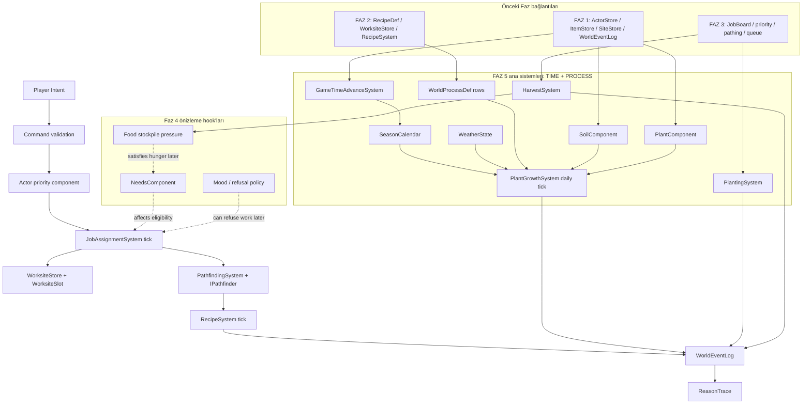
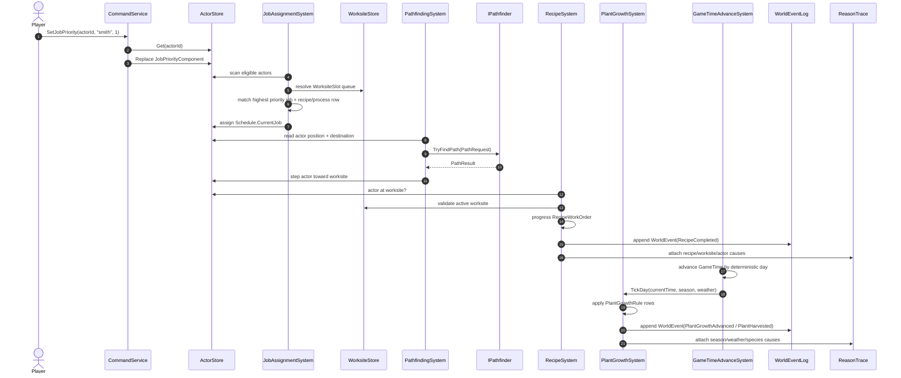

## 1. Sistem haritası (Mermaid graph TB)

> _Captain atom-map_: `docs/sprint-faz-5-atom-map.md` (Captain narrow vertical-slice decomposition).
> _Naming_: aligned with Captain types (JobRequest, ActorScheduleState, JobAssignmentSystem).
> _Spec covers full architecture; Captain may implement subset and extend later.



## 2. Veri modeli (Mermaid classDiagram)

```mermaid
classDiagram
    class GameTime
    class Season {
        <<enumeration>>
        None
        Spring
        Summer
        Autumn
        Winter
    }

    class SeasonDefinition {
        +Season Season
        +int StartDayOfYear
        +int EndDayOfYear
    }

    class SeasonCalendar {
        -ReadOnlyCollection~SeasonDefinition~ _seasons
        +GetSeason(GameTime time) Season
        +IsSeasonBoundary(GameTime previous, GameTime current) bool
    }

    class WeatherState {
        +string WeatherTag
        +GameTime ObservedAt
    }

    class EntityId {
        +ulong Value
        +bool IsEmpty
    }

    class SoilComponent {
        +EntityId EntityId
        +SiteId SiteId
        +GridPosition Position
        +string SoilTag
        +int Fertility
        +int Moisture
        +bool IsTilled
        +EntityId PlantEntityId
    }

    class PlantComponent {
        +EntityId EntityId
        +string SpeciesId
        +PlantStageId StageId
        +int GrowthDays
        +bool IsHarvested
        +GameTime PlantedAt
    }

    class PlantSpeciesDef {
        +string SpeciesId
        +string SeedItemTag
        +string HarvestItemTag
        +int BaseHarvestQuantity
    }

    class PlantGrowthStageDef {
        +PlantStageId StageId
        +int MinGrowthDays
        +bool IsHarvestable
    }

    class PlantGrowthRule {
        +string SpeciesId
        +Season Season
        +IReadOnlyList~string~ BlockedWeatherTags
        +int DailyGrowthUnits
    }

    class WorldProcessDef {
        +WorldProcessId Id
        +string ProcessTag
        +int DurationDays
    }

    class WorldProcessInstance {
        +WorldProcessId DefinitionId
        +EntityId SubjectEntityId
        +int ProgressDays
    }

    class ActorRecord {
        +ActorId Id
        +JobPriorityComponent JobPriorities
        +ActorScheduleState Schedule
        +ActorPathComponent Pathing
        +NeedsComponent Needs
    }

    class JobPriorityComponent {
        +GetPriority(string jobTag) int
    }

    class ActorScheduleState {
        +string CurrentJobId
        +WorksiteSlot CurrentWorksiteSlot
    }

    class ActorPathComponent {
        +IReadOnlyList~GridPosition~ Path
        +GridPosition Destination
    }

    class NeedsComponent {
        +int Hunger
        +int Fatigue
        +int Mood
    }

    class WorksiteSlot {
        +SiteId SiteId
        +GridPosition WorksitePosition
        +WorksiteKind WorksiteKind
        +int SlotIndex
        +GridPosition StandingPosition
        +TryResolve(WorksiteStore store) bool
    }

    class IPathfinder {
        <<interface>>
        +TryFindPath(PathRequest request, PathResult result) bool
        +IsPathBlocked(IReadOnlyList~GridPosition~ path, PathRequest request) bool
        +ComputeMovementCost(IReadOnlyList~GridPosition~ path) int
    }

    SeasonCalendar --> SeasonDefinition
    SeasonDefinition --> Season
    PlantGrowthRule --> Season
    SoilComponent --> EntityId
    PlantComponent --> EntityId
    PlantSpeciesDef --> PlantGrowthStageDef
    WorldProcessInstance --> WorldProcessDef
    ActorRecord o-- JobPriorityComponent
    ActorRecord o-- ActorScheduleState
    ActorRecord o-- ActorPathComponent
    ActorRecord o-- NeedsComponent
    ActorScheduleState --> WorksiteSlot
    WorksiteSlot --> WorksiteStore
    PathfindingSystem --> IPathfinder
```



Not: `Season` enum sadece takvim etiketi. Davranış `switch(Season)` ile değil, `SeasonDefinition`, `PlantGrowthRule`, `WorldProcessDef` satırlarıyla yürütülür.

## 3. Tick akışı (Mermaid sequenceDiagram)



## 4. C# scaffold — DOSYA YOLU + İMZA (gövde YOK)

```csharp
// File: Assets/Scripts/Domain/Core/EntityId.cs
using System;

namespace EmberCrpg.Domain.Core
{
    /// <summary>Stable handle for component-owned world entities that are not necessarily actors, items, or sites.</summary>
    public readonly struct EntityId : IEquatable<EntityId>
    {
        private readonly ulong _value;

        /// <summary>Creates an entity handle from its raw deterministic identifier.</summary>
        public EntityId(ulong value);

        /// <summary>Raw stable identifier carried by this handle.</summary>
        public ulong Value { get; }

        /// <summary>True when this handle is the empty no-entity sentinel.</summary>
        public bool IsEmpty { get; }

        /// <summary>Returns true when both handles carry the same raw identifier.</summary>
        public bool Equals(EntityId other);

        /// <summary>Returns true when the object is an entity handle with the same raw identifier.</summary>
        public override bool Equals(object obj);

        /// <summary>Returns a hash code derived only from the raw stable identifier.</summary>
        public override int GetHashCode();

        /// <summary>Returns a compact debug label for logs and tests.</summary>
        public override string ToString();
    }
}

// File: Assets/Scripts/Domain/Time/Season.cs
namespace EmberCrpg.Domain.Time
{
    /// <summary>Calendar season label. Systems must use data rows for behavior instead of branching on this enum.</summary>
    public enum Season
    {
        None = 0,
        Spring = 1,
        Summer = 2,
        Autumn = 3,
        Winter = 4,
    }
}

// File: Assets/Scripts/Domain/Time/SeasonDefinition.cs
using System;

namespace EmberCrpg.Domain.Time
{
    /// <summary>Data row mapping an inclusive day-of-year range to a season label.</summary>
    public sealed class SeasonDefinition
    {
        /// <summary>Creates one deterministic calendar range for a season.</summary>
        public SeasonDefinition(Season season, int startDayOfYear, int endDayOfYear);

        /// <summary>Season label carried by this row.</summary>
        public Season Season { get; }

        /// <summary>Inclusive one-based day-of-year where this season starts.</summary>
        public int StartDayOfYear { get; }

        /// <summary>Inclusive one-based day-of-year where this season ends.</summary>
        public int EndDayOfYear { get; }

        /// <summary>Returns true when the supplied one-based day-of-year falls inside this row.</summary>
        public bool ContainsDay(int dayOfYear);
    }
}

// File: Assets/Scripts/Domain/Time/SeasonCalendar.cs
using System.Collections.Generic;
using System.Collections.ObjectModel;
using EmberCrpg.Domain.Core;

namespace EmberCrpg.Domain.Time
{
    /// <summary>Pure calendar service that resolves GameTime into data-defined seasons.</summary>
    public sealed class SeasonCalendar
    {
        private readonly ReadOnlyCollection<SeasonDefinition> _seasons;

        /// <summary>Creates a calendar from deterministic season rows.</summary>
        public SeasonCalendar(IEnumerable<SeasonDefinition> seasons);

        /// <summary>Ordered season definition rows.</summary>
        public IReadOnlyList<SeasonDefinition> Seasons { get; }

        /// <summary>Returns the season containing the supplied timestamp.</summary>
        public Season GetSeason(GameTime time);

        /// <summary>Tries to resolve the season for the supplied timestamp without throwing.</summary>
        public bool TryGetSeason(GameTime time, out Season season);

        /// <summary>Returns true when advancing from previous to current crosses a season boundary.</summary>
        public bool IsSeasonBoundary(GameTime previous, GameTime current);
    }
}
```

```csharp
// File: Assets/Scripts/Domain/World/WeatherState.cs
using System;
using EmberCrpg.Domain.Core;

namespace EmberCrpg.Domain.World
{
    /// <summary>Pure weather tag state used by season and plant process rules.</summary>
    public sealed class WeatherState
    {
        private readonly string _weatherTag;

        /// <summary>Creates a weather state snapshot at a deterministic game time.</summary>
        public WeatherState(string weatherTag, GameTime observedAt);

        /// <summary>Data tag such as clear, rain, snow, or storm.</summary>
        public string WeatherTag { get; }

        /// <summary>Game time when the weather tag became current.</summary>
        public GameTime ObservedAt { get; }

        /// <summary>Returns an equivalent state with a different weather tag and timestamp.</summary>
        public WeatherState WithWeather(string weatherTag, GameTime observedAt);
    }
}

// File: Assets/Scripts/Domain/World/ComponentStore.cs
using System.Collections.Generic;
using EmberCrpg.Domain.Core;

namespace EmberCrpg.Domain.World
{
    /// <summary>Dictionary-backed component store keyed by EntityId with deterministic insertion-order enumeration.</summary>
    public sealed class ComponentStore<TComponent> where TComponent : class
    {
        private readonly Dictionary<EntityId, TComponent> _byEntityId;
        private readonly List<EntityId> _order;

        /// <summary>Creates an empty component store.</summary>
        public ComponentStore();

        /// <summary>Number of components currently held.</summary>
        public int Count { get; }

        /// <summary>Adds a component for an entity id.</summary>
        public void Add(EntityId entityId, TComponent component);

        /// <summary>Returns the component for an entity id, or throws if missing.</summary>
        public TComponent Get(EntityId entityId);

        /// <summary>Tries to fetch the component for an entity id.</summary>
        public bool TryGet(EntityId entityId, out TComponent component);

        /// <summary>Replaces an existing component for an entity id.</summary>
        public void Replace(EntityId entityId, TComponent component);

        /// <summary>Removes a component by entity id.</summary>
        public bool Remove(EntityId entityId);

        /// <summary>Components in deterministic insertion order.</summary>
        public IEnumerable<TComponent> Records { get; }

        /// <summary>Entity ids in deterministic insertion order.</summary>
        public IEnumerable<EntityId> EntityIds { get; }
    }
}
```

```csharp
// File: Assets/Scripts/Domain/Process/PlantStageId.cs
using System;

namespace EmberCrpg.Domain.Process
{
    /// <summary>Stable data-row handle for a plant growth stage such as seed, sapling, ripe, or harvested.</summary>
    public readonly struct PlantStageId : IEquatable<PlantStageId>
    {
        private readonly string _value;

        /// <summary>Creates a plant stage handle from a deterministic data id.</summary>
        public PlantStageId(string value);

        /// <summary>Raw data id carried by this handle.</summary>
        public string Value { get; }

        /// <summary>True when this handle has no stage id.</summary>
        public bool IsEmpty { get; }

        /// <summary>Returns true when both stage handles carry the same id.</summary>
        public bool Equals(PlantStageId other);

        /// <summary>Returns a hash code derived from the stage id.</summary>
        public override int GetHashCode();

        /// <summary>Returns the raw stage id for debug output.</summary>
        public override string ToString();
    }
}

// File: Assets/Scripts/Domain/Process/PlantGrowthStageDef.cs
namespace EmberCrpg.Domain.Process
{
    /// <summary>Data row describing when a species reaches a stage and whether that stage can be harvested.</summary>
    public sealed class PlantGrowthStageDef
    {
        /// <summary>Creates a plant growth stage row.</summary>
        public PlantGrowthStageDef(PlantStageId stageId, int minGrowthDays, bool isHarvestable);

        /// <summary>Stable stage id.</summary>
        public PlantStageId StageId { get; }

        /// <summary>Minimum accumulated growth days required to enter this stage.</summary>
        public int MinGrowthDays { get; }

        /// <summary>True when HarvestSystem may convert this plant into output stock.</summary>
        public bool IsHarvestable { get; }
    }
}

// File: Assets/Scripts/Domain/Process/PlantSpeciesDef.cs
using System.Collections.Generic;
using System.Collections.ObjectModel;

namespace EmberCrpg.Domain.Process
{
    /// <summary>Data row describing a plant species, seed input, harvest output, and ordered growth stages.</summary>
    public sealed class PlantSpeciesDef
    {
        private readonly ReadOnlyCollection<PlantGrowthStageDef> _stages;

        /// <summary>Creates a plant species definition from data rows.</summary>
        public PlantSpeciesDef(string speciesId, string seedItemTag, string harvestItemTag, int baseHarvestQuantity, IEnumerable<PlantGrowthStageDef> stages);

        /// <summary>Stable species id such as wheat.</summary>
        public string SpeciesId { get; }

        /// <summary>Inventory item tag consumed by planting.</summary>
        public string SeedItemTag { get; }

        /// <summary>Inventory item tag produced by harvesting.</summary>
        public string HarvestItemTag { get; }

        /// <summary>Base number of output units before deterministic modifiers.</summary>
        public int BaseHarvestQuantity { get; }

        /// <summary>Ordered stage rows for this species.</summary>
        public IReadOnlyList<PlantGrowthStageDef> Stages { get; }

        /// <summary>Returns the latest stage reached by accumulated growth days.</summary>
        public PlantStageId ResolveStage(int growthDays);
    }
}

// File: Assets/Scripts/Domain/Process/PlantGrowthRule.cs
using System.Collections.Generic;
using System.Collections.ObjectModel;
using EmberCrpg.Domain.Time;

namespace EmberCrpg.Domain.Process
{
    /// <summary>Data row controlling daily growth for a species under a season, soil tag, and blocked weather tags.</summary>
    public sealed class PlantGrowthRule
    {
        private readonly ReadOnlyCollection<string> _blockedWeatherTags;

        /// <summary>Creates a data-driven plant growth rule.</summary>
        public PlantGrowthRule(string speciesId, string soilTag, Season season, int dailyGrowthUnits, IEnumerable<string> blockedWeatherTags);

        /// <summary>Species id this rule applies to.</summary>
        public string SpeciesId { get; }

        /// <summary>Soil tag this rule applies to.</summary>
        public string SoilTag { get; }

        /// <summary>Season label this rule applies to.</summary>
        public Season Season { get; }

        /// <summary>Daily growth units applied when the rule matches.</summary>
        public int DailyGrowthUnits { get; }

        /// <summary>Weather tags that block the rule; wheat uses snow here.</summary>
        public IReadOnlyList<string> BlockedWeatherTags { get; }

        /// <summary>Returns true when the rule matches the supplied species, soil, season, and weather tag.</summary>
        public bool Matches(string speciesId, string soilTag, Season season, string weatherTag);
    }
}
```

```csharp
// File: Assets/Scripts/Domain/Process/SoilComponent.cs
using EmberCrpg.Domain.Actors;
using EmberCrpg.Domain.Core;

namespace EmberCrpg.Domain.Process
{
    /// <summary>Component attached to a tile entity representing tillable soil and an optional planted entity.</summary>
    public sealed class SoilComponent
    {
        /// <summary>Creates a soil component for a site grid position.</summary>
        public SoilComponent(EntityId entityId, SiteId siteId, GridPosition position, string soilTag, int fertility, int moisture, bool isTilled, EntityId plantEntityId);

        /// <summary>Entity id owning this component.</summary>
        public EntityId EntityId { get; }

        /// <summary>Site containing the soil tile.</summary>
        public SiteId SiteId { get; }

        /// <summary>Grid position of the soil tile inside the site.</summary>
        public GridPosition Position { get; }

        /// <summary>Data tag such as loam, clay, or sand.</summary>
        public string SoilTag { get; }

        /// <summary>Deterministic fertility score used by growth rules.</summary>
        public int Fertility { get; }

        /// <summary>Deterministic moisture score used by later irrigation rules.</summary>
        public int Moisture { get; }

        /// <summary>True when the soil can accept planting.</summary>
        public bool IsTilled { get; }

        /// <summary>Entity id of the planted crop, or empty when vacant.</summary>
        public EntityId PlantEntityId { get; }

        /// <summary>Returns a copy with a different tilled flag.</summary>
        public SoilComponent WithTilled(bool isTilled);

        /// <summary>Returns a copy with a planted entity reference.</summary>
        public SoilComponent WithPlant(EntityId plantEntityId);

        /// <summary>Returns a copy with no planted entity reference.</summary>
        public SoilComponent WithoutPlant();
    }
}

// File: Assets/Scripts/Domain/Process/PlantComponent.cs
using EmberCrpg.Domain.Core;

namespace EmberCrpg.Domain.Process
{
    /// <summary>Component attached to a plant entity tracking species, stage, growth days, and harvest state.</summary>
    public sealed class PlantComponent
    {
        /// <summary>Creates a plant component from deterministic planting state.</summary>
        public PlantComponent(EntityId entityId, string speciesId, PlantStageId stageId, int growthDays, bool isHarvested, GameTime plantedAt, ActorId plantedBy);

        /// <summary>Entity id owning this plant component.</summary>
        public EntityId EntityId { get; }

        /// <summary>Species id resolved through PlantSpeciesDef rows.</summary>
        public string SpeciesId { get; }

        /// <summary>Current stage id resolved from growth days.</summary>
        public PlantStageId StageId { get; }

        /// <summary>Accumulated data-driven growth days.</summary>
        public int GrowthDays { get; }

        /// <summary>True after HarvestSystem has converted the plant into output stock.</summary>
        public bool IsHarvested { get; }

        /// <summary>Game time when this plant was created.</summary>
        public GameTime PlantedAt { get; }

        /// <summary>Actor who planted this crop, if known.</summary>
        public ActorId PlantedBy { get; }

        /// <summary>Returns a copy with updated growth days and stage id.</summary>
        public PlantComponent WithGrowth(int growthDays, PlantStageId stageId);

        /// <summary>Returns a copy marked harvested.</summary>
        public PlantComponent WithHarvested();
    }
}
```

```csharp
// File: Assets/Scripts/Domain/Process/WorldProcessId.cs
using System;

namespace EmberCrpg.Domain.Process
{
    /// <summary>Stable handle for non-crafting process definitions such as plant growth.</summary>
    public readonly struct WorldProcessId : IEquatable<WorldProcessId>
    {
        private readonly ulong _value;

        /// <summary>Creates a world process handle from its raw id.</summary>
        public WorldProcessId(ulong value);

        /// <summary>Raw stable id.</summary>
        public ulong Value { get; }

        /// <summary>True when this handle is empty.</summary>
        public bool IsEmpty { get; }

        /// <summary>Returns true when both handles carry the same id.</summary>
        public bool Equals(WorldProcessId other);
    }
}

// File: Assets/Scripts/Domain/Process/WorldProcessDef.cs
using System.Collections.Generic;
using System.Collections.ObjectModel;

namespace EmberCrpg.Domain.Process
{
    /// <summary>Data row for deterministic non-crafting transformations driven by operation tags.</summary>
    public sealed class WorldProcessDef
    {
        private readonly ReadOnlyCollection<string> _operationTags;

        /// <summary>Creates a world process definition row.</summary>
        public WorldProcessDef(WorldProcessId id, string processTag, int durationDays, IEnumerable<string> operationTags);

        /// <summary>Stable process id.</summary>
        public WorldProcessId Id { get; }

        /// <summary>Data tag such as plant_growth or dry_soil.</summary>
        public string ProcessTag { get; }

        /// <summary>Number of daily ticks required to complete the process.</summary>
        public int DurationDays { get; }

        /// <summary>Operation tags resolved by a registry; no enum branch is required.</summary>
        public IReadOnlyList<string> OperationTags { get; }
    }
}

// File: Assets/Scripts/Domain/Process/WorldProcessInstance.cs
using EmberCrpg.Domain.Core;

namespace EmberCrpg.Domain.Process
{
    /// <summary>Runtime state for one active non-crafting world process.</summary>
    public sealed class WorldProcessInstance
    {
        /// <summary>Creates an active process instance for a subject entity.</summary>
        public WorldProcessInstance(WorldProcessId definitionId, EntityId subjectEntityId, int progressDays, bool isComplete);

        /// <summary>Definition row backing this process.</summary>
        public WorldProcessId DefinitionId { get; }

        /// <summary>Entity affected by this process.</summary>
        public EntityId SubjectEntityId { get; }

        /// <summary>Completed daily ticks.</summary>
        public int ProgressDays { get; }

        /// <summary>True when the process has completed.</summary>
        public bool IsComplete { get; }

        /// <summary>Returns a copy advanced by deterministic days.</summary>
        public WorldProcessInstance WithProgress(int progressDays, bool isComplete);
    }
}
```

```csharp
// File: Assets/Scripts/Domain/Actors/JobPriorityComponent.cs
using System.Collections.Generic;
using System.Collections.ObjectModel;

namespace EmberCrpg.Domain.Actors
{
    /// <summary>Actor component storing player or AI job priorities as data tags.</summary>
    public sealed class JobPriorityComponent
    {
        private readonly ReadOnlyCollection<JobPriorityRow> _priorities;

        /// <summary>Creates a priority component from deterministic rows.</summary>
        public JobPriorityComponent(IEnumerable<JobPriorityRow> priorities);

        /// <summary>Priority rows in deterministic order.</summary>
        public IReadOnlyList<JobPriorityRow> Priorities { get; }

        /// <summary>Returns priority for a job tag; lower numbers mean higher priority.</summary>
        public int GetPriority(string jobTag);

        /// <summary>Returns a copy with a priority set for one job tag.</summary>
        public JobPriorityComponent WithPriority(string jobTag, int priority);
    }

    /// <summary>Single data row mapping a job tag to a priority value.</summary>
    public sealed class JobPriorityRow
    {
        /// <summary>Creates a job priority row.</summary>
        public JobPriorityRow(string jobTag, int priority);

        /// <summary>Data tag such as smith, farmer, cook, or haul.</summary>
        public string JobTag { get; }

        /// <summary>Priority value where 1 is highest.</summary>
        public int Priority { get; }
    }
}

// File: Assets/Scripts/Domain/Actors/ActorScheduleState.cs
using EmberCrpg.Domain.Process;

namespace EmberCrpg.Domain.Actors
{
    /// <summary>Actor component holding the current job and resolved worksite slot.</summary>
    public sealed class ActorScheduleState
    {
        /// <summary>Creates a schedule component snapshot.</summary>
        public ActorScheduleState(string currentJobId, WorksiteSlot currentWorksiteSlot);

        /// <summary>Current job id, or empty when idle.</summary>
        public string CurrentJobId { get; }

        /// <summary>Resolved worksite slot for the current job.</summary>
        public WorksiteSlot CurrentWorksiteSlot { get; }

        /// <summary>Returns a copy assigned to a job and slot.</summary>
        public ActorScheduleState WithJob(string jobId, WorksiteSlot slot);

        /// <summary>Returns a copy with no current job.</summary>
        public ActorScheduleState ClearJob();
    }
}

// File: Assets/Scripts/Domain/Actors/ActorPathComponent.cs
using System.Collections.Generic;
using EmberCrpg.Domain.Core;

namespace EmberCrpg.Domain.Actors
{
    /// <summary>Actor component carrying path state computed by IPathfinder.</summary>
    public sealed class ActorPathComponent
    {
        private readonly IReadOnlyList<GridPosition> _path;

        /// <summary>Creates path state for an actor.</summary>
        public ActorPathComponent(GridPosition destination, IEnumerable<GridPosition> path, bool isBlocked);

        /// <summary>Current destination.</summary>
        public GridPosition Destination { get; }

        /// <summary>Path steps in deterministic order.</summary>
        public IReadOnlyList<GridPosition> Path { get; }

        /// <summary>True when the last path check found a blocker.</summary>
        public bool IsBlocked { get; }

        /// <summary>Returns a copy with a new path.</summary>
        public ActorPathComponent WithPath(GridPosition destination, IEnumerable<GridPosition> path);

        /// <summary>Returns a copy with blocked state set.</summary>
        public ActorPathComponent WithBlocked(bool isBlocked);
    }
}

// File: Assets/Scripts/Domain/Actors/NeedsComponent.cs
namespace EmberCrpg.Domain.Actors
{
    /// <summary>Faz 4 preview component for hunger, fatigue, and mood pressure read by job eligibility.</summary>
    public sealed class NeedsComponent
    {
        /// <summary>Creates a needs snapshot.</summary>
        public NeedsComponent(int hunger, int fatigue, int mood);

        /// <summary>Hunger pressure, later raised by NeedsSystem.</summary>
        public int Hunger { get; }

        /// <summary>Fatigue pressure, later raised by NeedsSystem.</summary>
        public int Fatigue { get; }

        /// <summary>Mood scalar derived from needs and memories.</summary>
        public int Mood { get; }
    }
}
```

```csharp
// File: Assets/Scripts/Domain/Process/WorksiteSlot.cs
using EmberCrpg.Domain.Actors;
using EmberCrpg.Domain.Core;

namespace EmberCrpg.Domain.Process
{
    /// <summary>Queueable work position referencing an existing WorksiteStore cell plus an actor standing position.</summary>
    public sealed class WorksiteSlot
    {
        /// <summary>Creates a deterministic worksite slot.</summary>
        public WorksiteSlot(SiteId siteId, GridPosition worksitePosition, WorksiteKind worksiteKind, int slotIndex, GridPosition standingPosition);

        /// <summary>Site containing the referenced worksite.</summary>
        public SiteId SiteId { get; }

        /// <summary>Grid position of the referenced worksite record.</summary>
        public GridPosition WorksitePosition { get; }

        /// <summary>Expected worksite kind used as a data label.</summary>
        public WorksiteKind WorksiteKind { get; }

        /// <summary>Stable slot index around the same worksite.</summary>
        public int SlotIndex { get; }

        /// <summary>Grid position where the actor should stand while working or waiting.</summary>
        public GridPosition StandingPosition { get; }

        /// <summary>Tries to resolve this slot against the existing WorksiteStore.</summary>
        public bool TryResolve(WorksiteStore store, out WorksiteRecord record);

        /// <summary>Returns true when a worksite record matches this slot's site, position, and kind.</summary>
        public bool Matches(WorksiteRecord record);
    }
}

// File: Assets/Scripts/Simulation/Pathfinding/IPathfinder.cs
using System.Collections.Generic;
using EmberCrpg.Domain.Actors;
using EmberCrpg.Domain.Core;

namespace EmberCrpg.Simulation.Pathfinding
{
    /// <summary>Pure pathfinding API consumed by systems. Implementations stay outside Domain and do not use UnityEngine.</summary>
    public interface IPathfinder
    {
        /// <summary>Finds a deterministic path for a request.</summary>
        bool TryFindPath(PathRequest request, out PathResult result);

        /// <summary>Checks whether an existing path is blocked by current constraints.</summary>
        bool IsPathBlocked(IReadOnlyList<GridPosition> path, PathRequest request);

        /// <summary>Computes deterministic movement cost for a path.</summary>
        int ComputeMovementCost(IReadOnlyList<GridPosition> path);
    }

    /// <summary>Input payload for pathfinding over one site grid.</summary>
    public sealed class PathRequest
    {
        private readonly IReadOnlyList<GridPosition> _blockedTiles;

        /// <summary>Creates a pathfinding request.</summary>
        public PathRequest(SiteId siteId, GridPosition start, GridPosition goal, IEnumerable<GridPosition> blockedTiles);

        /// <summary>Site whose grid is being searched.</summary>
        public SiteId SiteId { get; }

        /// <summary>Starting grid position.</summary>
        public GridPosition Start { get; }

        /// <summary>Goal grid position.</summary>
        public GridPosition Goal { get; }

        /// <summary>Blocked tiles from doors, actors, and reserved slots.</summary>
        public IReadOnlyList<GridPosition> BlockedTiles { get; }
    }

    /// <summary>Output payload for deterministic pathfinding.</summary>
    public sealed class PathResult
    {
        private readonly IReadOnlyList<GridPosition> _steps;

        /// <summary>Creates a path result.</summary>
        public PathResult(IEnumerable<GridPosition> steps, int movementCost);

        /// <summary>Path steps from start to goal.</summary>
        public IReadOnlyList<GridPosition> Steps { get; }

        /// <summary>Deterministic movement cost for the path.</summary>
        public int MovementCost { get; }
    }
}
```

```csharp
// File: Assets/Scripts/Simulation/Time/GameTimeAdvanceSystem.cs
using EmberCrpg.Domain.Core;
using EmberCrpg.Domain.Time;
using EmberCrpg.Domain.World;

namespace EmberCrpg.Simulation.Time
{
    /// <summary>Pure system that advances GameTime and emits day or season events.</summary>
    public sealed class GameTimeAdvanceSystem
    {
        /// <summary>Creates a time advance system with a season calendar.</summary>
        public GameTimeAdvanceSystem(SeasonCalendar calendar);

        private readonly SeasonCalendar _calendar;

        /// <summary>Advances time by minutes and emits deterministic time events.</summary>
        public GameTimeAdvanceResult AdvanceMinutes(GameTime current, long minutes, SiteId siteId, WorldEventLog events);

        /// <summary>Advances time by whole days and emits deterministic time events.</summary>
        public GameTimeAdvanceResult AdvanceDays(GameTime current, int days, SiteId siteId, WorldEventLog events);
    }

    /// <summary>Result of advancing deterministic game time.</summary>
    public sealed class GameTimeAdvanceResult
    {
        /// <summary>Creates a time advance result.</summary>
        public GameTimeAdvanceResult(GameTime previousTime, GameTime currentTime, Season previousSeason, Season currentSeason, int elapsedDays);

        /// <summary>Time before the advance.</summary>
        public GameTime PreviousTime { get; }

        /// <summary>Time after the advance.</summary>
        public GameTime CurrentTime { get; }

        /// <summary>Season before the advance.</summary>
        public Season PreviousSeason { get; }

        /// <summary>Season after the advance.</summary>
        public Season CurrentSeason { get; }

        /// <summary>Whole game days crossed by the advance.</summary>
        public int ElapsedDays { get; }

        /// <summary>True when previous and current seasons differ.</summary>
        public bool SeasonChanged { get; }
    }
}

// File: Assets/Scripts/Simulation/Process/PlantingSystem.cs
using EmberCrpg.Domain.Actors;
using EmberCrpg.Domain.Core;
using EmberCrpg.Domain.Inventory;
using EmberCrpg.Domain.Process;
using EmberCrpg.Domain.World;

namespace EmberCrpg.Simulation.Process
{
    /// <summary>Pure process system that consumes a seed item and creates a PlantComponent on tilled soil.</summary>
    public sealed class PlantingSystem
    {
        /// <summary>Creates a planting system.</summary>
        public PlantingSystem();

        /// <summary>Attempts to plant a species on a soil tile using actor inventory stock.</summary>
        public bool TryPlant(ActorId actorId, PlantSpeciesDef species, EntityId plantEntityId, EntityId soilEntityId, ComponentStore<SoilComponent> soils, ComponentStore<PlantComponent> plants, InventoryState inventory, GameTime time, WorldEventLog events);
    }
}

// File: Assets/Scripts/Simulation/Process/PlantGrowthSystem.cs
using System.Collections.Generic;
using EmberCrpg.Domain.Process;
using EmberCrpg.Domain.Time;
using EmberCrpg.Domain.World;

namespace EmberCrpg.Simulation.Process
{
    /// <summary>Daily deterministic plant growth system driven by species and growth rule rows.</summary>
    public sealed class PlantGrowthSystem
    {
        private readonly IReadOnlyDictionary<string, PlantSpeciesDef> _speciesById;
        private readonly IReadOnlyList<PlantGrowthRule> _growthRules;

        /// <summary>Creates a plant growth system from data rows.</summary>
        public PlantGrowthSystem(IEnumerable<PlantSpeciesDef> species, IEnumerable<PlantGrowthRule> growthRules);

        /// <summary>Ticks plant growth for one in-game day.</summary>
        public PlantGrowthTickResult TickDay(ComponentStore<SoilComponent> soils, ComponentStore<PlantComponent> plants, Season season, WeatherState weather, WorldEventLog events);
    }

    /// <summary>Summary of one plant growth day for deterministic tests and replay logs.</summary>
    public sealed class PlantGrowthTickResult
    {
        /// <summary>Creates a daily plant growth result.</summary>
        public PlantGrowthTickResult(int plantsAdvanced, int plantsBlockedByWeather, int plantsBecameHarvestable);

        /// <summary>Number of plants whose growth days advanced.</summary>
        public int PlantsAdvanced { get; }

        /// <summary>Number of plants blocked by data-defined weather tags.</summary>
        public int PlantsBlockedByWeather { get; }

        /// <summary>Number of plants that reached a harvestable stage.</summary>
        public int PlantsBecameHarvestable { get; }
    }
}

// File: Assets/Scripts/Simulation/Process/HarvestSystem.cs
using EmberCrpg.Domain.Core;
using EmberCrpg.Domain.Inventory;
using EmberCrpg.Domain.Process;
using EmberCrpg.Domain.World;
using EmberCrpg.Simulation.Rng;

namespace EmberCrpg.Simulation.Process
{
    /// <summary>Pure process system that converts harvestable plants into stockpile items.</summary>
    public sealed class HarvestSystem
    {
        /// <summary>Creates a harvest system.</summary>
        public HarvestSystem();

        /// <summary>Attempts to harvest one plant and add output stock deterministically.</summary>
        public bool TryHarvest(ActorId actorId, EntityId soilEntityId, ComponentStore<SoilComponent> soils, ComponentStore<PlantComponent> plants, PlantSpeciesDef species, InventoryState stockpile, IDeterministicRng rng, WorldEventLog events);
    }
}
```

Atom listesi:

| Atom | Dosya / sınıf | Açıklama | Kapanış testi | Tag |
|---:|---|---|---|---|
| 1 | `Domain/Time/Season.cs`, `SeasonDefinition.cs`, `SeasonCalendar.cs` | Mevsimi data row ile çözen saf TIME temeli | `SeasonCalendarTests` | [box=TIME] |
| 2 | `Simulation/Time/GameTimeAdvanceSystem.cs` | Gün/mevsim ilerleme ve `WorldEventLog` bağlantısı | `GameTimeAdvanceSystemTests` | [box=TIME] |
| 3 | `Domain/Core/EntityId.cs`, `Domain/World/ComponentStore.cs` | EntityId + component store; aynı PR’de Soil consumer ile kullanılmalı | `ComponentStoreTests` | [box=WORLD][box=PROCESS] |
| 4 | `Domain/Process/SoilComponent.cs` | Site grid tile üstünde tillable soil component | `SoilComponentTests` | [box=PROCESS] |
| 5 | `PlantStageId`, `PlantSpeciesDef`, `PlantGrowthStageDef`, `PlantGrowthRule` | Wheat seed/sapling/ripe/harvested data rows; branch yok | `PlantDefinitionTests` | [box=PROCESS][box=TIME] |
| 6 | `PlantComponent.cs`, `PlantingSystem.cs` | Wheat seed tüket, tilled soil üstüne plant entity yarat | `PlantingSystemTests` | [box=PROCESS] |
| 7 | `WorldProcessId`, `WorldProcessDef`, `WorldProcessInstance` | Crafting dışı transformation shape | `WorldProcessDefinitionTests` | [box=PROCESS] |
| 8 | `PlantGrowthSystem.cs` | Günlük tick; season + weather row match; snow growth halt | `PlantGrowthSystemTests` | [box=PROCESS][box=TIME] |
| 9 | `HarvestSystem.cs` | Ripe wheat -> stockpile food/wheat output; deterministic rng inject | `HarvestSystemTests` | [box=PROCESS] |
| 10 | `Data/Save/PlantSeasonSaveData.cs`, mapper extension | Soil/Plant/WorldProcess/Season round-trip; `SliceWorldState` field ekleme yok | `PlantSeasonRoundTripTests` | [box=TIME] |
| 11 | `WorksiteSlot.cs`, `IPathfinder.cs`, actor components | Faz 3 job/path lane ile farming/harvest job hook | `FarmingJobIntegrationTests` | [box=PROCESS][box=LIVING] |
| 12 | `docs/sprint-faz-5-plant-season-acceptance.md` | Deterministic replay proof: spring plant, summer harvest, food rises | `PlantSeasonAcceptanceTests` | [box=PROCESS][box=TIME][box=PLAYABLE] |

## 5. Test stratejisi

| Test dosyası | Pinlenen davranış |
|---|---|
| `tests/EmberCrpg.Domain.Tests/Time/SeasonCalendarTests.cs` | DayOfYear -> season mapping, boundary change, invalid overlapping rows |
| `tests/EmberCrpg.Simulation.Tests/Time/GameTimeAdvanceSystemTests.cs` | `GameTime` advance emits deterministic day/season events |
| `tests/EmberCrpg.Domain.Tests/World/ComponentStoreTests.cs` | EntityId keyed component add/get/replace/order |
| `tests/EmberCrpg.Domain.Tests/Process/PlantDefinitionTests.cs` | Wheat species rows, stage thresholds, snow blocked rule row |
| `tests/EmberCrpg.Simulation.Tests/Process/PlantingSystemTests.cs` | Seed consumed once, plant attached to soil, event + reason trace |
| `tests/EmberCrpg.Simulation.Tests/Process/PlantGrowthSystemTests.cs` | Daily growth, spring/summer progression, snow halt, no species branch |
| `tests/EmberCrpg.Simulation.Tests/Process/HarvestSystemTests.cs` | Ripe plant converts to stockpile item with injected deterministic rng |
| `tests/EmberCrpg.Data.Tests/Save/PlantSeasonRoundTripTests.cs` | Soil/Plant/WorldProcess save-load continues growth identically |
| `tests/EmberCrpg.Acceptance.Tests/Process/PlantSeasonAcceptanceTests.cs` | Player-facing spring planting -> summer harvest scenario |
| `tests/EmberCrpg.Acceptance.Tests/Replay/PlantSeasonReplayDeterminismTests.cs` | Same seed + command list => identical event log and stockpile |

Deterministic pattern: every system that needs chance or yield accepts `IDeterministicRng`; tests use a fixed sequence implementation. No Unity types, no `DateTime`, no wall-clock, no `UnityEngine.Random`.

Acceptance çevirisi: `player can wait until spring, plant wheat, harvest in summer, and see food stockpile rise` şu test olur: winter day’den spring’e `GameTimeAdvanceSystem.AdvanceDays`, tilled soil + wheat seed inventory, `PlantingSystem.TryPlant`, daily `PlantGrowthSystem.TickDay` until summer harvestable stage, `HarvestSystem.TryHarvest`, stockpile quantity increases, `WorldEventLog` contains ordered `SeasonChanged`, `PlantGrowthAdvanced`, `PlantHarvested` traces.

Replay determinism check: aynı seed, aynı starting save DTO, aynı command list iki kez koşulur; serialized `WorldEventLog`, plant growth days, stage ids, inventory quantities, and reason trace causes byte-for-byte karşılaştırılır.

## 6. Risk + acceptance

Smith senaryosu Faz 3 kabul kapısıdır, Faz 5’in plant lane’i aynı `ActorPriority -> JobAssignmentSystem -> Pathfinding -> WorksiteSlot -> RecipeSystem/ProcessSystem -> EventLog` hattını yeniden kullanır.

| Senaryo testi | Kurulum | Beklenen sonuç | Kapatacak atomlar |
|---|---|---|---|
| `player can set 2 actors to smith priority 1, watch both queue at the furnace, and produce 4 ingots in a deterministic day` | 2 actor, `smith=1`, active furnace, 2 queue slot, 8 ore + 4 fuel, 4 smelt jobs, deterministic pathfinder | Both actors reserve slots, complete 4 `RecipeCompleted` events, stockpile has 4 ingots, replay identical | Faz 3 priority/job/path atoms + Faz 2 `RecipeSystem`; bu map’te Atom 11 sadece hook doğrular |
| Faz 5 gerçek acceptance | Spring wait, tilled soil, wheat seed, clear weather, wheat growth rows | Plant reaches ripe in summer, harvest adds food/wheat, event log deterministic | Atom 1-12 |

Risk matrisi:

| Risk | Seviye | Neden | Azaltma |
|---|---:|---|---|
| ActorRecord component ekleri | Yüksek | Constructor/save mapper etkilenebilir | Optional parametreler sona eklenir, round-trip atomu ayrı tutulur |
| ComponentStore / EntityId | Orta | Yeni store şekli yanlış kullanılabilir | Aynı PR’de Soil consumer zorunlu; speculative helper değil |
| Job/path integration | Yüksek | Faz 3 tamamlanmadan Faz 5 farming job akışı kilitlenir | Atom 11’i en sona koy; plant core systems job’sız testlenebilir |
| Save/load | Orta | `SliceWorldState` named field kuralı ihlal edilebilir | Worksite sidecar desenini izle; yeni `SliceWorldState` field ekleme |
| Snow halt | Düşük | Branch yazma cazibesi var | `PlantGrowthRule.BlockedWeatherTags` row ile pinle |
| Wheat data | Düşük | Hard-code riski | `PlantSpeciesDef` + stage rows testte isimle doğrulanır |

Atom sırası önce TIME temelini, sonra data/state modelini, sonra visible process sistemlerini, en sonda save ve playable proof’u kapatır. Böylece üçüncü PR’a kadar görünür EventLog veya readable state üretme kuralı sağlanır.

Faz 4 hook’ları: `NeedsComponent` sadece okunabilir preview olarak kalmalı; Faz 5 `HarvestSystem` food stockpile artırır ama hunger düşürmez. Job eligibility ileride `NeedsComponent.Hunger/Fatigue/Mood` okuyabilir; `PlantHarvested` events later memory/mood systems tarafından tüketilebilir; eat/sleep recipes Faz 4’te ayrı data rows olarak bağlanır.
