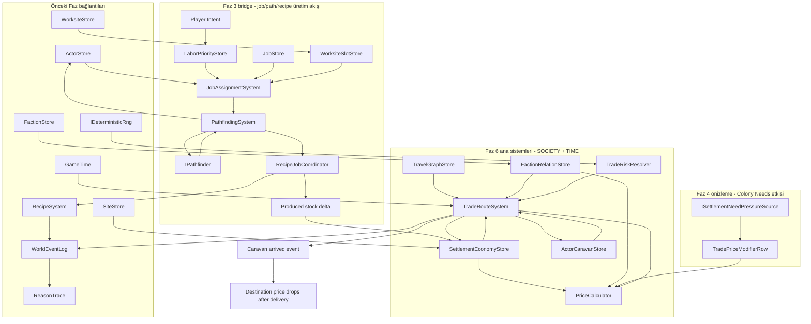
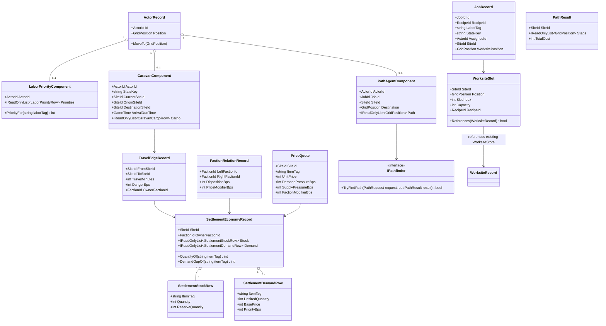
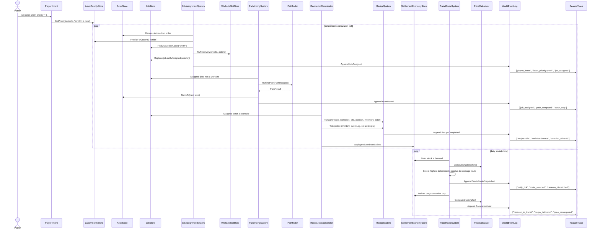

## 1. Sistem haritası (Mermaid graph TB)

> _Captain atom-map_: authored under `docs/archive/sprint/` as `sprint-faz-6-atom-map.md` when this slice is scheduled (Captain narrow vertical-slice decomposition).
> _Naming_: aligned with Captain types (JobRequest, ActorScheduleState, JobAssignmentSystem).
> _Spec covers full architecture; Captain may implement subset and extend later.



## 2. Veri modeli (Mermaid classDiagram)



## 3. Tick akışı (Mermaid sequenceDiagram)



## 4. C# scaffold - DOSYA YOLU + İMZA (gövde YOK)

Aşağıdaki bloklar signature-only scaffold’dur. Captain her atom PR’da gövdeleri ekler; burada hiçbir metot gövdesi yoktur.

```csharp
// File: Assets/Scripts/Domain/World/SettlementEconomyModels.cs
using System.Collections.Generic;
using EmberCrpg.Domain.Core;

namespace EmberCrpg.Domain.World
{
    /// <summary>Settlement stock row for one trade good. Keeps stock data-driven by item tag.</summary>
    public sealed class SettlementStockRow
    {
        /// <summary>Stable trade-good tag, for example "iron_ingot".</summary>
        private readonly string _itemTag;

        /// <summary>Creates a stock row for one item tag.</summary>
        public SettlementStockRow(string itemTag, int quantity, int reserveQuantity);

        /// <summary>Trade-good key used by recipes, prices, and route selection.</summary>
        public string ItemTag { get; }

        /// <summary>Current local stock quantity.</summary>
        public int Quantity { get; }

        /// <summary>Quantity protected from export so local demand is not starved.</summary>
        public int ReserveQuantity { get; }

        /// <summary>Returns an equivalent row with a changed quantity.</summary>
        public SettlementStockRow WithQuantity(int quantity);
    }

    /// <summary>Settlement demand row for one trade good. Price behavior reads rows, not enum branches.</summary>
    public sealed class SettlementDemandRow
    {
        /// <summary>Stable trade-good tag, for example "fuel".</summary>
        private readonly string _itemTag;

        /// <summary>Creates a demand row for one item tag.</summary>
        public SettlementDemandRow(string itemTag, int desiredQuantity, int basePrice, int priorityBps);

        /// <summary>Trade-good key matched against stock and caravan cargo.</summary>
        public string ItemTag { get; }

        /// <summary>Desired local quantity before shortage pressure is considered resolved.</summary>
        public int DesiredQuantity { get; }

        /// <summary>Base unit price before supply, demand, faction, and needs modifiers.</summary>
        public int BasePrice { get; }

        /// <summary>Demand priority in basis points; higher values make route selection prefer this good.</summary>
        public int PriorityBps { get; }
    }

    /// <summary>Data row for future needs or event-driven price pressure. This is the Faz 4 hook.</summary>
    public sealed class TradePriceModifierRow
    {
        /// <summary>Creates a data-driven price modifier row.</summary>
        public TradePriceModifierRow(string sourceKey, string itemTag, int modifierBps, string reason);

        /// <summary>Stable source key such as "needs:hunger" or "event:shortage".</summary>
        public string SourceKey { get; }

        /// <summary>Item tag affected by this modifier.</summary>
        public string ItemTag { get; }

        /// <summary>Signed basis-point modifier applied by PriceCalculator.</summary>
        public int ModifierBps { get; }

        /// <summary>Reason label copied into ReasonTrace when the modifier is observed.</summary>
        public string Reason { get; }
    }

    /// <summary>Pure SOCIETY record attached to a SiteId settlement. It owns stock and demand rows only.</summary>
    public sealed class SettlementEconomyRecord
    {
        /// <summary>Defensive stock-row view stored in deterministic constructor order.</summary>
        private readonly IReadOnlyList<SettlementStockRow> _stock;

        /// <summary>Defensive demand-row view stored in deterministic constructor order.</summary>
        private readonly IReadOnlyList<SettlementDemandRow> _demand;

        /// <summary>Creates a settlement economy record for one SiteRecord with SiteKind.Settlement.</summary>
        public SettlementEconomyRecord(SiteId siteId, FactionId ownerFactionId, IEnumerable<SettlementStockRow> stock, IEnumerable<SettlementDemandRow> demand);

        /// <summary>Site id of the settlement carrying this economy component.</summary>
        public SiteId SiteId { get; }

        /// <summary>Faction that owns or administers local prices and trade policy.</summary>
        public FactionId OwnerFactionId { get; }

        /// <summary>Deterministically ordered stock rows.</summary>
        public IReadOnlyList<SettlementStockRow> Stock { get; }

        /// <summary>Deterministically ordered demand rows.</summary>
        public IReadOnlyList<SettlementDemandRow> Demand { get; }

        /// <summary>Returns current quantity for an item tag, or zero if absent.</summary>
        public int QuantityOf(string itemTag);

        /// <summary>Returns desired quantity for an item tag, or zero if absent.</summary>
        public int DesiredQuantityOf(string itemTag);

        /// <summary>Returns max(0, desired minus stock) for route and price selection.</summary>
        public int DemandGapOf(string itemTag);

        /// <summary>Returns max(0, stock minus reserve) for export selection.</summary>
        public int ExportableSurplusOf(string itemTag);

        /// <summary>Returns an equivalent settlement with replaced stock rows.</summary>
        public SettlementEconomyRecord WithStock(IEnumerable<SettlementStockRow> stock);
    }

    /// <summary>Dictionary-backed settlement economy registry keyed by SiteId with deterministic enumeration.</summary>
    public sealed class SettlementEconomyStore
    {
        /// <summary>Lookup by settlement SiteId.</summary>
        private readonly Dictionary<SiteId, SettlementEconomyRecord> _bySiteId;

        /// <summary>Insertion order used for deterministic route selection tie-breaks.</summary>
        private readonly List<SiteId> _order;

        /// <summary>Creates an empty economy store.</summary>
        public SettlementEconomyStore();

        /// <summary>Number of settlement economy records.</summary>
        public int Count { get; }

        /// <summary>Adds a new settlement economy record.</summary>
        public void Add(SettlementEconomyRecord record);

        /// <summary>Replaces an existing settlement economy record.</summary>
        public void Replace(SettlementEconomyRecord record);

        /// <summary>Returns the settlement economy for a SiteId or throws.</summary>
        public SettlementEconomyRecord Get(SiteId siteId);

        /// <summary>Tries to fetch a settlement economy record.</summary>
        public bool TryGet(SiteId siteId, out SettlementEconomyRecord record);

        /// <summary>Settlement records in deterministic insertion order.</summary>
        public IEnumerable<SettlementEconomyRecord> Records { get; }
    }
}
```

```csharp
// File: Assets/Scripts/Domain/World/TravelGraphModels.cs
using System.Collections.Generic;
using EmberCrpg.Domain.Core;

namespace EmberCrpg.Domain.World
{
    /// <summary>Pure travel edge between two settlements. Travel time and danger are TIME inputs.</summary>
    public sealed class TravelEdgeRecord
    {
        /// <summary>Creates an undirected trade edge between two settlement sites.</summary>
        public TravelEdgeRecord(SiteId fromSiteId, SiteId toSiteId, int travelMinutes, int dangerBps, FactionId ownerFactionId);

        /// <summary>First settlement endpoint.</summary>
        public SiteId FromSiteId { get; }

        /// <summary>Second settlement endpoint.</summary>
        public SiteId ToSiteId { get; }

        /// <summary>Deterministic travel duration in game minutes.</summary>
        public int TravelMinutes { get; }

        /// <summary>Banditry or mishap chance in basis points, resolved only through injected IDeterministicRng.</summary>
        public int DangerBps { get; }

        /// <summary>Faction controlling tolls, safety, or relation modifiers on this edge.</summary>
        public FactionId OwnerFactionId { get; }

        /// <summary>Returns true when the edge touches the supplied settlement.</summary>
        public bool Connects(SiteId siteId);

        /// <summary>Returns the opposite endpoint or SiteId.Empty when the site is not on this edge.</summary>
        public SiteId OtherEnd(SiteId siteId);
    }

    /// <summary>Deterministic registry over settlement travel edges.</summary>
    public sealed class TravelGraphStore
    {
        /// <summary>All edges in insertion order.</summary>
        private readonly List<TravelEdgeRecord> _edges;

        /// <summary>Creates an empty travel graph.</summary>
        public TravelGraphStore();

        /// <summary>Number of registered travel edges.</summary>
        public int Count { get; }

        /// <summary>Adds a travel edge after validating both settlement endpoints.</summary>
        public void Add(TravelEdgeRecord edge);

        /// <summary>Returns outgoing edges for a settlement in deterministic insertion order.</summary>
        public IEnumerable<TravelEdgeRecord> OutgoingFrom(SiteId siteId);

        /// <summary>Tries to find an edge connecting two settlements.</summary>
        public bool TryGet(SiteId left, SiteId right, out TravelEdgeRecord edge);

        /// <summary>All travel edges in deterministic insertion order.</summary>
        public IEnumerable<TravelEdgeRecord> Records { get; }
    }
}
```

```csharp
// File: Assets/Scripts/Domain/World/FactionPriceModels.cs
using System.Collections.Generic;
using EmberCrpg.Domain.Core;

namespace EmberCrpg.Domain.World
{
    /// <summary>Faction pair relation row used by trade and prices. Values are data, not branches.</summary>
    public sealed class FactionRelationRecord
    {
        /// <summary>Creates a directional relation row from left faction to right faction.</summary>
        public FactionRelationRecord(FactionId leftFactionId, FactionId rightFactionId, int dispositionBps, int priceModifierBps);

        /// <summary>Faction owning the local point of view.</summary>
        public FactionId LeftFactionId { get; }

        /// <summary>Counterparty faction.</summary>
        public FactionId RightFactionId { get; }

        /// <summary>Signed disposition in basis points, consumed by future diplomacy slices.</summary>
        public int DispositionBps { get; }

        /// <summary>Signed price modifier in basis points.</summary>
        public int PriceModifierBps { get; }
    }

    /// <summary>Deterministic faction relation registry keyed by ordered faction pair.</summary>
    public sealed class FactionRelationStore
    {
        /// <summary>Pair lookup for relation rows.</summary>
        private readonly Dictionary<string, FactionRelationRecord> _byPairKey;

        /// <summary>Pair insertion order for deterministic save and replay.</summary>
        private readonly List<string> _order;

        /// <summary>Creates an empty relation store.</summary>
        public FactionRelationStore();

        /// <summary>Adds or replaces one directional relation row.</summary>
        public void Set(FactionRelationRecord record);

        /// <summary>Returns a relation row or a neutral default row.</summary>
        public FactionRelationRecord GetOrNeutral(FactionId leftFactionId, FactionId rightFactionId);

        /// <summary>All relation rows in deterministic insertion order.</summary>
        public IEnumerable<FactionRelationRecord> Records { get; }
    }

    /// <summary>Computed price quote for one item in one settlement at one deterministic tick.</summary>
    public sealed class PriceQuote
    {
        /// <summary>Creates an immutable price quote.</summary>
        public PriceQuote(SiteId siteId, string itemTag, int unitPrice, int demandPressureBps, int supplyPressureBps, int factionModifierBps, int externalModifierBps);

        /// <summary>Settlement where this price applies.</summary>
        public SiteId SiteId { get; }

        /// <summary>Trade-good tag being priced.</summary>
        public string ItemTag { get; }

        /// <summary>Final integer unit price after all data-row modifiers.</summary>
        public int UnitPrice { get; }

        /// <summary>Demand-derived signed basis-point contribution.</summary>
        public int DemandPressureBps { get; }

        /// <summary>Supply-derived signed basis-point contribution.</summary>
        public int SupplyPressureBps { get; }

        /// <summary>Faction relation basis-point contribution.</summary>
        public int FactionModifierBps { get; }

        /// <summary>Future needs, event, or scenario basis-point contribution.</summary>
        public int ExternalModifierBps { get; }
    }

    /// <summary>Future Faz 4 hook that can translate colony needs into price modifier rows.</summary>
    public interface ISettlementNeedPressureSource
    {
        /// <summary>Returns data-driven price modifiers for a settlement and tick.</summary>
        IEnumerable<TradePriceModifierRow> GetPriceModifiers(SiteId siteId, GameTime now);
    }

    /// <summary>Pure deterministic price service for local demand, stock, faction, and external rows.</summary>
    public sealed class PriceCalculator
    {
        /// <summary>Default external modifier source, usually empty until Faz 4 needs exist.</summary>
        private readonly ISettlementNeedPressureSource _needPressureSource;

        /// <summary>Creates a price calculator with an optional needs pressure source.</summary>
        public PriceCalculator(ISettlementNeedPressureSource needPressureSource = null);

        /// <summary>Computes a quote for one buyer faction at one settlement.</summary>
        public PriceQuote ComputeQuote(SettlementEconomyRecord settlement, string itemTag, FactionId buyerFactionId, FactionRelationStore relations, GameTime now);

        /// <summary>Computes the item price before and after a projected delivery without mutating state.</summary>
        public PriceQuote ComputeProjectedAfterDelivery(SettlementEconomyRecord settlement, string itemTag, int deliveredQuantity, FactionId buyerFactionId, FactionRelationStore relations, GameTime now);
    }
}
```

```csharp
// File: Assets/Scripts/Domain/World/CaravanModels.cs
using System.Collections.Generic;
using EmberCrpg.Domain.Core;

namespace EmberCrpg.Domain.World
{
    /// <summary>Stable handle for a planned or active trade route.</summary>
    public readonly struct TradeRouteId
    {
        /// <summary>Creates a trade route id from a raw stable value.</summary>
        public TradeRouteId(ulong value);

        /// <summary>Raw stable id value.</summary>
        public ulong Value { get; }

        /// <summary>True when this id is the empty sentinel.</summary>
        public bool IsEmpty { get; }
    }

    /// <summary>Cargo row carried by a caravan actor.</summary>
    public sealed class CaravanCargoRow
    {
        /// <summary>Creates one cargo row.</summary>
        public CaravanCargoRow(string itemTag, int quantity);

        /// <summary>Trade-good tag in cargo.</summary>
        public string ItemTag { get; }

        /// <summary>Quantity in transit.</summary>
        public int Quantity { get; }
    }

    /// <summary>One remembered route visit for deterministic caravan memory.</summary>
    public sealed class CaravanRouteMemory
    {
        /// <summary>Creates a route memory row.</summary>
        public CaravanRouteMemory(SiteId originSiteId, SiteId destinationSiteId, GameTime lastArrivalTime, string resultKey);

        /// <summary>Origin settlement remembered by the caravan.</summary>
        public SiteId OriginSiteId { get; }

        /// <summary>Destination settlement remembered by the caravan.</summary>
        public SiteId DestinationSiteId { get; }

        /// <summary>Last deterministic arrival timestamp.</summary>
        public GameTime LastArrivalTime { get; }

        /// <summary>Data key such as "delivered", "delayed", or "raided".</summary>
        public string ResultKey { get; }
    }

    /// <summary>Actor component that makes an ActorRecord behave as a caravan without inheritance.</summary>
    public sealed class CaravanComponent
    {
        /// <summary>Deterministic cargo rows.</summary>
        private readonly IReadOnlyList<CaravanCargoRow> _cargo;

        /// <summary>Deterministic route memory rows.</summary>
        private readonly IReadOnlyList<CaravanRouteMemory> _memory;

        /// <summary>Creates a caravan component for one actor.</summary>
        public CaravanComponent(ActorId actorId, string stateKey, SiteId currentSiteId, SiteId originSiteId, SiteId destinationSiteId, GameTime departureTime, GameTime arrivalDueTime, IEnumerable<CaravanCargoRow> cargo, IEnumerable<CaravanRouteMemory> memory);

        /// <summary>Actor carrying this component.</summary>
        public ActorId ActorId { get; }

        /// <summary>Data state key, for example "idle" or "in_transit".</summary>
        public string StateKey { get; }

        /// <summary>Current settlement when idle.</summary>
        public SiteId CurrentSiteId { get; }

        /// <summary>Transit origin settlement.</summary>
        public SiteId OriginSiteId { get; }

        /// <summary>Transit destination settlement.</summary>
        public SiteId DestinationSiteId { get; }

        /// <summary>Departure timestamp for current transit.</summary>
        public GameTime DepartureTime { get; }

        /// <summary>Arrival timestamp for current transit.</summary>
        public GameTime ArrivalDueTime { get; }

        /// <summary>Cargo rows currently held by the caravan.</summary>
        public IReadOnlyList<CaravanCargoRow> Cargo { get; }

        /// <summary>Recent deterministic route memory.</summary>
        public IReadOnlyList<CaravanRouteMemory> Memory { get; }

        /// <summary>Returns a component representing a dispatched caravan.</summary>
        public CaravanComponent WithDispatched(SiteId originSiteId, SiteId destinationSiteId, GameTime departureTime, GameTime arrivalDueTime, IEnumerable<CaravanCargoRow> cargo);

        /// <summary>Returns a component representing an arrived idle caravan.</summary>
        public CaravanComponent WithArrived(SiteId currentSiteId, GameTime arrivalTime, string resultKey);
    }

    /// <summary>Component store keyed by ActorId for caravan actors.</summary>
    public sealed class ActorCaravanStore
    {
        /// <summary>Caravan components keyed by actor id.</summary>
        private readonly Dictionary<ActorId, CaravanComponent> _byActorId;

        /// <summary>Actor insertion order for deterministic route selection.</summary>
        private readonly List<ActorId> _order;

        /// <summary>Creates an empty caravan component store.</summary>
        public ActorCaravanStore();

        /// <summary>Adds a caravan component.</summary>
        public void Add(CaravanComponent component);

        /// <summary>Replaces an existing caravan component.</summary>
        public void Replace(CaravanComponent component);

        /// <summary>Tries to fetch a caravan component for an actor.</summary>
        public bool TryGet(ActorId actorId, out CaravanComponent component);

        /// <summary>All caravan components in deterministic insertion order.</summary>
        public IEnumerable<CaravanComponent> Components { get; }
    }
}
```

```csharp
// File: Assets/Scripts/Domain/Actors/LaborPriorityModels.cs
using System.Collections.Generic;
using EmberCrpg.Domain.Core;

namespace EmberCrpg.Domain.Actors
{
    /// <summary>One actor labor priority row. Labor tags are data keys such as "smith".</summary>
    public sealed class LaborPriorityRow
    {
        /// <summary>Creates one labor priority row.</summary>
        public LaborPriorityRow(string laborTag, int priority, bool enabled);

        /// <summary>Data labor key matched to recipe and job rows.</summary>
        public string LaborTag { get; }

        /// <summary>Lower number means higher priority; one is highest player priority.</summary>
        public int Priority { get; }

        /// <summary>Whether the actor may accept jobs for this labor.</summary>
        public bool Enabled { get; }
    }

    /// <summary>Actor component holding labor priorities without subclassing ActorRecord.</summary>
    public sealed class LaborPriorityComponent
    {
        /// <summary>Priority rows in deterministic order.</summary>
        private readonly IReadOnlyList<LaborPriorityRow> _priorities;

        /// <summary>Creates a component for one actor.</summary>
        public LaborPriorityComponent(ActorId actorId, IEnumerable<LaborPriorityRow> priorities);

        /// <summary>Actor carrying the priority component.</summary>
        public ActorId ActorId { get; }

        /// <summary>Priority rows in deterministic order.</summary>
        public IReadOnlyList<LaborPriorityRow> Priorities { get; }

        /// <summary>Returns priority for a labor tag, or int.MaxValue when disabled or missing.</summary>
        public int PriorityFor(string laborTag);

        /// <summary>Returns an equivalent component with one priority row changed or inserted.</summary>
        public LaborPriorityComponent WithPriority(string laborTag, int priority, bool enabled);
    }

    /// <summary>Component store keyed by ActorId for labor priority components.</summary>
    public sealed class LaborPriorityStore
    {
        /// <summary>Priority components keyed by actor id.</summary>
        private readonly Dictionary<ActorId, LaborPriorityComponent> _byActorId;

        /// <summary>Actor insertion order for deterministic scans.</summary>
        private readonly List<ActorId> _order;

        /// <summary>Creates an empty priority store.</summary>
        public LaborPriorityStore();

        /// <summary>Sets one actor labor priority from player or AI intent.</summary>
        public void SetPriority(ActorId actorId, string laborTag, int priority, GameTime changedAt);

        /// <summary>Gets a component or an empty component for the actor.</summary>
        public LaborPriorityComponent GetOrEmpty(ActorId actorId);

        /// <summary>All components in deterministic insertion order.</summary>
        public IEnumerable<LaborPriorityComponent> Components { get; }
    }
}
```

```csharp
// File: Assets/Scripts/Domain/Process/JobModels.cs
using System.Collections.Generic;
using EmberCrpg.Domain.Core;

namespace EmberCrpg.Domain.Process
{
    /// <summary>Data row binding a player labor tag to a recipe. New craftables add rows, not branches.</summary>
    public sealed class LaborRecipeBindingRow
    {
        /// <summary>Creates a labor to recipe binding.</summary>
        public LaborRecipeBindingRow(string laborTag, RecipeId recipeId, string worksiteKind);

        /// <summary>Labor key such as "smith".</summary>
        public string LaborTag { get; }

        /// <summary>Recipe to execute for this labor.</summary>
        public RecipeId RecipeId { get; }

        /// <summary>Required worksite kind key, matching RecipeDef.WorksiteKind.</summary>
        public string WorksiteKind { get; }
    }

    /// <summary>Stable job id value used by JobStore and path agents.</summary>
    public readonly struct JobId
    {
        /// <summary>Creates a job id from a raw stable value.</summary>
        public JobId(ulong value);

        /// <summary>Raw stable identifier.</summary>
        public ulong Value { get; }

        /// <summary>True when this id is the empty sentinel.</summary>
        public bool IsEmpty { get; }
    }

    /// <summary>Pure PROCESS job record. State is a data key, not an enum branch surface.</summary>
    public sealed class JobRecord
    {
        /// <summary>Creates one job record.</summary>
        public JobRecord(JobId id, RecipeId recipeId, string laborTag, string stateKey, int priority, ActorId assigneeId, SiteId siteId, GridPosition worksitePosition, GameTime createdAt);

        /// <summary>Stable job id.</summary>
        public JobId Id { get; }

        /// <summary>Recipe this job will run.</summary>
        public RecipeId RecipeId { get; }

        /// <summary>Labor key used for actor matching.</summary>
        public string LaborTag { get; }

        /// <summary>Data state key such as "queued", "assigned", "active", "completed".</summary>
        public string StateKey { get; }

        /// <summary>Job priority, where lower values are selected first.</summary>
        public int Priority { get; }

        /// <summary>Actor assigned to the job, or ActorId.Empty.</summary>
        public ActorId AssigneeId { get; }

        /// <summary>Site containing the target worksite.</summary>
        public SiteId SiteId { get; }

        /// <summary>Grid position of the target worksite.</summary>
        public GridPosition WorksitePosition { get; }

        /// <summary>Creation timestamp for deterministic tie-breaks.</summary>
        public GameTime CreatedAt { get; }

        /// <summary>Returns an assigned copy.</summary>
        public JobRecord WithAssigned(ActorId actorId);

        /// <summary>Returns an active copy.</summary>
        public JobRecord WithActive();

        /// <summary>Returns a completed copy.</summary>
        public JobRecord WithCompleted();

        /// <summary>Returns a cancelled copy preserving replay reason through event log only.</summary>
        public JobRecord WithCancelled();
    }

    /// <summary>Dictionary-backed job registry with deterministic insertion-order enumeration.</summary>
    public sealed class JobStore
    {
        /// <summary>Jobs keyed by id.</summary>
        private readonly Dictionary<JobId, JobRecord> _byId;

        /// <summary>Job insertion order.</summary>
        private readonly List<JobId> _order;

        /// <summary>Creates an empty job store.</summary>
        public JobStore();

        /// <summary>Adds a job.</summary>
        public void Add(JobRecord job);

        /// <summary>Replaces an existing job.</summary>
        public void Replace(JobRecord job);

        /// <summary>Returns a job or throws.</summary>
        public JobRecord Get(JobId jobId);

        /// <summary>Queued jobs in deterministic order filtered by labor tag.</summary>
        public IEnumerable<JobRecord> QueuedByLabor(string laborTag);

        /// <summary>Jobs in deterministic insertion order.</summary>
        public IEnumerable<JobRecord> Records { get; }
    }

    /// <summary>Reservable work position backed by an existing WorksiteStore record.</summary>
    public sealed class WorksiteSlot
    {
        /// <summary>Creates a slot reference for a WorksiteRecord site and position.</summary>
        public WorksiteSlot(SiteId siteId, GridPosition position, int slotIndex, int capacity, RecipeId recipeId, ActorId reservedByActorId);

        /// <summary>Site containing the referenced WorksiteRecord.</summary>
        public SiteId SiteId { get; }

        /// <summary>Position of the referenced WorksiteRecord.</summary>
        public GridPosition Position { get; }

        /// <summary>Stable slot index at that worksite.</summary>
        public int SlotIndex { get; }

        /// <summary>Maximum simultaneous workers this slot group allows.</summary>
        public int Capacity { get; }

        /// <summary>Recipe this slot serves.</summary>
        public RecipeId RecipeId { get; }

        /// <summary>Actor reserving this slot, or ActorId.Empty.</summary>
        public ActorId ReservedByActorId { get; }

        /// <summary>Returns true when this slot points at the supplied WorksiteRecord.</summary>
        public bool References(WorksiteRecord worksite);

        /// <summary>Returns a reserved copy for one actor.</summary>
        public WorksiteSlot WithReservation(ActorId actorId);

        /// <summary>Returns an unreserved copy.</summary>
        public WorksiteSlot ClearedReservation();
    }

    /// <summary>Deterministic slot registry referencing WorksiteStore without owning WorksiteRecord data.</summary>
    public sealed class WorksiteSlotStore
    {
        /// <summary>Slots in deterministic insertion order.</summary>
        private readonly List<WorksiteSlot> _slots;

        /// <summary>Creates an empty slot store.</summary>
        public WorksiteSlotStore();

        /// <summary>Adds a slot reference after validating it against a WorksiteStore.</summary>
        public void Add(WorksiteSlot slot, WorksiteStore worksites);

        /// <summary>Tries to reserve the first free slot for a recipe at a worksite.</summary>
        public bool TryReserve(RecipeId recipeId, SiteId siteId, GridPosition position, ActorId actorId, out WorksiteSlot reservedSlot);

        /// <summary>Clears a reservation for an actor.</summary>
        public bool ClearReservation(ActorId actorId);

        /// <summary>Slots in deterministic insertion order.</summary>
        public IEnumerable<WorksiteSlot> Slots { get; }
    }
}
```

```csharp
// File: Assets/Scripts/Simulation/World/PathfindingContracts.cs
using System.Collections.Generic;
using EmberCrpg.Domain.Core;

namespace EmberCrpg.Simulation.World
{
    /// <summary>Pure path request for one actor movement decision.</summary>
    public sealed class PathRequest
    {
        /// <summary>Creates a path request inside one site.</summary>
        public PathRequest(SiteId siteId, GridPosition start, GridPosition goal);

        /// <summary>Site where pathfinding runs.</summary>
        public SiteId SiteId { get; }

        /// <summary>Start grid position.</summary>
        public GridPosition Start { get; }

        /// <summary>Goal grid position.</summary>
        public GridPosition Goal { get; }
    }

    /// <summary>Pure deterministic path result.</summary>
    public sealed class PathResult
    {
        /// <summary>Path steps in movement order.</summary>
        private readonly IReadOnlyList<GridPosition> _steps;

        /// <summary>Creates a path result.</summary>
        public PathResult(SiteId siteId, IEnumerable<GridPosition> steps, int totalCost);

        /// <summary>Site where the path applies.</summary>
        public SiteId SiteId { get; }

        /// <summary>Grid steps excluding or including start according to IPathfinder contract.</summary>
        public IReadOnlyList<GridPosition> Steps { get; }

        /// <summary>Total deterministic path cost.</summary>
        public int TotalCost { get; }
    }

    /// <summary>Pathfinder API. Implementations are pure C# and must not reference UnityEngine.</summary>
    public interface IPathfinder
    {
        /// <summary>Computes a deterministic path for the supplied request.</summary>
        bool TryFindPath(PathRequest request, out PathResult result);
    }
}
```

```csharp
// File: Assets/Scripts/Domain/Actors/PathAgentModels.cs
using System.Collections.Generic;
using EmberCrpg.Domain.Core;
using EmberCrpg.Domain.Process;

namespace EmberCrpg.Domain.Actors
{
    /// <summary>Actor component storing current path progress for one assigned job.</summary>
    public sealed class PathAgentComponent
    {
        /// <summary>Remaining or full path steps in deterministic order.</summary>
        private readonly IReadOnlyList<GridPosition> _path;

        /// <summary>Creates a path agent component.</summary>
        public PathAgentComponent(ActorId actorId, JobId jobId, SiteId siteId, GridPosition destination, IEnumerable<GridPosition> path, int nextStepIndex);

        /// <summary>Actor carrying this path.</summary>
        public ActorId ActorId { get; }

        /// <summary>Job this path serves.</summary>
        public JobId JobId { get; }

        /// <summary>Site where movement occurs.</summary>
        public SiteId SiteId { get; }

        /// <summary>Final destination.</summary>
        public GridPosition Destination { get; }

        /// <summary>Path steps in deterministic order.</summary>
        public IReadOnlyList<GridPosition> Path { get; }

        /// <summary>Index of the next step to apply.</summary>
        public int NextStepIndex { get; }

        /// <summary>True when no further steps remain.</summary>
        public bool IsComplete { get; }

        /// <summary>Returns a copy advanced by one step.</summary>
        public PathAgentComponent AdvancedOneStep();
    }

    /// <summary>Component store keyed by ActorId for active paths.</summary>
    public sealed class PathAgentStore
    {
        /// <summary>Path components keyed by actor id.</summary>
        private readonly Dictionary<ActorId, PathAgentComponent> _byActorId;

        /// <summary>Actor insertion order for deterministic movement.</summary>
        private readonly List<ActorId> _order;

        /// <summary>Creates an empty path agent store.</summary>
        public PathAgentStore();

        /// <summary>Adds or replaces one actor path component.</summary>
        public void Set(PathAgentComponent component);

        /// <summary>Removes an actor path component.</summary>
        public bool Remove(ActorId actorId);

        /// <summary>Tries to fetch one path component.</summary>
        public bool TryGet(ActorId actorId, out PathAgentComponent component);

        /// <summary>Path components in deterministic insertion order.</summary>
        public IEnumerable<PathAgentComponent> Components { get; }
    }
}
```

```csharp
// File: Assets/Scripts/Simulation/Process/JobAndRecipeSystems.cs
using System;
using System.Collections.Generic;
using EmberCrpg.Domain.Actors;
using EmberCrpg.Domain.Core;
using EmberCrpg.Domain.Inventory;
using EmberCrpg.Domain.Process;
using EmberCrpg.Domain.World;
using EmberCrpg.Domain.World;
using EmberCrpg.Simulation.World;

namespace EmberCrpg.Simulation.Process
{
    /// <summary>Assigns eligible actors to queued jobs from labor priority, recipes, and worksite slots.</summary>
    public sealed class JobAssignmentSystem
    {
        /// <summary>Data rows binding labor tags to recipes.</summary>
        private readonly IReadOnlyList<LaborRecipeBindingRow> _bindings;

        /// <summary>Creates a job system from data-driven labor recipe bindings.</summary>
        public JobAssignmentSystem(IEnumerable<LaborRecipeBindingRow> bindings);

        /// <summary>Scans eligible actors and queued jobs, reserves slots, assigns jobs, and emits events.</summary>
        public void Tick(GameTime now, ActorStore actors, LaborPriorityStore priorities, JobStore jobs, WorksiteStore worksites, WorksiteSlotStore slots, WorldEventLog eventLog);
    }

    /// <summary>Moves assigned actors along paths toward their job worksites.</summary>
    public sealed class PathfindingSystem
    {
        /// <summary>Pure pathfinder implementation injected by the caller.</summary>
        private readonly IPathfinder _pathfinder;

        /// <summary>Creates a pathfinding system over an injected pathfinder API.</summary>
        public PathfindingSystem(IPathfinder pathfinder);

        /// <summary>Computes missing paths, steps actors, clears completed paths, and emits movement events.</summary>
        public void Tick(GameTime now, ActorStore actors, JobStore jobs, PathAgentStore pathAgents, WorldEventLog eventLog);
    }

    /// <summary>Coordinates assigned jobs with the existing RecipeSystem when actors stand at worksites.</summary>
    public sealed class RecipeJobCoordinator
    {
        /// <summary>Existing deterministic recipe system.</summary>
        private readonly RecipeSystem _recipeSystem;

        /// <summary>Creates a coordinator around the existing RecipeSystem.</summary>
        public RecipeJobCoordinator(RecipeSystem recipeSystem);

        /// <summary>Starts or advances recipe work for actors at assigned worksites and applies produced stock deltas.</summary>
        public void Tick(GameTime now, ActorStore actors, JobStore jobs, WorksiteStore worksites, IReadOnlyDictionary<RecipeId, RecipeDef> recipes, InventoryState inventory, SettlementEconomyStore settlements, WorldEventLog eventLog, Func<RecipeOutput, InventoryItem> createOutput);
    }
}
```

```csharp
// File: Assets/Scripts/Simulation/Society/TradeRouteSystems.cs
using System.Collections.Generic;
using EmberCrpg.Domain.Core;
using EmberCrpg.Domain.World;
using EmberCrpg.Domain.World;
using EmberCrpg.Simulation.Rng;

namespace EmberCrpg.Simulation.Society
{
    /// <summary>Data row controlling route danger outcomes. New outcomes are rows, not enum branches.</summary>
    public sealed class TradeRiskRule
    {
        /// <summary>Creates one deterministic risk rule.</summary>
        public TradeRiskRule(string outcomeKey, int minDangerBps, int cargoLossBps, int delayMinutes, string reason);

        /// <summary>Outcome key such as "clear", "delayed", or "raided".</summary>
        public string OutcomeKey { get; }

        /// <summary>Minimum edge danger for this rule to apply.</summary>
        public int MinDangerBps { get; }

        /// <summary>Cargo loss in basis points.</summary>
        public int CargoLossBps { get; }

        /// <summary>Arrival delay in game minutes.</summary>
        public int DelayMinutes { get; }

        /// <summary>Reason label copied into ReasonTrace.</summary>
        public string Reason { get; }
    }

    /// <summary>Resolved risk result for one caravan transit.</summary>
    public sealed class TradeRiskResult
    {
        /// <summary>Creates a transit risk result.</summary>
        public TradeRiskResult(string outcomeKey, int cargoLossBps, int delayMinutes, string reason);

        /// <summary>Outcome key selected deterministically.</summary>
        public string OutcomeKey { get; }

        /// <summary>Cargo loss in basis points.</summary>
        public int CargoLossBps { get; }

        /// <summary>Arrival delay in game minutes.</summary>
        public int DelayMinutes { get; }

        /// <summary>Reason label for event trace.</summary>
        public string Reason { get; }
    }

    /// <summary>Pure deterministic resolver for banditry and shortage edge cases.</summary>
    public sealed class TradeRiskResolver
    {
        /// <summary>Risk rows in deterministic order.</summary>
        private readonly IReadOnlyList<TradeRiskRule> _rules;

        /// <summary>Creates a resolver from risk data rows.</summary>
        public TradeRiskResolver(IEnumerable<TradeRiskRule> rules);

        /// <summary>Resolves one edge transit using only edge data, caravan state, and injected deterministic RNG.</summary>
        public TradeRiskResult Resolve(TravelEdgeRecord edge, CaravanComponent caravan, IDeterministicRng rng);
    }

    /// <summary>Daily SOCIETY/TIME system that dispatches caravans, advances transit, delivers cargo, and emits events.</summary>
    public sealed class TradeRouteSystem
    {
        /// <summary>Injected risk resolver for danger and shortage edge cases.</summary>
        private readonly TradeRiskResolver _riskResolver;

        /// <summary>Injected price calculator used for before/after delivery traces.</summary>
        private readonly PriceCalculator _priceCalculator;

        /// <summary>Creates a trade route system.</summary>
        public TradeRouteSystem(TradeRiskResolver riskResolver, PriceCalculator priceCalculator);

        /// <summary>Runs one daily society tick: dispatches eligible idle caravans and delivers due caravans.</summary>
        public void TickDaily(GameTime now, SettlementEconomyStore settlements, TravelGraphStore travelGraph, FactionRelationStore relations, ActorCaravanStore caravans, WorldEventLog eventLog, IDeterministicRng rng);

        /// <summary>Attempts to dispatch one best deterministic route from current stock and demand.</summary>
        public bool TryDispatchBestRoute(GameTime now, SettlementEconomyStore settlements, TravelGraphStore travelGraph, FactionRelationStore relations, ActorCaravanStore caravans, WorldEventLog eventLog, IDeterministicRng rng);

        /// <summary>Delivers all caravans whose arrival time is due at or before now.</summary>
        public int DeliverDueCaravans(GameTime now, SettlementEconomyStore settlements, FactionRelationStore relations, ActorCaravanStore caravans, WorldEventLog eventLog);
    }
}
```

| Atom | Dosya + sınıf | Kısa açıklama | Kapanış testi | Tag |
|---:|---|---|---|---|
| 1 | `LaborPriorityModels.cs` - `LaborPriorityRow`, `LaborPriorityComponent`, `LaborPriorityStore` | Player intent ile actor priority set edilsin | `LaborPriorityStoreTests` | `[box=LIVING]` |
| 2 | `JobModels.cs` - `LaborRecipeBindingRow` | `smith -> SmeltIronIngot` data row olsun, C# branch olmasın | `LaborRecipeBindingRowTests` | `[box=PROCESS]` |
| 3 | `JobModels.cs` - `JobId`, `JobRecord`, `JobStore` | queued/assigned/active/completed state key’leri pinlensin | `JobStoreTests` | `[box=PROCESS]` |
| 4 | `JobModels.cs` - `WorksiteSlot`, `WorksiteSlotStore` | existing `WorksiteStore` üstüne reservable slot gelsin | `WorksiteSlotStoreTests` | `[box=PROCESS][box=WORLD]` |
| 5 | `JobAndRecipeSystems.cs` - `JobAssignmentSystem` | eligible actor scan, job match, slot reserve, event emit | `JobSystemTests` | `[box=PROCESS][box=LIVING][box=TIME]` |
| 6 | `PathfindingContracts.cs` - `IPathfinder`, `PathRequest`, `PathResult` | pathfinder API interface olarak sabitlensin | `PathfindingContractsTests` | `[box=WORLD]` |
| 7 | `PathAgentModels.cs`, `PathfindingSystem` | assigned actor worksite’a deterministic adımlarla gitsin | `PathfindingSystemTests` | `[box=WORLD][box=TIME]` |
| 8 | `RecipeJobCoordinator` | actor worksite’da ise existing `RecipeSystem` job üzerinden tick alsın | `RecipeJobCoordinatorTests` | `[box=PROCESS][box=MATTER]` |
| 9 | `SmithPriorityDeterministicDayTests.cs` | 2 smith, 2 furnace slot, 4 ingot acceptance proof | acceptance replay | `[box=PLAYABLE][box=TIME]` |
| 10 | `SettlementEconomyModels.cs` | `Settlement` stock/demand economy component store | `SettlementEconomyStoreTests` | `[box=SOCIETY]` |
| 11 | `FactionPriceModels.cs` - `FactionRelationRecord`, `FactionRelationStore` | faction price modifier row’ları | `FactionRelationStoreTests` | `[box=SOCIETY]` |
| 12 | `TravelGraphModels.cs` | settlement edge graph, danger, travel time | `TravelGraphStoreTests` | `[box=SOCIETY][box=TIME]` |
| 13 | `FactionPriceModels.cs` - `PriceQuote`, `PriceCalculator` | price = demand + supply + faction + modifier rows | `PriceCalculatorTests` | `[box=SOCIETY]` |
| 14 | `CaravanModels.cs` | caravan actor component + route memory | `ActorCaravanStoreTests` | `[box=SOCIETY][box=TIME]` |
| 15 | `TradeRouteSystems.cs` - `TradeRiskRule`, `TradeRiskResolver` | banditry/delay/cargo loss deterministic RNG ile | `TradeRiskResolverTests` | `[box=SOCIETY][box=TIME]` |
| 16 | `TradeRouteSystem.TryDispatchBestRoute` | surplus to shortage route seç, cargoyu transit’e al | `TradeRouteDispatchTests` | `[box=SOCIETY][box=TIME]` |
| 17 | `TradeRouteSystem.DeliverDueCaravans` | arrival stock mutate, price drop, event log | `TradeRouteArrivalTests` | `[box=SOCIETY][box=TIME]` |
| 18 | `TradeRouteSystem` shortage edge cases | no surplus, no edge, no idle caravan deterministic no-op | `TradeRouteShortageTests` | `[box=SOCIETY][box=TIME]` |
| 19 | `SliceSaveMapper` DTO extension | economy, edges, relations, caravans save/load | `SocietySaveRoundTripTests` | `[box=TIME]` |
| 20 | `CaravanArrivalPriceDropTests.cs` | city gate acceptance: caravan arrives, price drops | acceptance replay | `[box=PLAYABLE][box=SOCIETY]` |
| 21 | `ISettlementNeedPressureSource`, `TradePriceModifierRow` | Faz 4 Needs hook boş kaynakla no-op çalışsın | `NeedPressureHookTests` | `[box=SOCIETY]` |
| 22 | `faz-6 final summary` | visible PR count, replay log, player-can sentence | doc proof | `[box=PLAYABLE]` |

## 5. Test stratejisi

| Sınıf/davranış | Ne pin’lenir | xUnit dosya yolu |
|---|---|---|
| `LaborPriorityStore` | `SetPriority(actor, "smith", 1)` insert/replace ve deterministic order | `tests/EmberCrpg.Core.Tests/Actors/LaborPriorityStoreTests.cs` |
| `JobAssignmentSystem` | eligible actor scan, priority tie-break, slot reserve, `JobAssigned` event + trace | `tests/EmberCrpg.Core.Tests/Process/JobSystemTests.cs` |
| `WorksiteSlotStore` | existing `WorksiteStore` referansı, capacity 2, duplicate reservation refusal | `tests/EmberCrpg.Core.Tests/Process/WorksiteSlotStoreTests.cs` |
| `PathfindingSystem` | injected `IPathfinder`, one-step movement, completed path cleanup | `tests/EmberCrpg.Core.Tests/World/PathfindingSystemTests.cs` |
| `RecipeJobCoordinator` | actor worksite’da ise recipe start/tick, inventory consume, stock delta | `tests/EmberCrpg.Core.Tests/Process/RecipeJobCoordinatorTests.cs` |
| `SettlementEconomyStore` | stock/demand constructor invariants, replace, deterministic enumeration | `tests/EmberCrpg.Core.Tests/Society/SettlementEconomyStoreTests.cs` |
| `PriceCalculator` | demand gap raises price, delivery lowers price, faction modifier applies | `tests/EmberCrpg.Core.Tests/Society/PriceCalculatorTests.cs` |
| `TradeRouteSystem` | dispatch, transit, due arrival, stock mutation, event order | `tests/EmberCrpg.Core.Tests/Society/TradeRouteSystemTests.cs` |
| `TradeRiskResolver` | fixed/sequence RNG produces repeatable delay/loss outcomes | `tests/EmberCrpg.Core.Tests/Society/TradeRiskResolverTests.cs` |
| Save/load | society stores round-trip without Unity dependency | `tests/EmberCrpg.Core.Tests/Save/SocietySaveRoundTripTests.cs` |
| Replay determinism | same seed + same insertion order -> identical state and event trace | `tests/EmberCrpg.Core.Tests/Replay/SocietyReplayDeterminismTests.cs` |
| Acceptance smith | 2 actors smith priority 1 -> both queue furnace -> 4 ingots in one day | `tests/EmberCrpg.Core.Tests/Acceptance/SmithPriorityDeterministicDayTests.cs` |
| Acceptance caravan | city gate caravan arrives -> destination stock rises -> price drops | `tests/EmberCrpg.Core.Tests/Acceptance/CaravanArrivalPriceDropTests.cs` |

Deterministic test pattern:

```csharp
// File: tests/EmberCrpg.Core.Tests/TestDoubles/SequenceRng.cs
using EmberCrpg.Simulation.Rng;

namespace EmberCrpg.Core.Tests.TestDoubles
{
    /// <summary>Deterministic test RNG that returns a predefined integer sequence.</summary>
    public sealed class SequenceRng : IDeterministicRng
    {
        /// <summary>Creates a sequence RNG from explicit values.</summary>
        public SequenceRng(params int[] values);

        /// <summary>Returns the next value modulo exclusiveMax.</summary>
        public int NextInt(int exclusiveMax);

        /// <summary>Returns the next value as a 1..100 roll.</summary>
        public int RollPercent();
    }
}
```

Acceptance test çevirisi:

| Player sentence | Test fixture karşılığı |
|---|---|
| `player can set 2 actors to smith priority 1` | `LaborPriorityStore.SetPriority(actorA, "smith", 1, now)` ve actorB için aynı |
| `watch both queue at the furnace` | `JobAssignmentSystem.Tick` iki job’u iki actor’a assign eder, `WorksiteSlotStore` capacity 2 reservation üretir |
| `and produce 4 ingots` | 4 queued `SmeltIronIngot` job, 2 actor, 2 dalga completion |
| `in a deterministic day` | `GameTime.MinutesPerDay` içindeki tick loop sonunda 4 `iron_ingot`, aynı `WorldEventLog` replay hash |

Replay determinism check:

1. Aynı fixture iki kez kurulur: store insertion order, recipe rows, route edges, caravan actors aynı sırada.
2. Aynı `SequenceRng` veya `XorShiftRng(seed)` inject edilir.
3. `GameTime(0)` ile başlanır, aynı tick sayısı çalıştırılır.
4. Assert: settlement stock snapshot, caravan component snapshot, job states, actor positions, price quotes ve `WorldEvent.ReasonTrace.Causes` birebir eşittir.
5. Test UnityEngine referansı içermez; sadece Domain/Simulation saf C# tiplerini kullanır.

## 6. Risk + acceptance

`player can set 2 actors to smith priority 1, watch both queue at the furnace, and produce 4 ingots in a deterministic day` testi şöyle kapanır:

| Adım | Fixture | Beklenen | Kapatır |
|---|---|---|---|
| Priority | 2 actor, `LaborPriorityStore`, `smith` priority 1 | iki actor eligible | Atom 1 |
| Job queue | 4 `JobRecord`, `SmeltIronIngot`, `LaborRecipeBindingRow("smith", recipeId)` | 4 queued job | Atom 2-3 |
| Furnace queue | active `WorksiteRecord(Furnace)`, 2 `WorksiteSlot` | iki actor aynı furnace’da reserve edilir | Atom 4-5 |
| Movement | fixed `IPathfinder` iki deterministic path döner | actorlar worksite position’a gelir | Atom 6-7 |
| Production | existing `RecipeSystem`, coordinator, enough ore/fuel | 4 `iron_ingot`, 4 `RecipeCompleted` event | Atom 8 |
| Replay | aynı seed ile iki koşu | state snapshot + event trace aynı | Atom 9 |

Risk matrisi:

| Risk | Atom | Seviye | Neden | Mitigation |
|---|---:|---|---|---|
| Actor component stratejisi ActorRecord’u şişirebilir | 1, 7, 14 | Orta | Repo henüz tam component store’a geçmedi | ActorRecord’a inheritance ekleme; `ActorId` keyed component store kullan |
| `RecipeSystem` şu an tek work order odaklı | 8 | Büyük | Job lifecycle ile recipe lifecycle ayrık | `RecipeJobCoordinator` adaptör olsun, RecipeSystem çekirdeği minimal değişsin |
| Save/load genişlemesi çok alanlı | 19 | Büyük | Economy, edges, relations, caravans birlikte persist edilmeli | Runtime atomları yeşil olmadan save/load’a girme |
| Event kind ekleme branch’e dönüşebilir | 5, 16, 17 | Orta | `WorldEventKind` mevcut enum | Event kind sadece label olsun; davranış `Reason` ve data row’dan yürüsün, switch yazılmasın |
| Route selection karmaşıklaşabilir | 16 | Orta | Surplus/demand/faction/danger tie-break fazlalaşır | İlk slice: highest demand gap, then insertion order, then itemTag ordinal |
| Banditry nondeterministic kaçabilir | 15 | Orta | RNG gizli kullanılırsa replay bozulur | `IDeterministicRng` parametre zorunlu, DateTime/Random yasak |
| Price formülü spekülatif büyüyebilir | 13, 21 | Basit-Orta | Needs, faction, shortage hepsi fiyatı etkiler | `TradePriceModifierRow` hook’u, başlangıçta boş/no-op |
| Atom sırası bozulursa görünür progress gecikir | tümü | Orta | Agent-rules visible PR baskısı var | Atom 5, 8, 16, 17, 20 görünür EventLog veya player-can üretir |

Atom sırası gerekçesi:

| Sıra | Gerekçe |
|---|---|
| 1-4 | Önce data ve store kontratları; sistemler gövde yazmadan testlenebilir |
| 5-9 | Faz 3 bridge acceptance kapanır; üretim stock/demand için canlı kaynak olur |
| 10-14 | Faz 6 SOCIETY state modeli kurulur; route sistemi state’siz kalmaz |
| 15-18 | Runtime davranış eklenir; her PR EventLog ile görünür olabilir |
| 19 | Save/load ancak runtime shape sabitlenince güvenli |
| 20-22 | Acceptance, replay ve Faz 4 hook dokümantasyonu sprint kapanışına bağlanır |

Faz 4 Colony Needs entegrasyonu için bırakılacak hook’lar:

| Hook | Dosya | Faz 4 kullanımı |
|---|---|---|
| `ISettlementNeedPressureSource.GetPriceModifiers` | `FactionPriceModels.cs` | Hunger/comfort/morale shortage fiyatlara `TradePriceModifierRow` olarak girer |
| `TradePriceModifierRow.SourceKey` | `SettlementEconomyModels.cs` | `needs:food`, `needs:sleep`, `needs:morale` gibi data source izlenir |
| `SettlementDemandRow.PriorityBps` | `SettlementEconomyModels.cs` | Colony need pressure route selection priority’sini yükseltir |
| `ReasonTrace` cause labels | existing `ReasonTrace.cs` | `needs:food_shortage -> demand_modifier -> caravan_dispatched` zinciri debug edilir |
| `PriceCalculator.ComputeQuote(..., GameTime now)` | `FactionPriceModels.cs` | Needs decay ve daily pressure zamanla değişebilir |
| `TradeRouteSystem.TickDaily` | `TradeRouteSystems.cs` | Future Needs sistemi daily tick öncesi demand modifier üretir |
