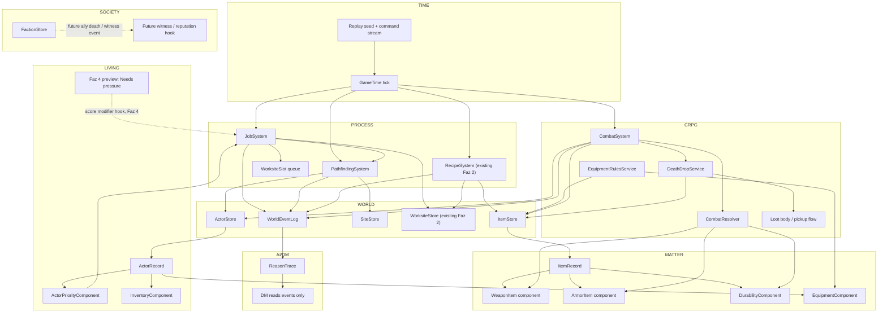
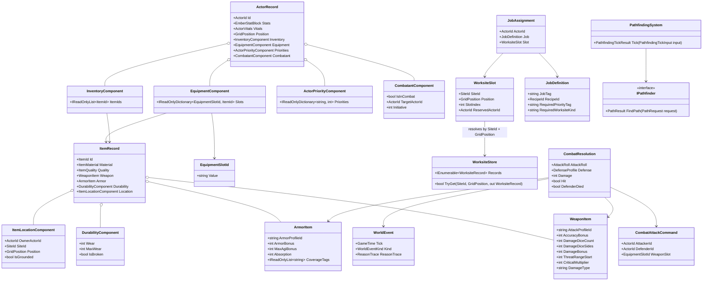
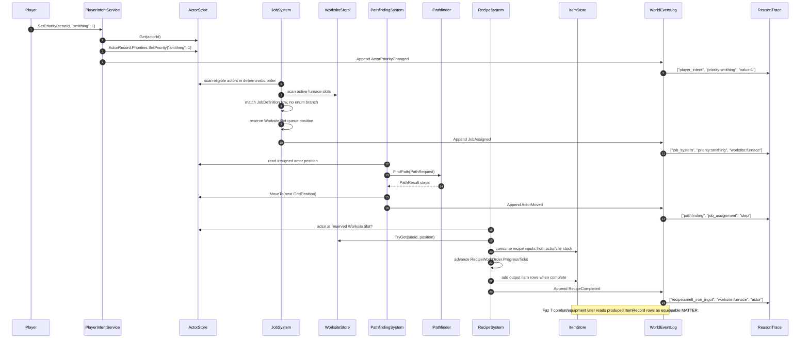

## 1. Sistem haritası (Mermaid graph TB)



## 2. Veri modeli (Mermaid classDiagram)



`WeaponItem` ve `ArmorItem`, `ItemRecord` alt sınıfı değildir. Roadmap’teki “extend” burada composition anlamına gelir: `ItemRecord` üstünde opsiyonel MATTER component satırları.

## 3. Tick akışı (Mermaid sequenceDiagram)



## 4. C# scaffold — DOSYA YOLU + İMZA (gövde YOK)

### `Assets/Scripts/Domain/Inventory/EquipmentSlotId.cs`

```csharp
using System;

namespace EmberCrpg.Domain.Inventory
{
    /// <summary>
    /// Data-driven equipment slot key. New slots arrive as data rows, not as enum-driven combat branches.
    /// </summary>
    public readonly record struct EquipmentSlotId
    {
        /// <summary>Creates a normalized slot id such as "weapon_main", "armor_body", or "shield".</summary>
        public EquipmentSlotId(string value);

        /// <summary>Canonical slot key used by equipment state and item definitions.</summary>
        public string Value { get; }

        /// <summary>True when the slot is the empty sentinel.</summary>
        public bool IsEmpty { get; }

        /// <summary>Creates a slot id from the legacy Sprint 4 slot enum during migration.</summary>
        public static EquipmentSlotId FromLegacy(EquipmentSlot slot);

        /// <summary>Returns the canonical slot key.</summary>
        public override string ToString();
    }
}
```

### `Assets/Scripts/Domain/Inventory/WeaponItem.cs`

```csharp
using System.Collections.Generic;

namespace EmberCrpg.Domain.Inventory
{
    /// <summary>
    /// MATTER component for weapon-capable item records. It is attached to ItemRecord by composition.
    /// </summary>
    public sealed class WeaponItem
    {
        /// <summary>Creates a weapon component from a data row.</summary>
        public WeaponItem(
            string attackProfileId,
            int accuracyBonus,
            int damageDiceCount,
            int damageDiceSides,
            int damageBonus,
            int threatRangeStart,
            int criticalMultiplier,
            string damageType,
            IEnumerable<string> onHitEffectIds);

        private readonly string[] _onHitEffectIds;

        /// <summary>Data row id used by combat math to select formulas without branching on item class.</summary>
        public string AttackProfileId { get; }

        /// <summary>Flat attack roll bonus supplied by this weapon.</summary>
        public int AccuracyBonus { get; }

        /// <summary>Number of deterministic damage dice rolled on hit.</summary>
        public int DamageDiceCount { get; }

        /// <summary>Sides per deterministic damage die.</summary>
        public int DamageDiceSides { get; }

        /// <summary>Flat damage bonus added after dice.</summary>
        public int DamageBonus { get; }

        /// <summary>Lowest natural d20 value that threatens a critical hit.</summary>
        public int ThreatRangeStart { get; }

        /// <summary>Damage multiplier used on confirmed critical hits.</summary>
        public int CriticalMultiplier { get; }

        /// <summary>Damage type key such as "slashing", "piercing", or "bludgeoning".</summary>
        public string DamageType { get; }

        /// <summary>Effect definition ids applied on hit by the Effect System in later phases.</summary>
        public IReadOnlyList<string> OnHitEffectIds { get; }
    }
}
```

### `Assets/Scripts/Domain/Inventory/ArmorItem.cs`

```csharp
using System.Collections.Generic;

namespace EmberCrpg.Domain.Inventory
{
    /// <summary>
    /// MATTER component for armor-capable item records. Coverage and protection are data row fields.
    /// </summary>
    public sealed class ArmorItem
    {
        /// <summary>Creates an armor component from a data row.</summary>
        public ArmorItem(
            string armorProfileId,
            int armorBonus,
            int maxAgiBonus,
            int absorption,
            IEnumerable<string> coverageTags);

        private readonly string[] _coverageTags;

        /// <summary>Data row id used by defense math and durability rules.</summary>
        public string ArmorProfileId { get; }

        /// <summary>Armor class bonus contributed while equipped and not broken.</summary>
        public int ArmorBonus { get; }

        /// <summary>Maximum AGI-derived defense bonus allowed by this armor.</summary>
        public int MaxAgiBonus { get; }

        /// <summary>Flat damage absorption before wounds or health damage are applied.</summary>
        public int Absorption { get; }

        /// <summary>Body coverage keys protected by this armor row.</summary>
        public IReadOnlyList<string> CoverageTags { get; }
    }
}
```

### `Assets/Scripts/Domain/Inventory/DurabilityComponent.cs`

```csharp
namespace EmberCrpg.Domain.Inventory
{
    /// <summary>
    /// Runtime wear state for weapons and armor. Combat systems replace this component after wear changes.
    /// </summary>
    public sealed class DurabilityComponent
    {
        /// <summary>Creates a durability state with current wear and maximum wear.</summary>
        public DurabilityComponent(int wear, int maxWear);

        /// <summary>Current accumulated wear, clamped between 0 and MaxWear.</summary>
        public int Wear { get; }

        /// <summary>Wear threshold at which the item becomes broken.</summary>
        public int MaxWear { get; }

        /// <summary>True when combat bonuses should be reduced or ignored by rules data.</summary>
        public bool IsBroken { get; }

        /// <summary>Returns a new durability component with additional deterministic wear applied.</summary>
        public DurabilityComponent AddWear(int amount);
    }
}
```

### `Assets/Scripts/Domain/Inventory/ItemLocationComponent.cs`

```csharp
using EmberCrpg.Domain.Actors;
using EmberCrpg.Domain.Core;

namespace EmberCrpg.Domain.Inventory
{
    /// <summary>
    /// Location component for item ownership and ground drops. It lets death drops mutate item location without SliceWorldState fields.
    /// </summary>
    public sealed class ItemLocationComponent
    {
        /// <summary>Creates an item location for carried, equipped, or ground items.</summary>
        public ItemLocationComponent(ActorId ownerActorId, SiteId siteId, GridPosition position, string containerTag);

        /// <summary>Actor currently owning the item, or empty when the item is on the ground.</summary>
        public ActorId OwnerActorId { get; }

        /// <summary>Site containing the item when grounded or carried.</summary>
        public SiteId SiteId { get; }

        /// <summary>Grid position for grounded items or last known owner position.</summary>
        public GridPosition Position { get; }

        /// <summary>Data key such as "inventory", "equipment", "ground", or "corpse".</summary>
        public string ContainerTag { get; }

        /// <summary>True when the item can be discovered by world pickup or loot flows.</summary>
        public bool IsGrounded { get; }
    }
}
```

### `Assets/Scripts/Domain/Inventory/InventoryComponent.cs`

```csharp
using System.Collections.Generic;
using EmberCrpg.Domain.Core;

namespace EmberCrpg.Domain.Inventory
{
    /// <summary>
    /// Actor component containing item ids owned by an actor. ItemRecord remains canonical in ItemStore.
    /// </summary>
    public sealed class InventoryComponent
    {
        /// <summary>Creates an inventory component from stable item ids.</summary>
        public InventoryComponent(IEnumerable<ItemId> itemIds);

        private readonly List<ItemId> _itemIds;

        /// <summary>Deterministic item id order used for replay and loot drops.</summary>
        public IReadOnlyList<ItemId> ItemIds { get; }

        /// <summary>Returns true when the actor owns the item id.</summary>
        public bool Contains(ItemId itemId);

        /// <summary>Adds an item id if it is not already present.</summary>
        public bool TryAdd(ItemId itemId);

        /// <summary>Removes an item id from actor ownership.</summary>
        public bool TryRemove(ItemId itemId);
    }
}
```

### `Assets/Scripts/Domain/Inventory/EquipmentComponent.cs`

```csharp
using System.Collections.Generic;
using EmberCrpg.Domain.Core;

namespace EmberCrpg.Domain.Inventory
{
    /// <summary>
    /// Actor equipment component keyed by data-driven slots. Equipped items are still ItemStore records.
    /// </summary>
    public sealed class EquipmentComponent
    {
        /// <summary>Creates an empty equipment component.</summary>
        public EquipmentComponent();

        /// <summary>Creates equipment component state from deterministic slot rows.</summary>
        public EquipmentComponent(IEnumerable<KeyValuePair<EquipmentSlotId, ItemId>> slots);

        private readonly Dictionary<EquipmentSlotId, ItemId> _slots;

        /// <summary>Read-only snapshot of equipped item ids by slot key.</summary>
        public IReadOnlyDictionary<EquipmentSlotId, ItemId> Slots { get; }

        /// <summary>Returns the equipped item id for a slot, or ItemId.Empty when none is equipped.</summary>
        public ItemId GetEquippedItemId(EquipmentSlotId slot);

        /// <summary>True when the item id appears in any equipment slot.</summary>
        public bool IsEquipped(ItemId itemId);

        /// <summary>Equips an item id into a data-driven slot.</summary>
        public void Equip(EquipmentSlotId slot, ItemId itemId);

        /// <summary>Clears a data-driven slot.</summary>
        public void Unequip(EquipmentSlotId slot);
    }
}
```

### `Assets/Scripts/Domain/Actors/ActorPriorityComponent.cs`

```csharp
using System.Collections.Generic;

namespace EmberCrpg.Domain.Actors
{
    /// <summary>
    /// LIVING component for player or AI work priorities. Job tags are data keys such as "smithing".
    /// </summary>
    public sealed class ActorPriorityComponent
    {
        /// <summary>Creates an empty priority component.</summary>
        public ActorPriorityComponent();

        /// <summary>Creates priority state from deterministic job priority rows.</summary>
        public ActorPriorityComponent(IEnumerable<KeyValuePair<string, int>> priorities);

        private readonly Dictionary<string, int> _priorities;

        /// <summary>Read-only job priority map, lower number means higher priority.</summary>
        public IReadOnlyDictionary<string, int> Priorities { get; }

        /// <summary>Sets a priority value for a job tag.</summary>
        public void SetPriority(string jobTag, int priority);

        /// <summary>Gets a priority value, or int.MaxValue when the actor has no interest in the job.</summary>
        public int GetPriority(string jobTag);

        /// <summary>Clears a single job priority.</summary>
        public bool ClearPriority(string jobTag);
    }
}
```

### `Assets/Scripts/Domain/Actors/CombatantComponent.cs`

```csharp
using EmberCrpg.Domain.Core;

namespace EmberCrpg.Domain.Actors
{
    /// <summary>
    /// CRPG component for actor combat participation. It stores encounter state, not combat formulas.
    /// </summary>
    public sealed class CombatantComponent
    {
        /// <summary>Creates combat participation state for an actor.</summary>
        public CombatantComponent(bool isInCombat, ActorId targetActorId, int initiative);

        /// <summary>True while the actor is in an active combat context.</summary>
        public bool IsInCombat { get; }

        /// <summary>Current combat target, or ActorId.Empty when no target is selected.</summary>
        public ActorId TargetActorId { get; }

        /// <summary>Deterministic initiative order value for turn or tick ordering.</summary>
        public int Initiative { get; }
    }
}
```

### `Assets/Scripts/Domain/Actors/ActorRecord.cs` update

```csharp
using System.Collections.Generic;
using EmberCrpg.Domain.Core;
using EmberCrpg.Domain.Inventory;

namespace EmberCrpg.Domain.Actors
{
    /// <summary>Pure actor record used by slice simulation and save/load mapping.</summary>
    public sealed class ActorRecord
    {
        private readonly List<string> _topicIds;
        private readonly List<string> _askedTopicIds;

        /// <summary>Existing constructor kept for migration compatibility.</summary>
        public ActorRecord(
            ActorId id,
            string name,
            ActorRole role,
            EmberStatBlock stats,
            ActorVitals vitals,
            GridPosition position,
            int accuracy,
            int dodge,
            int armor,
            int baseDamage,
            IEnumerable<string> topicIds = null);

        /// <summary>Faz 7 constructor adding component-based inventory, equipment, priorities, and combat state.</summary>
        public ActorRecord(
            ActorId id,
            string name,
            ActorRole role,
            EmberStatBlock stats,
            ActorVitals vitals,
            GridPosition position,
            int accuracy,
            int dodge,
            int armor,
            int baseDamage,
            InventoryComponent inventory,
            EquipmentComponent equipment,
            ActorPriorityComponent priorities,
            CombatantComponent combatant,
            IEnumerable<string> topicIds = null);

        /// <summary>Actor-owned item ids. Item data lives in ItemStore.</summary>
        public InventoryComponent Inventory { get; }

        /// <summary>Actor equipment slots. Equipped item data lives in ItemStore.</summary>
        public EquipmentComponent Equipment { get; }

        /// <summary>Actor job priorities used by JobSystem.</summary>
        public ActorPriorityComponent Priorities { get; }

        /// <summary>Actor combat participation state used by CombatSystem.</summary>
        public CombatantComponent Combatant { get; }
    }
}
```

### `Assets/Scripts/Domain/Inventory/ItemRecord.cs` update

```csharp
using System.Collections.Generic;
using EmberCrpg.Domain.Core;

namespace EmberCrpg.Domain.Inventory
{
    /// <summary>Pure record describing an item registry entry by id, material, quality, components, and location.</summary>
    public sealed class ItemRecord
    {
        private readonly string[] _tags;

        /// <summary>Existing constructor kept for migration compatibility.</summary>
        public ItemRecord(ItemId id, ItemMaterial material, ItemQuality quality, EquipmentSlot slot);

        /// <summary>Faz 7 constructor adding component-based weapon, armor, durability, location, and tags.</summary>
        public ItemRecord(
            ItemId id,
            ItemMaterial material,
            ItemQuality quality,
            EquipmentSlot slot,
            WeaponItem weapon,
            ArmorItem armor,
            DurabilityComponent durability,
            ItemLocationComponent location,
            IEnumerable<string> tags = null);

        /// <summary>Weapon component, or null when this item is not weapon-capable.</summary>
        public WeaponItem Weapon { get; }

        /// <summary>Armor component, or null when this item is not armor-capable.</summary>
        public ArmorItem Armor { get; }

        /// <summary>Durability component for wear and breakage.</summary>
        public DurabilityComponent Durability { get; }

        /// <summary>Ownership or ground placement component.</summary>
        public ItemLocationComponent Location { get; }

        /// <summary>Data tags used by recipes, loot filters, equipment rules, and UI.</summary>
        public IReadOnlyList<string> Tags { get; }

        /// <summary>True when the item has a weapon component.</summary>
        public bool HasWeapon { get; }

        /// <summary>True when the item has an armor component.</summary>
        public bool HasArmor { get; }

        /// <summary>Returns an equivalent item record with replacement durability.</summary>
        public ItemRecord WithDurability(DurabilityComponent durability);

        /// <summary>Returns an equivalent item record with replacement location.</summary>
        public ItemRecord WithLocation(ItemLocationComponent location);

        /// <summary>Returns true when the item carries the exact data tag.</summary>
        public bool HasTag(string tag);
    }
}
```

### `Assets/Scripts/Simulation/Inventory/EquipmentRulesService.cs`

```csharp
using EmberCrpg.Domain.Actors;
using EmberCrpg.Domain.Core;
using EmberCrpg.Domain.Inventory;
using EmberCrpg.Domain.World;

namespace EmberCrpg.Simulation.Inventory
{
    /// <summary>
    /// Pure equipment validation and mutation service. It checks data rows and never reaches Unity.
    /// </summary>
    public sealed class EquipmentRulesService
    {
        /// <summary>Creates equipment rules service.</summary>
        public EquipmentRulesService();

        /// <summary>Checks whether an actor can equip an item into the requested slot.</summary>
        public EquipmentValidationResult CanEquip(ActorRecord actor, ItemRecord item, EquipmentSlotId slot);

        /// <summary>Equips an owned item and appends a deterministic world event on success.</summary>
        public EquipmentActionResult TryEquip(
            ActorRecord actor,
            ItemStore itemStore,
            ItemId itemId,
            EquipmentSlotId slot,
            WorldEventLog eventLog,
            GameTime tick);

        /// <summary>Unequips an item from a slot and appends a deterministic world event on success.</summary>
        public EquipmentActionResult TryUnequip(
            ActorRecord actor,
            EquipmentSlotId slot,
            WorldEventLog eventLog,
            GameTime tick);
    }

    /// <summary>Validation result for equipment actions.</summary>
    public sealed class EquipmentValidationResult
    {
        /// <summary>Creates a validation result with optional failure reason.</summary>
        public EquipmentValidationResult(bool success, string reason);

        /// <summary>True when the action is legal.</summary>
        public bool Success { get; }

        /// <summary>Stable reason key for UI and tests.</summary>
        public string Reason { get; }
    }
}
```

### `Assets/Scripts/Simulation/Combat/CombatResolutionTypes.cs`

```csharp
using EmberCrpg.Domain.Core;
using EmberCrpg.Domain.Inventory;

namespace EmberCrpg.Simulation.Combat
{
    /// <summary>Player or AI request to resolve one equipment-backed attack.</summary>
    public sealed class CombatAttackCommand
    {
        /// <summary>Creates an attack command.</summary>
        public CombatAttackCommand(ActorId attackerId, ActorId defenderId, EquipmentSlotId weaponSlot);

        /// <summary>Actor performing the attack.</summary>
        public ActorId AttackerId { get; }

        /// <summary>Actor receiving the attack.</summary>
        public ActorId DefenderId { get; }

        /// <summary>Equipment slot used to select the weapon item.</summary>
        public EquipmentSlotId WeaponSlot { get; }
    }

    /// <summary>Breakdown of a deterministic d20 attack roll.</summary>
    public sealed class AttackRoll
    {
        /// <summary>Creates attack roll breakdown.</summary>
        public AttackRoll(int naturalRoll, int accuracyBonus, int statBonus, int equipmentBonus, int total);

        /// <summary>Raw d20 value from IDeterministicRng.</summary>
        public int NaturalRoll { get; }

        /// <summary>Actor accuracy contribution.</summary>
        public int AccuracyBonus { get; }

        /// <summary>Canonical Ember stat contribution, usually MIG or AGI by data profile.</summary>
        public int StatBonus { get; }

        /// <summary>Weapon or effect contribution.</summary>
        public int EquipmentBonus { get; }

        /// <summary>Total attack value after all components.</summary>
        public int Total { get; }
    }

    /// <summary>Breakdown of defender protection from stats, armor, and active defense.</summary>
    public sealed class DefenseProfile
    {
        /// <summary>Creates defense profile breakdown.</summary>
        public DefenseProfile(int baseDefense, int agiBonus, int armorBonus, int shieldBonus, int total);

        /// <summary>Base defense target value.</summary>
        public int BaseDefense { get; }

        /// <summary>AGI contribution after armor max limits.</summary>
        public int AgiBonus { get; }

        /// <summary>Armor contribution from equipped armor rows.</summary>
        public int ArmorBonus { get; }

        /// <summary>Shield contribution from equipped shield rows.</summary>
        public int ShieldBonus { get; }

        /// <summary>Total defense target value.</summary>
        public int Total { get; }
    }

    /// <summary>Full result of one attack resolution.</summary>
    public sealed class CombatResolution
    {
        /// <summary>Creates combat resolution result.</summary>
        public CombatResolution(
            AttackRoll attackRoll,
            DefenseProfile defense,
            bool hit,
            bool critical,
            int rawDamage,
            int mitigatedDamage,
            bool defenderDied,
            ItemId weaponItemId,
            ItemId armorItemId);

        /// <summary>Attack roll details.</summary>
        public AttackRoll AttackRoll { get; }

        /// <summary>Defense profile details.</summary>
        public DefenseProfile Defense { get; }

        /// <summary>True when the attack connects.</summary>
        public bool Hit { get; }

        /// <summary>True when a critical hit is confirmed.</summary>
        public bool Critical { get; }

        /// <summary>Damage before armor absorption.</summary>
        public int RawDamage { get; }

        /// <summary>Damage after armor absorption.</summary>
        public int MitigatedDamage { get; }

        /// <summary>True when defender death occurs during this attack.</summary>
        public bool DefenderDied { get; }

        /// <summary>Weapon item used for durability wear.</summary>
        public ItemId WeaponItemId { get; }

        /// <summary>Armor item used for protection and durability wear.</summary>
        public ItemId ArmorItemId { get; }
    }
}
```

### `Assets/Scripts/Simulation/Combat/CombatResolver.cs`

```csharp
using EmberCrpg.Domain.Actors;
using EmberCrpg.Domain.Inventory;
using EmberCrpg.Simulation.Rng;

namespace EmberCrpg.Simulation.Combat
{
    /// <summary>
    /// Pure combat math. It computes hit, damage, armor protection, and criticals from actor and equipment data.
    /// </summary>
    public sealed class CombatResolver
    {
        /// <summary>Creates combat resolver.</summary>
        public CombatResolver();

        /// <summary>Computes the attack roll using actor stats, weapon data, and deterministic RNG.</summary>
        public AttackRoll ComputeAttackRoll(ActorRecord attacker, ItemRecord weapon, IDeterministicRng rng);

        /// <summary>Computes defense from actor stats and equipped armor rows.</summary>
        public DefenseProfile ComputeDefense(ActorRecord defender, ItemRecord armor, ItemRecord shield);

        /// <summary>Resolves one attack without mutating stores.</summary>
        public CombatResolution Resolve(
            ActorRecord attacker,
            ActorRecord defender,
            ItemRecord weapon,
            ItemRecord armor,
            ItemRecord shield,
            IDeterministicRng rng);
    }
}
```

### `Assets/Scripts/Simulation/Combat/EquipmentWearService.cs`

```csharp
using EmberCrpg.Domain.Inventory;

namespace EmberCrpg.Simulation.Combat
{
    /// <summary>
    /// Applies deterministic weapon and armor wear after combat interactions.
    /// </summary>
    public sealed class EquipmentWearService
    {
        /// <summary>Creates equipment wear service.</summary>
        public EquipmentWearService();

        /// <summary>Computes weapon wear from an attack result and weapon data.</summary>
        public int ComputeWeaponWear(CombatResolution resolution, ItemRecord weapon);

        /// <summary>Computes armor wear from absorbed or mitigated damage.</summary>
        public int ComputeArmorWear(CombatResolution resolution, ItemRecord armor);

        /// <summary>Returns a replacement item record with applied wear.</summary>
        public ItemRecord ApplyWear(ItemRecord item, int wearAmount);
    }
}
```

### `Assets/Scripts/Simulation/Combat/DeathDropService.cs`

```csharp
using System.Collections.Generic;
using EmberCrpg.Domain.Actors;
using EmberCrpg.Domain.Core;
using EmberCrpg.Domain.Inventory;
using EmberCrpg.Domain.World;

namespace EmberCrpg.Simulation.Combat
{
    /// <summary>
    /// Moves a dead actor's inventory and equipment back into world item locations.
    /// </summary>
    public sealed class DeathDropService
    {
        /// <summary>Creates death drop service.</summary>
        public DeathDropService();

        /// <summary>Drops all carried and equipped items at the actor position and emits deterministic events.</summary>
        public IReadOnlyList<ItemId> DropInventory(
            ActorRecord deadActor,
            ItemStore itemStore,
            WorldEventLog eventLog,
            GameTime tick);
    }
}
```

### `Assets/Scripts/Simulation/Combat/CombatSystem.cs`

```csharp
using EmberCrpg.Domain.Core;
using EmberCrpg.Domain.World;
using EmberCrpg.Simulation.Rng;

namespace EmberCrpg.Simulation.Combat
{
    /// <summary>
    /// Store-integrated combat system for Faz 7. It reads equipment, mutates vitals and durability, emits events, and handles death drops.
    /// </summary>
    public sealed class CombatSystem
    {
        private readonly CombatResolver _resolver;
        private readonly EquipmentWearService _wear;
        private readonly DeathDropService _deathDrops;

        /// <summary>Creates combat system from pure services.</summary>
        public CombatSystem(CombatResolver resolver, EquipmentWearService wear, DeathDropService deathDrops);

        /// <summary>Resolves one attack command through ActorStore, ItemStore, deterministic RNG, and WorldEventLog.</summary>
        public CombatSystemTickResult ResolveAttack(
            CombatAttackCommand command,
            ActorStore actorStore,
            ItemStore itemStore,
            WorldEventLog eventLog,
            IDeterministicRng rng,
            GameTime tick);
    }

    /// <summary>Result of a store-integrated combat tick.</summary>
    public sealed class CombatSystemTickResult
    {
        /// <summary>Creates combat tick result.</summary>
        public CombatSystemTickResult(CombatResolution resolution, bool weaponBroke, bool armorBroke, bool deathDropsCreated);

        /// <summary>Pure combat math result.</summary>
        public CombatResolution Resolution { get; }

        /// <summary>True when weapon durability crossed the break threshold.</summary>
        public bool WeaponBroke { get; }

        /// <summary>True when armor durability crossed the break threshold.</summary>
        public bool ArmorBroke { get; }

        /// <summary>True when defender inventory was dropped into the world.</summary>
        public bool DeathDropsCreated { get; }
    }
}
```

### `Assets/Scripts/Domain/Process/WorksiteSlot.cs`

```csharp
using EmberCrpg.Domain.Actors;
using EmberCrpg.Domain.Core;

namespace EmberCrpg.Domain.Process
{
    /// <summary>
    /// Queueable worksite slot referencing an existing WorksiteStore entry by site and grid position.
    /// </summary>
    public sealed class WorksiteSlot
    {
        /// <summary>Creates a worksite slot row.</summary>
        public WorksiteSlot(SiteId siteId, GridPosition position, int slotIndex, ActorId reservedActorId);

        /// <summary>Site containing the existing WorksiteRecord.</summary>
        public SiteId SiteId { get; }

        /// <summary>Grid position of the existing WorksiteRecord.</summary>
        public GridPosition Position { get; }

        /// <summary>Data-driven slot index for parallel or queued work at a worksite.</summary>
        public int SlotIndex { get; }

        /// <summary>Actor currently reserved for the slot, or ActorId.Empty.</summary>
        public ActorId ReservedActorId { get; }

        /// <summary>Resolves this slot against WorksiteStore without storing a direct reference.</summary>
        public bool TryResolve(WorksiteStore store, out WorksiteRecord worksite);
    }
}
```

### `Assets/Scripts/Domain/Process/JobDefinition.cs`

```csharp
using EmberCrpg.Domain.Core;

namespace EmberCrpg.Domain.Process
{
    /// <summary>
    /// Data row describing a job the JobSystem can assign. New jobs are rows, not switch branches.
    /// </summary>
    public sealed class JobDefinition
    {
        /// <summary>Creates a job definition row.</summary>
        public JobDefinition(string jobTag, string requiredPriorityTag, string requiredWorksiteKind, RecipeId recipeId);

        /// <summary>Stable job key such as "smelt_iron_ingot".</summary>
        public string JobTag { get; }

        /// <summary>Actor priority key needed for eligibility, such as "smithing".</summary>
        public string RequiredPriorityTag { get; }

        /// <summary>Worksite kind key required by this job, such as "Furnace".</summary>
        public string RequiredWorksiteKind { get; }

        /// <summary>Recipe executed by this job, when it reaches the worksite.</summary>
        public RecipeId RecipeId { get; }
    }
}
```

### `Assets/Scripts/Domain/Process/JobAssignment.cs`

```csharp
using EmberCrpg.Domain.Core;

namespace EmberCrpg.Domain.Process
{
    /// <summary>
    /// Runtime assignment connecting one actor, one job row, and one worksite slot.
    /// </summary>
    public sealed class JobAssignment
    {
        /// <summary>Creates a deterministic job assignment.</summary>
        public JobAssignment(ActorId actorId, JobDefinition job, WorksiteSlot slot);

        /// <summary>Actor assigned to the job.</summary>
        public ActorId ActorId { get; }

        /// <summary>Job definition row chosen by scoring.</summary>
        public JobDefinition Job { get; }

        /// <summary>Reserved worksite slot for this actor.</summary>
        public WorksiteSlot Slot { get; }
    }
}
```

### `Assets/Scripts/Simulation/Process/JobSystem.cs`

```csharp
using System.Collections.Generic;
using EmberCrpg.Domain.Core;
using EmberCrpg.Domain.Process;
using EmberCrpg.Domain.World;

namespace EmberCrpg.Simulation.Process
{
    /// <summary>
    /// Pure assignment system that scans actor priorities, matches data-driven jobs, and reserves worksites.
    /// </summary>
    public sealed class JobSystem
    {
        private readonly List<JobAssignment> _assignments;

        /// <summary>Creates job system with no active assignments.</summary>
        public JobSystem();

        /// <summary>Active assignments in deterministic insertion order.</summary>
        public IReadOnlyList<JobAssignment> Assignments { get; }

        /// <summary>Scans eligible actors and assigns at most one new job per actor tick.</summary>
        public JobSystemTickResult Tick(
            ActorStore actorStore,
            WorksiteStore worksiteStore,
            IReadOnlyList<JobDefinition> jobDefinitions,
            WorldEventLog eventLog,
            GameTime tick);
    }

    /// <summary>Summary of assignments created by one JobSystem tick.</summary>
    public sealed class JobSystemTickResult
    {
        /// <summary>Creates job tick result.</summary>
        public JobSystemTickResult(IReadOnlyList<JobAssignment> createdAssignments);

        /// <summary>Assignments created this tick.</summary>
        public IReadOnlyList<JobAssignment> CreatedAssignments { get; }
    }
}
```

### `Assets/Scripts/Simulation/Movement/IPathfinder.cs`

```csharp
using System.Collections.Generic;
using EmberCrpg.Domain.Actors;
using EmberCrpg.Domain.Core;

namespace EmberCrpg.Simulation.Movement
{
    /// <summary>
    /// Interface-only pathfinder API for pure simulation. Implementations must be deterministic for identical inputs.
    /// </summary>
    public interface IPathfinder
    {
        /// <summary>Computes a deterministic path from start to goal inside one site.</summary>
        PathResult FindPath(PathRequest request);
    }

    /// <summary>Path request value passed to IPathfinder.</summary>
    public sealed class PathRequest
    {
        /// <summary>Creates a path request.</summary>
        public PathRequest(SiteId siteId, GridPosition start, GridPosition goal);

        /// <summary>Site containing the path.</summary>
        public SiteId SiteId { get; }

        /// <summary>Starting cell.</summary>
        public GridPosition Start { get; }

        /// <summary>Goal cell.</summary>
        public GridPosition Goal { get; }
    }

    /// <summary>Deterministic path result from IPathfinder.</summary>
    public sealed class PathResult
    {
        /// <summary>Creates a path result.</summary>
        public PathResult(bool success, IReadOnlyList<GridPosition> steps);

        /// <summary>True when a complete path exists.</summary>
        public bool Success { get; }

        /// <summary>Ordered cells from next step to goal.</summary>
        public IReadOnlyList<GridPosition> Steps { get; }
    }
}
```

### `Assets/Scripts/Simulation/Movement/PathfindingSystem.cs`

```csharp
using EmberCrpg.Domain.Core;
using EmberCrpg.Domain.Process;
using EmberCrpg.Domain.World;

namespace EmberCrpg.Simulation.Movement
{
    /// <summary>
    /// Moves assigned actors one deterministic step toward their reserved worksite slot.
    /// </summary>
    public sealed class PathfindingSystem
    {
        private readonly IPathfinder _pathfinder;

        /// <summary>Creates pathfinding system with an injected deterministic pathfinder.</summary>
        public PathfindingSystem(IPathfinder pathfinder);

        /// <summary>Advances one actor toward its job worksite and emits movement events.</summary>
        public PathfindingTickResult Tick(
            JobAssignment assignment,
            ActorStore actorStore,
            WorldEventLog eventLog,
            GameTime tick);
    }

    /// <summary>Result of one pathfinding tick.</summary>
    public sealed class PathfindingTickResult
    {
        /// <summary>Creates pathfinding tick result.</summary>
        public PathfindingTickResult(bool moved, bool arrived);

        /// <summary>True when actor position changed this tick.</summary>
        public bool Moved { get; }

        /// <summary>True when actor reached the reserved worksite slot.</summary>
        public bool Arrived { get; }
    }
}
```

### `Assets/Scripts/Simulation/Process/RecipeSystem.cs` update

```csharp
using System;
using EmberCrpg.Domain.Core;
using EmberCrpg.Domain.Inventory;
using EmberCrpg.Domain.Process;
using EmberCrpg.Domain.World;

namespace EmberCrpg.Simulation.Process
{
    /// <summary>Pure deterministic recipe execution for one active worksite and one inventory.</summary>
    public sealed class RecipeSystem
    {
        /// <summary>Starts recipe work from a job assignment when the actor has reached the reserved worksite slot.</summary>
        public bool TryStartAssigned(
            JobAssignment assignment,
            RecipeDef recipe,
            WorksiteStore worksites,
            ItemStore itemStore,
            Func<RecipeOutput, ItemRecord> createOutputRecord,
            out RecipeWorkOrder order);

        /// <summary>Advances assigned recipe work and emits WorldEvent plus ReasonTrace on completion.</summary>
        public bool TickAssigned(
            RecipeWorkOrder order,
            ItemStore itemStore,
            WorldEventLog eventLog,
            Func<RecipeOutput, ItemRecord> createOutputRecord);
    }
}
```

### Atom listesi

| Atom | Dosya / sınıf | Tag | Kısa açıklama | Görünürlük |
|---:|---|---|---|---|
| 1 | `docs/mechanics/faz-7-combat-equipment.md` | `[box=CRPG][box=MATTER]` | Bu atom map ve scaffold dokümanı. | Captain hızlanır |
| 2 | `EquipmentSlotId`, `WeaponItem`, `ArmorItem`, `DurabilityComponent` | `[box=MATTER]` | Equipment data modelini enum branch yerine component row yapar. | ItemStore okunabilir state |
| 3 | `ItemLocationComponent`, `ItemRecord` update | `[box=MATTER][box=WORLD]` | Item ownership, ground drop, durability ve weapon/armor composition ekler. | Store state görünür |
| 4 | `InventoryComponent`, `EquipmentComponent`, `ActorRecord` update | `[box=LIVING][box=MATTER]` | ActorRecord’a inventory/equipment component ekler. | ActorStore state görünür |
| 5 | `ActorPriorityComponent` | `[box=LIVING][box=PROCESS]` | Player intent ile actor job priority kurulur. | Debug HUD/event görünür |
| 6 | `EquipmentRulesService` | `[box=CRPG][box=MATTER]` | Equip/unequip validation, slot state, event emit. | Player can equip |
| 7 | `CombatResolutionTypes`, `CombatResolver` | `[box=CRPG]` | Pure hit, defense, damage, crit hesapları. | Test visible değil, sonraki atom consumer |
| 8 | `EquipmentWearService` | `[box=CRPG][box=MATTER]` | Weapon/armor wear ve break threshold. | ItemBroken event |
| 9 | `CombatSystem` | `[box=CRPG][box=MATTER]` | ActorStore + ItemStore + RNG + EventLog integration. | Combat event visible |
| 10 | `DeathDropService` | `[box=CRPG][box=MATTER][box=WORLD]` | Ölümde inventory/equipment world drop olur. | Loot body mümkün |
| 11 | `WorksiteSlot`, `JobDefinition`, `JobAssignment` | `[box=PROCESS][box=LIVING]` | Smithing queue ve worksite reservation modeli. | Assignment event |
| 12 | `JobSystem` | `[box=PROCESS][box=LIVING]` | Priority scan, job match, queue reservation. | JobAssigned event |
| 13 | `IPathfinder`, `PathfindingSystem` | `[box=PROCESS][box=WORLD]` | Interface-only path API ve deterministic stepping. | ActorMoved event |
| 14 | `RecipeSystem` assigned-work update | `[box=PROCESS][box=MATTER]` | Assignment üzerinden recipe progress ve output item rows. | RecipeCompleted event |
| 15 | `tests/.../SmithFurnaceDeterministicDayTests.cs` | `[box=PROCESS][box=MATTER][box=TIME]` | 2 smith, furnace queue, 4 ingot deterministic day. | Acceptance replay |
| 16 | `tests/.../SwordBanditLootReturnTests.cs` | `[box=CRPG][box=MATTER][box=WORLD]` | Sword equip, bandit fight, body loot, town return. | Roadmap acceptance |

## 5. Test stratejisi

| Test dosyası | Pin’lenen sınıf/davranış |
|---|---|
| `tests/EmberCrpg.Core.Tests/Inventory/WeaponArmorItemTests.cs` | `WeaponItem`, `ArmorItem`, `DurabilityComponent` constructor invariants ve data row alanları |
| `tests/EmberCrpg.Core.Tests/Inventory/ItemRecordComponentTests.cs` | `ItemRecord` weapon/armor/durability/location composition, inheritance yok |
| `tests/EmberCrpg.Core.Tests/Actors/ActorEquipmentComponentTests.cs` | `InventoryComponent`, `EquipmentComponent`, `ActorRecord` component wiring |
| `tests/EmberCrpg.Core.Tests/Inventory/EquipmentRulesServiceTests.cs` | equip/unequip validation, owned item şartı, slot occupancy, event reason trace |
| `tests/EmberCrpg.Core.Tests/Combat/CombatResolverTests.cs` | hit, miss, natural roll, armor defense, crit, damage, broken item penalty |
| `tests/EmberCrpg.Core.Tests/Combat/EquipmentWearServiceTests.cs` | weapon/armor wear, clamp, break threshold |
| `tests/EmberCrpg.Core.Tests/Combat/CombatSystemIntegrationTests.cs` | ActorStore + ItemStore + WorldEventLog integration |
| `tests/EmberCrpg.Core.Tests/Combat/DeathDropServiceTests.cs` | dead actor inventory and equipped items become grounded loot |
| `tests/EmberCrpg.Core.Tests/Process/JobSystemPriorityTests.cs` | priority scan, deterministic actor order, job row matching |
| `tests/EmberCrpg.Core.Tests/Movement/PathfindingSystemTests.cs` | injected `IPathfinder`, one-step movement, arrival detection |
| `tests/EmberCrpg.Core.Tests/Process/RecipeAssignedWorkTests.cs` | actor-at-worksite recipe start/progress/output |
| `tests/EmberCrpg.Core.Tests/Acceptance/SmithFurnaceDeterministicDayTests.cs` | 2 smith priority 1, furnace queue, 4 ingots in one deterministic day |
| `tests/EmberCrpg.Core.Tests/Acceptance/SwordBanditLootReturnTests.cs` | sword equip, fight bandit, loot body, return to town |
| `tests/EmberCrpg.Core.Tests/Replay/Faz7ReplayDeterminismTests.cs` | same seed + same commands = same stores + same WorldEvent sequence |

Deterministic pattern:

```csharp
using Xunit;
using EmberCrpg.Simulation.Rng;

public sealed class Faz7ReplayDeterminismTests
{
    [Fact]
    public void SameSeedAndCommands_ProduceSameEventTrace();

    private sealed class FixedSequenceRng : IDeterministicRng
    {
        public FixedSequenceRng(params int[] values);
        public int NextInt(int exclusiveMax);
        public int RollPercent();
    }
}
```

Acceptance çevirisi:

| Player sentence | Test setup | Assertion |
|---|---|---|
| `player can equip a sword` | Actor owns sword `ItemRecord` with `WeaponItem`; call `EquipmentRulesService.TryEquip` | equipment slot has sword id, `WorldEvent` has `item_equipped` reason |
| `fight a bandit in the woods` | Player and bandit in same `SiteId`; seed RNG; call `CombatSystem.ResolveAttack` until death | combat events deterministic, bandit vitals dead |
| `loot the body` | `DeathDropService` ran on death | bandit item locations are grounded/corpse and lootable |
| `return to town` | path or room movement command after loot | final actor site/position is town, event trace stable |

Replay determinism check: Her acceptance testi aynı command list ve seed ile iki ayrı world fixture kurar. Sonra `ActorStore` snapshot, `ItemStore` snapshot, `WorldEventLog` tuple listesi `(tick, kind, actorId, siteId, reason, trace causes)` byte-for-byte karşılaştırılır. RNG injection zorunlu: `CombatResolver`, `CombatSystem`, `JobSystem` tie-break gerektirirse `IDeterministicRng` alır.

## 6. Risk + acceptance

Smith/furnace acceptance testi:

| Adım | Beklenen davranış | Kapanan atom |
|---:|---|---|
| 1 | `ActorStore` içinde 2 smith actor, ikisinde `ActorPriorityComponent.SetPriority("smithing", 1)` | Atom 5 |
| 2 | `WorksiteStore` içinde active furnace, `WorksiteSlot` capacity row olarak 2 slot | Atom 11 |
| 3 | `ItemStore` içinde `8 iron_ore`, `4 fuel`; recipe row `SmeltIronIngot` = `2 ore + 1 fuel + 40 ticks -> 1 ingot` | Atom 14 |
| 4 | `JobSystem.Tick` iki smith’i deterministic order ile furnace queue’ya atar | Atom 12 |
| 5 | `PathfindingSystem.Tick` injected pathfinder ile iki smith’i furnace’a taşır | Atom 13 |
| 6 | `RecipeSystem.TickAssigned` iki paralel slotta 2 dalga çalıştırır | Atom 14 |
| 7 | Bir deterministic day = 80 active recipe tick veya data row’daki day budget; output toplam `4 iron_ingot` | Atom 15 |
| 8 | `WorldEventLog` içinde `JobAssigned`, `ActorMoved`, `RecipeCompleted x4`; `ReasonTrace` recipe/worksite/actor içerir | Atom 15 |

Risk matrisi:

| Atom | Risk | Neden | Mitigasyon |
|---:|---|---|---|
| 3 | Büyük | `ItemRecord` ve save mapper değişir; existing tests kırılabilir | Eski constructor korunur, yeni component constructor eklenir |
| 4 | Büyük | `ActorRecord` constructor genişler; factories ve save/load etkilenir | Backward-compatible constructor, default empty components |
| 9 | Büyük | Combat, item durability, vitals, event log aynı PR’da birleşir | Atom 7-8 pure servisleri önce pin’lenir |
| 10 | Orta | Loot için item location modeli gerekir | `ItemLocationComponent` önce gelir, SliceWorldState alanı eklenmez |
| 12 | Orta | Job scoring determinism tie-break hatası yaratabilir | ActorStore insertion order + priority + stable job row order |
| 13 | Orta | Pathfinder implementasyonu değişken olabilir | Sadece `IPathfinder` interface, testte fixed pathfinder |
| 14 | Orta | Existing `RecipeSystem` inventory-based; ItemStore assignment entegrasyonu refactor ister | `TryStartAssigned` yeni overload, eski API korunur |
| 2,5,7,8 | Basit | Saf data/pure math | xUnit invariant tests yeterli |
| 15,16 | Orta | Acceptance geniş yüzey tarar | Daha önceki atomlar event-visible olmalı |

Atom sırası data modelden başlar, çünkü Captain’in sonraki PR’larda branch açmadan combat, equipment ve job wiring yapabilmesi için ortak type sözleşmesi gerekir. Sonra actor/item store componentleri gelir. Pure servisler store-integrated sistemlerden önce gelir; acceptance atomları en sona kalır.

Faz 4 Colony needs hook’ları:

| Hook | Faz 7’de bırakılacak yüzey | Faz 4 kullanımı |
|---|---|---|
| Need pressure | `JobSystem.Tick` ileride opsiyonel `INeedPressureProvider` alabilir | Açlık/uyku job scoring’i etkiler |
| Work fatigue | `ReasonTrace` içinde `actor`, `job`, `duration_ticks` kalır | Needs sistemi çalışma yorgunluğunu okuyabilir |
| Combat exertion | `CombatSystem` event reasonları `combat_attack`, `damage_taken`, `actor_died` olur | Health, fear, stress, hunger drain bağlanır |
| Equipment comfort | `ArmorItem` data row `coverageTags`, `MaxAgiBonus`, future `comfortTag` için uygun | Ağır armor fatigue/heat ihtiyaçlarını etkiler |
| No direct LLM writes | AI/DM sadece `WorldEvent` + `ReasonTrace` okur | Needs narration world state’i yazmaz |

Not: Bu oturum read-only sandbox olduğu için `docs/mechanics/faz-7-combat-equipment.md` dosyası fiziksel olarak oluşturulmadı; içerik doğrudan hedef dosyaya konacak şekilde üretildi.
