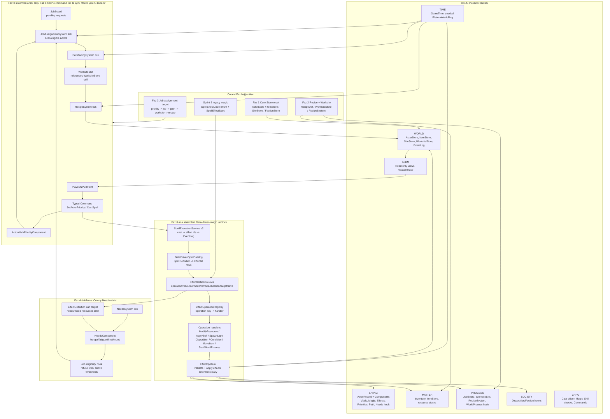
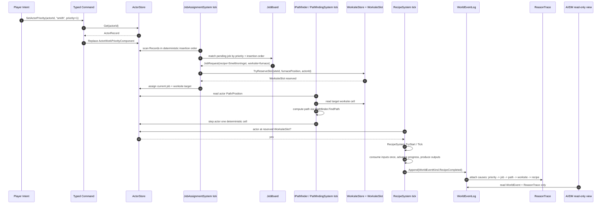

## 1. Sistem haritası (Mermaid graph TB)

> _Captain atom-map_: `docs/sprint-faz-8-atom-map.md` (Captain narrow vertical-slice decomposition).
> _Naming_: aligned with Captain types (JobRequest, ActorScheduleState, JobAssignmentSystem).
> _Spec covers full architecture; Captain may implement subset and extend later.



## 2. Veri modeli (Mermaid classDiagram)

```mermaid
classDiagram
    direction TB

    class EffectId {
        +string Value
        +bool IsEmpty
    }

    class EffectDefinition {
        +EffectId Id
        +string OperationKey
        +string ResourceKey
        +string ModeKey
        +MagnitudeFormula Magnitude
        +DurationRule Duration
        +TargetRule TargetRule
        +SaveRule SaveRule
        +IReadOnlyList~string~ Tags
    }

    class MagnitudeFormula {
        +string FormulaKey
        +int Constant
        +string StatKey
        +int ScaleNumerator
        +int ScaleDenominator
    }

    class DurationRule {
        +string ModeKey
        +int Ticks
    }

    class TargetRule {
        +string TargetKey
        +int RangeInTiles
        +int AreaRadiusInTiles
    }

    class SaveRule {
        +string SaveKey
        +int DifficultyClass
        +string SuccessModeKey
    }

    class EffectDefinitionCatalog {
        -Dictionary~EffectId,EffectDefinition~ _byId
        -List~EffectId~ _order
        +Add(EffectDefinition definition)
        +Get(EffectId id) EffectDefinition
        +TryGet(EffectId id, out EffectDefinition definition) bool
        +IEnumerable~EffectDefinition~ Definitions
    }

    class SpellDefinition {
        +string TemplateId
        +string DisplayName
        +string SchoolKey
        +string TargetKey
        +int ManaCost
        +int RangeInTiles
        +int CooldownTicks
        +IReadOnlyList~EffectId~ EffectIds
    }

    class IEffectOperation {
        <<interface>>
        +string OperationKey
        +Validate(EffectApplicationContext context) EffectApplicationResult
        +Apply(EffectApplicationContext context, IDeterministicRng rng) EffectApplicationResult
    }

    class EffectOperationRegistry {
        -Dictionary~string,IEffectOperation~ _operationsByKey
        +Register(IEffectOperation operation)
        +Get(string operationKey) IEffectOperation
        +TryGet(string operationKey, out IEffectOperation operation) bool
    }

    class EffectSystem {
        -EffectDefinitionCatalog _catalog
        -EffectOperationRegistry _operations
        -EffectFormulaEvaluator _formulaEvaluator
        +TryApply(EffectId effectId, EffectApplicationContext context, IDeterministicRng rng) EffectApplicationResult
        +TryApplyAll(IReadOnlyList~EffectId~ effectIds, EffectApplicationContext context, IDeterministicRng rng) IReadOnlyList~EffectApplicationResult~
    }

    class ActorRecord {
        +ActorId Id
        +ActorVitals Vitals
        +EmberStatBlock Stats
        +ActorMagicComponent Magic
        +ActorEffectQueueComponent Effects
        +ActorConditionComponent Conditions
        +ActorDispositionComponent Disposition
        +ActorWorkPriorityComponent WorkPriorities
        +ActorPathComponent Path
        +ActorNeedsComponent Needs
    }

    class ActorMagicComponent {
        -List~string~ _knownSpellIds
        +IReadOnlyList~string~ KnownSpellIds
        +SpellCooldownState Cooldowns
    }

    class ActorEffectQueueComponent {
        -List~EffectInstance~ _instances
        +IReadOnlyList~EffectInstance~ Instances
    }

    class ActorWorkPriorityComponent {
        -List~ActorWorkPriorityRow~ _priorities
        +IReadOnlyList~ActorWorkPriorityRow~ Priorities
    }

    class ActorPathComponent {
        -List~GridPosition~ _remainingSteps
        +GridPosition Destination
        +bool HasPath
    }

    class ActorNeedsComponent {
        +int Hunger
        +int Fatigue
        +int Thirst
        +int Mood
    }

    class WorksiteSlot {
        +SiteId SiteId
        +GridPosition WorksitePosition
        +int SlotIndex
        +ActorId OccupantActorId
        +bool IsOccupied
    }

    class WorksiteStore {
        +TryGet(SiteId siteId, GridPosition position, out WorksiteRecord record) bool
        +IEnumerable~WorksiteRecord~ Records
    }

    class IPathfinder {
        <<interface>>
        +FindPath(SiteId siteId, GridPosition from, GridPosition to, ActorId actorId) PathResult
    }

    class PathResult {
        +bool Success
        +IReadOnlyList~GridPosition~ Steps
        +string FailureReason
    }

    EffectDefinition --> EffectId
    EffectDefinition --> MagnitudeFormula
    EffectDefinition --> DurationRule
    EffectDefinition --> TargetRule
    EffectDefinition --> SaveRule
    EffectDefinitionCatalog --> EffectDefinition
    SpellDefinition --> EffectId
    EffectSystem --> EffectDefinitionCatalog
    EffectSystem --> EffectOperationRegistry
    EffectOperationRegistry --> IEffectOperation
    ActorRecord *-- ActorMagicComponent
    ActorRecord *-- ActorEffectQueueComponent
    ActorRecord *-- ActorConditionComponent
    ActorRecord *-- ActorDispositionComponent
    ActorRecord *-- ActorWorkPriorityComponent
    ActorRecord *-- ActorPathComponent
    ActorRecord *-- ActorNeedsComponent
    WorksiteSlot --> WorksiteStore : references existing site+cell
    IPathfinder --> PathResult
```



## 3. Tick akışı (Mermaid sequenceDiagram)



## 4. C# scaffold — DOSYA YOLU + İMZA (gövde YOK)

Aşağıdaki bloklar signature-only scaffold’tur. Gövde yazılmayacak; Captain implement ederken aynı imzaları compile edilebilir hale getirecek. Domain/Simulation içinde `using UnityEngine` yoktur. Yeni davranışlar enum branch ile değil `string` key + data row + registry lookup ile çalışır.

### Magic domain data

**Assets/Scripts/Domain/Magic/EffectId.cs**

```csharp
using System;

namespace EmberCrpg.Domain.Magic
{
    /// <summary>Stable data id for one effect definition row. Empty ids are invalid for runtime lookup.</summary>
    public readonly struct EffectId : IEquatable<EffectId>
    {
        private readonly string _value;

        /// <summary>Creates an effect id from a stable data key.</summary>
        public EffectId(string value);

        /// <summary>Raw stable id value used by data catalogs and save data.</summary>
        public string Value { get; }

        /// <summary>True when this id cannot identify a real effect row.</summary>
        public bool IsEmpty { get; }

        /// <summary>Returns true when both ids carry the same stable value.</summary>
        public bool Equals(EffectId other);

        /// <summary>Returns true when the object is an effect id with the same stable value.</summary>
        public override bool Equals(object obj);

        /// <summary>Returns a deterministic hash from the stable id value.</summary>
        public override int GetHashCode();

        /// <summary>Returns a compact debug label for logs and failing tests.</summary>
        public override string ToString();

        /// <summary>Returns true when both ids carry the same stable value.</summary>
        public static bool operator ==(EffectId left, EffectId right);

        /// <summary>Returns true when ids carry different stable values.</summary>
        public static bool operator !=(EffectId left, EffectId right);
    }
}
```

**Assets/Scripts/Domain/Magic/EffectDefinition.cs**

```csharp
using System.Collections.Generic;

namespace EmberCrpg.Domain.Magic
{
    /// <summary>Data row describing one runtime effect without C# branches per spell. Operation, resource, mode, target, save, and formula are keys resolved by systems.</summary>
    public sealed class EffectDefinition
    {
        private readonly string[] _tags;

        /// <summary>Creates an immutable effect definition row.</summary>
        public EffectDefinition(
            EffectId id,
            string operationKey,
            string resourceKey,
            string modeKey,
            MagnitudeFormula magnitude,
            DurationRule duration,
            TargetRule targetRule,
            SaveRule saveRule,
            IEnumerable<string> tags);

        /// <summary>Stable effect id used by spell rows and runtime instances.</summary>
        public EffectId Id { get; }

        /// <summary>Registry key for the operation handler, for example modify_resource.</summary>
        public string OperationKey { get; }

        /// <summary>Data key for the resource being modified, for example health, mana, fatigue, mood.</summary>
        public string ResourceKey { get; }

        /// <summary>Data key for operation mode, for example damage, restore, apply, move, start.</summary>
        public string ModeKey { get; }

        /// <summary>Data-only magnitude formula evaluated by the simulation layer.</summary>
        public MagnitudeFormula Magnitude { get; }

        /// <summary>Duration rule for instant, timed, permanent, or while-equipped effects.</summary>
        public DurationRule Duration { get; }

        /// <summary>Targeting rule used after command target validation.</summary>
        public TargetRule TargetRule { get; }

        /// <summary>Optional save or resistance rule. A none key means no save.</summary>
        public SaveRule SaveRule { get; }

        /// <summary>Stable tags used for dispel, filtering, UI, and future AI queries.</summary>
        public IReadOnlyList<string> Tags { get; }
    }
}
```

**Assets/Scripts/Domain/Magic/MagnitudeFormula.cs**

```csharp
namespace EmberCrpg.Domain.Magic
{
    /// <summary>Data-only formula descriptor. Simulation evaluates it with actor stats and seeded RNG.</summary>
    public sealed class MagnitudeFormula
    {
        /// <summary>Creates a formula row such as fixed, skill_scaled, stat_scaled, or dice.</summary>
        public MagnitudeFormula(string formulaKey, int constant, string statKey, int scaleNumerator, int scaleDenominator);

        /// <summary>Formula resolver key; not an enum and not a switch target in spell code.</summary>
        public string FormulaKey { get; }

        /// <summary>Base constant used by fixed and scaled formulas.</summary>
        public int Constant { get; }

        /// <summary>Optional actor stat key used by stat-scaled formulas.</summary>
        public string StatKey { get; }

        /// <summary>Integer numerator for deterministic scaling.</summary>
        public int ScaleNumerator { get; }

        /// <summary>Integer denominator for deterministic scaling.</summary>
        public int ScaleDenominator { get; }
    }
}
```

**Assets/Scripts/Domain/Magic/DurationRule.cs**

```csharp
namespace EmberCrpg.Domain.Magic
{
    /// <summary>Data-only duration descriptor for instant and timed effects. Runtime state lives in EffectInstance.</summary>
    public sealed class DurationRule
    {
        /// <summary>Creates a duration rule by data key and tick count.</summary>
        public DurationRule(string modeKey, int ticks);

        /// <summary>Duration mode key such as instant, timed, permanent, or while_equipped.</summary>
        public string ModeKey { get; }

        /// <summary>Deterministic tick count; zero is valid for instant effects.</summary>
        public int Ticks { get; }
    }
}
```

**Assets/Scripts/Domain/Magic/TargetRule.cs**

```csharp
namespace EmberCrpg.Domain.Magic
{
    /// <summary>Data-only targeting rule attached to an effect. Command validation owns line-of-sight and range checks.</summary>
    public sealed class TargetRule
    {
        /// <summary>Creates a target rule for self, touch, ranged, area, item, or worksite targets.</summary>
        public TargetRule(string targetKey, int rangeInTiles, int areaRadiusInTiles);

        /// <summary>Target key resolved by target validation without enum branching.</summary>
        public string TargetKey { get; }

        /// <summary>Maximum deterministic tile range; zero means not applicable for this target key.</summary>
        public int RangeInTiles { get; }

        /// <summary>Area radius in tiles; zero means single-target or self.</summary>
        public int AreaRadiusInTiles { get; }
    }
}
```

**Assets/Scripts/Domain/Magic/SaveRule.cs**

```csharp
namespace EmberCrpg.Domain.Magic
{
    /// <summary>Data-only saving throw or resistance rule. A none key means the effect applies without a save.</summary>
    public sealed class SaveRule
    {
        /// <summary>Creates a save rule with a save key, difficulty class, and success behavior key.</summary>
        public SaveRule(string saveKey, int difficultyClass, string successModeKey);

        /// <summary>Save key such as none, fortitude, reflex, will, or magic_resistance.</summary>
        public string SaveKey { get; }

        /// <summary>Deterministic target number for save resolution.</summary>
        public int DifficultyClass { get; }

        /// <summary>Success behavior key such as negate, half, or block_all.</summary>
        public string SuccessModeKey { get; }
    }
}
```

**Assets/Scripts/Domain/Magic/EffectDefinitionCatalog.cs**

```csharp
using System.Collections.Generic;

namespace EmberCrpg.Domain.Magic
{
    /// <summary>Deterministic in-memory catalog of EffectDefinition rows. Enumeration preserves insertion order for replay stability.</summary>
    public sealed class EffectDefinitionCatalog
    {
        private readonly Dictionary<EffectId, EffectDefinition> _byId;
        private readonly List<EffectId> _order;

        /// <summary>Creates an empty catalog.</summary>
        public EffectDefinitionCatalog();

        /// <summary>Number of registered effect rows.</summary>
        public int Count { get; }

        /// <summary>Definitions in deterministic insertion order.</summary>
        public IEnumerable<EffectDefinition> Definitions { get; }

        /// <summary>Adds one definition row and rejects duplicate or empty ids.</summary>
        public void Add(EffectDefinition definition);

        /// <summary>Returns the definition for an id or throws if it is missing.</summary>
        public EffectDefinition Get(EffectId id);

        /// <summary>Tries to return the definition for an id without throwing.</summary>
        public bool TryGet(EffectId id, out EffectDefinition definition);
    }
}
```

### Actor components added to `ActorRecord`

**Assets/Scripts/Domain/Actors/ActorMagicComponent.cs**

```csharp
using System.Collections.Generic;
using EmberCrpg.Domain.Magic;

namespace EmberCrpg.Domain.Actors
{
    /// <summary>Actor-local CRPG magic state. Known spells and cooldowns are state; effect behavior remains in systems.</summary>
    public sealed class ActorMagicComponent
    {
        private readonly List<string> _knownSpellIds;

        /// <summary>Creates actor magic state from known spell ids and cooldown state.</summary>
        public ActorMagicComponent(IEnumerable<string> knownSpellIds, SpellCooldownState cooldowns);

        /// <summary>Known spell template ids in deterministic insertion order.</summary>
        public IReadOnlyList<string> KnownSpellIds { get; }

        /// <summary>Per-spell cooldown state reused from the existing magic rail.</summary>
        public SpellCooldownState Cooldowns { get; }

        /// <summary>Returns true when the actor knows a spell template id.</summary>
        public bool Knows(string spellTemplateId);
    }
}
```

**Assets/Scripts/Domain/Actors/ActorEffectQueueComponent.cs**

```csharp
using System.Collections.Generic;
using EmberCrpg.Domain.Core;
using EmberCrpg.Domain.Magic;

namespace EmberCrpg.Domain.Actors
{
    /// <summary>Actor-local active effect queue. It stores runtime instances; operation handlers own mutation semantics.</summary>
    public sealed class ActorEffectQueueComponent
    {
        private readonly List<EffectInstance> _instances;

        /// <summary>Creates an empty or restored effect queue component.</summary>
        public ActorEffectQueueComponent(IEnumerable<EffectInstance> instances = null);

        /// <summary>Active effect instances in deterministic insertion order.</summary>
        public IReadOnlyList<EffectInstance> Instances { get; }

        /// <summary>Adds or refreshes an instance according to stacking keys owned by the effect row.</summary>
        public void AddOrRefresh(EffectInstance instance);

        /// <summary>Removes one runtime instance by id and returns whether it existed.</summary>
        public bool Remove(string instanceId);

        /// <summary>Returns active instances matching one effect definition id.</summary>
        public IEnumerable<EffectInstance> FindByEffectId(EffectId effectId);
    }

    /// <summary>Runtime state for one applied effect on one actor. It is serializable and deterministic.</summary>
    public sealed class EffectInstance
    {
        /// <summary>Creates an active effect instance.</summary>
        public EffectInstance(
            string instanceId,
            EffectId effectId,
            ActorId sourceActorId,
            ActorId targetActorId,
            int ticksRemaining,
            int stacks,
            bool saved,
            long appliedTick);

        /// <summary>Stable runtime instance id for save/load and dispel operations.</summary>
        public string InstanceId { get; }

        /// <summary>Definition row id backing this instance.</summary>
        public EffectId EffectId { get; }

        /// <summary>Actor that caused the effect, if any.</summary>
        public ActorId SourceActorId { get; }

        /// <summary>Actor carrying this effect.</summary>
        public ActorId TargetActorId { get; }

        /// <summary>Remaining deterministic ticks; negative values are not used.</summary>
        public int TicksRemaining { get; }

        /// <summary>Current stack count for the row/source rule.</summary>
        public int Stacks { get; }

        /// <summary>True when the target passed a save and the success mode allows a reduced effect.</summary>
        public bool Saved { get; }

        /// <summary>World tick when the instance was applied.</summary>
        public long AppliedTick { get; }

        /// <summary>Returns an equivalent instance with a new remaining duration.</summary>
        public EffectInstance WithTicksRemaining(int ticksRemaining);
    }
}
```

**Assets/Scripts/Domain/Actors/ActorConditionComponent.cs**

```csharp
using System.Collections.Generic;

namespace EmberCrpg.Domain.Actors
{
    /// <summary>Actor-local condition flags derived from active effects. The flags are string keys so new conditions ship as data.</summary>
    public sealed class ActorConditionComponent
    {
        private readonly HashSet<string> _conditionKeys;

        /// <summary>Creates condition state from existing condition keys.</summary>
        public ActorConditionComponent(IEnumerable<string> conditionKeys = null);

        /// <summary>Active condition keys.</summary>
        public IReadOnlyCollection<string> ConditionKeys { get; }

        /// <summary>Returns true when the condition key is currently active.</summary>
        public bool Has(string conditionKey);

        /// <summary>Adds a condition key from an ApplyCondition operation.</summary>
        public void Add(string conditionKey);

        /// <summary>Removes a condition key when all contributing effects expire.</summary>
        public bool Remove(string conditionKey);
    }
}
```

**Assets/Scripts/Domain/Actors/ActorDispositionComponent.cs**

```csharp
using System.Collections.Generic;
using EmberCrpg.Domain.Core;

namespace EmberCrpg.Domain.Actors
{
    /// <summary>Actor-local opinion table keyed by another actor. Faz 9 can promote this into richer memory/faction reputation.</summary>
    public sealed class ActorDispositionComponent
    {
        private readonly Dictionary<ActorId, int> _dispositionByActor;

        /// <summary>Creates an empty or restored disposition component.</summary>
        public ActorDispositionComponent(IDictionary<ActorId, int> dispositionByActor = null);

        /// <summary>Gets disposition toward another actor, returning zero when absent.</summary>
        public int Get(ActorId otherActorId);

        /// <summary>Sets disposition toward another actor with deterministic clamping.</summary>
        public void Set(ActorId otherActorId, int value);

        /// <summary>Applies a signed delta and returns the new value.</summary>
        public int Modify(ActorId otherActorId, int delta);
    }
}
```

**Assets/Scripts/Domain/Actors/ActorWorkPriorityComponent.cs**

```csharp
using System.Collections.Generic;

namespace EmberCrpg.Domain.Actors
{
    /// <summary>Actor-local PROCESS preference rows. Lower numeric priority wins; disabled rows are explicit data.</summary>
    public sealed class ActorWorkPriorityComponent
    {
        private readonly List<ActorWorkPriorityRow> _priorities;

        /// <summary>Creates a priority component from deterministic rows.</summary>
        public ActorWorkPriorityComponent(IEnumerable<ActorWorkPriorityRow> priorities = null);

        /// <summary>Priority rows in deterministic insertion order.</summary>
        public IReadOnlyList<ActorWorkPriorityRow> Priorities { get; }

        /// <summary>Replaces all priorities with normalized rows.</summary>
        public void Replace(IEnumerable<ActorWorkPriorityRow> priorities);

        /// <summary>Tries to find an enabled priority for a job key.</summary>
        public bool TryGetPriority(string jobKey, out int priority);
    }

    /// <summary>One data row linking an actor to a job key and priority. Job keys are strings, not enums.</summary>
    public readonly struct ActorWorkPriorityRow
    {
        /// <summary>Creates one actor priority row.</summary>
        public ActorWorkPriorityRow(string jobKey, int priority, bool enabled);

        /// <summary>Data key for the job family, for example smith.</summary>
        public string JobKey { get; }

        /// <summary>Lower value wins among enabled rows.</summary>
        public int Priority { get; }

        /// <summary>False means the actor explicitly refuses this job key.</summary>
        public bool Enabled { get; }
    }
}
```

**Assets/Scripts/Domain/Actors/ActorPathComponent.cs**

```csharp
using System.Collections.Generic;

namespace EmberCrpg.Domain.Actors
{
    /// <summary>Actor-local deterministic path state. Pathfinding computes paths; this component only stores remaining steps.</summary>
    public sealed class ActorPathComponent
    {
        private readonly List<GridPosition> _remainingSteps;

        /// <summary>Creates path state from a destination and remaining steps.</summary>
        public ActorPathComponent(GridPosition destination, IEnumerable<GridPosition> remainingSteps = null);

        /// <summary>Current destination cell.</summary>
        public GridPosition Destination { get; }

        /// <summary>Remaining deterministic steps to destination.</summary>
        public IReadOnlyList<GridPosition> RemainingSteps { get; }

        /// <summary>True when the actor still has a path to follow.</summary>
        public bool HasPath { get; }

        /// <summary>Returns the next step without mutating the path.</summary>
        public bool TryPeekNext(out GridPosition position);

        /// <summary>Consumes and returns the next step.</summary>
        public bool TryPopNext(out GridPosition position);
    }
}
```

**Assets/Scripts/Domain/Actors/ActorNeedsComponent.cs**

```csharp
namespace EmberCrpg.Domain.Actors
{
    /// <summary>Faz 4 hook for hunger, thirst, fatigue, and mood. Faz 8 only exposes effect/resource integration points.</summary>
    public sealed class ActorNeedsComponent
    {
        /// <summary>Creates need state with deterministic scalar values.</summary>
        public ActorNeedsComponent(int hunger, int thirst, int fatigue, int mood);

        /// <summary>Hunger pressure from 0 to 100.</summary>
        public int Hunger { get; }

        /// <summary>Thirst pressure from 0 to 100.</summary>
        public int Thirst { get; }

        /// <summary>Fatigue pressure from 0 to 100, separate from vital fatigue pool.</summary>
        public int Fatigue { get; }

        /// <summary>Mood scalar derived later from needs and memory.</summary>
        public int Mood { get; }

        /// <summary>Returns equivalent state with a changed named resource key.</summary>
        public ActorNeedsComponent WithResource(string resourceKey, int value);
    }
}
```

**Assets/Scripts/Domain/Actors/ActorRecord.cs**

```csharp
using EmberCrpg.Domain.Magic;

namespace EmberCrpg.Domain.Actors
{
    /// <summary>Existing pure actor record extended by composition components. Systems own all behavior.</summary>
    public sealed class ActorRecord
    {
        private ActorMagicComponent _magic;
        private ActorEffectQueueComponent _effects;
        private ActorConditionComponent _conditions;
        private ActorDispositionComponent _disposition;
        private ActorWorkPriorityComponent _workPriorities;
        private ActorPathComponent _path;
        private ActorNeedsComponent _needs;

        /// <summary>Actor-local magic state.</summary>
        public ActorMagicComponent Magic { get; }

        /// <summary>Actor-local active effect queue.</summary>
        public ActorEffectQueueComponent Effects { get; }

        /// <summary>Actor-local condition key state.</summary>
        public ActorConditionComponent Conditions { get; }

        /// <summary>Actor-local disposition table.</summary>
        public ActorDispositionComponent Disposition { get; }

        /// <summary>Actor-local work priorities used by job matching.</summary>
        public ActorWorkPriorityComponent WorkPriorities { get; }

        /// <summary>Actor-local path-following state.</summary>
        public ActorPathComponent Path { get; }

        /// <summary>Faz 4 needs hook exposed to effects and job eligibility.</summary>
        public ActorNeedsComponent Needs { get; }

        /// <summary>Replaces actor magic state without changing identity.</summary>
        public void ApplyMagic(ActorMagicComponent magic);

        /// <summary>Replaces actor effect queue state without changing identity.</summary>
        public void ApplyEffects(ActorEffectQueueComponent effects);

        /// <summary>Replaces actor work priorities without changing identity.</summary>
        public void ApplyWorkPriorities(ActorWorkPriorityComponent priorities);

        /// <summary>Replaces actor path state without changing identity.</summary>
        public void ApplyPath(ActorPathComponent path);

        /// <summary>Replaces Faz 4 need hook state without changing identity.</summary>
        public void ApplyNeeds(ActorNeedsComponent needs);
    }
}
```

### Magic simulation API

**Assets/Scripts/Simulation/Magic/EffectApplicationContext.cs**

```csharp
using EmberCrpg.Domain.Actors;
using EmberCrpg.Domain.Core;
using EmberCrpg.Domain.Inventory;
using EmberCrpg.Domain.Magic;
using EmberCrpg.Domain.Process;
using EmberCrpg.Domain.World;

namespace EmberCrpg.Simulation.Magic
{
    /// <summary>Runtime context for applying one effect. It carries stores explicitly so operations do not reach global state.</summary>
    public sealed class EffectApplicationContext
    {
        /// <summary>Creates effect application context for a caster, target, current tick, and required stores.</summary>
        public EffectApplicationContext(
            EffectDefinition effect,
            ActorRecord caster,
            ActorRecord target,
            ActorStore actors,
            ItemStore items,
            WorksiteStore worksites,
            InventoryState inventory,
            WorldEventLog eventLog,
            GameTime currentTime,
            string sourceSpellId);

        /// <summary>Effect row being applied.</summary>
        public EffectDefinition Effect { get; }

        /// <summary>Actor causing the effect.</summary>
        public ActorRecord Caster { get; }

        /// <summary>Actor receiving the effect when the target is an actor.</summary>
        public ActorRecord Target { get; }

        /// <summary>Actor store for operations that need actor lookup.</summary>
        public ActorStore Actors { get; }

        /// <summary>Item store for item-moving operations.</summary>
        public ItemStore Items { get; }

        /// <summary>Existing worksite store for worksite and process operations.</summary>
        public WorksiteStore Worksites { get; }

        /// <summary>Inventory state affected by item/resource operations.</summary>
        public InventoryState Inventory { get; }

        /// <summary>Append-only event log written by successful visible effects.</summary>
        public WorldEventLog EventLog { get; }

        /// <summary>Authoritative deterministic world time.</summary>
        public GameTime CurrentTime { get; }

        /// <summary>Optional source spell template id for traces and save data.</summary>
        public string SourceSpellId { get; }
    }
}
```

**Assets/Scripts/Simulation/Magic/EffectApplicationResult.cs**

```csharp
using EmberCrpg.Domain.Core;
using EmberCrpg.Domain.Magic;
using EmberCrpg.Domain.World;

namespace EmberCrpg.Simulation.Magic
{
    /// <summary>Deterministic result of validating or applying one effect. Error codes are strings to avoid enum growth.</summary>
    public sealed class EffectApplicationResult
    {
        private readonly string[] _eventReasons;

        /// <summary>Creates a result snapshot for one effect application.</summary>
        public EffectApplicationResult(
            bool success,
            string errorCode,
            EffectId effectId,
            ActorId targetActorId,
            int magnitude,
            string message,
            ReasonTrace reasonTrace);

        /// <summary>True when the effect applied and any mutation has already happened.</summary>
        public bool Success { get; }

        /// <summary>Stable string error code; empty when successful.</summary>
        public string ErrorCode { get; }

        /// <summary>Effect row id represented by this result.</summary>
        public EffectId EffectId { get; }

        /// <summary>Actor target affected by this result, if any.</summary>
        public ActorId TargetActorId { get; }

        /// <summary>Resolved deterministic magnitude after formulas and saves.</summary>
        public int Magnitude { get; }

        /// <summary>Short deterministic message suitable for logs and tests.</summary>
        public string Message { get; }

        /// <summary>Causal trace written alongside visible world events.</summary>
        public ReasonTrace ReasonTrace { get; }

        /// <summary>Creates a successful result.</summary>
        public static EffectApplicationResult Ok(EffectId effectId, ActorId targetActorId, int magnitude, string message, ReasonTrace reasonTrace);

        /// <summary>Creates a failed result without mutating the world.</summary>
        public static EffectApplicationResult Fail(string errorCode, EffectId effectId, ActorId targetActorId, string message, ReasonTrace reasonTrace);
    }
}
```

**Assets/Scripts/Simulation/Magic/IEffectOperation.cs**

```csharp
using EmberCrpg.Simulation.Rng;

namespace EmberCrpg.Simulation.Magic
{
    /// <summary>Operation handler for one effect operation key. New spell rows reuse handlers; C# changes only for new operation families.</summary>
    public interface IEffectOperation
    {
        /// <summary>Data key that selects this handler from EffectOperationRegistry.</summary>
        string OperationKey { get; }

        /// <summary>Validates that the current context can apply the effect without mutating state.</summary>
        EffectApplicationResult Validate(EffectApplicationContext context);

        /// <summary>Applies the effect deterministically using the injected seeded RNG.</summary>
        EffectApplicationResult Apply(EffectApplicationContext context, IDeterministicRng rng);
    }
}
```

**Assets/Scripts/Simulation/Magic/EffectOperationRegistry.cs**

```csharp
using System.Collections.Generic;

namespace EmberCrpg.Simulation.Magic
{
    /// <summary>Deterministic registry mapping operation keys to handlers. It replaces SpellEffectCode branching.</summary>
    public sealed class EffectOperationRegistry
    {
        private readonly Dictionary<string, IEffectOperation> _operationsByKey;

        /// <summary>Creates an empty operation registry.</summary>
        public EffectOperationRegistry();

        /// <summary>Registers one operation handler by key.</summary>
        public void Register(IEffectOperation operation);

        /// <summary>Returns a registered operation or throws when missing.</summary>
        public IEffectOperation Get(string operationKey);

        /// <summary>Tries to return a registered operation without throwing.</summary>
        public bool TryGet(string operationKey, out IEffectOperation operation);
    }
}
```

**Assets/Scripts/Simulation/Magic/EffectSystem.cs**

```csharp
using System.Collections.Generic;
using EmberCrpg.Domain.Magic;
using EmberCrpg.Simulation.Rng;

namespace EmberCrpg.Simulation.Magic
{
    /// <summary>Authoritative data-driven effect applicator. It resolves rows, formulas, operation handlers, saves, events, and traces.</summary>
    public sealed class EffectSystem
    {
        private readonly EffectDefinitionCatalog _catalog;
        private readonly EffectOperationRegistry _operations;
        private readonly EffectFormulaEvaluator _formulaEvaluator;
        private readonly SaveRuleResolver _saveRuleResolver;

        /// <summary>Creates an effect system from explicit catalogs and services.</summary>
        public EffectSystem(
            EffectDefinitionCatalog catalog,
            EffectOperationRegistry operations,
            EffectFormulaEvaluator formulaEvaluator,
            SaveRuleResolver saveRuleResolver);

        /// <summary>Applies one effect id against the supplied context.</summary>
        public EffectApplicationResult TryApply(EffectId effectId, EffectApplicationContext context, IDeterministicRng rng);

        /// <summary>Applies a deterministic ordered list of effect ids.</summary>
        public IReadOnlyList<EffectApplicationResult> TryApplyAll(IReadOnlyList<EffectId> effectIds, EffectApplicationContext context, IDeterministicRng rng);
    }
}
```

**Assets/Scripts/Simulation/Magic/EffectFormulaEvaluator.cs**

```csharp
using EmberCrpg.Domain.Magic;
using EmberCrpg.Simulation.Rng;

namespace EmberCrpg.Simulation.Magic
{
    /// <summary>Evaluates data formula rows with deterministic integer math and seeded RNG.</summary>
    public sealed class EffectFormulaEvaluator
    {
        /// <summary>Creates a formula evaluator.</summary>
        public EffectFormulaEvaluator();

        /// <summary>Evaluates a magnitude formula for the current effect application.</summary>
        public int Evaluate(MagnitudeFormula formula, EffectApplicationContext context, IDeterministicRng rng);
    }
}
```

**Assets/Scripts/Simulation/Magic/SaveRuleResolver.cs**

```csharp
using EmberCrpg.Domain.Magic;
using EmberCrpg.Simulation.Rng;

namespace EmberCrpg.Simulation.Magic
{
    /// <summary>Resolves save and resistance rules deterministically. Natural roll semantics are pinned in xUnit tests.</summary>
    public sealed class SaveRuleResolver
    {
        /// <summary>Creates a save resolver.</summary>
        public SaveRuleResolver();

        /// <summary>Returns the save result for a rule and context using the injected RNG.</summary>
        public SaveRuleResult Resolve(SaveRule saveRule, EffectApplicationContext context, IDeterministicRng rng);
    }

    /// <summary>Result of one save or resistance roll. Success behavior remains data-driven through SuccessModeKey.</summary>
    public sealed class SaveRuleResult
    {
        /// <summary>Creates a save result snapshot.</summary>
        public SaveRuleResult(bool attempted, bool succeeded, int roll, string successModeKey);

        /// <summary>True when the rule required a roll.</summary>
        public bool Attempted { get; }

        /// <summary>True when the target succeeded at the save or resistance check.</summary>
        public bool Succeeded { get; }

        /// <summary>Raw deterministic roll used by the check.</summary>
        public int Roll { get; }

        /// <summary>Data key describing what success does.</summary>
        public string SuccessModeKey { get; }
    }
}
```

### Operation handlers

**Assets/Scripts/Simulation/Magic/Operations/ModifyResourceOperation.cs**

```csharp
using EmberCrpg.Simulation.Rng;

namespace EmberCrpg.Simulation.Magic.Operations
{
    /// <summary>Modifies actor resources such as health, mana, fatigue, hunger, thirst, and mood through data keys.</summary>
    public sealed class ModifyResourceOperation : IEffectOperation
    {
        private readonly EffectFormulaEvaluator _formulaEvaluator;

        /// <summary>Creates a resource modification operation.</summary>
        public ModifyResourceOperation(EffectFormulaEvaluator formulaEvaluator);

        /// <summary>Operation key: modify_resource.</summary>
        public string OperationKey { get; }

        /// <summary>Validates target actor and resource key.</summary>
        public EffectApplicationResult Validate(EffectApplicationContext context);

        /// <summary>Applies deterministic damage, restore, drain, or set modes to the keyed resource.</summary>
        public EffectApplicationResult Apply(EffectApplicationContext context, IDeterministicRng rng);
    }
}
```

**Assets/Scripts/Simulation/Magic/Operations/ApplyBuffOperation.cs**

```csharp
using EmberCrpg.Simulation.Rng;

namespace EmberCrpg.Simulation.Magic.Operations
{
    /// <summary>Applies timed actor effects such as shield absorption by creating EffectInstance rows.</summary>
    public sealed class ApplyBuffOperation : IEffectOperation
    {
        private readonly EffectFormulaEvaluator _formulaEvaluator;

        /// <summary>Creates a buff operation.</summary>
        public ApplyBuffOperation(EffectFormulaEvaluator formulaEvaluator);

        /// <summary>Operation key: apply_buff.</summary>
        public string OperationKey { get; }

        /// <summary>Validates target actor and duration rule.</summary>
        public EffectApplicationResult Validate(EffectApplicationContext context);

        /// <summary>Adds or refreshes a runtime effect instance on the target actor.</summary>
        public EffectApplicationResult Apply(EffectApplicationContext context, IDeterministicRng rng);
    }
}
```

**Assets/Scripts/Simulation/Magic/Operations/SpawnLightOperation.cs**

```csharp
using EmberCrpg.Simulation.Rng;

namespace EmberCrpg.Simulation.Magic.Operations
{
    /// <summary>Spawns deterministic light component requests without presentation dependencies.</summary>
    public sealed class SpawnLightOperation : IEffectOperation
    {
        private readonly EffectFormulaEvaluator _formulaEvaluator;

        /// <summary>Creates a light spawn operation.</summary>
        public SpawnLightOperation(EffectFormulaEvaluator formulaEvaluator);

        /// <summary>Operation key: spawn_light.</summary>
        public string OperationKey { get; }

        /// <summary>Validates target position and duration rule.</summary>
        public EffectApplicationResult Validate(EffectApplicationContext context);

        /// <summary>Appends a world event and creates the pure light component request.</summary>
        public EffectApplicationResult Apply(EffectApplicationContext context, IDeterministicRng rng);
    }
}
```

**Assets/Scripts/Simulation/Magic/Operations/ModifyDispositionOperation.cs**

```csharp
using EmberCrpg.Simulation.Rng;

namespace EmberCrpg.Simulation.Magic.Operations
{
    /// <summary>Modifies actor-to-actor disposition through ActorDispositionComponent. Faz 9 can later read the same state for memory and reputation.</summary>
    public sealed class ModifyDispositionOperation : IEffectOperation
    {
        private readonly EffectFormulaEvaluator _formulaEvaluator;

        /// <summary>Creates a disposition operation.</summary>
        public ModifyDispositionOperation(EffectFormulaEvaluator formulaEvaluator);

        /// <summary>Operation key: modify_disposition.</summary>
        public string OperationKey { get; }

        /// <summary>Validates source actor, target actor, and magnitude formula.</summary>
        public EffectApplicationResult Validate(EffectApplicationContext context);

        /// <summary>Applies a signed deterministic disposition delta.</summary>
        public EffectApplicationResult Apply(EffectApplicationContext context, IDeterministicRng rng);
    }
}
```

**Assets/Scripts/Simulation/Magic/Operations/ApplyConditionOperation.cs**

```csharp
using EmberCrpg.Simulation.Rng;

namespace EmberCrpg.Simulation.Magic.Operations
{
    /// <summary>Applies condition keys such as stunned, invisible, frightened, or paralyzed through data rows.</summary>
    public sealed class ApplyConditionOperation : IEffectOperation
    {
        /// <summary>Creates a condition operation.</summary>
        public ApplyConditionOperation();

        /// <summary>Operation key: apply_condition.</summary>
        public string OperationKey { get; }

        /// <summary>Validates target actor and condition resource key.</summary>
        public EffectApplicationResult Validate(EffectApplicationContext context);

        /// <summary>Adds the condition key to the target actor and records the active effect instance when timed.</summary>
        public EffectApplicationResult Apply(EffectApplicationContext context, IDeterministicRng rng);
    }
}
```

**Assets/Scripts/Simulation/Magic/Operations/MoveItemOperation.cs**

```csharp
using EmberCrpg.Simulation.Rng;

namespace EmberCrpg.Simulation.Magic.Operations
{
    /// <summary>Moves or consumes item rows through ItemStore and InventoryState. It is used for telekinesis, translocation, and material components.</summary>
    public sealed class MoveItemOperation : IEffectOperation
    {
        /// <summary>Creates an item movement operation.</summary>
        public MoveItemOperation();

        /// <summary>Operation key: move_item.</summary>
        public string OperationKey { get; }

        /// <summary>Validates item source, destination, and inventory capacity.</summary>
        public EffectApplicationResult Validate(EffectApplicationContext context);

        /// <summary>Applies deterministic item movement without direct Unity object access.</summary>
        public EffectApplicationResult Apply(EffectApplicationContext context, IDeterministicRng rng);
    }
}
```

**Assets/Scripts/Simulation/Magic/Operations/StartWorldProcessOperation.cs**

```csharp
using EmberCrpg.Simulation.Rng;

namespace EmberCrpg.Simulation.Magic.Operations
{
    /// <summary>Starts a recipe or future world process from data. It connects magic to PROCESS without adding spell-specific branches.</summary>
    public sealed class StartWorldProcessOperation : IEffectOperation
    {
        /// <summary>Creates a world process start operation.</summary>
        public StartWorldProcessOperation();

        /// <summary>Operation key: start_world_process.</summary>
        public string OperationKey { get; }

        /// <summary>Validates worksite, recipe/process key, and actor eligibility.</summary>
        public EffectApplicationResult Validate(EffectApplicationContext context);

        /// <summary>Starts the referenced process and emits a deterministic world event.</summary>
        public EffectApplicationResult Apply(EffectApplicationContext context, IDeterministicRng rng);
    }
}
```

### Data-driven spell rail

**Assets/Scripts/Domain/Magic/SpellDefinition.cs**

```csharp
using System.Collections.Generic;

namespace EmberCrpg.Domain.Magic
{
    /// <summary>Existing spell definition promoted to reference effect ids instead of SpellEffectCode rows. Legacy constructors remain only as migration adapters until tests move row-by-row.</summary>
    public sealed class SpellDefinition
    {
        private readonly EffectId[] _effectIds;

        /// <summary>Creates a data-driven spell definition from effect ids.</summary>
        public SpellDefinition(
            string templateId,
            string displayName,
            string schoolKey,
            string targetKey,
            int manaCost,
            int rangeInTiles,
            int cooldownTicks,
            IEnumerable<EffectId> effectIds);

        /// <summary>Stable spell template id.</summary>
        public string TemplateId { get; }

        /// <summary>Player-facing deterministic label.</summary>
        public string DisplayName { get; }

        /// <summary>School key as data, not an enum branch.</summary>
        public string SchoolKey { get; }

        /// <summary>Target key as data, not an enum branch.</summary>
        public string TargetKey { get; }

        /// <summary>Mana cost paid by the caster before effects resolve.</summary>
        public int ManaCost { get; }

        /// <summary>Maximum tile range for target validation.</summary>
        public int RangeInTiles { get; }

        /// <summary>Cooldown started after successful committed cast.</summary>
        public int CooldownTicks { get; }

        /// <summary>Ordered effect ids applied by the spell.</summary>
        public IReadOnlyList<EffectId> EffectIds { get; }
    }
}
```

**Assets/Scripts/Simulation/Magic/DataDrivenSpellCatalog.cs**

```csharp
using System.Collections.Generic;
using EmberCrpg.Domain.Magic;

namespace EmberCrpg.Simulation.Magic
{
    /// <summary>Deterministic spell catalog backed by data rows. It replaces hard-coded new spell branches.</summary>
    public sealed class DataDrivenSpellCatalog
    {
        private readonly Dictionary<string, SpellDefinition> _spellsById;
        private readonly List<string> _order;

        /// <summary>Creates a catalog from spell definition rows.</summary>
        public DataDrivenSpellCatalog(IEnumerable<SpellDefinition> spells);

        /// <summary>Spells in deterministic insertion order.</summary>
        public IReadOnlyList<SpellDefinition> All { get; }

        /// <summary>Finds a spell by template id or returns null when absent.</summary>
        public SpellDefinition Find(string templateId);
    }
}
```

**Assets/Scripts/Simulation/Magic/DataDrivenSpellRows.cs**

```csharp
using System.Collections.Generic;
using EmberCrpg.Domain.Magic;

namespace EmberCrpg.Simulation.Magic
{
    /// <summary>Temporary embedded rows for the migration PR. Captain should replace this with external data loading later, without changing runtime semantics.</summary>
    public static class DataDrivenSpellRows
    {
        /// <summary>Returns the seven legacy effect rows expressed as EffectDefinition data.</summary>
        public static IEnumerable<EffectDefinition> LegacyEffectDefinitions();

        /// <summary>Returns existing starter spell rows using effect ids instead of SpellEffectCode.</summary>
        public static IEnumerable<SpellDefinition> StarterSpells();

        /// <summary>Returns one new spell row that proves data-only spell shipping.</summary>
        public static SpellDefinition NewDataOnlySpell();
    }
}
```

**Assets/Scripts/Simulation/Magic/SpellExecutionServiceV2.cs**

```csharp
using System.Collections.Generic;
using EmberCrpg.Domain.Actors;
using EmberCrpg.Domain.World;
using EmberCrpg.Simulation.Rng;

namespace EmberCrpg.Simulation.Magic
{
    /// <summary>End-to-end spell execution using data-driven effect ids and operation registry. It writes visible EventLog entries on success.</summary>
    public sealed class SpellExecutionServiceV2
    {
        private readonly DataDrivenSpellCatalog _spellCatalog;
        private readonly EffectSystem _effectSystem;
        private readonly SpellCastingService _castingService;
        private readonly SpellTargetValidator _targetValidator;

        /// <summary>Creates the data-driven spell execution service.</summary>
        public SpellExecutionServiceV2(
            DataDrivenSpellCatalog spellCatalog,
            EffectSystem effectSystem,
            SpellCastingService castingService,
            SpellTargetValidator targetValidator);

        /// <summary>Attempts one complete spell cast and applies all effect rows deterministically.</summary>
        public SpellExecutionResult TryExecute(
            ActorRecord caster,
            string spellTemplateId,
            IReadOnlyCollection<string> knownSpellIds,
            ActorRecord requestedTarget,
            WorldEventLog eventLog,
            IDeterministicRng rng);
    }
}
```

### PROCESS/LIVING scaffold required by the tick flow

**Assets/Scripts/Domain/Process/JobKey.cs**

```csharp
using System;

namespace EmberCrpg.Domain.Process
{
    /// <summary>Stable data key for a job family. It replaces enum-driven job branching.</summary>
    public readonly struct JobKey : IEquatable<JobKey>
    {
        private readonly string _value;

        /// <summary>Creates a job key from data.</summary>
        public JobKey(string value);

        /// <summary>Raw stable job key.</summary>
        public string Value { get; }

        /// <summary>True when the key cannot identify a real job row.</summary>
        public bool IsEmpty { get; }

        /// <summary>Returns true when both keys are identical.</summary>
        public bool Equals(JobKey other);

        /// <summary>Returns true when the object is a matching job key.</summary>
        public override bool Equals(object obj);

        /// <summary>Returns a deterministic hash code.</summary>
        public override int GetHashCode();

        /// <summary>Returns a compact debug label.</summary>
        public override string ToString();
    }
}
```

**Assets/Scripts/Domain/Process/JobDefinition.cs**

```csharp
namespace EmberCrpg.Domain.Process
{
    /// <summary>Data row describing a job family. Recipes and priorities refer to this key instead of branching on job enums.</summary>
    public sealed class JobDefinition
    {
        /// <summary>Creates a job definition row.</summary>
        public JobDefinition(JobKey key, string requiredSkillTag, string recipeTag);

        /// <summary>Stable job key, for example smith.</summary>
        public JobKey Key { get; }

        /// <summary>Skill tag used by actor eligibility and future quality rules.</summary>
        public string RequiredSkillTag { get; }

        /// <summary>Recipe tag or recipe id prefix this job can satisfy.</summary>
        public string RecipeTag { get; }
    }
}
```

**Assets/Scripts/Domain/Process/JobRequest.cs**

```csharp
using EmberCrpg.Domain.Core;

namespace EmberCrpg.Domain.Process
{
    /// <summary>One pending work request on a job board. It binds job key, recipe, worksite, quantity, and requester.</summary>
    public sealed class JobRequest
    {
        /// <summary>Creates one deterministic job request.</summary>
        public JobRequest(
            ulong requestId,
            JobKey jobKey,
            RecipeId recipeId,
            SiteId siteId,
            WorksiteSlot slot,
            int quantity,
            ActorId requesterActorId);

        /// <summary>Stable request id assigned by the caller.</summary>
        public ulong RequestId { get; }

        /// <summary>Job family key used for actor matching.</summary>
        public JobKey JobKey { get; }

        /// <summary>Recipe to run for this request.</summary>
        public RecipeId RecipeId { get; }

        /// <summary>Site where the work should happen.</summary>
        public SiteId SiteId { get; }

        /// <summary>Requested worksite slot or unoccupied slot target.</summary>
        public WorksiteSlot Slot { get; }

        /// <summary>Number of recipe completions requested.</summary>
        public int Quantity { get; }

        /// <summary>Actor that requested the job, if any.</summary>
        public ActorId RequesterActorId { get; }
    }
}
```

**Assets/Scripts/Domain/Process/JobBoard.cs**

```csharp
using System.Collections.Generic;
using EmberCrpg.Domain.Core;

namespace EmberCrpg.Domain.Process
{
    /// <summary>Deterministic board of pending and claimed jobs. Ordering is priority first, then insertion order.</summary>
    public sealed class JobBoard
    {
        private readonly List<JobRequest> _pending;
        private readonly Dictionary<ulong, ActorId> _claimsByRequestId;

        /// <summary>Creates an empty job board.</summary>
        public JobBoard();

        /// <summary>Pending requests in deterministic insertion order.</summary>
        public IReadOnlyList<JobRequest> Pending { get; }

        /// <summary>Adds one pending job request.</summary>
        public void Add(JobRequest request);

        /// <summary>Tries to pick the next request matching an actor priority component.</summary>
        public bool TryPeekNext(ActorId actorId, ActorWorkPriorityComponent priorities, out JobRequest request);

        /// <summary>Claims a pending request for one actor.</summary>
        public bool TryClaim(ulong requestId, ActorId actorId);

        /// <summary>Completes and removes a claimed request.</summary>
        public bool Complete(ulong requestId);

        /// <summary>Cancels and removes a pending or claimed request.</summary>
        public bool Cancel(ulong requestId);
    }
}
```

**Assets/Scripts/Domain/Process/WorksiteSlot.cs**

```csharp
using EmberCrpg.Domain.Actors;
using EmberCrpg.Domain.Core;

namespace EmberCrpg.Domain.Process
{
    /// <summary>Slot attached to an existing WorksiteStore site cell. It lets multiple actors queue at one furnace without changing WorksiteRecord shape.</summary>
    public sealed class WorksiteSlot
    {
        /// <summary>Creates a worksite slot referencing an existing WorksiteStore key.</summary>
        public WorksiteSlot(SiteId siteId, GridPosition worksitePosition, int slotIndex, ActorId occupantActorId);

        /// <summary>Site containing the worksite.</summary>
        public SiteId SiteId { get; }

        /// <summary>Grid position matching an existing WorksiteStore record.</summary>
        public GridPosition WorksitePosition { get; }

        /// <summary>Deterministic slot index around the worksite.</summary>
        public int SlotIndex { get; }

        /// <summary>Actor occupying or reserving this slot. Empty means free.</summary>
        public ActorId OccupantActorId { get; }

        /// <summary>True when the slot has a non-empty occupant.</summary>
        public bool IsOccupied { get; }

        /// <summary>Returns an equivalent slot reserved by the actor.</summary>
        public WorksiteSlot WithOccupant(ActorId actorId);
    }
}
```

**Assets/Scripts/Domain/Process/WorksiteSlotStore.cs**

```csharp
using System.Collections.Generic;
using EmberCrpg.Domain.Actors;
using EmberCrpg.Domain.Core;

namespace EmberCrpg.Domain.Process
{
    /// <summary>Deterministic slot registry layered over WorksiteStore. It never replaces WorksiteStore as the source of worksite truth.</summary>
    public sealed class WorksiteSlotStore
    {
        private readonly List<WorksiteSlot> _slots;

        /// <summary>Creates slot state from rows.</summary>
        public WorksiteSlotStore(IEnumerable<WorksiteSlot> slots = null);

        /// <summary>Slots in deterministic insertion order.</summary>
        public IReadOnlyList<WorksiteSlot> Slots { get; }

        /// <summary>Tries to reserve a free slot at an existing worksite cell.</summary>
        public bool TryReserve(SiteId siteId, GridPosition worksitePosition, ActorId actorId, out WorksiteSlot slot);

        /// <summary>Releases any slot occupied by the actor.</summary>
        public bool ReleaseByActor(ActorId actorId);
    }
}
```

**Assets/Scripts/Simulation/Movement/IPathfinder.cs**

```csharp
using EmberCrpg.Domain.Actors;
using EmberCrpg.Domain.Core;

namespace EmberCrpg.Simulation.Movement
{
    /// <summary>Pure pathfinder API. Implementations may change, but systems consume only this interface.</summary>
    public interface IPathfinder
    {
        /// <summary>Computes a deterministic path inside one site from start to goal.</summary>
        PathResult FindPath(SiteId siteId, GridPosition start, GridPosition goal, ActorId actorId);
    }
}
```

**Assets/Scripts/Simulation/Movement/PathResult.cs**

```csharp
using System.Collections.Generic;
using EmberCrpg.Domain.Actors;

namespace EmberCrpg.Simulation.Movement
{
    /// <summary>Pathfinding result carrying deterministic steps or a stable failure reason.</summary>
    public sealed class PathResult
    {
        private readonly GridPosition[] _steps;

        /// <summary>Creates a path result snapshot.</summary>
        public PathResult(bool success, IEnumerable<GridPosition> steps, string failureReason);

        /// <summary>True when a path was found.</summary>
        public bool Success { get; }

        /// <summary>Steps from next cell to destination in deterministic order.</summary>
        public IReadOnlyList<GridPosition> Steps { get; }

        /// <summary>Stable failure reason for tests and ReasonTrace.</summary>
        public string FailureReason { get; }
    }
}
```

**Assets/Scripts/Simulation/Movement/PathfindingSystem.cs**

```csharp
using EmberCrpg.Domain.Core;
using EmberCrpg.Domain.World;

namespace EmberCrpg.Simulation.Movement
{
    /// <summary>Authoritative tick system that computes and steps actor paths. It mutates ActorRecord only through ActorStore records.</summary>
    public sealed class PathfindingSystem
    {
        private readonly IPathfinder _pathfinder;

        /// <summary>Creates a pathfinding system with an explicit pure pathfinder.</summary>
        public PathfindingSystem(IPathfinder pathfinder);

        /// <summary>Computes a path for an actor and stores it on ActorPathComponent.</summary>
        public bool TryAssignPath(ActorStore actors, ActorId actorId, SiteId siteId, GridPosition destination);

        /// <summary>Steps one actor by one deterministic path cell.</summary>
        public bool TickActor(ActorStore actors, ActorId actorId);
    }
}
```

**Assets/Scripts/Simulation/Process/JobAssignmentSystem.cs**

```csharp
using EmberCrpg.Domain.Core;
using EmberCrpg.Domain.Inventory;
using EmberCrpg.Domain.Process;
using EmberCrpg.Domain.World;
using EmberCrpg.Simulation.Movement;

namespace EmberCrpg.Simulation.Process
{
    /// <summary>Coordinates actor job assignment, slot reservation, pathing, and recipe progress. It is the PROCESS/LIVING vertical slice for the smith acceptance.</summary>
    public sealed class JobAssignmentSystem
    {
        private readonly PathfindingSystem _pathfindingSystem;
        private readonly RecipeSystem _recipeSystem;

        /// <summary>Creates a job system from explicit simulation dependencies.</summary>
        public JobAssignmentSystem(PathfindingSystem pathfindingSystem, RecipeSystem recipeSystem);

        /// <summary>Scans eligible actors and assigns jobs by actor priority and board order.</summary>
        public int TickAssignment(
            ActorStore actors,
            JobBoard jobBoard,
            WorksiteStore worksites,
            WorksiteSlotStore slots,
            SiteId siteId);

        /// <summary>Steps assigned actors toward their reserved worksite slots.</summary>
        public int TickPathing(ActorStore actors, SiteId siteId);

        /// <summary>Advances active work once actors are at their worksite slots.</summary>
        public int TickWork(
            ActorStore actors,
            JobBoard jobBoard,
            WorksiteStore worksites,
            WorksiteSlotStore slots,
            InventoryState inventory,
            WorldEventLog eventLog);
    }
}
```

### Atom listesi (sıralı, her atom = 1 PR)

| Atom | Tag | Dosya/sınıf ana kapsamı | Kısa açıklama | Bağımlılık |
|---:|---|---|---|---|
| 1 | [box=CRPG] | `EffectId`, `EffectDefinition`, `EffectDefinitionCatalog`, `ModifyResourceOperation`, `ApplyBuffOperation`, `DataDrivenSpellRows`, `SpellExecutionServiceV2` | Büyük “promotion PR”: mevcut 7 `SpellEffectCode` davranışı data row olarak çalışır; enum’a yeni entry eklenmez. | Başlangıç |
| 2 | [box=CRPG] | `EffectOperationRegistry`, kalan operation handler imzaları | `spawn_light`, `modify_disposition`, `apply_condition`, `move_item`, `start_world_process` handler rail’i eklenir. | Atom 1 |
| 3 | [box=CRPG] | `DataDrivenSpellRows.NewDataOnlySpell`, `DataDrivenSpellCatalog` | Yeni spell sadece data row olarak eklenir; C# branch yok; EventLog’a yazar. | Atom 1 |
| 4 | [box=LIVING] | `ActorMagicComponent`, `ActorEffectQueueComponent`, `ActorConditionComponent` | ActorRecord composition rail’i magic/effect state için eklenir. | Atom 1 |
| 5 | [box=TIME] | Save DTO + xUnit replay tests | Effect/spell state round-trip ve seeded replay determinism pin’lenir. | Atom 1-4 |
| 6 | [box=LIVING] | `ActorWorkPriorityComponent`, `ActorWorkPriorityRow` | Player actor priority set edebilir; job key string data’dır. | Önceki Faz 1 |
| 7 | [box=PROCESS] | `JobKey`, `JobDefinition`, `JobRequest`, `JobBoard` | Job matching rail’i data-driven job key ile kurulur. | Atom 6 |
| 8 | [box=PROCESS] | `WorksiteSlot`, `WorksiteSlotStore` | Existing `WorksiteStore` korunur; furnace çevresinde deterministic queue slotları açılır. | Faz 2 |
| 9 | [box=WORLD] | `IPathfinder`, `PathResult`, `PathfindingSystem` | Pathfinder API interface olarak sabitlenir; actor one-step movement tick edilir. | Atom 8 |
| 10 | [box=PROCESS] | `JobAssignmentSystem` | Assignment + pathing + recipe work orchestration bağlanır. | Atom 6-9 |
| 11 | [box=PLAYABLE] | xUnit acceptance replay + EventLog proof | 2 smith actor, furnace queue, 4 ingot deterministic day acceptance kapanır. | Atom 10 |
| 12 | [box=LIVING] | `ActorNeedsComponent` hook + eligibility predicate | Faz 4 needs/refusal hook’ları eklenir; behavior Faz 4’e bırakılır. | Atom 10 |

## 5. Test stratejisi

| Test alanı | Pin’lenen davranış | xUnit dosya yolu |
|---|---|---|
| EffectDefinition invariants | Empty id, blank operation/resource/mode, formula/duration/target/save null rejection | `Tests/EmberCrpg.Domain.Tests/Magic/EffectDefinitionTests.cs` |
| Catalog determinism | Duplicate id rejection, insertion-order enumeration, missing id behavior | `Tests/EmberCrpg.Domain.Tests/Magic/EffectDefinitionCatalogTests.cs` |
| Legacy row migration | 7 existing enum effect davranışı data row olarak eşleşir: damage, heal, fatigue, shield, mana restore/drain, fatigue drain | `Tests/EmberCrpg.Simulation.Tests/Magic/LegacyEffectRowsTests.cs` |
| Operation registry | Operation key lookup; no handler means deterministic failure | `Tests/EmberCrpg.Simulation.Tests/Magic/EffectOperationRegistryTests.cs` |
| ModifyResourceOperation | health/mana/fatigue damage-restore clamp symmetry | `Tests/EmberCrpg.Simulation.Tests/Magic/ModifyResourceOperationTests.cs` |
| ApplyBuffOperation | duration, refresh, stack, expiry state | `Tests/EmberCrpg.Simulation.Tests/Magic/ApplyBuffOperationTests.cs` |
| SaveRuleResolver | natural 1 fail, natural 20 pass, exact DC, half/negate behavior | `Tests/EmberCrpg.Simulation.Tests/Magic/SaveRuleResolverTests.cs` |
| Data-only spell | New spell row succeeds without C# operation/spell branch and appends EventLog | `Tests/EmberCrpg.Simulation.Tests/Magic/DataOnlySpellAcceptanceTests.cs` |
| Actor components | ActorRecord composition replace methods preserve identity | `Tests/EmberCrpg.Domain.Tests/Actors/ActorComponentTests.cs` |
| Job priority | Lower priority wins, disabled rows skipped, stable job key matching | `Tests/EmberCrpg.Domain.Tests/Actors/ActorWorkPriorityComponentTests.cs` |
| JobBoard | Add/peek/claim/complete/cancel order | `Tests/EmberCrpg.Domain.Tests/Process/JobBoardTests.cs` |
| WorksiteSlot | Multiple actors reserve furnace slots deterministically | `Tests/EmberCrpg.Domain.Tests/Process/WorksiteSlotStoreTests.cs` |
| PathfindingSystem | Injected fake `IPathfinder`; no Unity dependency; one step per tick | `Tests/EmberCrpg.Simulation.Tests/Movement/PathfindingSystemTests.cs` |
| JobAssignmentSystem acceptance | 2 smiths queue at furnace and produce 4 ingots | `Tests/EmberCrpg.Simulation.Tests/Process/SmithingDayAcceptanceTests.cs` |
| Replay determinism | Same seed + same command trace -> identical EventLog + inventory | `Tests/EmberCrpg.Simulation.Tests/Replay/Faz8ReplayDeterminismTests.cs` |

Deterministic test pattern:

```csharp
using Xunit;
using EmberCrpg.Simulation.Rng;

namespace EmberCrpg.Simulation.Tests.Magic
{
    /// <summary>Pattern only: seeded RNG must be injected into every roll-owning system.</summary>
    public sealed class DeterministicPatternExample
    {
        [Fact]
        public void SameSeedAndCommandsProduceSameResult();
    }
}
```

Acceptance test çevirisi:

| Player sentence | Test fixture karşılığı |
|---|---|
| player can cast a new spell that exists only in data | `DataDrivenSpellRows.NewDataOnlySpell()` catalog’a eklenir; `SpellExecutionServiceV2.TryExecute(...)` çağrılır |
| no C# branch added | Test sadece catalog row ekler; operation registry mevcut handler’ları kullanır |
| see it succeed | Result `Success == true`, target resource değişir veya buff/condition eklenir |
| write to EventLog | `WorldEventLog.Events` içinde `SpellCast`/`EffectApplied` reason bulunur |
| player can set 2 actors to smith priority 1 | İki actor `ActorWorkPriorityRow("smith", 1, true)` alır |
| watch both queue at furnace | `WorksiteSlotStore` iki slotu iki actor için reserve eder |
| produce 4 ingots in deterministic day | 4 `RecipeCompleted` event’i ve inventory’de 4 `IronIngot` assert edilir |

Replay determinism check:

| Girdi | Assert |
|---|---|
| `XorShiftRng(seed: 0xF8000001)` | RNG dışarıdan inject edilir |
| Aynı actor insertion order | Job assignment actor order aynı |
| Aynı JobBoard insertion order | Claim order aynı |
| Aynı fake/static pathfinder | Step sequence aynı |
| Aynı recipe rows | EventLog reason sequence aynı |
| Save/load ortasında replay | Final inventory, actor positions, active effects, cooldowns birebir aynı |

## 6. Risk + acceptance

Acceptance senaryosu:

`player can set 2 actors to smith priority 1, watch both queue at the furnace, and produce 4 ingots in a deterministic day`

Test kurulumu:

| Aşama | Test eylemi | Beklenen sonuç | Kapanış atomları |
|---|---|---|---|
| Actor priority | Actor A ve Actor B için `smith` priority `1` set edilir | `ActorWorkPriorityComponent.TryGetPriority("smith") == true` | Atom 6 |
| Job request | JobBoard’a 4 adet `SmeltIronIngot` işi eklenir | Requests deterministic insertion order’da kalır | Atom 7 |
| Furnace queue | Existing `WorksiteStore` furnace cell + 2 `WorksiteSlot` | İki actor aynı furnace için farklı slot reserve eder | Atom 8 |
| Pathing | Fake/static `IPathfinder` path döner | Actorlar tick başına bir step ilerler | Atom 9 |
| Work | `RecipeSystem` 8 ore + 4 fuel tüketir | 4 completion sonrası 4 ingot oluşur | Atom 10 |
| Event/replay | EventLog + ReasonTrace karşılaştırılır | Same seed replay birebir aynı event sequence üretir | Atom 11 |

Risk matrisi:

| Risk | Seviye | Neden | Mitigasyon | İlgili atom |
|---|---:|---|---|---|
| SpellEffectCode migration refactor | Yüksek | Mevcut magic testleri enum/spec üstüne kurulu | Atom 1 tek promotion PR; eski 7 davranış row-by-row pin’lenir | 1 |
| Operation handlers fazla genişler | Orta | Handler listesi farklı store’lara dokunur | Önce ModifyResource + ApplyBuff davranışını çalıştır; kalan handler’ları dar context ile ekle | 1-2 |
| ActorRecord component genişlemesi save/load kırar | Orta | Existing save mapper ActorSaveData kullanıyor | Component save DTO’ları atom 5’e kadar eklenmez; önce runtime ve tests | 4-5 |
| JobAssignmentSystem Faz 3 kapsamı büyür | Yüksek | Assignment + path + recipe aynı vertical slice | Priority, board, slot, path, orchestration ayrı PR; acceptance en son | 6-11 |
| WorksiteSlot existing WorksiteStore ile çakışır | Orta | WorksiteRecord immutable ve tek cell temsil ediyor | Slot store sadece site+position referansı tutar; WorksiteStore source of truth kalır | 8 |
| Pathfinder engine’e sızar | Orta | Unity navigation cazip olabilir | `IPathfinder` pure interface; xUnit fake pathfinder zorunlu | 9 |
| Needs hook erken behavior’a dönüşür | Düşük | Faz 4 henüz gelmedi | Sadece `ActorNeedsComponent` + eligibility hook; hunger tick/refusal Faz 4’e bırakılır | 12 |

Atom sırası nedeni:

| Sıra | Gerekçe |
|---|---|
| Atom 1 önce | Agent rules v2 data-driven effect rule: yeni spell eklenmeden önce promotion şart. |
| Atom 3 Atom 1’den sonra | Yeni spell C# branch olmadan sadece data row ile kanıtlanmalı. |
| Atom 6-8 Atom 10’dan önce | JobAssignmentSystem orchestration, priority/board/slot olmadan deterministik seçilemez. |
| Atom 9 Atom 10’dan önce | Pathfinding API interface önce sabitlenirse JobAssignmentSystem Unity veya concrete pathfinder’a bağlanmaz. |
| Atom 11 en son | Smithing-day acceptance, Faz 2 recipe + Faz 3 job/path rail tamamen bağlanınca anlamlıdır. |
| Atom 12 ayrı | Faz 4 hook görünür davranış değildir; Faz 4’e zemin atar ama sprint acceptance’ı bloke etmez. |

Faz 4 Colony Needs hook’ları:

| Hook | Faz 8’de bırakılacak şekil | Faz 4’te genişleyecek davranış |
|---|---|---|
| `ActorNeedsComponent` | Hunger/thirst/fatigue/mood scalar state | `NeedsSystem` tick ile artış/azalış |
| `ModifyResourceOperation` resource key | `hunger`, `thirst`, `mood` key’lerini kabul edecek extension point | Eat/sleep/rest recipes needs restore eder |
| `JobAssignmentSystem` eligibility predicate | `CanActorWork` içinde needs gate için tek predicate seam | Hunger threshold üstünde work refusal |
| `ReasonTrace` causes | `needs:hunger:blocked` gibi cause key’leri için alan | UI/AI neden çalışmadığını okuyabilir |
| Data rows | Needs etkileri data row olarak eklenebilir | Yeni yemek/rest effectleri C# branch olmadan gelir |
