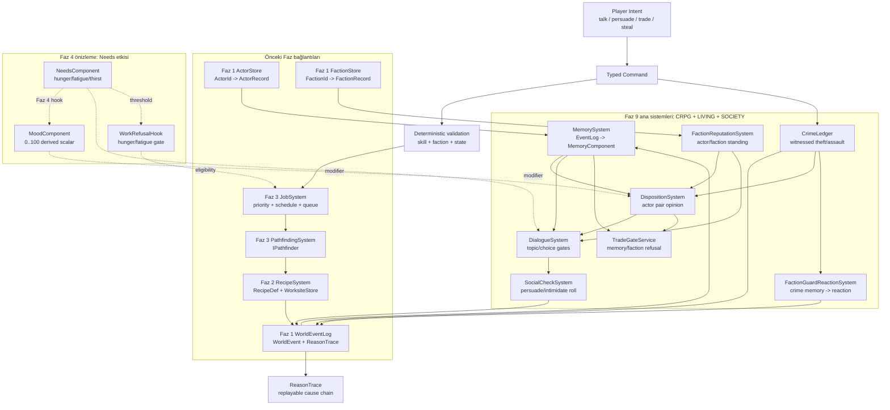
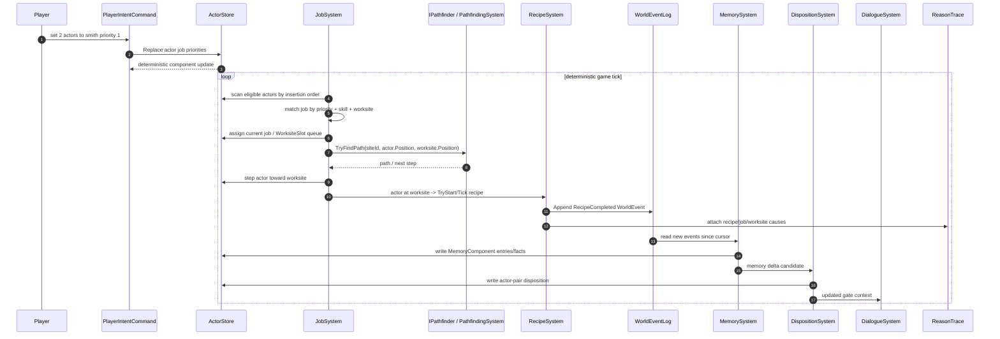

## 1. Sistem haritası (Mermaid graph TB)



Notlar:
- Faz 9 hiçbir world mutation’ı doğrudan UI/LLM üzerinden yapmaz; tüm sonuçlar store mutasyonu + `WorldEventLog` üzerinden akar.
- Dialogue, memory ve faction kuralları `DialogueGateRow`, `MemoryEventRuleDef`, `FactionReputationRuleDef`, `SocialCheckDef` gibi data row’lardan yürür; yeni branch/enum eklemek son çaredir.
- Faz 4 için `NeedsInfluenceSnapshot` hook’u şimdiden gate context’e girer, ama Faz 9 atomları hunger/fatigue simülasyonunu implement etmez.

## 2. Veri modeli (Mermaid classDiagram)

```mermaid
classDiagram
    class ActorRecord {
        +ActorId Id
        +GridPosition Position
        +MemoryComponent Memory
        +DispositionComponent Disposition
        +FactionMembershipComponent FactionMembership
        +DialogueComponent Dialogue
        +ReplaceMemory(MemoryComponent memory)
        +ReplaceDisposition(DispositionComponent disposition)
        +ReplaceFactionMembership(FactionMembershipComponent membership)
        +ReplaceDialogue(DialogueComponent dialogue)
    }

    class MemoryComponent {
        -List~MemoryEntry~ _recentEntries
        -HashSet~string~ _longTermFactKeys
        +ActorId OwnerId
        +IReadOnlyList~MemoryEntry~ RecentEntries
        +IReadOnlyCollection~string~ LongTermFactKeys
        +WithEntry(MemoryEntry entry, int maxRecentEntries) MemoryComponent
        +WithFact(string factKey) MemoryComponent
        +HasFact(string factKey) bool
    }

    class MemoryEntry {
        +string EntryId
        +GameTime ObservedAt
        +ActorId SubjectActorId
        +FactionId SubjectFactionId
        +string FactKey
        +int Salience
        +string SourceReason
    }

    class DispositionComponent {
        -Dictionary~ActorId,DispositionScore~ _byTarget
        +ActorId OwnerId
        +GetScore(ActorId targetId) DispositionScore
        +WithScore(DispositionScore score) DispositionComponent
    }

    class DispositionScore {
        +ActorId SourceActorId
        +ActorId TargetActorId
        +int BaseValue
        +int MemoryModifier
        +int FactionModifier
        +int NeedsMoodModifier
        +int CurrentValue
    }

    class FactionMembershipComponent {
        +ActorId OwnerId
        +FactionId HomeFactionId
        +IReadOnlyList~FactionStanding~ Standings
        +GetStanding(FactionId factionId) FactionStanding
    }

    class DialogueComponent {
        +ActorId OwnerId
        +IReadOnlyList~string~ TopicIds
        +IReadOnlySet~string~ SeenTopicIds
        +WithSeenTopic(string topicId) DialogueComponent
    }

    class DialogueDef {
        +string DialogueId
        +ActorId NpcActorId
        +IReadOnlyList~DialogueNodeDef~ Nodes
    }

    class DialogueNodeDef {
        +string NodeId
        +string TextKey
        +IReadOnlyList~DialogueChoiceDef~ Choices
    }

    class DialogueChoiceDef {
        +string ChoiceId
        +string TextKey
        +IReadOnlyList~DialogueGateRow~ Gates
        +IReadOnlyList~DialogueEffectRow~ Effects
        +string NextNodeId
        +bool EndsDialogue
    }

    class DialogueGateRow {
        +string GateKey
        +string OperationKey
        +string LeftOperand
        +string CompareOp
        +string RightOperand
    }

    class DialogueEffectRow {
        +string EffectKey
        +string OperationKey
        +string TargetKey
        +int Magnitude
        +string Reason
    }

    class CrimeLedger {
        -Dictionary~string,CrimeRecord~ _byCrimeId
        +Add(CrimeRecord record)
        +TryGet(string crimeId, CrimeRecord record) bool
        +RecordsForWitness(ActorId witnessId) IReadOnlyList~CrimeRecord~
    }

    class CrimeRecord {
        +string CrimeId
        +string CrimeKind
        +GameTime OccurredAt
        +SiteId SiteId
        +GridPosition Position
        +ActorId PerpetratorId
        +ActorId VictimActorId
        +FactionId JurisdictionFactionId
        +IReadOnlyList~CrimeWitnessRecord~ Witnesses
    }

    class FactionReputationLedger {
        -Dictionary~string,FactionReputationEntry~ _entries
        +Apply(FactionReputationDelta delta)
        +GetActorStanding(ActorId actorId, FactionId factionId) int
        +GetFactionPairStanding(FactionId sourceId, FactionId targetId) int
    }

    class WorksiteSlot {
        +SiteId SiteId
        +GridPosition Position
        +ActorId OccupantActorId
        +int QueueIndex
        +string ReservationReason
    }

    class WorksiteStore {
        +TryGet(SiteId siteId, GridPosition position, WorksiteRecord record) bool
    }

    class IPathfinder {
        <<interface>>
        +TryFindPath(SiteId siteId, GridPosition start, GridPosition goal, IReadOnlyList~GridPosition~ path) bool
        +TryGetNextStep(SiteId siteId, GridPosition start, GridPosition goal, GridPosition next) bool
    }

    ActorRecord *-- MemoryComponent
    ActorRecord *-- DispositionComponent
    ActorRecord *-- FactionMembershipComponent
    ActorRecord *-- DialogueComponent
    MemoryComponent *-- MemoryEntry
    DispositionComponent *-- DispositionScore
    FactionMembershipComponent *-- FactionStanding
    DialogueDef *-- DialogueNodeDef
    DialogueNodeDef *-- DialogueChoiceDef
    DialogueChoiceDef *-- DialogueGateRow
    DialogueChoiceDef *-- DialogueEffectRow
    CrimeLedger *-- CrimeRecord
    CrimeRecord *-- CrimeWitnessRecord
    FactionReputationLedger *-- FactionReputationEntry
    WorksiteStore ..> WorksiteSlot : references existing worksite cell
    IPathfinder ..> GridPosition
```



## 3. Tick akışı (Mermaid sequenceDiagram)



Faz 9’e özgü ek akış:
- Theft/assault gibi crime event’leri `CrimeWitnessSystem` tarafından `CrimeLedger` içine yazılır.
- `MemorySystem`, witness actor’ların `MemoryComponent`’ına `crime.theft.witnessed` veya `crime.assault.witnessed` gibi fact key ekler.
- `DispositionSystem`, memory + faction jurisdiction + mood hook toplamından pair score hesaplar.
- `DialogueSystem` trade topic/choice gating yapar; düşük disposition veya açık crime memory varsa trade response yerine refusal node döner.

## 4. C# scaffold — DOSYA YOLU + İMZA (gövde YOK)

### `Assets/Scripts/Domain/Living/MemoryEntry.cs`

```csharp
using EmberCrpg.Domain.Core;

namespace EmberCrpg.Domain.Living
{
    /// <summary>Immutable fact remembered by one actor. It stores mechanical data only; prose belongs to Presentation or AI/DM views.</summary>
    public sealed record MemoryEntry(
        string EntryId,
        GameTime ObservedAt,
        ActorId ObserverActorId,
        ActorId SubjectActorId,
        FactionId SubjectFactionId,
        string FactKey,
        int Salience,
        string SourceReason);
}
```

### `Assets/Scripts/Domain/Living/MemoryComponent.cs`

```csharp
using System.Collections.Generic;
using EmberCrpg.Domain.Core;

namespace EmberCrpg.Domain.Living
{
    /// <summary>Actor-local memory component attached to ActorRecord. It is bounded, deterministic, and written only by MemorySystem.</summary>
    public sealed class MemoryComponent
    {
        /// <summary>Recent mechanical memory entries in deterministic append order.</summary>
        private readonly List<MemoryEntry> _recentEntries;

        /// <summary>Stable fact keys promoted from repeated or salient events.</summary>
        private readonly HashSet<string> _longTermFactKeys;

        /// <summary>Creates a memory component for one actor with optional restored state.</summary>
        public MemoryComponent(ActorId ownerId, IEnumerable<MemoryEntry> recentEntries = null, IEnumerable<string> longTermFactKeys = null);

        /// <summary>Actor that owns this component.</summary>
        public ActorId OwnerId { get; }

        /// <summary>Recent entries visible to dialogue, faction, and DM query systems.</summary>
        public IReadOnlyList<MemoryEntry> RecentEntries { get; }

        /// <summary>Long-term fact keys used by data-driven dialogue gates.</summary>
        public IReadOnlyCollection<string> LongTermFactKeys { get; }

        /// <summary>Returns a component containing the entry, trimmed to the supplied deterministic capacity.</summary>
        public MemoryComponent WithEntry(MemoryEntry entry, int maxRecentEntries);

        /// <summary>Returns a component containing the stable fact key.</summary>
        public MemoryComponent WithFact(string factKey);

        /// <summary>Checks whether the component contains the fact key.</summary>
        public bool HasFact(string factKey);
    }
}
```

### `Assets/Scripts/Domain/Living/DispositionComponent.cs`

```csharp
using System.Collections.Generic;
using EmberCrpg.Domain.Core;

namespace EmberCrpg.Domain.Living
{
    /// <summary>Actor-pair disposition component. Scores are stored per target actor and recomputed by DispositionSystem.</summary>
    public sealed class DispositionComponent
    {
        /// <summary>Disposition rows keyed by target actor id.</summary>
        private readonly Dictionary<ActorId, DispositionScore> _byTarget;

        /// <summary>Creates a component for one source actor with optional restored pair scores.</summary>
        public DispositionComponent(ActorId ownerId, IEnumerable<DispositionScore> scores = null);

        /// <summary>Actor that owns the pair scores.</summary>
        public ActorId OwnerId { get; }

        /// <summary>Stored pair scores in deterministic target-id order.</summary>
        public IReadOnlyList<DispositionScore> Scores { get; }

        /// <summary>Returns the score for a target, or a neutral default when no row exists.</summary>
        public DispositionScore GetScore(ActorId targetId);

        /// <summary>Returns a component with the supplied pair score inserted or replaced.</summary>
        public DispositionComponent WithScore(DispositionScore score);
    }

    /// <summary>Computed social score between two actors. It separates base, memory, faction, and future needs/mood modifiers for traceability.</summary>
    public sealed record DispositionScore(
        ActorId SourceActorId,
        ActorId TargetActorId,
        int BaseValue,
        int MemoryModifier,
        int FactionModifier,
        int NeedsMoodModifier,
        int CurrentValue,
        string ReasonKey);
}
```

### `Assets/Scripts/Domain/Living/FactionMembershipComponent.cs`

```csharp
using System.Collections.Generic;
using EmberCrpg.Domain.Core;

namespace EmberCrpg.Domain.Living
{
    /// <summary>Actor-local faction component. It records home faction and actor-specific standings without subclassing ActorRecord.</summary>
    public sealed class FactionMembershipComponent
    {
        /// <summary>Standing rows keyed by faction id.</summary>
        private readonly Dictionary<FactionId, FactionStanding> _standings;

        /// <summary>Creates faction membership for one actor.</summary>
        public FactionMembershipComponent(ActorId ownerId, FactionId homeFactionId, IEnumerable<FactionStanding> standings = null);

        /// <summary>Actor that owns this component.</summary>
        public ActorId OwnerId { get; }

        /// <summary>Actor's primary faction; empty means unaffiliated.</summary>
        public FactionId HomeFactionId { get; }

        /// <summary>Actor-specific standing rows in deterministic faction-id order.</summary>
        public IReadOnlyList<FactionStanding> Standings { get; }

        /// <summary>Returns actor standing with a faction, defaulting to neutral.</summary>
        public FactionStanding GetStanding(FactionId factionId);

        /// <summary>Returns a component with the supplied standing inserted or replaced.</summary>
        public FactionMembershipComponent WithStanding(FactionStanding standing);
    }

    /// <summary>Standing row between one actor and one faction. Values are mechanical and can drive dialogue gates or guard reactions.</summary>
    public sealed record FactionStanding(ActorId ActorId, FactionId FactionId, int Value, string ReasonKey);
}
```

### `Assets/Scripts/Domain/Living/DialogueComponent.cs`

```csharp
using System.Collections.Generic;
using EmberCrpg.Domain.Core;

namespace EmberCrpg.Domain.Living
{
    /// <summary>Actor-local dialogue component. It links an actor to data-driven topic ids and seen topic ids.</summary>
    public sealed class DialogueComponent
    {
        /// <summary>Known topic ids attached to this actor.</summary>
        private readonly List<string> _topicIds;

        /// <summary>Topic ids this actor has already discussed.</summary>
        private readonly HashSet<string> _seenTopicIds;

        /// <summary>Creates dialogue state for one actor with optional restored topic state.</summary>
        public DialogueComponent(ActorId ownerId, IEnumerable<string> topicIds = null, IEnumerable<string> seenTopicIds = null);

        /// <summary>Actor that owns this component.</summary>
        public ActorId OwnerId { get; }

        /// <summary>Topic ids exposed by this actor's dialogue catalog rows.</summary>
        public IReadOnlyList<string> TopicIds { get; }

        /// <summary>Topic ids that were already selected in prior conversations.</summary>
        public IReadOnlyCollection<string> SeenTopicIds { get; }

        /// <summary>Returns a component with a topic marked as seen.</summary>
        public DialogueComponent WithSeenTopic(string topicId);

        /// <summary>Checks whether a topic has already been discussed.</summary>
        public bool HasSeenTopic(string topicId);
    }
}
```

### `Assets/Scripts/Domain/Actors/ActorRecord.cs` (extend existing)

```csharp
using EmberCrpg.Domain.Living;

namespace EmberCrpg.Domain.Actors
{
    /// <summary>Existing pure actor record extended with social components. The class remains Unity-free and composition-based.</summary>
    public sealed class ActorRecord
    {
        /// <summary>Persistent memory component owned by this actor.</summary>
        private MemoryComponent _memory;

        /// <summary>Actor-pair disposition component owned by this actor.</summary>
        private DispositionComponent _disposition;

        /// <summary>Faction membership and standing component owned by this actor.</summary>
        private FactionMembershipComponent _factionMembership;

        /// <summary>Dialogue topics and seen-topic state owned by this actor.</summary>
        private DialogueComponent _dialogue;

        /// <summary>Persistent memory component used by dialogue, faction, and DM query systems.</summary>
        public MemoryComponent Memory { get; }

        /// <summary>Disposition component used for actor-pair reactions.</summary>
        public DispositionComponent Disposition { get; }

        /// <summary>Faction membership component used for reputation and jurisdiction checks.</summary>
        public FactionMembershipComponent FactionMembership { get; }

        /// <summary>Dialogue component used for topic availability and repeated-topic memory.</summary>
        public DialogueComponent Dialogue { get; }

        /// <summary>Replaces memory through the actor record, preserving actor identity.</summary>
        public void ReplaceMemory(MemoryComponent memory);

        /// <summary>Replaces disposition through the actor record, preserving actor identity.</summary>
        public void ReplaceDisposition(DispositionComponent disposition);

        /// <summary>Replaces faction membership through the actor record, preserving actor identity.</summary>
        public void ReplaceFactionMembership(FactionMembershipComponent membership);

        /// <summary>Replaces dialogue state through the actor record, preserving actor identity.</summary>
        public void ReplaceDialogue(DialogueComponent dialogue);
    }
}
```

### `Assets/Scripts/Domain/Crpg/DialogueDef.cs`

```csharp
using System.Collections.Generic;
using EmberCrpg.Domain.Core;

namespace EmberCrpg.Domain.Crpg
{
    /// <summary>Data-driven dialogue tree definition. It carries ids and rows only; DialogueSystem owns evaluation.</summary>
    public sealed record DialogueDef(string DialogueId, ActorId NpcActorId, IReadOnlyList<DialogueNodeDef> Nodes, string StartNodeId);

    /// <summary>One NPC dialogue node. TextKey points to localization/data, not generated prose.</summary>
    public sealed record DialogueNodeDef(string NodeId, string TextKey, IReadOnlyList<DialogueChoiceDef> Choices);

    /// <summary>One player-selectable dialogue choice. Gates and effects are data rows evaluated by registered operations.</summary>
    public sealed record DialogueChoiceDef(
        string ChoiceId,
        string TextKey,
        IReadOnlyList<DialogueGateRow> Gates,
        IReadOnlyList<DialogueEffectRow> Effects,
        string NextNodeId,
        bool EndsDialogue);

    /// <summary>Data row that gates a dialogue node or choice. OperationKey chooses a registered evaluator, not a switch branch.</summary>
    public sealed record DialogueGateRow(string GateKey, string OperationKey, string LeftOperand, string CompareOp, string RightOperand);

    /// <summary>Data row that applies a deterministic dialogue consequence. OperationKey chooses a registered executor.</summary>
    public sealed record DialogueEffectRow(string EffectKey, string OperationKey, string TargetKey, int Magnitude, string Reason);
}
```

### `Assets/Scripts/Domain/Crpg/DialogueRuntime.cs`

```csharp
using System.Collections.Generic;
using EmberCrpg.Domain.Core;

namespace EmberCrpg.Domain.Crpg
{
    /// <summary>Runtime state for one active conversation. It is serializable pure data and contains no UI state.</summary>
    public sealed record DialogueSession(string SessionId, string DialogueId, string CurrentNodeId, ActorId PlayerActorId, ActorId NpcActorId, bool IsActive);

    /// <summary>Read model returned by DialogueSystem after deterministic gate evaluation.</summary>
    public sealed record DialogueView(string DialogueId, string NodeId, string TextKey, IReadOnlyList<DialogueChoiceView> Choices);

    /// <summary>One available choice in the current dialogue view. Hidden choices are not returned to the player.</summary>
    public sealed record DialogueChoiceView(string ChoiceId, string TextKey, IReadOnlyList<string> ReasonKeys);

    /// <summary>Result of selecting a dialogue choice. It includes the next view and emitted mechanical reasons.</summary>
    public sealed record DialogueSelectionResult(DialogueSession Session, DialogueView NextView, IReadOnlyList<string> EffectReasonKeys);
}
```

### `Assets/Scripts/Domain/Crpg/SocialCheckDef.cs`

```csharp
using EmberCrpg.Domain.Core;

namespace EmberCrpg.Domain.Crpg
{
    /// <summary>Data row for persuade, intimidate, or similar social checks. SkillKey and OperationKey keep checks data-driven.</summary>
    public sealed record SocialCheckDef(string CheckId, string OperationKey, string SkillKey, int BaseDifficulty, int DispositionWeight, int FactionWeight);

    /// <summary>Runtime request for one deterministic social check.</summary>
    public sealed record SocialCheckRequest(string CheckId, ActorId SourceActorId, ActorId TargetActorId, string SkillKey, int DifficultyModifier, string ReasonKey);

    /// <summary>Result of one seeded social check roll. The roll and threshold are stored for replay and ReasonTrace output.</summary>
    public sealed record SocialCheckResult(string CheckId, bool Succeeded, int Roll, int Threshold, string ReasonKey);
}
```

### `Assets/Scripts/Domain/Society/CrimeLedger.cs`

```csharp
using System.Collections.Generic;
using EmberCrpg.Domain.Actors;
using EmberCrpg.Domain.Core;

namespace EmberCrpg.Domain.Society
{
    /// <summary>World-level crime ledger. It stores witnessed crimes by data keys such as crime.theft or crime.assault.</summary>
    public sealed class CrimeLedger
    {
        /// <summary>Crime records keyed by stable crime id.</summary>
        private readonly Dictionary<string, CrimeRecord> _byCrimeId;

        /// <summary>Creates a ledger with optional restored crime records.</summary>
        public CrimeLedger(IEnumerable<CrimeRecord> records = null);

        /// <summary>Crime records in deterministic insertion order.</summary>
        public IReadOnlyList<CrimeRecord> Records { get; }

        /// <summary>Adds one crime record; duplicate ids are rejected.</summary>
        public void Add(CrimeRecord record);

        /// <summary>Tries to get a crime record by id.</summary>
        public bool TryGet(string crimeId, out CrimeRecord record);

        /// <summary>Returns all crimes witnessed by the supplied actor in deterministic crime order.</summary>
        public IReadOnlyList<CrimeRecord> RecordsForWitness(ActorId witnessId);
    }

    /// <summary>Mechanical crime fact with perpetrator, jurisdiction, and witnesses. CrimeKind is a data key, not an enum branch.</summary>
    public sealed record CrimeRecord(
        string CrimeId,
        string CrimeKind,
        GameTime OccurredAt,
        SiteId SiteId,
        GridPosition Position,
        ActorId PerpetratorId,
        ActorId VictimActorId,
        FactionId JurisdictionFactionId,
        IReadOnlyList<CrimeWitnessRecord> Witnesses,
        string SourceReason);

    /// <summary>One witness link inside a crime record. Confidence lets future perception rules degrade without changing schema.</summary>
    public sealed record CrimeWitnessRecord(ActorId WitnessActorId, int Confidence, string WitnessReason);
}
```

### `Assets/Scripts/Domain/Society/FactionReputationLedger.cs`

```csharp
using System.Collections.Generic;
using EmberCrpg.Domain.Core;

namespace EmberCrpg.Domain.Society
{
    /// <summary>Reputation ledger for actor-faction and faction-faction standing. It is the SOCIETY source for disposition modifiers.</summary>
    public sealed class FactionReputationLedger
    {
        /// <summary>Reputation entries keyed by deterministic composite keys.</summary>
        private readonly Dictionary<string, FactionReputationEntry> _entries;

        /// <summary>Creates a reputation ledger with optional restored rows.</summary>
        public FactionReputationLedger(IEnumerable<FactionReputationEntry> entries = null);

        /// <summary>Entries in deterministic key order for save/load and replay assertions.</summary>
        public IReadOnlyList<FactionReputationEntry> Entries { get; }

        /// <summary>Applies one reputation delta and returns the resulting entry.</summary>
        public FactionReputationEntry Apply(FactionReputationDelta delta);

        /// <summary>Returns an actor's standing with a faction, defaulting to neutral.</summary>
        public int GetActorStanding(ActorId actorId, FactionId factionId);

        /// <summary>Returns standing between two factions, defaulting to neutral.</summary>
        public int GetFactionPairStanding(FactionId sourceFactionId, FactionId targetFactionId);
    }

    /// <summary>Stored reputation row. SubjectKey keeps actor and faction rows in one deterministic ledger.</summary>
    public sealed record FactionReputationEntry(string SubjectKey, FactionId FactionId, int Value, string ReasonKey);

    /// <summary>Reputation mutation row emitted by crime, dialogue, trade, or quest effects.</summary>
    public sealed record FactionReputationDelta(string SubjectKey, FactionId FactionId, int Delta, string ReasonKey);
}
```

### `Assets/Scripts/Domain/Living/NeedsInfluenceSnapshot.cs`

```csharp
namespace EmberCrpg.Domain.Living
{
    /// <summary>Faz 4 preview hook passed into dialogue and disposition evaluation. Faz 9 stores the hook shape but does not simulate needs.</summary>
    public sealed record NeedsInfluenceSnapshot(int Hunger, int Fatigue, int Thirst, int MoodModifier, string ReasonKey);
}
```

### `Assets/Scripts/Domain/Process/WorksiteSlot.cs`

```csharp
using EmberCrpg.Domain.Actors;
using EmberCrpg.Domain.Core;

namespace EmberCrpg.Domain.Process
{
    /// <summary>Reservation view over an existing WorksiteStore cell. It does not replace WorksiteRecord; it lets job/path systems queue actors deterministically.</summary>
    public sealed record WorksiteSlot(SiteId SiteId, GridPosition Position, ActorId OccupantActorId, int QueueIndex, string ReservationReason);
}
```

### `Assets/Scripts/Simulation/World/IPathfinder.cs`

```csharp
using System.Collections.Generic;
using EmberCrpg.Domain.Actors;
using EmberCrpg.Domain.Core;

namespace EmberCrpg.Simulation.World
{
    /// <summary>Pure pathfinding API consumed by job and dialogue movement systems. Implementations must be deterministic for the same site and inputs.</summary>
    public interface IPathfinder
    {
        /// <summary>Finds a path between two grid positions inside a site.</summary>
        bool TryFindPath(SiteId siteId, GridPosition start, GridPosition goal, out IReadOnlyList<GridPosition> path);

        /// <summary>Returns the next deterministic step toward a goal without exposing implementation details.</summary>
        bool TryGetNextStep(SiteId siteId, GridPosition start, GridPosition goal, out GridPosition next);
    }
}
```

### `Assets/Scripts/Simulation/Living/MemorySystem.cs`

```csharp
using System.Collections.Generic;
using EmberCrpg.Domain.Core;
using EmberCrpg.Domain.Living;
using EmberCrpg.Domain.Society;
using EmberCrpg.Domain.World;

namespace EmberCrpg.Simulation.Living
{
    /// <summary>Reads WorldEventLog and writes MemoryComponent entries. It is idempotent through MemorySystemState cursor tracking.</summary>
    public sealed class MemorySystem
    {
        /// <summary>Data-driven rules mapping event reasons/traces to memory fact keys.</summary>
        private readonly IReadOnlyList<MemoryEventRuleDef> _rules;

        /// <summary>Creates the memory system with data-driven event-to-memory rules.</summary>
        public MemorySystem(IEnumerable<MemoryEventRuleDef> rules);

        /// <summary>Consumes new world events since the saved cursor and updates actor memory components.</summary>
        public MemorySystemState Tick(GameTime now, WorldEventLog eventLog, ActorStore actors, CrimeLedger crimeLedger, MemorySystemState state);

        /// <summary>Builds a memory entry for one actor/event/rule match.</summary>
        public MemoryEntry BuildEntry(GameTime now, WorldEvent worldEvent, ActorId observerId, MemoryEventRuleDef rule);
    }

    /// <summary>Replay-safe cursor for MemorySystem. It prevents duplicate memory writes when the same event log is ticked repeatedly.</summary>
    public sealed record MemorySystemState(int LastConsumedEventIndex);

    /// <summary>Data row mapping event reason or trace labels to memory facts. MatchKey and FactKey are data strings, not enum branches.</summary>
    public sealed record MemoryEventRuleDef(string RuleId, string MatchKey, string FactKey, int Salience, bool PromoteToLongTermFact);
}
```

### `Assets/Scripts/Simulation/Living/DispositionSystem.cs`

```csharp
using EmberCrpg.Domain.Actors;
using EmberCrpg.Domain.Core;
using EmberCrpg.Domain.Living;
using EmberCrpg.Domain.Society;
using EmberCrpg.Domain.World;

namespace EmberCrpg.Simulation.Living
{
    /// <summary>Computes actor-pair disposition from base value, memory facts, faction reputation, and future needs/mood hook.</summary>
    public sealed class DispositionSystem
    {
        /// <summary>Creates a deterministic disposition system with clamp bounds.</summary>
        public DispositionSystem(int minValue, int maxValue);

        /// <summary>Computes a score from source actor to target actor without mutating stores.</summary>
        public DispositionScore Compute(
            ActorRecord source,
            ActorRecord target,
            FactionReputationLedger factionReputation,
            NeedsInfluenceSnapshot needsInfluence);

        /// <summary>Writes the computed score into the source actor's DispositionComponent.</summary>
        public void Apply(ActorRecord source, DispositionScore score);
    }
}
```

### `Assets/Scripts/Simulation/Crpg/DialogueSystem.cs`

```csharp
using System.Collections.Generic;
using EmberCrpg.Domain.Actors;
using EmberCrpg.Domain.Crpg;
using EmberCrpg.Domain.Living;
using EmberCrpg.Domain.Society;

namespace EmberCrpg.Simulation.Crpg
{
    /// <summary>Deterministic dialogue state machine. It evaluates data gates and executes data effects through injected registries.</summary>
    public sealed class DialogueSystem
    {
        /// <summary>Gate evaluator registry used for condition rows.</summary>
        private readonly IDialogueGateEvaluator _gateEvaluator;

        /// <summary>Effect executor registry used for consequence rows.</summary>
        private readonly IDialogueEffectExecutor _effectExecutor;

        /// <summary>Creates a dialogue system with deterministic gate and effect services.</summary>
        public DialogueSystem(IDialogueGateEvaluator gateEvaluator, IDialogueEffectExecutor effectExecutor);

        /// <summary>Starts a dialogue and returns the initial gated view.</summary>
        public DialogueSelectionResult Start(DialogueDef dialogue, ActorRecord player, ActorRecord npc, DialogueGateContext context);

        /// <summary>Returns a gated read model for the current node.</summary>
        public DialogueView GetView(DialogueDef dialogue, DialogueSession session, ActorRecord player, ActorRecord npc, DialogueGateContext context);

        /// <summary>Selects one choice, executes its effects, and returns the next deterministic session/view.</summary>
        public DialogueSelectionResult SelectChoice(DialogueDef dialogue, DialogueSession session, string choiceId, ActorRecord player, ActorRecord npc, DialogueGateContext context);
    }

    /// <summary>Context passed to data-driven dialogue gates. It keeps memory, disposition, faction, crime, and needs inputs explicit.</summary>
    public sealed record DialogueGateContext(
        DispositionScore Disposition,
        FactionReputationLedger FactionReputation,
        CrimeLedger CrimeLedger,
        NeedsInfluenceSnapshot NeedsInfluence,
        IReadOnlyList<string> ReasonKeys);

    /// <summary>Interface for evaluating dialogue gate rows. Implementations dispatch by registered operation keys, not enum switches.</summary>
    public interface IDialogueGateEvaluator
    {
        /// <summary>Evaluates one gate row against actor and world-social context.</summary>
        bool Evaluate(DialogueGateRow gate, ActorRecord player, ActorRecord npc, DialogueGateContext context);
    }

    /// <summary>Interface for executing dialogue effect rows. Implementations route mutations through stores and event logs.</summary>
    public interface IDialogueEffectExecutor
    {
        /// <summary>Executes one effect row and returns mechanical reason keys for EventLog/ReasonTrace.</summary>
        IReadOnlyList<string> Execute(DialogueEffectRow effect, ActorRecord player, ActorRecord npc, DialogueGateContext context);
    }
}
```

### `Assets/Scripts/Simulation/Crpg/SocialCheckSystem.cs`

```csharp
using EmberCrpg.Domain.Actors;
using EmberCrpg.Domain.Crpg;
using EmberCrpg.Domain.Living;
using EmberCrpg.Simulation.Rng;

namespace EmberCrpg.Simulation.Crpg
{
    /// <summary>Resolves persuade, intimidate, and similar social checks through injected deterministic RNG.</summary>
    public sealed class SocialCheckSystem
    {
        /// <summary>Creates the social check system with clamp bounds for thresholds.</summary>
        public SocialCheckSystem(int minThreshold, int maxThreshold);

        /// <summary>Computes a deterministic threshold from skill, disposition, faction, and data row weights.</summary>
        public int ComputeThreshold(SocialCheckDef def, ActorRecord source, ActorRecord target, DispositionScore disposition);

        /// <summary>Rolls one check using the supplied deterministic RNG.</summary>
        public SocialCheckResult Roll(SocialCheckDef def, SocialCheckRequest request, ActorRecord source, ActorRecord target, DispositionScore disposition, IDeterministicRng rng);
    }
}
```

### `Assets/Scripts/Simulation/Society/CrimeWitnessSystem.cs`

```csharp
using EmberCrpg.Domain.Core;
using EmberCrpg.Domain.Society;
using EmberCrpg.Domain.World;

namespace EmberCrpg.Simulation.Society
{
    /// <summary>Builds crime ledger rows from witnessed crime events. Visibility is injected later; v1 uses deterministic actor/site proximity rules.</summary>
    public sealed class CrimeWitnessSystem
    {
        /// <summary>Creates the crime witness system with deterministic witness radius.</summary>
        public CrimeWitnessSystem(int witnessRadius);

        /// <summary>Consumes new event log rows and appends crime records for matching data-driven crime rules.</summary>
        public CrimeWitnessState Tick(GameTime now, WorldEventLog eventLog, ActorStore actors, CrimeLedger ledger, CrimeWitnessState state);

        /// <summary>Attempts to build one crime record from one event and matching rule.</summary>
        public bool TryBuildCrimeRecord(GameTime now, WorldEvent worldEvent, ActorStore actors, CrimeRuleDef rule, out CrimeRecord record);
    }

    /// <summary>Replay-safe cursor for crime witness scanning.</summary>
    public sealed record CrimeWitnessState(int LastConsumedEventIndex);

    /// <summary>Data row that maps an event reason or trace key to a crime kind and faction jurisdiction.</summary>
    public sealed record CrimeRuleDef(string RuleId, string MatchKey, string CrimeKind, int Severity, FactionId JurisdictionFactionId);
}
```

### `Assets/Scripts/Simulation/Society/FactionReputationSystem.cs`

```csharp
using EmberCrpg.Domain.Core;
using EmberCrpg.Domain.Society;
using EmberCrpg.Domain.World;

namespace EmberCrpg.Simulation.Society
{
    /// <summary>Applies faction reputation changes from dialogue, crimes, and trade outcomes. It mutates only the reputation ledger and event log.</summary>
    public sealed class FactionReputationSystem
    {
        /// <summary>Creates a faction reputation system with deterministic clamp bounds.</summary>
        public FactionReputationSystem(int minValue, int maxValue);

        /// <summary>Applies a reputation delta and appends a causal world event.</summary>
        public FactionReputationEntry ApplyDelta(GameTime now, FactionReputationLedger ledger, WorldEventLog eventLog, FactionReputationDelta delta);
    }
}
```

### `Assets/Scripts/Simulation/Society/FactionGuardReactionSystem.cs`

```csharp
using EmberCrpg.Domain.Actors;
using EmberCrpg.Domain.Core;
using EmberCrpg.Domain.Society;
using EmberCrpg.Domain.World;

namespace EmberCrpg.Simulation.Society
{
    /// <summary>Determines guard reaction from witnessed crime memory and faction jurisdiction. It never invents dialogue text.</summary>
    public sealed class FactionGuardReactionSystem
    {
        /// <summary>Creates guard reaction logic with deterministic thresholds.</summary>
        public FactionGuardReactionSystem(int warnThreshold, int arrestThreshold);

        /// <summary>Computes a guard reaction without mutating world state.</summary>
        public GuardReactionResult Evaluate(ActorRecord guard, ActorRecord subject, CrimeLedger crimes, FactionReputationLedger reputation);

        /// <summary>Appends the chosen reaction to WorldEventLog with a ReasonTrace.</summary>
        public void EmitReaction(GameTime now, GuardReactionResult result, WorldEventLog eventLog);
    }

    /// <summary>Mechanical guard reaction result. ReactionKey is a data key consumed by UI/dialogue rows.</summary>
    public sealed record GuardReactionResult(ActorId GuardActorId, ActorId SubjectActorId, string ReactionKey, int Severity, string ReasonKey);
}
```

### `Assets/Scripts/Simulation/Crpg/TradeGateService.cs`

```csharp
using EmberCrpg.Domain.Actors;
using EmberCrpg.Domain.Living;
using EmberCrpg.Domain.Society;

namespace EmberCrpg.Simulation.Crpg
{
    /// <summary>Deterministic gate for trade availability. It lets dialogue expose refusal instead of opening the merchant surface.</summary>
    public sealed class TradeGateService
    {
        /// <summary>Creates trade gate logic with a refusal threshold.</summary>
        public TradeGateService(int refusalDispositionThreshold);

        /// <summary>Returns whether trade is currently allowed and why.</summary>
        public TradeGateResult Evaluate(ActorRecord player, ActorRecord merchant, DispositionScore disposition, CrimeLedger crimes);
    }

    /// <summary>Trade gate result used by dialogue rows and acceptance tests.</summary>
    public sealed record TradeGateResult(bool CanTrade, string GateReasonKey);
}
```

### Atom listesi

| Atom | Dosya / sınıf | Açıklama | Tag |
|---:|---|---|---|
| 1 | `docs/mechanics/faz-9-dialogue-memory-faction.md` | Bu atom map + scaffold dosyası; Captain için Faz 9 canonical decomposition. | `[box=CRPG]` |
| 2 | `MemoryEntry`, `MemoryComponent` | Actor-local bounded memory component ve fact key modeli. | `[box=LIVING]` |
| 3 | `ActorRecord` Faz 9 component hooks | `Memory`, `Disposition`, `FactionMembership`, `Dialogue` component’larını ekle. | `[box=LIVING]` |
| 4 | `MemoryEventRuleDef`, `MemorySystemState` | EventLog cursor + data-driven event-to-memory rule temeli. | `[box=LIVING]` |
| 5 | `MemorySystem.Tick` | `WorldEventLog` içinden yeni event’leri okuyup `MemoryComponent` yazar. | `[box=LIVING]` |
| 6 | `DispositionScore`, `DispositionComponent` | Actor-pair score storage ve neutral default davranışı. | `[box=LIVING]` |
| 7 | `DispositionSystem` | Memory + faction + Faz4 needs hook ile score hesaplar. | `[box=LIVING]` |
| 8 | `FactionMembershipComponent`, `FactionStanding` | Actor-local home faction ve per-faction standing. | `[box=SOCIETY]` |
| 9 | `FactionReputationLedger` | Actor/faction ve faction/faction reputation ledger. | `[box=SOCIETY]` |
| 10 | `FactionReputationSystem` | Reputation delta uygular, EventLog + ReasonTrace üretir. | `[box=SOCIETY]` |
| 11 | `CrimeLedger`, `CrimeRecord` | Witnessed theft/assault gibi crime facts için ledger. | `[box=CRPG]` |
| 12 | `CrimeWitnessSystem`, `CrimeRuleDef` | Event reason/trace key -> crime record data row eşleşmesi. | `[box=CRPG]` |
| 13 | `FactionGuardReactionSystem` | Crime memory + jurisdiction -> guard reaction result. | `[box=SOCIETY]` |
| 14 | `DialogueDef` row modeli | Node/choice/gate/effect data rows; branch yerine operation key. | `[box=CRPG]` |
| 15 | `DialogueComponent` | Actor topic ids ve seen topic ids. | `[box=CRPG]` |
| 16 | `DialogueSystem.Start/GetView` | Gated dialogue view üretir. | `[box=CRPG]` |
| 17 | `IDialogueGateEvaluator` | Disposition/memory/faction/topic gates için registry interface. | `[box=CRPG]` |
| 18 | `IDialogueEffectExecutor` | Reputation/memory/topic effects için registry interface. | `[box=CRPG]` |
| 19 | `SocialCheckDef`, `SocialCheckSystem` | Persuade/intimidate checks; `IDeterministicRng` injected. | `[box=CRPG]` |
| 20 | `TradeGateService` | NPC refuses trade when memory/disposition/faction gate fails. | `[box=CRPG]` |
| 21 | `NeedsInfluenceSnapshot` | Faz 4 needs/mood entegrasyon hook’u. | `[box=LIVING]` |
| 22 | `WorksiteSlot`, `IPathfinder` docs/API alignment | Faz 3 path/job acceptance akışını Faz 9 EventLog dinleyicileriyle uyumlu tutar. | `[box=PROCESS]` |
| 23 | Save/load mapper extension | Actor social components + ledgers round-trip. | `[box=TIME]` |
| 24 | xUnit deterministic unit tests | Component, system, gate, social roll testleri. | `[box=LIVING]` |
| 25 | Acceptance replay: crime two days ago | NPC remembers crime after two days and refuses trade. | `[box=CRPG]` |
| 26 | Replay determinism proof | Same seed + command trace -> same EventLog, memory, disposition, dialogue view. | `[box=CRPG]` |

## 5. Test stratejisi

| Test alanı | Pin’lenen davranış | xUnit dosya yolu |
|---|---|---|
| Memory component | Entry append order, max recent trim, long-term fact lookup. | `Tests/EmberCrpg.Core.Tests/Living/MemoryComponentTests.cs` |
| Memory system | Same `WorldEventLog` ticked twice does not duplicate memory. | `Tests/EmberCrpg.Core.Tests/Living/MemorySystemTests.cs` |
| Actor component integration | `ActorRecord` component replacement preserves `ActorId`, position, vitals. | `Tests/EmberCrpg.Core.Tests/Actors/ActorRecordSocialComponentTests.cs` |
| Disposition | Memory/faction/needs modifiers clamp deterministically. | `Tests/EmberCrpg.Core.Tests/Living/DispositionSystemTests.cs` |
| Faction reputation | Delta application, neutral defaults, deterministic ordering. | `Tests/EmberCrpg.Core.Tests/Society/FactionReputationLedgerTests.cs` |
| Crime ledger | Crime ids unique, witness lookup stable, no enum branch dependency. | `Tests/EmberCrpg.Core.Tests/Society/CrimeLedgerTests.cs` |
| Crime witness | Theft/assault event reason rows produce ledger records. | `Tests/EmberCrpg.Core.Tests/Society/CrimeWitnessSystemTests.cs` |
| Dialogue gates | Disposition, memory fact, faction standing, seen-topic gates. | `Tests/EmberCrpg.Core.Tests/Crpg/DialogueSystemGateTests.cs` |
| Social checks | `IDeterministicRng` injected; persuade/intimidate roll replay-stable. | `Tests/EmberCrpg.Core.Tests/Crpg/SocialCheckSystemTests.cs` |
| Trade refusal | Merchant refuses trade from remembered crime + low disposition. | `Tests/EmberCrpg.Core.Tests/Crpg/TradeGateServiceTests.cs` |
| Save/load | Components + ledgers round-trip without Unity dependency. | `Tests/EmberCrpg.Core.Tests/Save/Faz9SocialStateRoundTripTests.cs` |
| Acceptance replay | Crime witnessed, two days pass, NPC remembers and refuses trade. | `Tests/EmberCrpg.Core.Tests/Acceptance/Faz9CrimeMemoryTradeRefusalTests.cs` |
| Replay determinism | Same seed and commands produce identical signatures. | `Tests/EmberCrpg.Core.Tests/Acceptance/Faz9ReplayDeterminismTests.cs` |

Deterministic test pattern:
- Test creates `XorShiftRng(seed)` or fixed `IDeterministicRng`.
- All actor/faction/site ids are explicit numeric ids.
- Event order comes from store insertion order; no LINQ over unordered dictionaries unless sorted.
- `GameTime` advances by exact `AddDays(2)`, never wall clock.
- Assertions compare compact signatures: event kind/reason, `ReasonTrace.Causes`, memory fact keys, disposition score, dialogue choice ids.

Acceptance test çevirisi:
- “player can witness an NPC remember a crime committed two days ago and refuse to trade”
- Arrange: player, merchant, guard/witness, faction jurisdiction, trade dialogue row, crime rule row.
- Act 1: player commits theft; `CrimeWitnessSystem` records witness; `MemorySystem` writes `crime.theft.witnessed`.
- Act 2: advance `GameTime` exactly two days; tick memory/disposition.
- Act 3: start merchant dialogue/trade.
- Assert: merchant has memory fact, disposition is below refusal threshold, `TradeGateResult.CanTrade == false`, dialogue view contains refusal choice/node, EventLog contains causal `ReasonTrace`.

Not: repo şu anda Unity EditMode/NUnit kullanıyor. Faz 9 kısıtı xUnit dediği için Captain ya saf `.NET` xUnit project eklemeli ya da geçiş tamamlanana kadar bu testleri `Assets/Tests/EditMode/...` NUnit eşleniğiyle mirror etmelidir. Core davranış aynı kalmalı; Unity dependency girmemeli.

## 6. Risk + acceptance

### Faz 3 acceptance senaryosu nasıl test edilir?

Senaryo:
`player can set 2 actors to smith priority 1, watch both queue at the furnace, and produce 4 ingots in a deterministic day`

Faz 9 bu senaryoyu yeniden implement etmez; bu Faz 3 `JobSystem + PathfindingSystem + RecipeSystem` acceptance’ıdır. Faz 9’in görevi, bu EventLog akışını bozmayıp memory/dialogue/faction dinleyicilerinin determinism’i koruduğunu göstermektir.

Test akışı:
1. Seed `9009`, iki actor, bir furnace `WorksiteRecord`, dört smelt job, yeterli ore/fuel.
2. Player intent iki actor için `smith priority 1` yazar.
3. `JobSystem` actor’ları insertion order + priority ile seçer.
4. `IPathfinder` actor’ları furnace queue’ya taşır; `WorksiteSlot.QueueIndex` deterministik kalır.
5. `RecipeSystem` dört `RecipeCompleted` event’i append eder.
6. `MemorySystem` bu event’leri okur ama crime/trade memory üretmez; sadece rule match varsa memory yazar.
7. Replay aynı seed/command trace ile tekrar koşar.
8. Assert: 4 ingot output, aynı event signature, aynı ReasonTrace, aynı memory/disposition state.

Bu senaryoyu kapatan atomlar:
- Faz 3 tarafı: Job priority, JobBoard, ActorScheduleState, JobAssignmentSystem, IPathfinder integration, RecipeSystem active order.
- Faz 9 tarafı: Atom 4-5 `MemorySystemState` idempotency, Atom 22 `WorksiteSlot/IPathfinder` alignment, Atom 26 replay determinism proof.

### Risk matrisi

| Risk | Büyük/basit | Etkilenen atomlar | Neden | Mitigation |
|---|---|---:|---|---|
| `ActorRecord` component ekleme | Büyük | 3, 23 | Constructor/save mapper churn yaratır. | Optional component defaults; önce tests, sonra mapper. |
| xUnit vs mevcut NUnit altyapısı | Büyük | 24-26 | Repo test runner şu an NUnit. | İlk PR’da saf xUnit project kararı veya NUnit mirror notu. |
| Event kind genişletme baskısı | Orta | 4, 5, 12 | Yeni enum eklemek kolay ama data-driven kısıta ters. | `ReasonTrace`/reason key + `MemoryEventRuleDef`/`CrimeRuleDef`. |
| Dialogue gate registry | Orta | 16-18 | Çok genel registry spekülatif olabilir. | Sadece acceptance gate ops: memory fact, disposition threshold, faction standing, seen topic. |
| Save/load sosyal state | Büyük | 23 | Component + ledger round-trip çok dosya dokunur. | Önce pure component tests, sonra mapper atomu. |
| Crime witness visibility | Orta | 12 | Gerçek FOV/path visibility henüz yoksa yanlış witness çıkar. | v1 deterministic radius; interface hook sonraya. |
| Social check balance | Basit | 19 | Sayılar tuning ister. | Testler sadece deterministic threshold/roll pin’ler. |
| Trade refusal UX | Basit | 20, 25 | UI değil core gate. | Dialogue view refusal key döndürür, Presentation sonra işler. |

Atom sırası nedeni:
- Önce component/data primitive’leri gelir; çünkü sistemler store’a yazacak hedef olmadan ilerleyemez.
- Sonra memory ingestion gelir; Faz 9’in bütün görünür davranışı EventLog’dan memory’ye akar.
- Disposition ve faction reputation memory’den sonra gelir; aksi halde gate context eksik kalır.
- Dialogue ve social check en sonra gelir; çünkü gate’ler memory/disposition/faction inputsuz sahte olur.
- Acceptance/replay son atomdur; tüm social state, crime, dialogue ve trade gate birlikte kanıtlanır.

### Faz 4 Colony needs entegrasyonu için bırakılacak hook’lar

| Hook | Faz 9 yeri | Faz 4 kullanımı |
|---|---|---|
| `NeedsInfluenceSnapshot` | `DialogueGateContext`, `DispositionSystem.Compute` | Hunger/fatigue mood modifier olarak disposition ve dialogue refusal’a girer. |
| `DispositionScore.NeedsMoodModifier` | `DispositionScore` | Mood kaynaklı sosyal tepki ayrı izlenir. |
| `DialogueGateRow.OperationKey = "needs.threshold"` | Dialogue data row | Açlık/fatigue belirli eşik üstündeyse trade/work dialogue kapatılır. |
| `TradeGateResult.GateReasonKey` | `TradeGateService` | `needs.hungry.refuse_trade` gibi Faz 4 reasons eklenebilir. |
| `MemoryEntry.Salience` | `MemoryComponent` | Açlık/stress altındaki olaylar daha yüksek salience alabilir. |
| `WorkRefusalHook` graph edge | Faz 3 Job eligibility | Actor hungry/fatigued olduğunda job assignment reddi data-driven gate’e bağlanır. |
