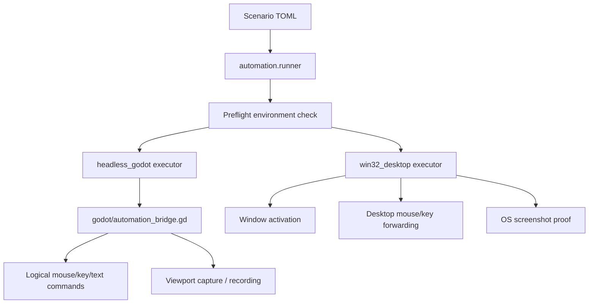

# Automation Stack

## Policy

- `computer_use` is not the primary Godot QA path.
- `headless_godot` is the preferred deterministic path.
- `win32_desktop` is the desktop proof fallback.
- The desktop runner must fail early if dependencies are missing instead of
  pretending the scenario was executed.

## Current Evidence

- `python -m pytest godot-client/tests/automation -q` is green for executor contracts, scenario loading, reporting, and Win32/headless capability-gap handling.
- `title_creation_bridge` passes through `headless_godot` and produces deterministic viewport artifacts with synthetic fallback labeling instead of pretending to be desktop signoff.
