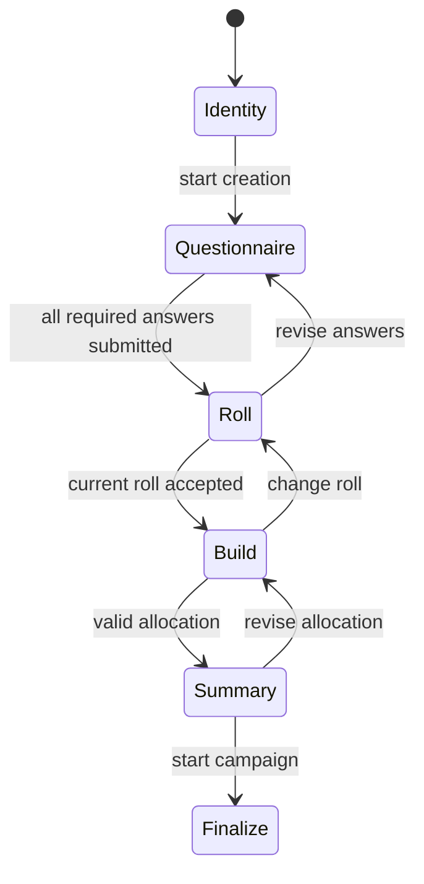

# Creation State Machine

## Current Implementation Target

- `Identity`
  - player name
  - adapter
  - optional profile and seed
- `Questionnaire`
  - all questions visible in one scrollable canvas
  - grouped by section
  - live creation preview from selected answers
- `Roll`
  - current roll
  - saved roll
  - explicit active/saved state
- `Build`
  - rules-driven assignment from rolled pool
  - no raw freeform stat entry
- `Summary`
  - dossier view, not CSV-like dump
  - campaign premise, colony pressure, world/culture bias, and final build

## Current Evidence

- Godot headless coverage exercises identity, questionnaire, roll, build, and summary state transitions in `godot-client/tests/run_headless_tests.gd`.
- Headless automation scenario `title_creation_bridge` proves the title surface, opening New Game, identity input, and questionnaire transition through the automation bridge without desktop-coordinate assumptions.
