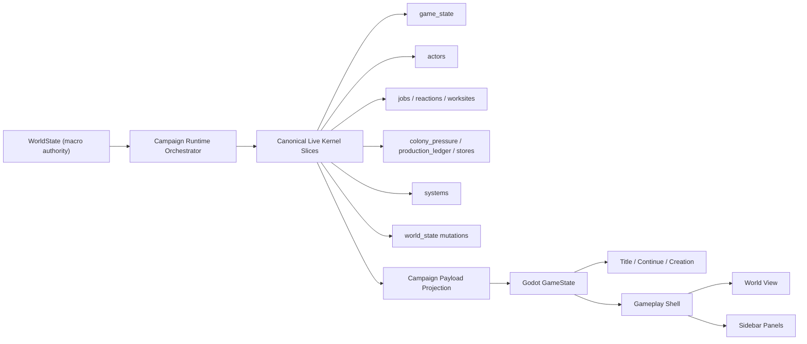

# Runtime Authority

This document defines the current authoritative runtime split for Ember RPG.

## Authority Rules

- `WorldState` is the macro authority for regions, sites, factions, travel edges, migration waves, active caravans, relations, and ownership/history consequences.
- `GameState` is the canonical campaign-local persistence and client handoff root.
- The authoritative live slices exposed to Godot are:
  - `world_state`
  - `game_state`
  - `actors`
  - `jobs`
  - `reactions`
  - `worksites`
  - `colony_pressure`
  - `production_ledger`
  - `stores`
  - `systems`
- `campaign.settlement` and other aggregate summaries are presentation projections only; they are not simulation authority.
- Campaign save/session serialization persists canonical kernel roots (`kernel_world_state`, `kernel_game_state`, and the other kernel slices) and strict load fails fast on invalid canonical roots.
- Deprecated terminal and legacy compatibility paths may still exist in code, but they are not part of the active product contract or release signoff.

## Authoritative Tick Order

Every world advance or commander command must run the deterministic campaign pipeline in this order:

1. effects and timed effect queues
2. syndromes and contagion
3. pain / blood / medical side effects
4. power, fluids, temperature, traps, and strange moods
5. colony needs and morale
6. labor assignment, job ticking, and reaction completion
7. production ledger, farm/seed updates, and quest seed regeneration
8. store price drift, caravans, diplomacy drift, migration waves, and ownership/history consequences
9. payload projection and persistence-ready canonical state

## Client Contract

- Godot is the active player-facing client.
- The title scene and gameplay shell consume canonical payload slices only.
- The gameplay shell follows a single-authority rule: exactly one active owner for status, combat, dialog, and save/load surfaces.
- Scene-instanced and programmatically inserted surfaces may not coexist for the same shell concern.
- Shell-touching changes must be reviewed against [godot-crpg-shell-authority](C:/Users/msbel/projects/ember-rpg/.agents/skills/godot-crpg-shell-authority/SKILL.md).
- Headless Godot automation is the authoritative QA path for repeatable UI proof.
- Win32 desktop automation is a fallback proof layer for desktop/window screenshots and window activation only.
- Long `100`/`500` turn chaos is a soak lane, not the default release gate.
